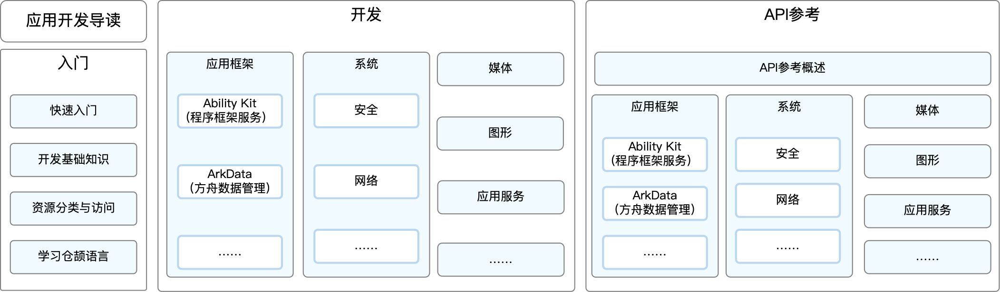

# OpenHarmony仓颉文档

## 简介

欢迎访问OpenHarmony仓颉文档仓库。

仓颉编程语言是一种面向全场景应用开发的通用编程语言，可以兼顾开发效率和运行性能，并提供良好的编程体验。

本仓库存放使用仓颉编程语言开发OpenHarmony应用相关的指南、API参考等文档。欢迎阅读文档，参与OpenHarmony仓颉开发者文档开源项目，共同完善开发者文档。

## 文档架构

OpenHarmony仓颉文档的总体架构如下图所示：

**图1**：文档架构图



如上图所示，应用开发者文档主要包含：

1. **[应用开发导读](./zh-cn/application-dev/cj-start/start/cj-start-application-development-overview.md)**：总体介绍应用开发文档内容，方便开发者了解文档全景。
2. **[入门](./zh-cn/application-dev/cj-start/README_zh.md)**：
   - **[快速入门](./zh-cn/application-dev/cj-start/start/quick-start/README_zh.md)**：介绍开发准备（基本概念和工具准备），以及使用仓颉编程语言构建第一个OpenHarmony应用，帮助开发者从一个简单的例子初步了解OpenHarmony应用开发。
   - **[开发基础知识](./zh-cn/application-dev/cj-start/basic-knowledge/README_zh.md)**：介绍OpenHarmony应用开发过程中的基础知识，包括应用程序包基础知识、应用配置文件等。
   - **[资源分类与访问](./zh-cn/application-dev/cj-start/start/ide-resource-categories-and-access.md)**：介绍OpenHarmony应用开发过程中需要使用的字符串、颜色、字体、间距和图标等资源内容。
   - **[学习仓颉语言](./zh-cn/application-dev/learn-cj/README_zh.md)**：介绍仓颉编程语言特点和语法等知识，让开发者更好地了解仓颉语言，从而使用仓颉语言开发OpenHarmony应用。
3. **[开发](./zh-cn/application-dev/README_zh.md)**：介绍相关概念、原理机制，以及详细的开发步骤，包括如下内容：
   - **应用框架**：包括Ability Kit（程序框架服务）、ArkData（方舟数据管理）、ArkUI（方舟UI框架）、窗口管理、屏幕管理、ArkWeb（方舟Web）、Core File Kit（文件基础服务）、IPC Kit（进程间通信服务）、Localization Kit（本地化开发服务）等。
   - **系统**：包括安全（程序控制访问、加解密算法框架服务、密钥管理服务等）、网络（短距通信服务、网络服务、蜂窝通信服务等）、基础功能（进程线程通信、上传下载等基础服务）、硬件（传感器服务）、调测调优（性能分析服务、应用测试服务、调试命令等）。
   - **媒体**：包括相机服务、图片处理服务、媒体文件管理服务等。
   - **图形**：包括方舟2D图形服务。
   - **应用服务**：包括位置服务。
4. **[API参考](./zh-cn/application-dev/reference/README_zh.md)**：介绍OpenHarmony应用开发需要的仓颉语言版API，包括API的功能描述、参数、返回值、权限信息、示例代码等内容，帮助开发者理解和使用仓颉语言开发OpenHarmony应用。

## 文档目录

OpenHarmony仓颉文档仓库的总体目录结构如下：

```text
.
├── en                                   # 英文文档目录，子目录结构和zh-cn类似
│   ├── application-dev
│   ├── CONTRIBUTING.md
│   ├── COPYRIGHT
│   ├── figures
│   ├── Overview-of-Cangjie-capabilities-in-OpenHarmony.md
│   └── README.md
├── zh-cn                                # 中文文档目录
│   ├── application-dev                  # OpenHarmony-仓颉应用开发文档，包括指南和API参考等
│   ├── CONTRIBUTING.md                  # 贡献指导
│   ├── COPYRIGHT                        # 版权说明
│   ├── figures                          # 存放同级文件引用的图片
│   ├── Overview-of-Cangjie-capabilities-in-OpenHarmony.md # 仓颉在OpenHarmony中的能力概览
│   └── README_zh.md                     # 开发者文档总览
├── LICENSE                              # 许可证文件
├── OAT.xml                              # OAT规则文件，用于该仓OAT开源检查
├── README.md                            # OpenHarmony-仓颉文档仓总体说明（英文）
└── README_zh.md                         # OpenHarmony-仓颉文档仓总体说明（中文）
```

## 参与贡献

欢迎您参与贡献，我们鼓励开发者以各种方式参与文档反馈和贡献。

您可以对现有文档进行评价、更改、反馈文档质量问题、贡献您的原创内容等。详情请参见[贡献文档](./zh-cn/CONTRIBUTING.md)。

## 许可证

仓颉开发者文档许可证请参见[License](./LICENSE) 。

## 相关仓

- [openharmony docs](https://gitcode.com/openharmony/docs/blob/master/README_zh.md)：OpenHarmony社区资料仓库，存放基于ArkTS语言开发OpenHarmony的应用开发文档，以及设备开发文档等开发者文档。
- [cangjie_docs](https://gitcode.com/Cangjie/cangjie_docs/blob/main/README_zh.md)：仓颉社区资料仓库，存放仓颉语言语法、命令行工具等仓颉知识。
- [cangjie_runtime](https://gitcode.com/Cangjie/cangjie_runtime/blob/main/stdlib/doc/libs/summary_cjnative.md)：仓颉运行时与仓颉编程语言标准库，可在此处查看标准库API参考。
- [cangjie_stdx](https://gitcode.com/Cangjie/cangjie_stdx/blob/main/doc/summary_cjnative.md)：仓颉编程语言stdx扩展模块仓库，可在此仓库查看扩展库API参考。
