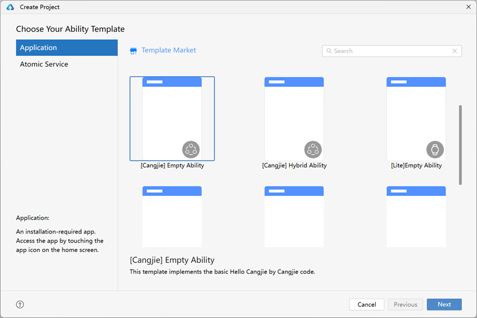
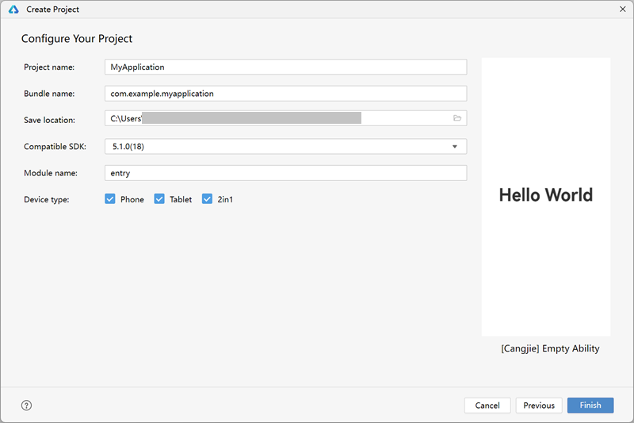
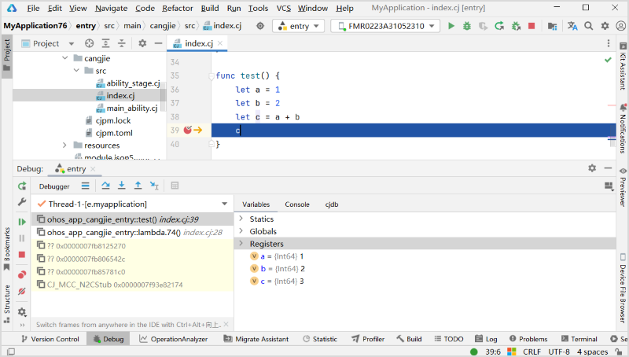

# I. Cangjie Features and Supported Scenarios

Cangjie is positioned as a modern programming language for OpenHarmony application development. It is a statically typed, statically compiled programming language that integrates modern language features, comprehensive compilation optimizations, runtime implementations, and out-of-the-box toolchain support to provide OpenHarmony application developers with a friendly development experience and exceptional program performance.

Key features of Cangjie:

* **Static Type System**: Cangjie is a statically typed language where the types of variables and expressions are determined at compile time and do not change during runtime. The static type system can detect errors in programs during compilation, reducing debugging and troubleshooting time.
* **Concise Syntax**: Cangjie incorporates excellent design concepts and syntactic features from statically typed application development languages, making it easier for developers familiar with these languages to learn Cangjie. Additionally, Cangjie supports type inference and rich syntactic sugar, enabling concise and efficient programming. It also provides metaprogramming capabilities, allowing developers to quickly design domain-specific languages (DSLs) for specific business needs, further enhancing Cangjie's usability.
* **Multi-Paradigm Support**: Cangjie is a typical multi-paradigm programming language, offering robust support for procedural, object-oriented, and functional programming. Developers can flexibly choose or mix different programming paradigms to meet the needs of various development scenarios.
* **Rich Standard Library**: Cangjie provides a comprehensive, general-purpose, and high-performance standard library, including collections, I/O, databases, networking, security, OS, mathematics, data structures, sorting algorithms, console I/O, regular expressions, time, command-line processing, file system, and synchronization libraries, helping developers quickly build OpenHarmony applications.
* **Growing Ecosystem**: Cangjie has built over 400 third-party libraries based on the open-source community, covering the high-frequency third-party libraries required by the Top 5000 applications. Additionally, Cangjie has optimized several third-party libraries for pain points in OpenHarmony application development, such as MarkDown, protobuf, pako, bigint, lottie, formula-ffi, and editor4cj, which perform well in both functionality and performance.

Cangjie is suitable for business scenarios including but not limited to:

* Complex application development scenarios that balance development efficiency, performance, and security.
* eDSL-based programming, such as UI DSL, database access DSL, and big data processing DSL.
* Scenarios requiring specific third-party libraries, such as MarkDown rendering and data serialization.

Current Cangjie capabilities have been validated in the following scenarios:

| Application Scenario | Business Functionality | Cangjie Capabilities |
| :------: | ------ | ------ |
| Delivery Management (e.g., Meituan Riders) | The app homepage provides three UI lists for new tasks, pending pickups, and deliveries in progress, offering full-process order tracking based on user location information. | Cangjie-ArkTS interoperability, Ability Kit (application framework services), ArkUI (Ark UI framework), Image Kit (image processing services), Location Kit (location services), Telephony Kit (cellular communication services), Basic Services Kit (basic services), etc. |
| Delivery Management (e.g., Meituan Riders) | Intelligent inference module, combining real-time sensor data to call relevant algorithms for user state analysis. | Cangjie-ArkTS/Python/JS interoperability, Network Kit (networking services), Camera Kit (camera services), Media Library Kit (media file management services), Sensor Service Kit (sensor services), Crypto Architecture Kit (encryption/decryption algorithm framework services), etc. |
| Delivery Management (e.g., Meituan Riders) | Voice and recording module, calling media-related capabilities to record user speech and send it to cloud servers. | Media Kit (media services), Core File Kit (file basic services), etc. |
| Knowledge Social (e.g., LeetCode) | Problem and solution module, providing problem descriptions and allowing users to post and share solutions and source code. | ArkUI (Ark UI framework), ArkWeb (Ark Web), etc. |
| Knowledge Social (e.g., LeetCode) | Online programming, providing code editing, real-time highlighting, and sending code to the server for evaluation. | ArkData (Ark data management), Network Kit (networking services), etc. |
| Knowledge Social (e.g., LeetCode) | Personal information module, displaying and editing personal information, including name, avatar, etc. | Core File Kit (file basic services), Image Kit (image processing services), etc. |
| Emerging AI (e.g., Nano AI, Kimi) | Chat interface, similar to instant messaging, supporting user text input, file uploads, displaying AI responses, and real-time interaction between AI and users. | ArkUI (Ark UI framework), Core File Kit (file basic services), Network Kit (networking services), etc. |

# II. Supported Capabilities

Below are the capabilities Cangjie provides for OpenHarmony. For detailed descriptions, refer to the [Cangjie Development Documentation](https://gitcode.com/openharmony-sig/arkcompiler_cangjie_ark_interop/tree/master/doc).

## 1. ArkUI

The Cangjie version of the ArkUI framework provides a declarative development paradigm (referred to as the "declarative paradigm") based on the Cangjie language, suitable for different application scenarios and technical backgrounds. It is a minimalist, high-performance, cross-device UI development framework that offers essential capabilities for building application UIs, including:

- **Layout**: Layout is a necessary UI element that defines the position of components on the interface. The ArkUI framework provides multiple layout methods, including basic linear, stack, flex, relative, and grid layouts, as well as more complex lists, grids, and carousels.
- **Components**: Components are necessary UI elements that form the appearance of the interface. System-provided components are called system components, while developer-defined ones are called custom components. Built-in system components include buttons, radio buttons, progress bars, text, etc. Developers can chain calls to set the rendering effects of system components. Developers can also combine system components into custom components, modularizing the UI into independent units for independent creation, development, and reuse, enhancing engineering efficiency.
- **Page Routing**: Applications may contain multiple pages, and page routing enables navigation between them.
- **Graphics**: The Ark development framework provides capabilities for displaying various types of images and custom drawing to meet developers' needs, supporting shape drawing, color filling, text drawing, transformations, clipping, and image embedding.
- **Animation**: Animation is a key UI element. Excellent animation design greatly enhances user experience. The framework offers rich animation capabilities, including built-in component animations, property animations, explicit animations, custom transition animations, and animation APIs. Developers can use encapsulated physical models or call animation APIs to implement custom animation trajectories.
- **Interaction Events**: Interaction events are necessary for UI and user interaction. The Ark development framework provides various interaction events, including touch, mouse, keyboard, and focus events, as well as gesture events derived from these.
- **Customization**: Customization capabilities allow developers to tailor the UI interface, including custom combinations and extensions.

## 2. API

Cangjie APIs are a series of APIs provided to support OpenHarmony application development using the Cangjie language, accompanied by comprehensive documentation and sample code. Currently, Cangjie APIs cover part of the OpenHarmony SDK's open capabilities. Over time, more open capabilities will be added.

Cangjie APIs were first released with OpenHarmony 6.x and will continue to expand in subsequent versions, aiming to provide full OpenHarmony system capabilities for Cangjie applications. The initial Cangjie APIs prioritize security, high performance, concurrency, and basic runtime needs, covering 5 categories and 22 Kits:

* **Application Framework**
  
  * ArkUI (Ark UI framework): Provides high-performance declarative development.
  * ArkData (Ark data management): Offers high-performance distributed key-value databases and key-value data processing.
  * ArkWeb (Ark Web): Provides high-performance web control.
  * Core File Kit (file basic services): Supports concurrent file operations.
  * Ability Kit (application framework services): Provides basic meta-capabilities, package management, and access control for application runtime.
  * IPC Kit (inter-process communication services): Offers basic inter-process communication capabilities for application runtime.
  * Localization Kit (localization services): Provides internationalization support for application runtime.
* **System**
  
  * Crypto Architecture Kit (encryption/decryption algorithm framework services): Offers security-related cryptographic algorithm libraries and interfaces.
  * Universal Keystore Kit (key management services): Provides security-related key management and cryptographic operations.
  * Network Kit (networking services): Supports concurrent HTTP data requests.
  * Connectivity Kit (short-range communication services): Offers high-performance Bluetooth and Wi-Fi device interfaces.
  * Sensor Service Kit (sensor services): Provides high-performance sensor data processing.
  * Basic Services Kit (basic services): Includes power management, event notifications, startup recovery, upload/download, and settings for application runtime.
  * Performance Analysis Kit (performance analysis services): Offers application tracing and event subscription for runtime.
  * Telephony Kit (cellular communication services): Provides basic call management for application runtime.
  * Test Kit (application testing services): Offers testing and debugging frameworks for application runtime.
* **Media**
  
  * Camera Kit (camera services): Provides high-performance camera interfaces.
  * Image Kit (image processing services): Supports concurrent decoding, encoding, editing, metadata processing, and image reception.
  * Media Kit (media services): Offers concurrent access to audio/video media services.
  * Media Library Kit (media file management services): Provides concurrent album management, including creation, access, and modification of media data.
* **Graphics**
  
  * ArkGraphics 2D (Ark 2D graphics services): Offers basic color space object management for application runtime.
* **Application Services**
  
  * Location Kit (location services): Provides basic positioning functionality for application runtime.

For APIs not currently supported by Cangjie, users can call ArkTS APIs or NDK APIs via Cangjie-ArkTS or Cangjie-C cross-language interoperability.

## 3. Interoperability with ArkTS

In OpenHarmony application development, there are scenarios requiring mixed development with Cangjie and ArkTS, such as:

- **Scenario 1**: When developing with ArkTS, call Cangjie-developed code modules via cross-language interoperability to leverage Cangjie's high performance and concurrency, improving application performance.
- **Scenario 2**: When developing with Cangjie, call ArkTS libraries via cross-language interoperability to reuse ArkTS's rich library ecosystem.

To address these scenarios, Cangjie provides the **ark_interop** interoperability library for ArkTS interaction. The library offers the following key data structures:

- **JSValue**: Represents objects from ArkTS (e.g., numbers, strings, objects, functions), serving as a bridge for type conversion between Cangjie and ArkTS.
- **JSRuntime**: Manages the ArkTS runtime, representing an instance of the ArkTS runtime.
- **JSContext**: Represents the context for ArkTS interoperability, providing module loading and JSValue creation.
- **JSCallInfo**: Represents the parameter set when a call originates from ArkTS.
- **JSModule**: Handles module registration, exporting Cangjie-side symbols to the ArkTS engine.
- **JSArray, JSObject, JSClass, JSFunction, JSHeapObject, JSExternal, JSPromise, JSBigInt**: Cangjie language interfaces for creating and accessing reference-type objects in ArkTS.
- **JSSymbol, JSBoolean, JSNull, JSNumber, JSType, JSUndefined**: Cangjie language interfaces for creating and accessing value-type objects in ArkTS.

To reduce the complexity of interoperability development, Cangjie provides the declarative interoperability macro **ark_interop_macro**, allowing developers to annotate functions or types in Cangjie code that need to be exported to ArkTS with "@Interop[ArkTS]". This automatically generates interoperability "glue" code and ArkTS interface declarations during compilation, reducing manual coding efforts.

### Typical Scenario 1: ArkTS Calls Cangjie

For Scenario 1, use the interoperability library to implement interfaces in Cangjie that can be called from ArkTS. Example:

```cangjie
// Import the interoperability library
import ohos.ark_interop.*

func addNumber(context: JSContext, callInfo: JSCallInfo): JSValue {
    // Get arguments from JSCallInfo
    let arg0: JSValue = callInfo[0]
    let arg1: JSValue = callInfo[1]
    // Convert JSValue to Cangjie types
    let a: Float64 = arg0.toNumber()
    let b: Float64 = arg1.toNumber()
    // Actual Cangjie function behavior
    let value = a + b
    // Convert result to JSValue
    let result: JSValue = context.number(value).toJSValue()
    // Return JSValue
    return result
}

// Must register the function in JSModule
let EXPORT_MODULE = JSModule.registerModule {
    runtime, exports =>
        exports["addNumber"] = runtime.function(addNumber).toJSValue()
}
```

In ArkTS, load the Cangjie module and call the interface:

```ts
// Import the Cangjie dynamic library (name matches the Cangjie package name)
import { addNumber } from "libohos_app_cangjie_entry.so";

// Call the Cangjie interface
let result = addNumber(1, 2);
```

This scenario can be simplified using the interoperability macro. For example, the Cangjie code above can be reduced to:

```cangjie
@Interop[ArkTS]
public func addNumber(a: Float64, b: Float64): Float64 {
    a + b
}
```

### Typical Scenario 2: Cangjie Calls ArkTS

For Scenario 2, use the interoperability library to load ArkTS modules and call interfaces. Example:

```cangjie
func callInterop(x: Float64, y: Float64): Float64 {
    // Get the interoperability context
    let context: JSContext = JSRuntime().mainContext
    // Load the target ArkTS module
    let module: JSObject = context.loadArkTSModule(JSModules.Entry).asObject(context)

    // Get the exported function from the ArkTS module
    let addNumber = module["addNumber"].asFunction(context)
    // Call the ArkTS function
    let result = addNumber.call([context.number(x).toJSValue(), context.number(y).toJSValue()])

    return result.toFloat64()
}
```

## 4. IDE Features

Provides the DevEco Studio Cangjie development plugin, supporting OpenHarmony application development with Cangjie (pure Cangjie or mixed Cangjie-ArkTS). It supports developing Cangjie static libraries and offers basic project management, compilation, language services, and debugging capabilities. Dynamic libraries, UI previews, static checks, performance tuning, and testing services are not yet supported.

After downloading and installing DevEco Studio, developers can install the Cangjie plugin and download the corresponding OpenHarmony SDK to begin Cangjie application development. Key features include:

- **Project Management and Creation**:
  
  **Project Directory Structure: Cangjie Project**
  
  DevEco Studio supports creating Cangjie projects with the following directory structure:
  
  ```text
  Project_name
  ├── .hvigor
  ├── .idea
  ├── AppScope
  ├── entry
  │    ├── libs
  │    ├── src
  │    │    ├── main
  │    │    │    ├── cangjie
  │    │    │    │    ├── ability_stage.cj
  │    │    │    │    ├── index.cj
  │    │    │    │    └── main_ability.cj
  │    │    │    ├── resources
  │    │    │    └── module.json5
  │    │    └── ohosTest
  │    ├── build-profile.json5
  │    ├── cjpm.toml
  │    ├── hvigorfile.ts
  │    └── oh-package.json5
  ├── hvigor
  │    └── hvigor-config.json5
  ├── oh_modules
  ├── build-profile.json5
  ├── code-linter.json5
  ├── hvigorfile.ts
  ├── local.properties
  ├── oh-package.json5
  └── oh-package-lock.json5
  ```
  
  Key files:
  
  - **AppScope > app.json5**: Global application configuration.
  - **entry**: Application module, compiled into a HAP.
    - **src > main > cangjie**: Stores Cangjie source code.
    - **src > main > resources**: Stores resources like graphics, multimedia, strings, and layout files.
    - **src > main > module.json5**: Stage module configuration, including HAP settings and device-specific configurations.
    - **build-profile.json5**: Module-level build configurations.
    - **hvigorfile.ts**: Module-level build script.
    - **cjpm.toml**: Cangjie package management configuration.
    - **oh-package.json5**: Describes third-party package names, versions, entry files, and dependencies.
    - **src > ohosTest**: Stores Cangjie test code for instrumentation testing.
  - **hvigor**: Stores the hvigor tool used by the project.
    - **hvigor-config.json5**: Specifies the global hvigor version and parameters.
  - **oh_modules**: Stores third-party library dependencies.
  - **build-profile.json5**: Application-level configurations, including signing and product settings.
  - **hvigorfile.ts**: Application-level build script.
  - **oh-package.json5**: Describes global configurations like dependency overrides and parameterized settings.
  
  **Project Directory Structure: Cangjie-ArkTS Interoperability Project**
  
  DevEco Studio supports creating Cangjie-ArkTS interoperability projects with the following directory structure:
  
  ```text
  Project_name
  ├── .hvigor
  ├── .idea
  ├── AppScope
  │    └── app.json5
  ├── entry
  │    ├── libs
  │    ├── oh_modules
  │    ├── src
  │    │    ├── main
  │    │    │    ├── cangjie
  │    │    │    │    ├── types
  │    │    │    │    └── index.cj
  │    │    │    ├── ets
  │    │    │    │    ├── entryability
  │    │    │    │    ├── entrybackupability
  │    │    │    │    └── pages
  │    │    │    ├── resources
  │    │    │    └── module.json5
  │    │    ├── mock
  │    │    ├── ohosTest
  │    │    └── test
  │    ├── build-profile.json5
  │    ├── cjpm.toml
  │    ├── hvigorfile.ts
  │    ├── obfuscation-rules.txt
  │    ├── oh-package.json5
  │    └── oh-package-lock.json5
  ├── hvigor
  │    └── hvigor-config.json5
  ├── oh_modules
  ├── build-profile.json5
  ├── code-linter.json5
  ├── hvigorfile.ts
  ├── local.properties
  ├── oh-package.json5
  └── oh-package-lock.json5
  ```

- **AppScope > app.json5**: Global configuration information of the application.
  - **entry**: Application module, compiled and built to generate a HAP.
    - **src > main > cangjie > loader**: Provides method declarations for loading Cangjie so, enabling ArkTS to call methods registered in Cangjie.
    - **src > main > cangjie**: Stores Cangjie source code.
    - **src > main > ets**: Stores ArkTS source code.
    - **src > main > resources**: Stores resource files used by the application, such as graphics, multimedia, strings, and layout files.
    - **src > main > module.json5**: Stage module configuration file, primarily containing HAP configuration information, application-specific device configuration, and global application configuration.
    - **build-profile.json5**: Current module information and compilation configuration items, including buildOption, targets, etc.
    - **hvigorfile.ts**: Module-level compilation and build task script.
    - **cjpm.toml**: Cangjie's package management configuration file.
    - **oh-package.json5**: Describes third-party package information, including package name, version, entry file (type declaration file), and dependencies.
  - **hvigor**: Stores the hvigor used by the current project.
    - **hvigor-config.json5**: Specifies the globally used hvigor and its parameter configurations for the project.
  - **oh_modules**: Stores third-party library dependency information, including third-party library files relied upon by the application/service.
  - **build-profile.json5**: Application-level configuration information, including signatures and product configurations.
  - **hvigorfile.ts**: Application-level compilation and build task script.
  - **oh-package.json5**: Describes global configurations, such as dependency overrides (overrides), dependency rewrites (overrideDependencyMap), and parameterized configurations (parameterFile).

**Creating a Cangjie Project**

1. Open the project creation wizard interface in one of the following ways:
   - If no project is currently open, select **Create Project** on the DevEco Studio welcome page to start a new project.
   - If a project is already open, choose **File > New > Create Project** from the menu bar to create a new project.
2. Select the **[Cangjie] Empty Ability** template in the project creation wizard.
     
     

3. On the project configuration page, configure basic project information as guided.
     
     
     
     - **Project name**: The project name, customizable and composed of uppercase/lowercase letters, numbers, and underscores.
     - **Bundle name**: The unique package name identifier for the application.
       
       Requirements for the application package name:
       - Must be a dot-separated string with at least three segments, each containing only letters, numbers, or underscores (e.g., "com.example.myapplication").
       - The first segment must start with a letter; non-first segments must start with a number or letter. Each segment must end with a number or letter (e.g., "com.01example.myapplication").
       - Consecutive dots are not allowed (e.g., "com.example..myapplication").
       - Length must be between 7 and 128 characters.
     - **Save location**: Local storage path for project files, composed of letters, numbers, and underscores. Chinese characters are not allowed.
     - **Compatible SDK**: Minimum compatible API Version.
     - **Module name**: The module name.
     - **Device type**: Device types supported by the project template.
       
       To query the device types supported by a specific API during development:
       
       1. Hover over the API in the editor to view its syscap information via language service tooltips.
       2. Check the syscap field in the API's comment header (e.g., SystemCapability.Communication.NFC.CardEmulation).
       3. View all device-supported syscap capabilities in DevEco SDK at:
          - ohos: deveco-studio\sdk\default\openharmony\ets\api\device-define
       4. Locate the openharmony directory, find the {A}.json file under device type {A}, which contains the full syscap capability set for device {A}.
4. Click **Finish**. The tool will automatically generate sample code and related resources. Wait for project initialization to complete the creation.
     
     

**Integrating Cangjie into an Existing ArkTS Project**

Right-click **entry > New > Cangjie(Interop)** in the project interface to enable Cangjie-ArkTS hybrid modules. After project synchronization, the original ArkTS module becomes a Cangjie-ArkTS hybrid module.


- **Code Editing**: Features like syntax highlighting, code completion, syntax diagnostics, hover tips, definition navigation, reference lookup, formatting, and other coding aids, including metaprogramming-related capabilities.
  
  Example of code completion:
  
  

- **Compilation and Build**: Supports compiling Cangjie HAP/APP, Cangjie HAR/HSP, and pushing Cangjie HAP packages to OpenHarmony devices for execution.
- **Code Debugging**: Supports debugging Cangjie HAP on devices, including breakpoints, step-by-step debugging, and visualization of debugging information (threads, stack, variables, etc.).
  
  Example: Setting debug code type: Go to **Run > Edit Configurations > Debugger**, select the module, and set Debug type.
  
  
  
  Example: Inspecting variables: During debugging, when paused at a breakpoint or due to other interruptions, the stack list displays the current thread state, and the Variable list allows viewing global/static variables, register variables, and local variables.
  
  

# III. Next Steps

Cangjie will continue to focus on high-efficiency development, high performance, and robust security, enhancing the development experience while delivering default high performance and security. It will further explore cross-platform capabilities, enabling OpenHarmony developers to achieve "write once, run on three platforms" and establish Cangjie as the preferred static programming language for OpenHarmony ecosystem development. Future directions include:

* **High Performance**: Improve performance via Actor model, concurrent priority algorithms, and structured concurrency; reduce memory usage through memory ownership mechanisms; lower power consumption via hardware-optimized techniques.
* **Robust Security**: Strengthen compile-time security with safety macros and FFI checks; enhance runtime security with forward control-flow integrity; build application-level security through data-flow analysis.
* **Cross-Platform**: Develop static compilation-to-machine-code capabilities for cross-OS execution, enabling "homogeneous development, heterogeneous execution" code sharing. Improve offline/online toolchains for cross-OS optimization, debugging, and frameworks to increase OpenHarmony application code reuse across platforms. Explore interoperability with Java/OC/Swift/Kotlin.
* **Commercial Readiness**: Focus on developer experience by enhancing OpenHarmony Cangjie APIs, IDE tools, and documentation to advance language capabilities.
