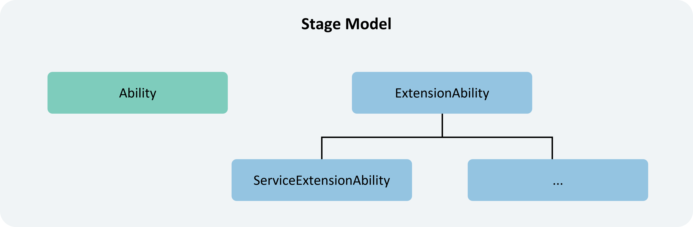

# Application Model  

## Components of the Application Model  

The application model is an abstract refinement of the capabilities required by applications, provided by the system for developers. It offers essential components and runtime mechanisms for applications. With the application model, developers can build applications based on a unified framework, making development simpler and more efficient.  

The components of the application model include:  

1. **Application Components**  

   Application components are the fundamental building blocks of an application and serve as its runtime entry points. As users launch, interact with, and exit an application, the components transition through different states, collectively referred to as the **application component lifecycle**. Application components provide lifecycle callback functions, allowing developers to monitor [state changes](cj-uiability-lifecycle.md) in the application.  

   When developing an application, developers must first implement the application components and their lifecycle callbacks, as well as configure relevant information in the application configuration file. This enables the operating system to instantiate the components during runtime, schedule their lifecycle callbacks, and execute the developer's code.  

2. **Application Process Model**  

   The application process model defines how processes are created and destroyed, as well as inter-process communication mechanisms.  

3. **Application Thread Model**  

   The application thread model defines thread creation and destruction within a process, the setup of the main thread and UI thread, and inter-thread communication methods.  

4. **Application Task Management Model** (Open only to system applications)  

   The application task management model defines how tasks (Missions) are created and destroyed, as well as the relationship between tasks and components. A **task** represents a user's interaction record with an application component instance. Each time a user launches a new instance of an application component, a new task is generated.  

   For example, when a user opens a video application, a corresponding task appears in the "Recent Tasks" interface. If the user taps this task, the system brings it to the foreground. If the video application includes a video editing feature implemented as an application component, launching this feature creates a new instance, resulting in two tasks—video application and video editing—displayed in the "Recent Tasks" interface.  

5. **Application Configuration File**  

   The application configuration file contains application settings, component information, permissions, and developer-defined configurations. These details are utilized during compilation, distribution, and runtime by build tools, app stores, and the operating system.  

## Overview of Application Models  

As the system evolves, the following application models are provided:  

- **Stage Model**: Currently the primary and long-term supported model. In this model, classes such as `AbilityStage` and `WindowStage` serve as "stages" for application components and windows, hence the name **Stage Model**.  

## Understanding the Stage Model  

The following table provides an overview of the Stage Model.  

**Table 1** Overview of the Stage Model  

| Category       | Stage Model |  
|----------------|------------|  
| **Application Components** | 1. **Component Classification** <!-- ToBeReviewed -->&nbsp;&nbsp;&nbsp;- **UIAbility Component**: Contains UI elements and provides display capabilities, primarily for user interaction. For details, see [UIAbility Component Overview](cj-uiability-overview.md). &nbsp;&nbsp;&nbsp;- **ExtensionAbility Component**: Offers extended capabilities for specific scenarios (e.g., cards, input methods), catering to diverse use cases. 2. **Development Approach** &nbsp;&nbsp;&nbsp;Adopts an object-oriented methodology, exposing application components as class interfaces for developers to extend and customize. |  
| **Process Model** | Two types of processes: 1. **Main Process** 2. **ExtensionAbility Process** |  
| **Task Management Model** | - Each UIAbility component instance creates a task. - Tasks persist in storage until the maximum task limit (configurable per product) is exceeded or the user manually deletes them. - UIAbility components do not form a stack structure. |  
| **Application Configuration File** | Uses `app.json5` for application-level configurations and `module.json5` for HAP (Harmony Ability Package) and component details. |