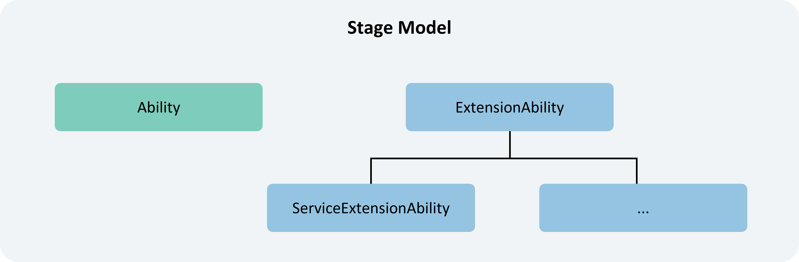

# Application Model

<!--Del-->
> **Note:**
>
> Currently in the beta phase.
<!--DelEnd-->

## Components of the Application Model

The application model is an abstract refinement of the capabilities required by applications, provided by the system for developers. It offers essential components and operational mechanisms for applications. With the application model, developers can build applications based on a unified framework, making development simpler and more efficient.

The components of the application model include:

1. **Application Components**

   Application components are the fundamental building blocks of an application and serve as its entry points for execution. As users launch, interact with, and exit an application, these components transition through various states, collectively referred to as the component lifecycle. Application components provide lifecycle callback functions, allowing developers to monitor [state changes](cj-uiability-lifecycle.md) in the application. When developing an application, the first step is to implement these components along with their lifecycle callbacks, and to configure relevant information in the application's configuration file. This enables the operating system to instantiate the components during runtime via the configuration file, schedule their lifecycle callbacks, and thereby execute the developer's code.

2. **Application Process Model**

   The application process model defines how processes are created and terminated, as well as the mechanisms for inter-process communication.

3. **Application Thread Model**

   The application thread model specifies the creation and termination of threads within a process, the setup of the main thread and UI thread, and the communication methods between threads.

4. **Application Task Management Model (Exclusive to System Applications)**

   The application task management model governs the creation and termination of tasks (Missions) and their relationships with components. A task represents a record of a user's interaction with an application component instance. Each time a user launches a new instance of an application component, a new task is generated. For example, when a user opens a video application, a corresponding task appears in the "Recent Tasks" interface. Selecting this task brings it to the foreground. If the video editing feature within the application is also implemented as an application component, launching it creates another instance, resulting in two tasks (video application and video editing) displayed in the "Recent Tasks" interface.

5. **Application Configuration File**

   The application configuration file contains details such as application settings, component information, permissions, and developer-defined metadata. This information is utilized during compilation, distribution, and runtime by tools like compilers, app stores, and the operating system.

## Overview of Application Models

As the system evolves, the following application models are provided:

- **Stage Model**: Currently the primary and long-term supported model. Named for its use of classes like `AbilityStage` and `WindowStage` as "stages" for application components and windows.

## Understanding the Stage Model

The following table provides an overview of the Stage Model.

  **Table 1** Stage Model Overview

| Item | Stage Model |
| -------- |  -------- |
| **Application Components** | 1. Component Classification <!-- ToBeReviewed -->&nbsp;&nbsp;&nbsp;-&nbsp;UIAbility Component: Contains UI elements and provides display capabilities, primarily for user interaction. For details, see [UIAbility Component Overview](cj-uiability-overview.md). &nbsp;&nbsp;&nbsp;-&nbsp;ExtensionAbility Component: Offers extended capabilities for specific scenarios (e.g., widgets, input methods), catering to diverse use cases. 2. Development Approach &nbsp;&nbsp;&nbsp;Adopts an object-oriented methodology, exposing application components as class interfaces for developers to extend and customize. |
| **Process Model** |  Two types of processes: 1. Main Process 2. ExtensionAbility Process |
|**Task Management Model**  | -&nbsp;Each UIAbility component instance creates a task. -&nbsp;Tasks persist until exceeding the maximum allowed (configurable per product) or being manually deleted by the user. -&nbsp;UIAbility components do not form a stack structure. |
| **Application Configuration File**  | Uses `app.json5` for application-level metadata and `module.json5` for HAP details and component configurations. |