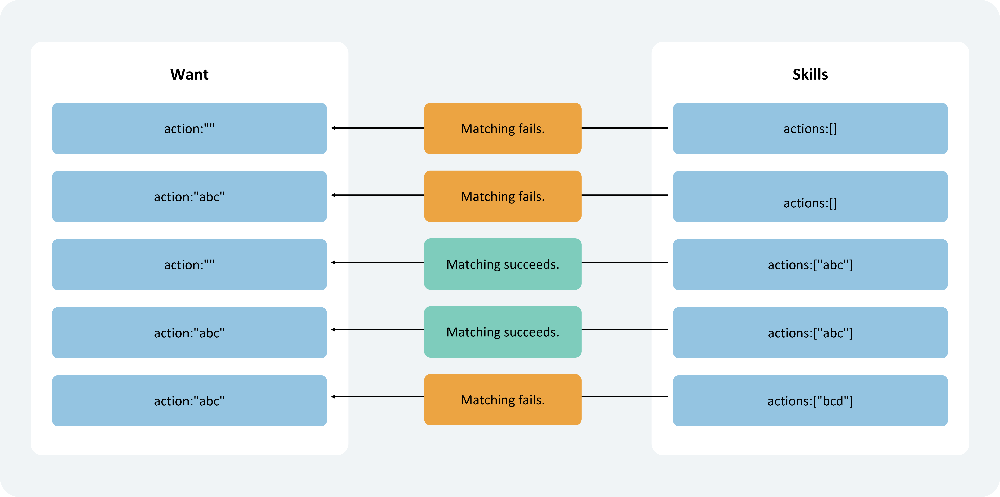
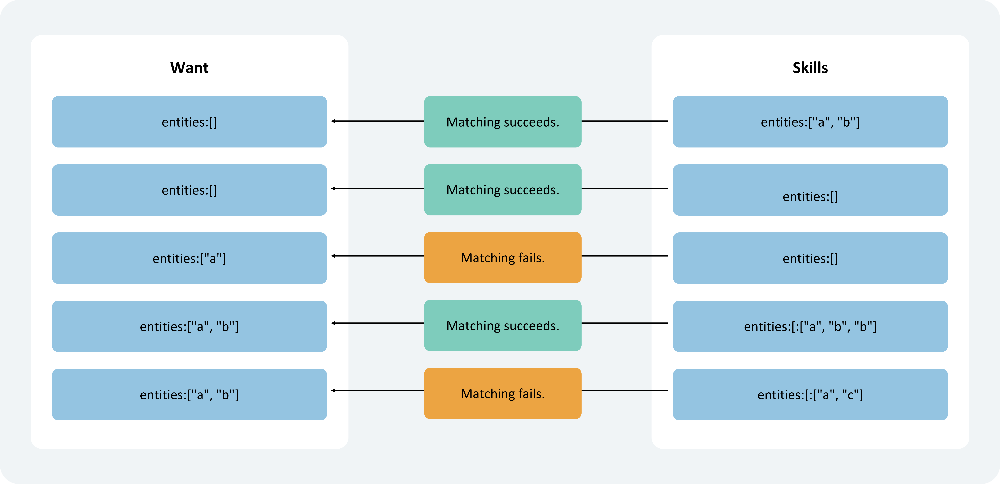
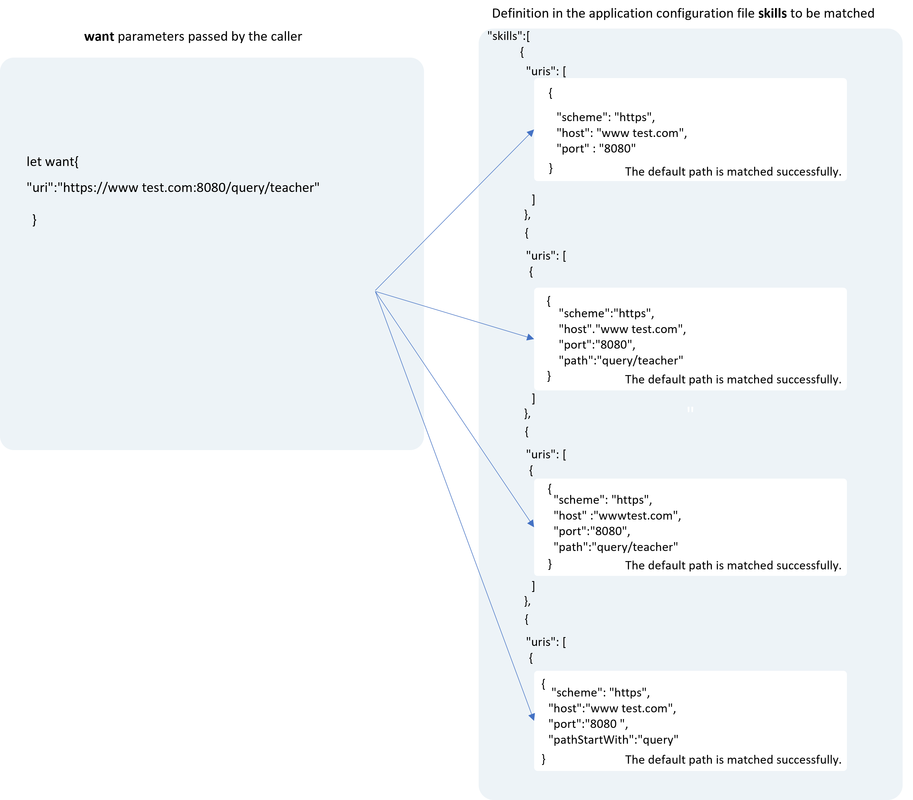
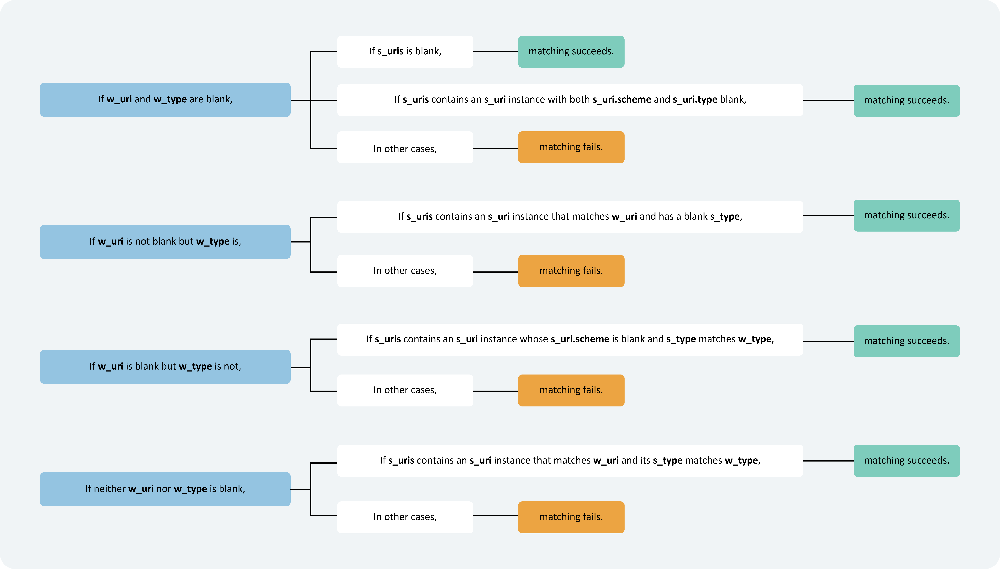
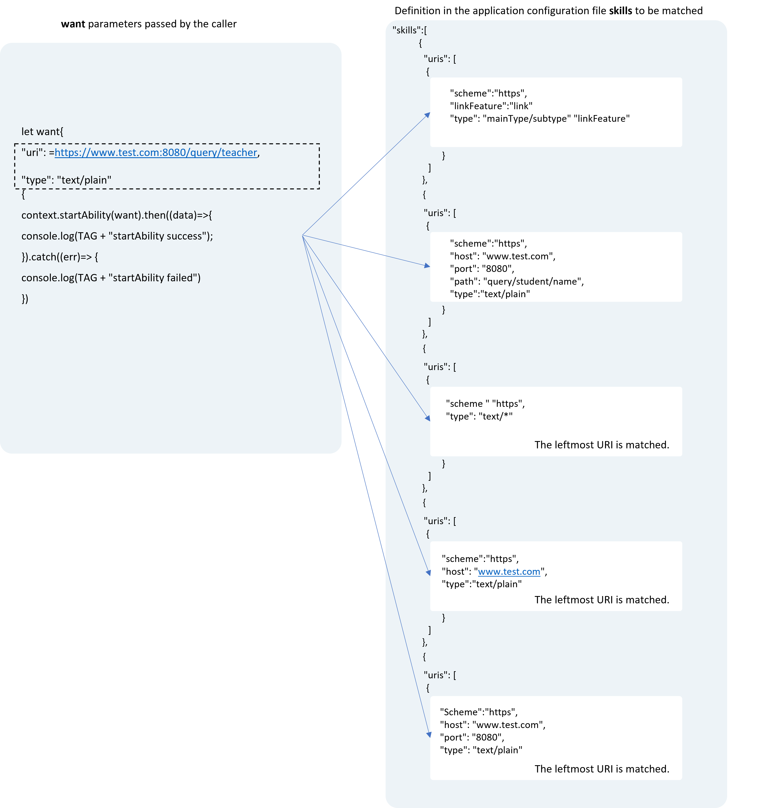
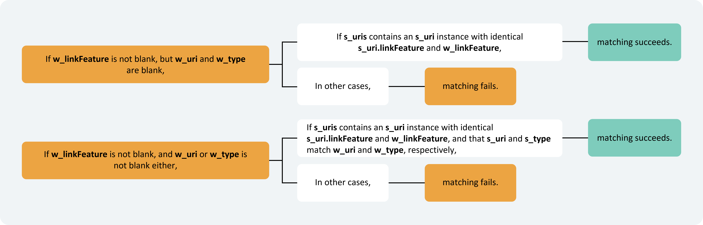
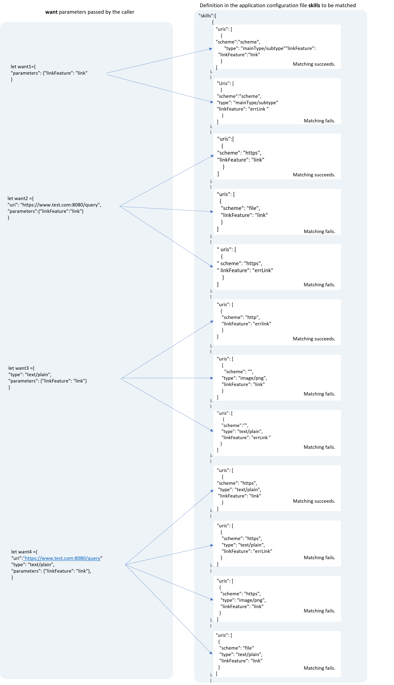

# Explicit Want and Implicit Want Matching Rules

When launching a target application component, matching is performed through either an explicit [Want](../../../en/application-dev/reference/AbilityKit/cj-apis-app-ability-want.md#class-want) or an implicit [Want](../../../en/application-dev/reference/AbilityKit/cj-apis-app-ability-want.md#class-want). The matching rules described in this chapter specify how the parameters set in the [Want](../../../en/application-dev/reference/AbilityKit/cj-apis-app-ability-want.md#class-want) parameter passed by the caller are matched with the configuration file declared by the target application component.

## Explicit Want Matching Principle

The matching principle for explicit [Want](../../../en/application-dev/reference/AbilityKit/cj-apis-app-ability-want.md#class-want) is shown in the following table.

| Name | Type | Matching Item | Required | Rule |
| -------- | -------- | -------- | -------- | -------- |
| deviceId | String | Yes | No | If left empty, only application components within the local device will be matched. |
| bundleName | String | Yes | Yes | If abilityName is specified but bundleName is not, the matching will fail. |
| moduleName | String | Yes | No | If left empty and there are multiple modules within the same application with duplicate-named application components, the first one will be matched by default. |
| abilityName | String | Yes | Yes | This field must be set to indicate explicit matching. |
| uri | String | No | No | This parameter is ignored during system matching but can still be passed to the target application component as a parameter. |
| type | String | No | No | This parameter is ignored during system matching but can still be passed to the target application component as a parameter. |
| action | String | No | No | This parameter is ignored during system matching but can still be passed to the target application component as a parameter. |
| entities | Array&lt;String&gt; | No | No | This parameter is ignored during system matching but can still be passed to the target application component as a parameter. |
| flags | UInt32 | No | No | Does not participate in matching and is directly passed to the system for processing. Generally used to set runtime information, such as URI data authorization. |
| parameters | String | No | No | Does not participate in matching. Custom application data will be directly passed to the target application component. |

## Implicit Want Matching Principle

The matching principle for implicit [Want](../../../en/application-dev/reference/AbilityKit/cj-apis-app-ability-want.md#class-want) is shown in the following table.

| Name        | Type                           | Matching Item | Required | Rule                                                         |
| ----------- | ------------------------------ | ------ | ---- | ------------------------------------------------------------ |
| deviceId    | String                         | Yes     | No   | Cross-device implicit invocation is currently not supported. |
| abilityName | String                         | No     | No   | This field must be left empty to indicate implicit matching. |
| bundleName  | String                         | Yes     | No   | Matches the target application component within the corresponding application package. |
| moduleName  | String                         | Yes     | No   | Matches the target application component within the corresponding Module. |
| uri         | String                         | Yes     | No   | Refer to [Matching Rules for uri and type in Want Parameters](#matching-rules-for-uri-and-type-in-want-parameters). |
| type        | String                         | Yes     | No   | Refer to [Matching Rules for uri and type in Want Parameters](#matching-rules-for-uri-and-type-in-want-parameters). |
| action      | String                         | Yes     | No   | Refer to [Matching Rules for action in Want Parameters](#matching-rules-for-action-in-want-parameters). |
| entities    | Array&lt;String&gt;            | Yes     | No   | Refer to [Matching Rules for entities in Want Parameters](#matching-rules-for-entities-in-want-parameters). |
| flags       | UInt32                         | No     | No   | Does not participate in matching and is directly passed to the system for processing. Generally used to set runtime information, such as URI data authorization. |
| parameters  | String | Yes     | No   | Custom application data will be directly passed to the target application component. Currently, matching using the key `linkFeature` in parameters is supported. When the `linkFeature` field is not empty, `linkFeature` matching takes precedence. |

From the definition of implicit Want, it can be inferred that:

- The `want` parameter passed by the caller indicates the operation the caller needs to perform and provides relevant data and other application type restrictions.
- The `skills` configuration of the target application component declares its capabilities (parameters under the [skills tag](../cj-start/basic-knowledge/module-configuration-file.md#skills-tag) in the [module.json5 configuration file](../cj-start/basic-knowledge/module-configuration-file.md)).

The system matches the `want` parameters passed by the caller (including `action`, `entities`, `uri`, `type`, and `parameters` attributes) with the `skills` configuration of the installed target application components (including `actions`, `entities`, `uris`, and `type` attributes). If none of the five attributes in the `want` parameters are configured, implicit matching fails.

- When the `linkFeature` field in `parameters` is not empty, the system will prioritize `linkFeature` matching.
    - If `linkFeature` matching succeeds and `uri` or `type` is configured in the `want`, the system will continue to match the `uri` and `type` attributes. If both match successfully, implicit matching succeeds; otherwise, matching fails. If `uri` and `type` are not configured in the `want`, implicit matching succeeds.
    - If `linkFeature` matching fails, no further attribute matching is performed, and matching fails.
- When the `linkFeature` in `parameters` is not configured or is empty, the application selector will display the application to the user for selection only when all four attributes (`action`, `entities`, `uri`, and `type`) match successfully.

### Matching Rules for action in Want Parameters

The `action` in the `want` parameter passed by the caller is matched with the `actions` in the `skills` configuration of the target application component.

- If the `action` in the caller's `want` parameter is empty and the `actions` in the `skills` configuration of the target Ability are empty, `action` matching fails.
- If the `action` in the caller's `want` parameter is not empty and the `actions` in the `skills` configuration of the target application component are empty, `action` matching fails.
- If the `action` in the caller's `want` parameter is empty and the `actions` in the `skills` configuration of the target application component are not empty, `action` matching succeeds.
- If the `action` in the caller's `want` parameter is not empty and the `actions` in the `skills` configuration of the target application component are not empty and include the `action` from the caller's `want` parameter, `action` matching succeeds.
- If the `action` in the caller's `want` parameter is not empty and the `actions` in the `skills` configuration of the target application component are not empty but do not include the `action` from the caller's `want` parameter, `action` matching fails.

    **Figure 1** Matching Rules for action in Want Parameters

    

### Matching Rules for entities in Want Parameters

The `entities` in the `want` parameter passed by the caller is matched with the `entities` in the `skills` configuration of the target application component.

- If the `entities` in the caller's `want` parameter is empty and the `entities` in the `skills` configuration of the target application component are not empty, `entities` matching succeeds.
- If the `entities` in the caller's `want` parameter is empty and the `entities` in the `skills` configuration of the target application component are empty, `entities` matching succeeds.
- If the `entities` in the caller's `want` parameter is not empty and the `entities` in the `skills` configuration of the target application component are empty, `entities` matching fails.
- If the `entities` in the caller's `want` parameter is not empty and the `entities` in the `skills` configuration of the target application component are not empty and include the `entities` from the caller's `want` parameter, `entities` matching succeeds.
- If the `entities` in the caller's `want` parameter is not empty and the `entities` in the `skills` configuration of the target application component are not empty but do not fully include the `entities` from the caller's `want` parameter, `entities` matching fails.

  **Figure 2** Matching Rules for entities in Want Parameters

  

### Matching Rules for uri and type in Want Parameters

When the caller sets the `uri` and `type` parameters in the `want` parameter to initiate a request to launch an application component, the system traverses the list of installed components and matches each with the `uris` array in the `skills` configuration of the target application component. If any `uri` in the `uris` array of the target application component's `skills` configuration matches the `uri` and `type` set in the caller's `want` parameter, the matching is successful.

In practice, there are four scenarios for `uri` and `type`. The specific matching rules for these scenarios are as follows:

- Both `uri` and `type` in the caller's `want` parameter are empty.
    - If the `uris` array in the `skills` configuration of the target application component is empty, matching succeeds.
    - If the `uris` array in the `skills` configuration of the target application component contains an element where both `scheme` and `type` are empty, matching succeeds.
    - In all other cases, matching fails.
- The `uri` in the caller's `want` parameter is not empty, but `type` is empty.
    - If the `uris` array in the `skills` configuration of the target application component is empty, matching fails.
    - If the `uris` array in the `skills` configuration of the target application component contains an element where [uri matching](#uri-matching-rules) succeeds and `type` is empty, matching succeeds; otherwise, matching fails.
    - If the above two conditions fail and the `uri` passed is a file path URI, the file's MIME type is obtained based on the file extension. If this type matches the `type` configured in the `skills` file, matching succeeds.
- The `uri` in the caller's `want` parameter is empty, but `type` is not empty.
    - If the `uris` array in the `skills` configuration of the target application component is empty, matching fails.
    - If the `uris` array in the `skills` configuration of the target application component contains an element where the `scheme` of `uri` is empty and [type matching](#type-matching-rules) succeeds, matching succeeds; otherwise, matching fails.
- Both `uri` and `type` in the caller's `want` parameter are not empty, as shown below.
    - If the `uris` array in the `skills` configuration of the target application component is empty, matching fails.
    - If the `uris` array in the `skills` configuration of the target application component contains an element where both [uri matching](#uri-matching-rules) and [type matching](#type-matching-rules) succeed, matching succeeds; otherwise, matching fails.

Leftmost URI matching: When the `uris` array in the `skills` configuration of the target application component only configures `scheme`, or only `scheme` and `host`, or only `scheme`, `host`, and `port`, the leftmost part of the `uri` in the caller's `want` parameter must match `scheme`, or `scheme` and `host`, or `scheme`, `host`, and `port` to satisfy leftmost URI matching.

**Figure 3** Matching Rules When Both uri and type in Want Parameters Are Not Empty

For simplified description:

- The `uri` parameter in the caller's `want` parameter is referred to as `w_uri`; the `uris` in the `skills` configuration of the target application component are referred to as `s_uris`, with each element being `s_uri`.
- The `type` parameter in the caller's `want` parameter is referred to as `w_type`, and the `type` data in the `uris` array of the `skills` configuration is referred to as `s_type`.

**Figure 4** Specific Matching Rules for uri and type in Want Parameters

### URI Matching Rules

The specific matching rules are as follows:

- If `s_uri.scheme` is empty, matching succeeds when `w_uri` is empty; otherwise, matching fails.
- If `s_uri.host` is empty, matching succeeds when `w_uri` and `s_uri.scheme` are the same; otherwise, matching fails.
- If `s_uri.port` is empty, matching succeeds when `w_uri` and `s_uri.scheme` and `host` are the same; otherwise, matching fails.
- If `s_uri.path`, `pathStartWith`, and `pathRegex` are all empty, matching succeeds when `w_uri` and `s_uri.scheme`, `host`, and `port` are the same; otherwise, matching fails.
- If `s_uri.path` is not empty, matching succeeds when `w_uri` and `s_uri` **full path expression** are the same; otherwise, `pathStartWith` matching is performed.
- If `s_uri.pathStartWith` is not empty, matching succeeds when `w_uri` contains the `s_uri` **prefix expression**; otherwise, `pathRegex` matching is performed.
- If `s_uri.pathRegex` is not empty, matching succeeds when `w_uri` satisfies the `s_uri` **regular expression**; otherwise, matching fails.

> **Note:**
>
> The `scheme`, `host`, `port`, `path`, `pathStartWith`, and `pathRegex` attributes in the `uris` of the `skills` configuration of the target application component are concatenated. If `path`, `pathStartWith`, and `pathRegex` attributes are declared in sequence, `uris` will be concatenated into the following four expressions:
>
> - **Prefix URI expression**: When the configuration file only configures `scheme`, or only `scheme` and `host`, or only `scheme`, `host`, and `port`, the parameter passed must be a URI prefixed with the configuration file.
>     - `scheme://`
>     - `scheme://host`
>     - `scheme://host:port`
> - **Full path expression**: `scheme://host:port/path`
> - **Prefix expression**: `scheme://host:port/pathStartWith`
> - **Regular expression**: `scheme://host:port/pathRegex`
>
> The reserved URIs of system applications uniformly start with `ohos`, such as `ohosclock://`. The URIs configured by third-party application components must not duplicate those of system applications; otherwise, the third-party application components cannot be launched via these URIs.

**Figure 5** Example of URI Matching Rules in Want Parameters

### Type Matching Rules

> **Note:**
>
> The applicability of the type matching rules described in this section is based on the condition that the `type` in the `want` parameter is not empty. When the `type` in the `want` parameter is empty, refer to [Matching Rules for uri and type in Want Parameters](#matching-rules-for-uri-and-type-in-want-parameters).

The specific matching rules are as follows:

- If `s_type` is empty, matching fails.
- If `s_type` or `w_type` is the wildcard `*/*`, matching succeeds.
- If the last character of `s_type` is the wildcard `*`, such as `prefixType/*`, matching succeeds when `w_type` contains `prefixType/`; otherwise, matching fails.
- If the last character of `w_type` is the wildcard `*`, such as `prefixType/*`, matching succeeds when `s_type` contains `prefixType/`; otherwise, matching fails.

### linkFeature Matching Rules

> **Note:**
>
> The `linkFeature` matching rules described in this section apply to scenarios where the `parameters` in the `want` parameter contains the `linkFeature` key and its corresponding value is not empty.

The `parameters` in the `want` parameter passed by the caller is matched with the `uris` in the `skills` configuration of the target application component. For simplified description, the `linkFeature` parameter in the caller's `want` parameter is referred to as `w_linkFeature`. The specific matching rules are as follows:

- If both `uri` and `type` in the `want` parameter are empty, only `linkFeature` is matched. Matching succeeds when `w_linkFeature` and `s_uri.linkFeature` are the same; otherwise, matching fails.
- If either `uri` or `type` in the `want` parameter is not empty, `linkFeature`, `uri`, and `type` are matched in sequence (refer to [Matching Rules for uri and type in Want Parameters](#matching-rules-for-uri-and-type-in-want-parameters)). Matching succeeds when all three fields match successfully; otherwise, matching fails.

**Figure 6** Specific Matching Rules for linkFeature in Want Parameters

