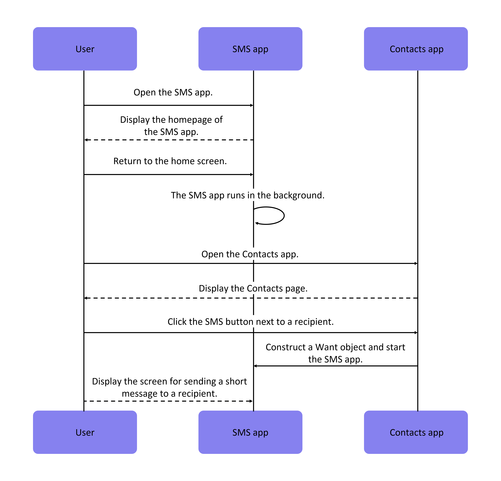

# Launching UIAbility Components Within an Application

[UIAbility](../../../en/application-dev/reference/AbilityKit/cj-apis-app-ability-ui_ability.md#class-uiability) is the smallest unit scheduled by the system. When navigating between functional modules within a device, it involves launching specific Abilities, including other Abilities within the same application or Abilities from other applications (e.g., launching a third-party payment Ability).

This chapter primarily introduces the methods for launching Ability components within an application.

- [Launching UIAbility Components Within an Application](#launching-uiability-components-within-an-application)
  - [Launching UIAbility Within an Application](#launching-uiability-within-an-application)
  - [Launching a Specified Page of a UIAbility](#launching-a-specified-page-of-a-uiability)
    - [Overview](#overview)
    - [Caller UIAbility Specifies the Launch Page](#caller-uiability-specifies-the-launch-page)
    - [Cold Start of Target UIAbility](#cold-start-of-target-uiability)
    - [Hot Start of Target UIAbility](#hot-start-of-target-uiability)

## Launching UIAbility Within an Application

When an application contains multiple [UIAbility](../../../en/application-dev/reference/AbilityKit/cj-apis-app-ability-ui_ability.md#class-uiability) components, there are scenarios where Abilities are launched within the application. For example, in a payment application, launching the payment Ability from the entry Ability.

Assume the application has two Abilities: EntryAbility and FuncAbility (which can be in the same Module or different Modules), and FuncAbility needs to be launched from a page in EntryAbility.

1. In EntryAbility, launch the Ability by calling the [startAbility()](../../../en/application-dev/reference/AbilityKit/cj-apis-app-ability-ui_ability.md#func-startabilitywant-startoptions) method. [Want](../../../en/application-dev/reference/AbilityKit/cj-apis-app-ability-want.md#class-want) is the entry parameter for launching the Ability instance, where `bundleName` is the Bundle name of the application to be launched, `abilityName` is the name of the Ability to be launched, `moduleName` is added when the target Ability belongs to a different Module, and `parameters` are custom information parameters. For how to obtain the context in the example, refer to [Obtaining UIAbility Context Information](cj-uiability-usage.md#obtaining-uiability-context-information).

    <!-- compile -->

    ```cangjie
    import kit.ArkUI.Button
    import ohos.business_exception.*
    import kit.AbilityKit.{Want, UIAbilityContext}
    import std.collection.HashMap

    var globalContext:?UIAbilityContext = None

    // Refer to the section on obtaining UIAbility context information
    func getContext(): UIAbilityContext {
        return globalContext.getOrThrow()
    }

    @Entry
    @Component
    class PageAbilityComponentsInteractive {
        func build() {
            Row {
                Column {
                    Button().onClick {
                        evt =>
                        // context is the AbilityContext of the caller Ability
                        let context = getContext()
                        let parametersMap = HashMap<String, WantValueType>()
                        parametersMap.add("info", StringValue("From EntryAbility PageAbilityComponentsInteractive page"))
                        let want = Want(
                            deviceId: "", // Empty deviceId indicates the current device
                            bundleName: "com.samples.stagemodelabilitydevelop",
                            abilityName: "FuncAbilityA",
                            moduleName: "entry", // moduleName is optional
                            // Custom information
                            parameters: parametersMap
                        )
                        try {
                            context
                                .startAbility(want)
                                .get()
                        } catch (e: BusinessException) {
                            HILog.info(0, "device_interaction", "Failed to start FuncAbility. Code is ${e.code}, message is ${e.message}")
                        }
                    }
                }.width(100.percent)
            }.height(100.percent)
        }
    }
    ```

2. In FuncAbility's [onCreate()](../../../en/application-dev/reference/AbilityKit/cj-apis-app-ability-ui_ability.md#func-oncreatewant-launchparam) or [onNewWant()](../../../en/application-dev/reference/AbilityKit/cj-apis-app-ability-ui_ability.md#func-onnewwantwant-launchparam) lifecycle callback file, receive the parameters passed from EntryAbility.

    <!-- compile -->

    ```cangjie
    import kit.AbilityKit.{UIAbility, UIAbilityContext, LaunchParam, Want}

    var globalFuncAbilityAContext: ?UIAbilityContext = None
    class FuncAbilityA <: UIAbility {
        public override func onCreate(want: Want, launchParam: LaunchParam): Unit {
            globalFuncAbilityAContext = this.context
            // Receive parameters passed from the caller Ability
            let funcAbilityWant = want
            // want.parameters is a JSON-formatted string; users can parse the info field value using a third-party JSON library
        }
        // ...
    }
    ```

    > **Note:**
    >
    > In the launched FuncAbility, you can obtain the PID, Bundle Name, and other information of the caller [UIAbility](../../../en/application-dev/reference/AbilityKit/cj-apis-app-ability-ui_ability.md#class-uiability) by accessing the `parameters` of the passed [Want](../../../en/application-dev/reference/AbilityKit/cj-apis-app-ability-want.md#class-want) parameter.

3. After completing the business logic in FuncAbility, if you need to terminate the current [UIAbility](../../../en/application-dev/reference/AbilityKit/cj-apis-app-ability-ui_ability.md#class-uiability) instance, call the [terminateSelf()](../../../en/application-dev/reference/AbilityKit/cj-apis-app-ability-ui_ability.md#func-terminateself) method in FuncAbility. For how to obtain the context in the example, refer to [Obtaining UIAbility Context Information](cj-uiability-usage.md#obtaining-uiability-context-information).

    <!-- compile -->

    ```cangjie
    import ohos.business_exception.*
    import kit.AbilityKit.UIAbilityContext

    var globalFuncAbilityAContext: ?UIAbilityContext = None
    // Refer to the section on obtaining UIAbility context information
    func getFuncAbilityAContext(): UIAbilityContext {
        return globalFuncAbilityAContext.getOrThrow()
    }

    @Entry
    @Component
    class PageFromStageModel {
        func build() {
            Row {
                Column {
                    Button("FuncAbility").onClick {
                        evt =>
                        let context = getFuncAbilityAContext()
                        try {
                            context.terminateSelf().get()
                        } catch (e: BusinessException) {
                            HiLog.Info(0, "device_interaction", "Failed to start terminate self. Code is ${e.code}, message is ${e.message}")
                        }
                    }
                    // ...
                }.width(100.percent)
            }.height(100.percent)
        }
    }
    ```

    > **Note:**
    >
    > When calling the terminateSelf() method to terminate the current Ability instance, a snapshot of the instance is retained by default, meaning the corresponding task can still be seen in the recent tasks list. If you do not want to retain the snapshot, configure the `removeMissionAfterTerminate` field in the [abilities tag](../cj-start/basic-knowledge/module-configuration-file.md#abilities-tag) of the corresponding Ability's [module.json5 configuration file](../cj-start/basic-knowledge/module-configuration-file.md) to `true`.

## Launching a Specified Page of a UIAbility

### Overview

A [UIAbility](../../../en/application-dev/reference/AbilityKit/cj-apis-app-ability-ui_ability.md#class-uiability) can correspond to multiple pages. When launching the UIAbility in different scenarios, different pages may need to be displayed. For example, when navigating from one UIAbility's page to another UIAbility, you may want to launch a specified page of the target UIAbility.

UIAbility launches are divided into two scenarios: cold start and hot start.

- **UIAbility Cold Start**: Refers to launching a UIAbility instance that is completely closed, requiring full loading and initialization of the UIAbility instance's code, resources, etc.
- **UIAbility Hot Start**: Refers to launching a UIAbility instance that has already been started and run in the foreground but was switched to the background for some reason. In this case, the UIAbility instance's state can be quickly restored.

This chapter mainly explains the two scenarios of launching a specified page: [Target UIAbility Cold Start](#cold-start-of-target-uiability) and [Target UIAbility Hot Start](#hot-start-of-target-uiability), as well as how the caller specifies the launch page.

### Caller UIAbility Specifies the Launch Page

When a caller [UIAbility](../../../en/application-dev/reference/AbilityKit/cj-apis-app-ability-ui_ability.md#class-uiability) launches another UIAbility, it often needs to navigate to a specified page. For example, FuncAbility contains two pages (Index for the home page and FuncA for the function A page). In this case, you need to configure the specified page information in the passed [Want](../../../en/application-dev/reference/AbilityKit/cj-apis-app-ability-want.md#class-want) parameter by adding a custom parameter to the `parameters` field of the Want object to pass the page navigation information. For how to obtain the context in the example, refer to [Obtaining UIAbility Context Information](cj-uiability-usage.md#obtaining-uiability-context-information).

<!-- compile -->

```cangjie
import kit.ArkUI.Button
import ohos.business_exception.*
import kit.AbilityKit.{Want, UIAbilityContext, AbilityResult}
import std.collection.HashMap

// Refer to the section on obtaining UIAbility context information
func getContext(): UIAbilityContext {
    return globalContext.getOrThrow()
}

@Entry
@Component
class PageAbilityComponentsInteractive {
    func build() {
        Row {
            Column {
                Button().onClick {
                    evt =>
                    // context is the AbilityContext of the caller Ability
                    let context = getContext()
                    let parametersMap = HashMap<String, WantValueType>()
                    parametersMap.add("router", StringValue("FuncA"))
                    let want = Want(
                        deviceId: "", // Empty deviceId indicates the current device
                        bundleName: "com.samples.stagemodelabilitydevelop",
                        abilityName: "FuncAbilityA",
                        moduleName: "entry", // moduleName is optional
                        // Custom information
                        parameters: parametersMap
                    )
                    try {
                        context.startAbility(want)
                    } catch (e: BusinessException) {
                        Hilog.info(0, "device_interaction", "Failed to start FuncAbility. Code is ${e.code}, message is ${e.message}")
                    }
                }
            }.width(100.percent)
        }.height(100.percent)
    }
}
```

### Cold Start of Target UIAbility

During the cold start of the target [UIAbility](../../../en/application-dev/reference/AbilityKit/cj-apis-app-ability-ui_ability.md#class-uiability), the parameters passed from the caller are received in the target Ability's [onCreate()](../../../en/application-dev/reference/AbilityKit/cj-apis-app-ability-ui_ability.md#func-oncreatewant-launchparam) lifecycle callback. Then, in the target Ability's [onWindowStageCreate()](../../../en/application-dev/reference/AbilityKit/cj-apis-app-ability-ui_ability.md#func-onwindowstagecreatewindowstage) lifecycle callback, parse the [Want](../../../en/application-dev/reference/AbilityKit/cj-apis-app-ability-want.md#class-want) parameter passed from the caller to obtain the URL of the page to be loaded, and pass it to the [windowStage.loadContent()](../../../en/application-dev/reference/arkui-cj/cj-apis-window.md#class-windowstage) method.

<!-- compile -->

```cangjie
import std.collection.HashMap
import kit.AbilityKit.{UIAbility, LaunchParam, Want}

class FuncAbilityA <: UIAbility {
    var router = "Index"
    public override func onCreate(want: Want, launchParam: LaunchParam): Unit {
        // Receive parameters passed from the caller UIAbility
        let funcAbilityWant = want
        // want.parameters is a JSON-formatted string; users can parse the router field value using a third-party JSON library
    }

    public override func onWindowStageCreate(windowStage: WindowStage): Unit {
        Hilog.info(0, "device_interaction", "FuncAbilityA onWindowStageCreate.")
        windowStage.loadContent(router)
    }
}
```

### Hot Start of Target UIAbility

In application development, there are scenarios where the target [UIAbility](../../../en/application-dev/reference/AbilityKit/cj-apis-app-ability-ui_ability.md#class-uiability) instance has already been launched. In this case, when launching the target Ability again, the initialization logic is not re-executed; only the [onNewWant()](../../../en/application-dev/reference/AbilityKit/cj-apis-app-ability-ui_ability.md#func-onnewwantwant-launchparam) lifecycle method is triggered. To navigate to a specified page, you need to parse the parameters in onNewWant() for processing.

For example, consider a scenario involving a messaging application and a contacts application.

1. The user opens the messaging application first, launching the UIAbility instance of the messaging application and displaying its home page.
2. The user returns to the home screen, and the messaging application enters the background.
3. The user opens the contacts application and finds contact "Zhang San."
4. The user clicks the message button for "Zhang San," which relaunches the UIAbility instance of the messaging application.
5. Since the UIAbility instance of the messaging application has already been launched, the onNewWant() callback of this UIAbility is triggered, without executing [onCreate()](../../../en/application-dev/reference/AbilityKit/cj-apis-app-ability-ui_ability.md#func-oncreatewant-launchparam) and [onWindowStageCreate()](../../../en/application-dev/reference/AbilityKit/cj-apis-app-ability-ui_ability.md#func-onwindowstagecreatewindowstage) initialization logic.

**Figure 1** Hot Start of Target UIAbility



The development steps are as follows:

1. Cold start the UIAbility instance of the messaging application.

    <!-- compile -->

    ```cangjie
    import std.collection.HashMap
    import ohos.base.{AppLog, BusinessException}
    import kit.AbilityKit.{UIAbility, LaunchParam, Want}

    var globalFuncAbilityAContext:?UIAbilityContext = None
    class FuncAbilityA <: UIAbility {
        var url = "Index"
        public override func onCreate(want: Want, launchParam: LaunchParam): Unit {
            // Receive parameters passed from the caller Ability
            let funcAbilityWant = want
            let info = "XXX"
            // want.parameters is a JSON-formatted string; users can parse the router field value using a third-party JSON library and assign it to info
            if (info == "FuncA") {
                url = "PageColdStartUp"
            }
        }

        public override func onWindowStageCreate(windowStage: WindowStage): Unit {
            HiLog.info(0, "device_interaction", "FuncAbilityA onWindowStageCreate.")
            globalFuncAbilityAContext = this.context
            windowStage.loadContent(url)
        }
    }
    ```

2. In the [onNewWant()](../../../en/application-dev/reference/AbilityKit/cj-apis-app-ability-ui_ability.md#func-onnewwantwant-launchparam) callback of the messaging application's UIAbility, parse the [Want](../../../en/application-dev/reference/AbilityKit/cj-apis-app-ability-want.md#class-want) parameter passed from the caller, use the [Router](../../../en/application-dev/reference/arkui-cj/cj-apis-router.md#class-router) object, and navigate to the specified page. When the UIAbility instance of the messaging application is launched again, it will navigate to the specified page.

    <!-- compile -->

    ```cangjie
    import std.collection.HashMap
    import ohos.base.{AppLog, BusinessException}
    import kit.AbilityKit.{UIAbility, LaunchParam, Want}
    import kit.ArkUI.{launch, Router}

    class FuncAbilityA <: UIAbility {
        //...
        public override func onNewWant(want: Want, launchParam: LaunchParam): Unit {
            // Receive parameters passed from the caller Ability
            let funcAbilityWant = want
            let info = "XXX"
            // want.parameters is a JSON-formatted string; users can parse the router field value using a third-party JSON library and assign it to info
            if (info == "FuncA") {
                url = "PageHotStartUp"
            }
            launch {
                Router.pushUrl(url: "PageHotStartUp", callback: {code => AppLog.error("Failed to push url. Code is ${code}")})
            }
        }
    }
    ```

> **Note:**
>
> When the called [UIAbility component launch mode](cj-uiability-launch-type.md) is set to `multiton`, a new instance is created each time it is launched, so the onNewWant() callback will not be used.