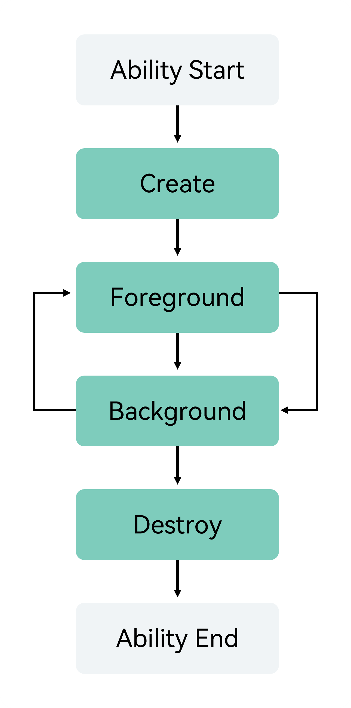
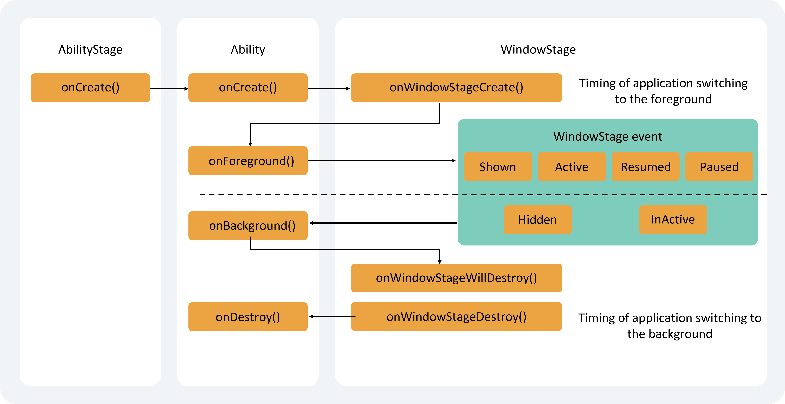

# UIAbility Component Lifecycle

## Overview

When users open, switch, or return to a corresponding application, the [UIAbility](../../../en/application-dev/reference/AbilityKit/cj-apis-app-ability-ui_ability.md#class-uiability) instances within the application transition between different states in their lifecycle. The UIAbility class provides a series of callbacks that notify when the current UIAbility instance undergoes state changes, including creation and destruction of the UIAbility instance, or transitions between foreground and background states.

The lifecycle of UIAbility includes four states: Create, Foreground, Background, and Destroy, as illustrated below.

**Figure 1** UIAbility Lifecycle States

<!-- ToBeReviewd -->

## Lifecycle State Description

### Create State

The Create state is triggered when the [UIAbility](../../../en/application-dev/reference/AbilityKit/cj-apis-app-ability-ui_ability.md#class-uiability) instance is created during application loading. The system calls the [onCreate()](../../../en/application-dev/reference/AbilityKit/cj-apis-app-ability-ui_ability.md#func-oncreatewant-launchparam) callback. This callback can be used for page initialization operations, such as variable definition and resource loading, to prepare for subsequent UI display.

<!-- compile -->

```cangjie
internal import kit.AbilityKit.UIAbility
internal import kit.AbilityKit.Want

class MainAbility <: UIAbility {
    public override func onCreate(want: Want, launchParam: LaunchParam): Unit {
      // Page initialization
    }
    // ...
}
```

> **Note:**
>
> [Want](../../../en/application-dev/reference/AbilityKit/cj-apis-app-ability-want.md#class-want) is a carrier for information transfer between objects and can be used for inter-component communication. For detailed information about Want, refer to [Information Carrier Want](cj-want-overview.md).

### WindowStageCreate and WindowStageDestroy States

After the [UIAbility](../../../en/application-dev/reference/AbilityKit/cj-apis-app-ability-ui_ability.md#class-uiability) instance is created and before it enters the Foreground state, the system creates a WindowStage. Upon WindowStage creation, the [onWindowStageCreate()](../../../en/application-dev/reference/AbilityKit/cj-apis-app-ability-ui_ability.md#func-onwindowstagecreatewindowstage) callback is triggered. This callback can be used to set up UI loading and subscribe to WindowStage events.

**Figure 2** WindowStageCreate and WindowStageDestroy States

<!-- ToBeReviewd -->

In the onWindowStageCreate() callback, use the [loadContent()](../../../en/application-dev/reference/arkui-cj/cj-apis-window.md#class-windowstage) method to specify the page to be loaded by the application. Additionally, call the [on('windowStageEvent')](../../../en/application-dev/reference/arkui-cj/cj-apis-window.md#func-onwindowcallbacktype-callback1argumentwindowstageeventtype) method to subscribe to [WindowStage events](../../../en/application-dev/reference/arkui-cj/cj-apis-window.md#enum-windowstageeventtype) (focus/unfocus, foreground/background transitions, interactive/non-interactive states).

> **Note:**
>
> The timing of [WindowStage events](../../../en/application-dev/reference/arkui-cj/cj-apis-window.md#enum-windowstageeventtype) may vary across different development scenarios.

<!-- compile -->

```cangjie
import kit.AbilityKit.UIAbilityContext
import kit.AbilityKit.UIAbility
import kit.ArkUI.{WindowStage, WindowCallbackType, WindowStageEventType}
import ohos.base.{AppLog, Callback1Argument, BusinessException}

class WindowStageCallback <: Callback1Argument<WindowStageEventType> {
    public override func invoke(arg: WindowStageEventType) {
        match (arg) {
            case WindowStageEventType.SHOWN => // Transition to foreground
                AppLog.info("windowStage foreground.")
            case WindowStageEventType.ACTIVE => // Focus state
                AppLog.info("windowStage active.")
            case WindowStageEventType.INACTIVE => // Unfocus state
                AppLog.info("windowStage inactive.")
            case WindowStageEventType.HIDDEN => // Transition to background
                AppLog.info("windowStage background.")
            case WindowStageEventType.RESUMED => // Interactive state
                AppLog.info("windowStage resumed.")
            case WindowStageEventType.PAUSED => // Non-interactive state
                AppLog.info("windowStage paused.")
            case _ => ()
        }
    }
}

class MainAbility <: UIAbility {
    // ...
    public override func onWindowStageCreate(windowStage: WindowStage): Unit {
        // Subscribe to WindowStage events (focus/unfocus, foreground/background transitions, interactive/non-interactive states)
        try {
            windowStage.on(WindowStageEvent, WindowStageCallback())
        } catch (e: BusinessException) {
            AppLog.error("Failed to enable the listener for window stage event changes. Cause: ${e.message}");
        }
        // Set up UI loading
        windowStage.loadContent("EntryView")
    }
}
```

> **Note:**
>
> For WindowStage usage, refer to [Window Development Guide](../../../en/application-dev/reference/arkui-cj/cj-apis-window.md).

### Foreground and Background States

The Foreground and Background states are triggered when the [UIAbility](../../../en/application-dev/reference/AbilityKit/cj-apis-app-ability-ui_ability.md#class-uiability) instance transitions to the foreground and background, respectively, corresponding to the [onForeground()](../../../en/application-dev/reference/AbilityKit/cj-apis-app-ability-ui_ability.md#func-onforeground) and [onBackground()](../../../en/application-dev/reference/AbilityKit/cj-apis-app-ability-ui_ability.md#func-onbackground) callbacks.

The `onForeground()` callback is triggered before the UI of the UIAbility becomes visible, such as when the UIAbility transitions to the foreground. Use this callback to request system resources or reacquire resources released in `onBackground()`.

The `onBackground()` callback is triggered after the UI of the UIAbility becomes completely invisible, such as when the UIAbility transitions to the background. Use this callback to release resources unnecessary when the UI is invisible or to perform time-consuming operations like state preservation.

For example, if an application requires user location data and has obtained the necessary permissions, the location service can be enabled in the `onForeground()` callback to retrieve current location information.

When the application transitions to the background, the location service can be stopped in the `onBackground()` callback to conserve system resources.

<!-- compile -->

```cangjie
import kit.AbilityKit.UIAbility

class MainAbility <: UIAbility {
    // ...

    public override func onForeground(): Unit {
        // Request system resources or reacquire resources released in onBackground()
    }

    public override func onBackground(): Unit {
        // Release unnecessary resources or perform time-consuming operations
        // such as state preservation
    }
}
```

When a UIAbility instance is already created and configured with the [singleton](cj-uiability-launch-type.md#singleton启动模式) launch mode, calling [startAbility()](../../../en/application-dev/reference/AbilityKit/cj-apis-app-ability-ui_ability.md#func-startabilityforresultwant-asynccallbackabilityresult) to launch this UIAbility instance again will only trigger the [onNewWant()](../../../en/application-dev/reference/AbilityKit/cj-apis-app-ability-ui_ability.md#func-onnewwantwant-launchparam) callback, bypassing the [onCreate()](../../../en/application-dev/reference/AbilityKit/cj-apis-app-ability-ui_ability.md#func-oncreatewant-launchparam) and [onWindowStageCreate()](../../../en/application-dev/reference/AbilityKit/cj-apis-app-ability-ui_ability.md#func-onwindowstagecreatewindowstage) lifecycle callbacks. Use this callback to update resources and data for subsequent UI display.

<!-- compile -->

```cangjie
import kit.AbilityKit.{UIAbility, Want, LaunchParam}

class MainAbility <: UIAbility {
    // ...
    public override func onNewWant(want: Want, launchParam: LaunchParam): Unit {
        // Update resources and data
    }
}
```

### Destroy State

The Destroy state is triggered when the [UIAbility](../../../en/application-dev/reference/AbilityKit/cj-apis-app-ability-ui_ability.md#class-uiability) instance is destroyed. Use the onDestroy() callback to release system resources, save data, etc.

For example, calling the [terminateSelf()](../../../en/application-dev/reference/AbilityKit/cj-apis-app-ability-ui_ability.md#func-terminateself) method to stop the current UIAbility instance will execute the onDestroy() callback and complete the destruction of the UIAbility instance.

<!--RP1-->
Similarly, when a user closes the UIAbility instance from the recent tasks list, the onDestroy() callback is executed, and the UIAbility instance is destroyed.

> **Note:**
>
> When debugging an application in developer mode, removing a task of the debugged application from the recent tasks list will forcibly terminate the application's process.

<!--RP1End-->

<!-- compile -->

```cangjie
import kit.AbilityKit.UIAbility

class MainAbility <: UIAbility {
    // ...

    public override func onDestroy(): Unit {
        // Release system resources or save data
    }
}
```