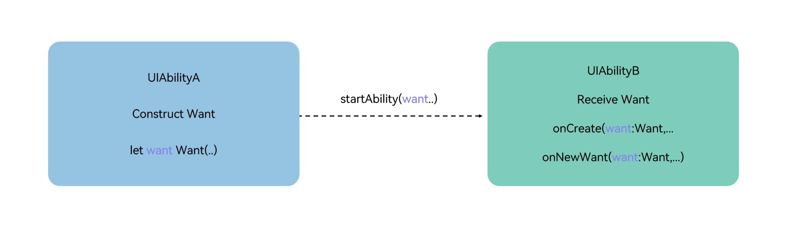

# Overview of Want

<!--Del-->
> **Note:**
>
> Currently in the beta phase.
<!--DelEnd-->

## Definition and Usage of Want

[Want](../reference/AbilityKit/cj-apis-app-ability-want.md#class-want) is an object used for transferring information between application components.

One common usage scenario is as a parameter of the [startAbility()](../reference/AbilityKit/cj-apis-app-ability-ui_ability.md#func-startabilitywant-startOptions) method. For example, when UIAbilityA needs to start UIAbilityB and pass some data to UIAbilityB, Want can serve as a carrier to transfer the data to UIAbilityB.

**Figure 1** Illustration of Want Usage  

<!-- ToBeReviewd -->

## Types of Want

- **Explicit Want**: When starting a target application component, if the caller specifies both abilityName and bundleName in the [Want](../reference/AbilityKit/cj-apis-app-ability-want.md#class-want) parameter, it is called an Explicit Want.

    Explicit Want is typically used for launching components within the same application by specifying the target component's bundle name (bundleName) and abilityName in the Want object. When there is a clearly defined target object to handle the request, Explicit Want provides a straightforward and effective way to start the target application component.

  <!-- compile -->

  ```cangjie
  import kit.AbilityKit.Want

  let wantInfo = Want(deviceId: "", bundleName: "com.example.myapplication", abilityName: "FuncAbility")
  ```

- **Implicit Want**: When starting a target application component, if the caller does not specify abilityName in the [Want](../reference/AbilityKit/cj-apis-app-ability-want.md#class-want) parameter, it is called an Implicit Want.

    When the target object is not clearly defined, Implicit Want can be used to leverage capabilities provided by other applications without needing to know which specific application provides them. Implicit Want uses [skills tags](../cj-start/basic-knowledge/module-configuration-file.md#skills标签) to define the required capabilities, and the system matches all applications that declare support for handling such requests. For example, when opening a link, the system will match all applications that support this action and let the user choose which one to use.

  <!-- compile -->

  ```cangjie
  import kit.AbilityKit.Want

  // uncomment line below if wish to implicitly query only in the specific bundle.
  // bundleName: 'com.example.myapplication'
  let wantInfo = Want(action: "ohos.want.action.search",
      // entities can be omitted
      entities: ["entity.system.browsable"],
      uri: "https://www.test.com:8080/query/student",
      dataType: "text/plain")
  ```

    > **Note:**
    >
    > Depending on the matching results of target application components in the system, three scenarios may occur when using Implicit Want to start an application component:
    >
    > - No matching application component is found: The startup fails.
    > - One matching application component is found: The component is launched directly.
    > - Multiple matching application components are found ([UIAbility](../reference/AbilityKit/cj-apis-app-ability-ui_ability.md#class-uiability)): A selection dialog pops up for the user to choose.