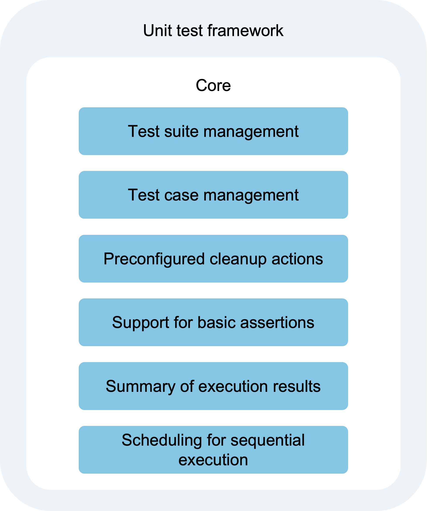
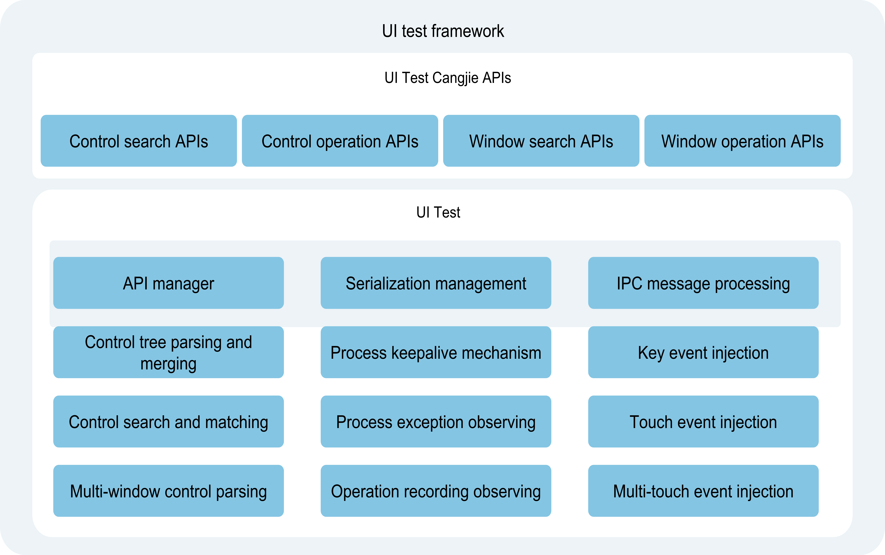
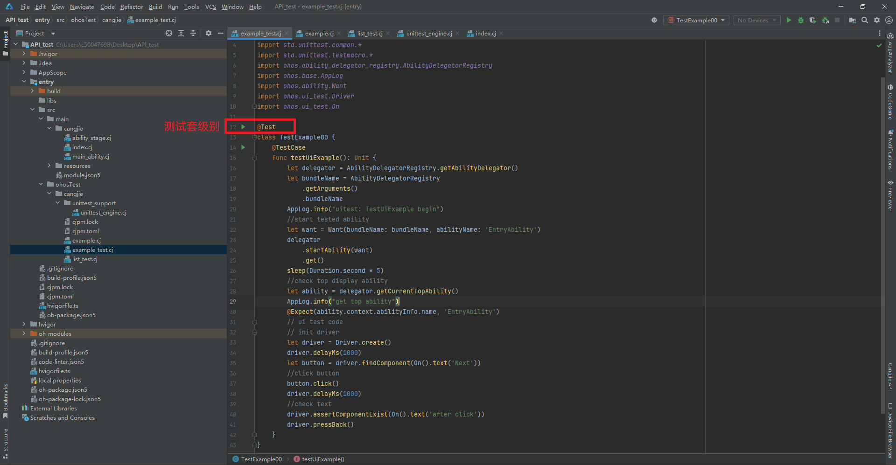
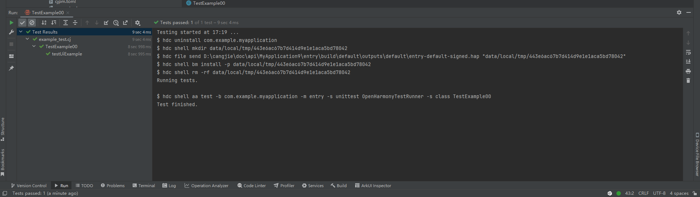

# Automated Testing Framework Usage Guide

## Overview

The Cangjie Automated Testing Framework consists of two components: the Cangjie OpenHarmony Unit Testing Framework and UiTest.

The Cangjie OpenHarmony Unit Testing Framework is implemented based on the std.unittest library native to the Cangjie language, providing fundamental capabilities for writing unit test cases, executing them, and generating test reports. Building upon std.unittest, TestRunner has been adapted for the OH platform, enabling its use within applications.

UiTest offers capabilities for locating and manipulating UI components. By calling the interfaces provided by UiTest, users can write test scripts to achieve UI automation testing. The UiTest framework also provides auxiliary testing capabilities in the form of hdc shell commands, such as capturing screenshots, obtaining control trees, recording user operations, and injecting simulated UI operations.

This guide introduces the main features, implementation principles, environment setup, and methods for writing and executing test scripts in the Cangjie Automated Testing Framework.

## Implementation Principles

The testing framework is divided into a unit testing framework and a UI testing framework.

The unit testing framework serves as the foundational base of the testing framework, providing essential capabilities for test case identification, scheduling, execution, and result aggregation.

The UI testing framework primarily offers UiTest APIs for developers to invoke in corresponding test scenarios, while its script execution still relies on the unit testing framework.

### Unit Testing Framework

- Main Functions of the Unit Testing Framework

  

- Basic Script Flow

    - Locate the corresponding TestRunner.registerCreator based on the -s unittest parameter, instantiate TestRunner, and sequentially execute onPrepare and onRun.
    - Parse startup parameters in onRun to identify which test cases to execute, along with timeout and other information.
    - Call the Cangjie kernel unittest to initialize and execute the test suite, saving test results in XML format on the device at `/data/app/el1/100/base/${bundleName}/tests`.
    - After all specified test suites are executed, read the XML test report and print it to the terminal and hilog logs.

### UI Testing Framework

- Main Functions of the UI Testing Framework



## Writing and Executing Tests with Cangjie

### Setting Up the Environment

Refer to the official website for instructions on [downloading](https://developer.harmonyos.com/cn/develop/deveco-studio#download) DevEco Studio and performing the necessary configuration steps.

### Creating and Writing Test Scripts

#### Creating Test Scripts

<!--RP1-->
In DevEco Studio, create a new application development project. The ohosTest directory is where the test scripts are located.
<!--RP1End-->

#### Writing Unit Test Scripts

This section describes the capabilities supported by the unit testing framework and how to use them.

In the unit testing framework, test scripts must include the following basic elements:

1. Import dependencies to use the required testing interfaces.
2. Write test code, including the relevant logic such as interface calls.
3. Invoke assertion interfaces to set checkpoints in the test code. Without checkpoints, it cannot be considered a complete test script.

    The following example code implements a scenario where the test page is launched, and the current displayed page on the device is checked to see if it matches the expected page.

    <!-- compile -->

    ```cangjie
    //example_test.cj
    import kit.TestKit.*
    import kit.AbilityKit.*
    import std.unittest.*
    import std.unittest.common.*
    import std.unittest.testmacro.*

    @Test
    class TestExample00 {
        @TestCase
        func testUiExample(): Unit {
            let delegator = AbilityDelegatorRegistry.getAbilityDelegator()
            let bundleName = AbilityDelegatorRegistry
                .getArguments()
                .bundleName
            AppLog.info("uitest: TestUiExample begin")
            //start tested ability
            let want = Want(bundleName: bundleName, abilityName: 'EntryAbility')
            delegator
                .startAbility(want)
                .get()
            sleep(Duration.second * 5)
            //check top display ability
            let ability = delegator.getCurrentTopAbility()
            AppLog.info("get top ability")
            @Expect(ability.context.abilityInfo.name, 'EntryAbility')
        }
    }
    ```

#### Writing UI Test Scripts

This section introduces the capabilities supported by the UI testing framework and the corresponding API usage methods.

UI testing is based on unit testing. UI test scripts extend unit test scripts by adding UiTest interfaces. For details, refer to the [API documentation](../../../en/application-dev/reference/TestKit/cj-apis-ui_test.md).

The following example code builds upon the unit test script above, implementing a scenario where a click operation is performed on the launched application page, and the resulting page change is checked to see if it matches the expected change.

1. Write the index.cj page code as the example demo under test.

    <!-- compile -->

    ```cangjie
    import ohos.base.*
    import ohos.component.*
    import ohos.state_manage.*
    import ohos.arkui.state_macro_manage.*

    @Entry
    @Component
    class EntryView {
        @State
        var message: String = "Hello World"

        func build() {
            Row {
                Column {
                    Text(this.message)
                        .fontSize(50)
                        .fontWeight(FontWeight.Bold)
                    Text("Next")
                        .fontSize(50)
                        .margin(top: 20)
                        .fontWeight(FontWeight.Bold)
                    Text("after click")
                        .fontSize(50)
                        .margin(top: 20)
                        .fontWeight(FontWeight.Bold)
                }.width(100.percent)
            }.height(100.percent)
        }
    }
    ```

2. Write specific test code in the example_test.cj file under ohosTest > cangjie.

    <!-- compile -->

    ```cangjie
    import kit.TestKit.*
    import kit.AbilityKit.*
    import std.unittest.*
    import std.unittest.common.*
    import std.unittest.testmacro.*

    @Test
    class TestExample00 {
        @TestCase
        func testUiExample(): Unit {
            let delegator = AbilityDelegatorRegistry.getAbilityDelegator()
            let bundleName = AbilityDelegatorRegistry
                .getArguments()
                .bundleName
            AppLog.info("uitest: TestUiExample begin")
            //start tested ability
            let want = Want(bundleName: bundleName, abilityName: 'EntryAbility')
            delegator
                .startAbility(want)
                .get()
            sleep(Duration.second * 5)
            //check top display ability
            let ability = delegator.getCurrentTopAbility()
            AppLog.info("get top ability")
            @Expect(ability.context.abilityInfo.name, 'EntryAbility')
            // ui test code
            // init driver
            let driver = Driver.create()
            driver.delayMs(1000)
            let button = driver.findComponent(On().text('Next'))
            //click button
            button.click()
            driver.delayMs(1000)
            //check text
            driver.assertComponentExist(On().text('after click'))
            driver.pressBack()
        }
    }
    ```

### Executing Test Scripts

#### Executing in DevEco Studio

Script execution requires connecting to a hardware device. Click the button to execute the test suite, i.e., all test cases defined in the testClass method.



**Viewing Test Results**

After test execution, you can directly view the test results in DevEco Studio, as shown in the example below.



#### Executing in CMD

Script execution requires connecting to a hardware device, installing the application test package on the test device, and executing the aa command in the cmd window to complete the test cases.

> **Note:**
>
> Using the cmd method requires configuring the hdc environment variables.

**aa test Command Execution Parameters**

| Full Parameter | Short Parameter | Meaning | Example |
| ------------- | ------ | ------- | ------------ |
| --bundleName  | -b   | Application Bundle Name.  | - b com.test.example    |
| --packageName | -p  | Application module name, applicable to FA model applications. | - p com.test.example.entry         |
| --moduleName  | -m   | Application module name, applicable to STAGE model applications.        | -m entry     |
| NA    | -s  | Specific parameters, passed as key-value pairs. | - s unittest OpenHarmonyTestRunner |

The framework currently supports multiple test execution methods, triggered by passing configuration key-value pair parameters after the -s parameter, as shown in the table below.

| Parameter Name | Meaning | Values | Example |
| ------------ | ------------------- | ------------- | -------- |
| unittest| The OpenHarmonyTestRunner object used for test execution.| OpenHarmonyTestRunner or custom runner name | - s unittest OpenHarmonyTestRunner   |
| class |Specifies the test suite or test case to execute.| {testClassName}#{testCaseName},{testClassName}  | -s class attributeTest#testAttributeIt|

Currently, only test suite execution at the TestClass level is supported, not individual TestCase execution.

**Executing the test Command in the CMD Window**

> **Note:**
>
> Parameter configuration and commands are based on the Stage model.

Example 1: Execute all test cases.

```shell
hdc shell aa test -b xxx -m xxx -s unittest OpenHarmonyTestRunner
```

Example 2: Execute specified TestClass test suite cases. Separate multiple classes with commas.

```shell
  hdc shell aa test -b xxx -m xxx -s unittest OpenHarmonyTestRunner -s class s1,s2
```

**Viewing Test Results**

- After cmd execution is complete, the following log information will be printed.

```xml
<?xml version="1.0" encoding="UTF-8"?>
<testsuite name="default.TestExample00" tests="1" failures="0" errors="0" skipped="0" time="7.990736" timestamp="2025-05-22T10:42:47.544499427+08:00">
        <testcase name="testUiExample" classname="default.TestExample00" assertions="1" time="7.989778"/>
</testsuite>
```

| Log Field | Meaning |
| -----------| --------------|
| testsuite.name | Name of the current test suite.|
| testsuite.tests    | Total number of test cases in the current suite. |
| testsuite.failures | Number of failed test cases. |
| testsuite.errors | Number of test cases with errors. |
| testsuite.skipped | Number of skipped test cases. |
| testsuite.time | Test suite execution duration (seconds). |
| testsuite.timestamp | Test suite execution start timestamp. |
| testcase.name | Test case name. |
| testcase.classname | Name of the test suite to which the case belongs. |
| testcase.assertions | Number of actual assertions in the test case. |
| testcase.time | Test case execution duration (seconds). |

> **Note:**
>
> In breakOnError mode, when a test case encounters an error, check the Ignore and interruption descriptions.

## Testing Based on Shell Commands

During development, if you need to quickly perform operations such as screenshots, screen recording, injecting simulated UI operations, or obtaining control trees, you can use shell commands to complete the corresponding tests more conveniently.

> **Note:**
>
> Using the cmd method requires configuring the hdc environment variables.

**Command List**

| Command  | Parameters   |Description      |
|-------|-------------|-------|
| help   | help|  Displays the command information supported by the uitest tool.  |
| screenCap       |[-p] | Takes a screenshot. Optional.<br>Specifies the storage path and filename, which can only be stored under /data/local/tmp/.<br>Default storage path: /data/local/tmp, filename: timestamp + .png. |
| dumpLayout      |[-p] \<-i \| -a>|Supports obtaining the control tree while the daemon is running.<br> **-p** : Specifies the storage path and filename, which can only be stored under /data/local/tmp/. Default storage path: /data/local/tmp, filename: timestamp + .json.<br> **-i** : Does not filter invisible controls or merge windows.<br> **-a** : Saves BackgroundColor, Content, FontColor, FontSize, and extraAttrs attribute data.<br> **Default** : Does not save the above attribute data.<br> **-a and -i** cannot be used simultaneously. |
| uiRecord        | uiRecord \<record \| read>|Records UI operations.  <br> **record** : Starts recording, saving the current interface operations to /data/local/tmp/record.csv. Use Ctrl+C to stop recording.  <br> **read** : Reads and prints the recorded data.<br>For the meaning of each parameter, refer to [User Recording Operations](#用户录制操作).|
| uiInput| \<help \| click \| doubleClick \| longClick \| fling \| swipe \| drag \| dircFling \| inputText \| keyEvent>| Injects simulated UI operations.<br>For the meaning of each parameter, refer to [Injecting UI Simulated Operations](#注入ui模拟操作).   |
| --version | --version|Gets the current tool version information.   |
| start-daemon|start-daemon| Starts the uitest test process. |

### Screenshot Usage Example

```bash
# Storage path: /data/local/tmp, filename: timestamp + .png.
hdc shell uitest screenCap
# Specifies the storage path and filename, stored under /data/local/tmp/.
hdc shell uitest screenCap -p /data/local/tmp/1.png
```

### Example for Obtaining Control Tree

```bash
hdc shell uitest dumpLayout -p /data/local/tmp/1.json
```

### User Operation Recording

> **Note:**
>
> During recording, wait for the recognition result of the current operation to be output in the command line before proceeding to the next step.

```bash
# Record current interface operations to /data/local/tmp/record.csv. Use Ctrl+C to stop recording.
hdc shell uitest uiRecord record
# Read and print recorded data.
hdc shell uitest uiRecord read
```

The following example shows the fields contained in the record data and their meanings, for reference only.

```text
{
  "ABILITY": "com.ohos.launcher.MainAbility", // Foreground application interface
  "BUNDLE": "com.ohos.launcher", // Operating application
  "CENTER_X": "", // Reserved field, currently unused
  "CENTER_Y": "", // Reserved field, currently unused
  "EVENT_TYPE": "pointer", //
  "LENGTH": "0", // Total step length
  "OP_TYPE": "click", // Event type, currently supports recording of click, double-click, long-press, drag, swipe, and fling actions
  "VELO": "0.000000", // Release velocity
  "direction.X": "0.000000", // Overall movement in X direction
  "direction.Y": "0.000000", // Overall movement in Y direction
  "duration": 33885000.0, // Duration of the gesture operation
  "fingerList": [{
    "LENGTH": "0", // Total step length
    "MAX_VEL": "40000", // Maximum velocity
    "VELO": "0.000000", // Release velocity
    "W1_BOUNDS": "{"bottom":361,"left":37,"right":118,"top":280}", // Starting control bounds
    "W1_HIER": "ROOT,3,0,0,0,0,0,0,0,0,5,0,0,0,0,0,0,0", // Starting control hierarchy
    "W1_ID": "", // Starting control ID
    "W1_Text": "", // Starting control text
    "W1_Type": "Image", // Starting control type
    "W2_BOUNDS": "{"bottom":361,"left":37,"right":118,"top":280}", // Ending control bounds
    "W2_HIER": "ROOT,3,0,0,0,0,0,0,0,0,5,0,0,0,0,0,0,0", // Ending control hierarchy
    "W2_ID": "", // Ending control ID
    "W2_Text": "", // Ending control text
    "W2_Type": "Image", // Ending control type
    "X2_POSI": "47", // Ending X position
    "X_POSI": "47", // Starting X position
    "Y2_POSI": "301", // Ending Y position
    "Y_POSI": "301", // Starting Y position
    "direction.X": "0.000000", // Movement in X direction
    "direction.Y": "0.000000" // Movement in Y direction
  }],
  "fingerNumber": "1" // Number of fingers
}
```

### Injecting UI Simulation Operations

| Command   | Required | Description    |
|------|------|-----------------|
| help   | Yes    | Help information related to the uiInput command. |
| click   | Yes    | Simulate a click operation.      |
| doubleClick   | Yes    | Simulate a double-click operation.      |
| longClick   | Yes    | Simulate a long-press operation.     |
| fling   | Yes    | Simulate a fling operation.   |
| swipe   | Yes    | Simulate a swipe operation.     |
| drag   | Yes    | Simulate a drag operation.     |
| dircFling   | Yes    | Simulate a directional fling operation.     |
| inputText   | Yes    | Simulate text input in an input box.     |
| keyEvent   | Yes    | Simulate physical key events (e.g., keyboard, power button, back, home, etc.) and combination key operations.     |

#### Example Usage of uiInput click/doubleClick/longClick

| Configuration Parameter    | Required | Description   |
|---------|------|-----------------|
| point_x | Yes      | X-coordinate of the click point. |
| point_y | Yes       | Y-coordinate of the click point. |

```shell
# Execute a click event.
hdc shell uitest uiInput click 100 100

# Execute a double-click event.
hdc shell uitest uiInput doubleClick 100 100

# Execute a long-press event.
hdc shell uitest uiInput longClick 100 100
```

#### Example Usage of uiInput fling

| Configuration Parameter  | Required   | Description      |
|------|------------------|-----------------|
| from_x   | Yes  | Starting X-coordinate of the swipe. |
| from_y   | Yes    | Starting Y-coordinate of the swipe. |
| to_x   | Yes   | Ending X-coordinate of the swipe. |
| to_y   | Yes   | Ending Y-coordinate of the swipe. |
| swipeVelocityPps_   | No      | Swipe velocity, unit: px/s, range: 200-40000.<br> Default: 600. |
| stepLength_   | No | Swipe step length. Default: swipe distance/50.<br>  **For better simulation results, it is recommended to omit this parameter or use the default value.**  |

```shell
# Execute a fling operation with stepLength_ omitted.
hdc shell uitest uiInput fling 10 10 200 200 500
```

#### Example Usage of uiInput swipe/drag

| Configuration Parameter  | Required             | Description               |
|------|------------------|-----------------|
| from_x   | Yes     | Starting X-coordinate of the swipe. |
| from_y   | Yes    | Starting Y-coordinate of the swipe. |
| to_x   | Yes    | Ending X-coordinate of the swipe. |
| to_y   | Yes    | Ending Y-coordinate of the swipe. |
| swipeVelocityPps_   | No      | Swipe velocity, unit: px/s, range: 200-40000.<br> Default: 600. |

```shell
# Execute a swipe operation.
hdc shell uitest uiInput swipe 10 10 200 200 500

# Execute a drag operation.
hdc shell uitest uiInput drag 10 10 100 100 500
```

#### Example Usage of uiInput dircFling

| Configuration Parameter  | Required  | Description |
|------------|-------------|----------|
| direction  | No | Swipe direction, range: [0,1,2,3], default: 0.<br> 0: left, 1: right, 2: up, 3: down.    |
| swipeVelocityPps_ | No| Swipe velocity, unit: px/s, range: 200-40000.<br> Default: 600.    |
| stepLength   | No   | Swipe step length.<br> Default: swipe distance/50. For better simulation results, it is recommended to omit this parameter or use the default value. |

```shell
# Execute a left swipe operation.
hdc shell uitest uiInput dircFling 0 500
# Execute a right swipe operation.
hdc shell uitest uiInput dircFling 1 600
# Execute an upward swipe operation.
hdc shell uitest uiInput dircFling 2
# Execute a downward swipe operation.
hdc shell uitest uiInput dircFling 3
```

#### Example Usage of uiInput inputText

| Configuration Parameter  | Required   | Description |
|------|---------|----------|
| point_x   | Yes | X-coordinate of the input box. |
| point_y   | Yes   | Y-coordinate of the input box. |
| text   | Yes   | Text content to input.  |

```shell
# Execute an input box text input operation.
hdc shell uitest uiInput inputText 100 100 hello
```

#### Example Usage of uiInput keyEvent

| Configuration Parameter   | Required  | Description |
|------|------|----------|
| keyID1   | Yes    | Physical key ID, range: KeyCode/Back/Home/Power.<br>When Back/Home/Power is used, combination keys are not supported. |
| keyID2    | No    | Physical key ID. |
| keyID3    | No    | Physical key ID. |

> **Note:**
>
> A maximum of three key values can be passed. For specific key values, refer to [KeyCode](../../../en/application-dev/reference/arkui-cj/cj-universal-event-key.md#var-keycode).

```shell
# Return to home screen.
hdc shell uitest uiInput keyEvent Home
# Go back.
hdc shell uitest uiInput keyEvent Back
# Combination key paste.
hdc shell uitest uiInput keyEvent 2072 2038
```

### Obtaining Version Information

```bash
hdc shell uitest --version
```

### Starting the uitest Test Process

```shell
hdc shell uitest start-daemon
```

> **Note**
>
> The device must be in developer mode.
>
> Only processes started by the `aa test` command have the capability to call UITest interfaces. For example, processes started by `aa start` will report errors when calling UITest interfaces.
>
> The [APL level](../security/AccessToken/cj-app-permission-mgmt-overview.md#权限机制中的基本概念) of the test hap must be system_basic or normal.

## Common Issues

### Common Issues in UI Test Cases

**1. Error log shows "Get windows failed/GetRootByWindow failed"**

**Issue Description**

UI test case execution fails, and the hilog shows "Get windows failed/GetRootByWindow failed."

**Possible Cause**

The ArkUI switch is not enabled, causing the control tree information of the tested interface to not be generated.

**Solution**

Execute the following command and restart the device before running the test case again.

```shell
hdc shell param set persist.ace.testmode.enabled 1
```

**2. Error log shows "uitest-api dose not allow calling concurrently"**

**Issue Description**

UI test case execution fails, and the hilog shows "uitest-api dose not allow calling concurrently."

**Possible Causes**

1. The test case involves multi-threaded concurrent calls to UITest interfaces, which is not supported.
2. Multiple processes in the test environment are concurrently executing UITest cases, leading to multiple UITest processes being started. The framework does not support multi-process calls.

**Solution**

1. Review the test case implementation to avoid multi-threaded concurrent calls to UITest interfaces.
2. Check the test environment to avoid multi-process concurrent execution of UITest-related cases.

**3. Error log shows "does not exist on current UI! Check if the UI has changed after you got the widget object"**

**Issue Description**

UI test case execution fails, and the hilog shows "does not exist on current UI! Check if the UI has changed after you got the widget object."

**Possible Cause**

After the target control is located in the test case code, the device interface changes, causing the located control to be lost and preventing further simulated operations.

**Solution**

Re-execute the UI test case.
