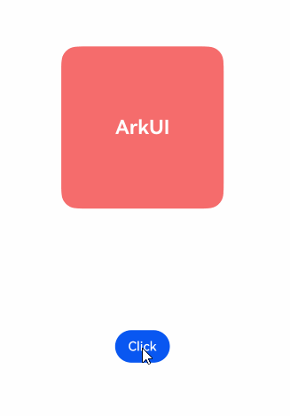
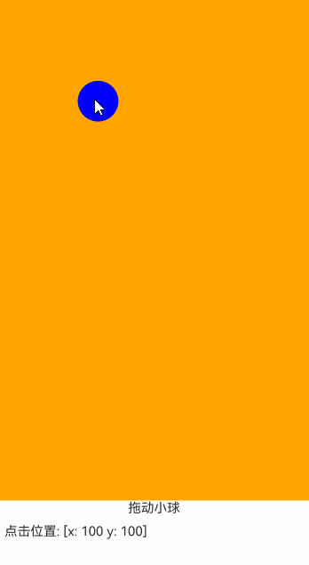

# Animation Transitions

In addition to running animations, UI interfaces also bear the function of real-time interaction with users. When user behavior changes according to intent, the UI interface should respond immediately. For example, if a user swipes up to exit during the application startup process, the startup animation should immediately transition to the exit animation, rather than waiting for the startup animation to complete before exiting, thereby reducing user wait time. For scenarios like desktop page flipping where animations are triggered from touch-following to release, the initial speed of the animation after release should inherit the gesture speed to avoid a sense of pause caused by discontinuous speed. To address the above scenarios, the system provides transition capabilities between animations and between gestures and animations, ensuring smooth transitions in various scenarios while minimizing development difficulty.

Assume there is an ongoing animation for a certain animatable property. When UI-side behavior changes the end value of this property, developers only need to modify the property value within the [animateTo](../../../en/application-dev/reference/arkui-cj/cj-animation-animateto.md#func-animatetoanimateparamunit) animation closure or change the property value affected by the [animationStart](../../../en/application-dev/reference/arkui-cj/cj-animation-animation.md#func-animationstartanimateparam) interface to generate the animation. The system will automatically transition from the previous animation to the current one, allowing developers to focus solely on implementing the current single animation.

The following example demonstrates this. By clicking "Click," the scale property of the red square changes. When "Click" is rapidly clicked multiple times, the end value of the scale property changes continuously, and the current animation smoothly transitions toward the new end value of the scale property.

 <!--run-->

```cangjie
package ohos_app_cangjie_entry

import kit.ArkUI.*
import ohos.arkui.state_macro_manage.*

@Observed
class SetSlt {
    @Publish var isAnimation: Bool = true
    public func set() {
        this.isAnimation = !this.isAnimation
    }

    public func getScale(): Float32 {
        if (this.isAnimation){
            return 2.0
        }
        return 1.0
    }
}

@Entry
@Component
class EntryView {
    @State var SetAnimation: SetSlt = SetSlt()

    func build() {
        Column() {
            Text('ArkUI')
                .fontWeight(FontWeight.Bold)
                .fontSize(12)
                .fontColor(Color.White)
                .textAlign(TextAlign.Center)
                .borderRadius(10)
                .backgroundColor(0xf56c6c)
                .width(100)
                .height(100)
                .animationStart(AnimateParam(curve: Curve.Ease))
                .scale(x: this.SetAnimation.getScale(), y: this.SetAnimation.getScale())
                .animationEnd()
            Button('Click')
                .margin(top: 200)
                .onClick({evt =>
                    this.SetAnimation.set()
                })
        }
        .width(100.percent)
        .height(100.percent)
        .justifyContent(FlexAlign.Center)
    }
}
```



## Gesture-to-Animation Transition

In scenarios involving gestures like swiping, pinching, or rotating, property changes are typically triggered during the touch-following phase. After release, these properties often continue to change until they reach their end values.

The initial speed of property changes during the release phase should match the speed of property changes just before release. If the property change speed starts from zero after release, it would be like a moving car slamming on the brakes, creating an abrupt visual change that neither users nor developers want to see.

For animations using the [springMotion](../../../en/application-dev/reference/arkui-cj/cj-apis-curves.md#static-func-springmotionfloat32float32float32) curve, the release-phase animation will automatically inherit the speed of the touch-following phase animation, starting from the current position of the touch-following animation and moving toward the specified property end value.

The following example code demonstrates a ball following touch movement.

 <!--run-->

```cangjie
package ohos_app_cangjie_entry

import kit.ArkUI.*
import ohos.arkui.state_macro_manage.*

@Entry
@Component
class EntryView {
    @State var positionX: Float64 = 100.0
    @State var positionY: Float64 = 100.0
    var diameter: Float64 = 50.0

    func build() {
        Column() {
            Row() {
                Circle(width: this.diameter, height: this.diameter)
                    .fill(Color.Blue)
                    .animationStart(AnimateParam(curve: Curve.EaseInOut))
                    .position(x: this.positionX, y: this.positionY)
                    .animationEnd()
                    .onTouch({ event: TouchEvent =>
                    if (event.eventType == TouchType.Move) {
                        this.positionX = event.touches[0].screenX - this.diameter / 2.0
                        this.positionY = event.touches[0].screenY - this.diameter / 2.0
                    } else if (event.eventType == TouchType.Up) {
                        this.positionX = 100.0
                        this.positionY = 100.0
                    }
                })
            }
            .width(100.percent)
            .height(80.percent)
            .clip(true) // If the ball exceeds the parent component bounds, make it invisible
            .backgroundColor(0xFEA400)

            Flex(direction: FlexDirection.Row,justifyContent: FlexAlign.Center, alignItems: ItemAlign.Start) {
                Text("Drag the ball").fontSize(16)
            }
            .width(100.percent)

            Row() {
                Text('Click position: [x: ${Int64(this.positionX)} y: ${Int64(this.positionY)}]').fontSize(16)
            }
            .padding(10)
            .width(100.percent)
        }
        .width(100.percent)
        .height(100.percent)
    }
}
```

