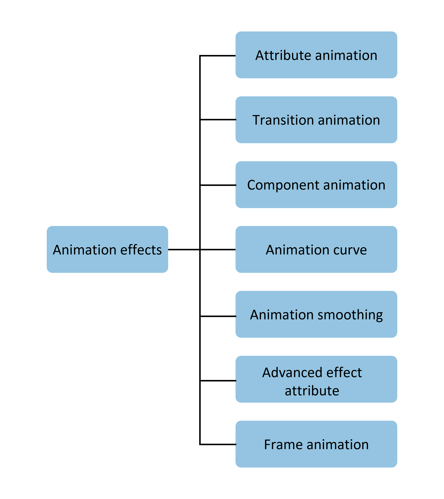

# Animation Overview  

The UI (User Interface) consists of various components (such as time, wallpapers, etc.) that developers interact with when using the device. Properties serve as interfaces to control the behavior of these components. For example, developers can adjust a component's position on the screen using the position property.  

Changes in property values typically result in UI updates. Animations can add smooth transition effects when the UI changes. Without animations, properties would change instantly, creating abrupt shifts that may cause users to lose visual focus.  

  

The objectives of animations include:  

- Making interface transitions natural and fluid.  
- Enhancing user feedback and interactivity.  
- Increasing user patience during scenarios like content loading, alleviating discomfort caused by waiting.  
- Guiding users to understand and operate the device.  

Animations can be applied in scenarios where UI transitions require smooth effects, such as device startup, application launch/exit, or pulling down to access the control center. These animations provide users with feedback about their actions and help maintain their focus on the interface.  

ArkUI offers various animation interfaces (e.g., property animations, transition animations) to drive property values from a starting point to an endpoint based on predefined animation parameters. Although the parameter values are not absolutely continuous during the change process and exhibit some discreteness, the human eye's persistence of vision creates the illusion of a "continuous" animation. A single UI change is called an animation frame, corresponding to one screen refresh. A key metric for animation smoothness is the frame rate (FPS, Frames Per Second), which represents the number of animation frames per second—higher FPS results in smoother animations.  

In ArkUI, animation parameters include duration, animation curves, and others. The animation curve is a primary factor that determines the pattern of property value changes. For example, with a linear animation curve, the property value changes uniformly from the start to the end within the animation duration. Property changes that are too fast or too slow may lead to poor visual experiences, affecting user satisfaction. Therefore, animation parameters—especially animation curves—must be designed and adjusted according to the scenario and curve characteristics.  

Animation interfaces drive property values to transition smoothly from their original state to a new state based on the rules defined by animation parameters, thereby producing continuous visual effects in the UI. This document provides guidance on the usage and considerations of various animations, structured as follows, to help developers quickly learn about animations.  

  

- **Property Animation**: The most fundamental type of animation, which drives property changes frame by frame according to animation parameters, producing sequential animation effects. Except for custom property animations, the animation process is handled by the system, and the application side does not perceive the animation process.  

- **Transition Animation**: Adds transition effects when components appear or disappear. To ensure consistency, some interface animation curves are predefined and do not support customization by developers.  
  - **Avoid using UIAbility to compose all interfaces within an application**: UIAbility represents a task and appears as an independent card in the multitasking interface. Navigation between UIAbilities involves task switching. For example, in a typical scenario where users view enlarged images within an app, it is not recommended to invoke the Gallery's UIAbility to open and view images, as this triggers task switching and adds the Gallery's UIAbility to the multitasking interface. The correct approach is to build an enlarged image component within the app and invoke it via a modal transition, ensuring all interfaces within a task are contained within a single UIAbility.  
  - **For navigation transitions, use the Navigation component to implement transition animations**: The traditional page + router approach for navigation transitions has limitations because pages are independent, restricting coordinated animation effects. This not only leads to disjointed transitions between pages but also lacks support for "write once, deploy everywhere" development.  

- **Component Animation**: Components provide default animations (e.g., scrolling effects in Lists) for ease of use, while some components also support customizable animations.  

- **Animation Curves**: Introduces the characteristics and usage of traditional curves and spring curves. Animation curves influence the motion patterns of property values, thereby determining the visual effects of animations.  

- **Animation Chaining**: Explains how to achieve smooth transitions between animations or between gestures and animations.  

- **Advanced Animation Effects**: Introduces the usage of interfaces for advanced effects such as blur effects, large shadows, and color gradients.  

- **Frame Animation**: The system provides interpolation results during the animation process, and developers modify property values frame by frame to create animations. Compared to property animations, frame animations offer the advantage of pausing but are less performant.