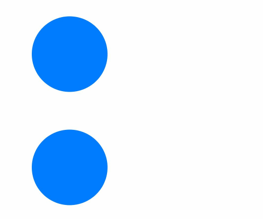
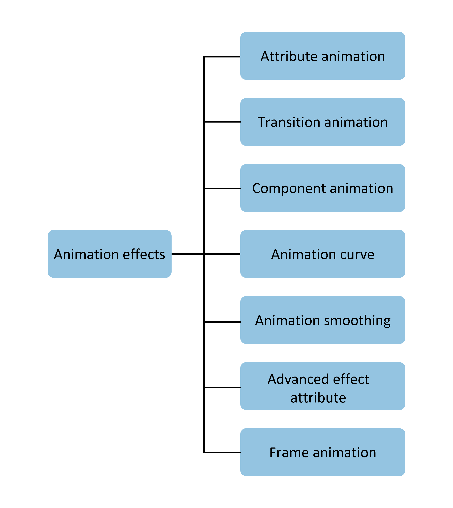

# Animation Overview

<!--Del-->
> **Note:**
>
> Currently in the beta phase.
<!--DelEnd-->

The UI (User Interface) consists of various components (such as time, wallpapers, etc.) that developers interact with when using the device. Properties serve as interfaces to control the behavior of these components. For example, developers can adjust a component's position on the screen through its position property.

Changes in property values typically lead to UI updates. Animations can add smooth transition effects when the UI changes. Without animations, property changes would occur instantaneously, resulting in abrupt transitions that may cause users to lose visual focus.

The objectives of animations include:

- Making interface transitions natural and fluid.
- Enhancing user feedback and interactivity.
- Increasing user patience during scenarios like content loading, alleviating discomfort caused by waiting.
- Guiding users to understand and operate the device.

Animations can be applied in scenarios requiring smooth UI transitions, such as device startup, application launch/exit, or pulling down to access the control center. These animations provide users with feedback about their actions and help maintain their focus on the interface.

ArkUI offers various animation APIs (property animations, transition animations, etc.) to drive property values from their starting points to endpoints according to predefined animation parameters. Although the parameter values during the change process are not absolutely continuous but rather discretized, the human eye's persistence of vision creates the illusion of a "continuous" animation. A single UI change is called an animation frame, corresponding to one screen refresh. A key metric for animation smoothness is the frame rate (FPS, Frames Per Second), which indicates the number of animation frames per second—higher FPS results in smoother animations. In ArkUI, animation parameters include duration, animation curves, etc. The animation curve, as a primary factor, determines the pattern of property value changes. For example, with a linear animation curve, the property value changes uniformly from the start to the end value over the animation duration. Too fast or too slow property changes may lead to poor visual experiences, affecting user satisfaction. Therefore, animation parameters, especially animation curves, need to be designed and adjusted based on the scenario and curve characteristics.

Animation APIs drive property values to transition smoothly from their original state to a new state according to the rules defined by animation parameters, thereby producing continuous visual effects on the UI. This document provides usage methods and considerations for various animations in the following structure to help developers quickly learn about animations.

- **Property Animation**: The most basic type of animation, which drives property changes frame by frame according to animation parameters, producing sequential animation effects. Except for custom property animations, the animation process is handled by the system, and the application side does not perceive the animation process.

- **Transition Animation**: Adds transition effects when components appear or disappear. To ensure animation consistency, some APIs have built-in animation curves and do not support customization by developers.
    - **Not recommended to use UIAbility to combine all interfaces within an application**: UIAbility represents a task and appears as an independent card in the multitasking interface. Navigation between UIAbilities involves task switching. For example, in a typical scenario where users view large images within an app, it is not advisable to invoke the Gallery's UIAbility to open and view images, as this would trigger task switching and add the Gallery's UIAbility to the multitasking interface. The correct approach is to build a large-image component within the app and invoke it via a modal transition, ensuring all interfaces within a task are self-contained within a single UIAbility.
    - **For navigation transitions, use the Navigation component to implement transition animations**: The older approach of using `page + router` for navigation transitions suffers from limitations due to the independence of pages, resulting in constrained interactive animation effects. This not only easily leads to disjointed transitions between pages but also does not support "write once, run anywhere" development.

- **Component Animation**: Components provide default animations (e.g., sliding effects in Lists) for ease of use, while some components also support customizable animations.

- **Animation Curves**: Introduces the characteristics and usage of traditional curves and spring curves. Animation curves influence the motion patterns of property values, thereby determining the visual effects of animations.

- **Animation Chaining**: Explains how to achieve smooth transitions between animations or between gestures and animations.

- **Advanced Animation Effects**: Introduces the usage of APIs for advanced effects such as blurring, large shadows, and color gradients.

- **Frame Animation**: The system provides interpolation results during the animation process, and developers modify property values frame by frame to create animations. Compared to property animations, frame animations offer the advantage of pausing but are less performant.