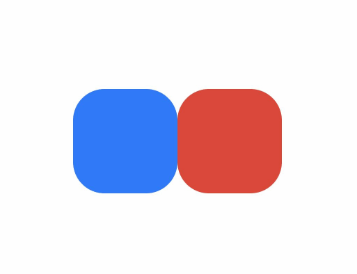
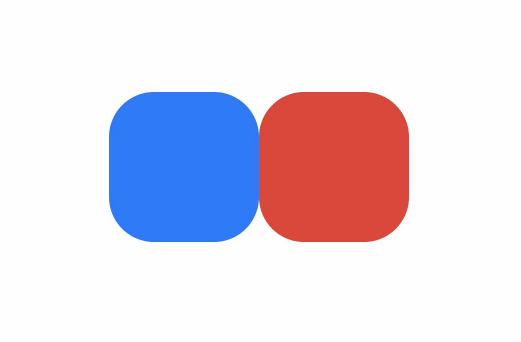

# Implementing Property Animations

Continuous visual effects on the UI caused by changes in animatable properties are referred to as property animations. Property animations are the most fundamental and easy-to-understand type of animation. ArkUI provides two property animation interfaces: [animateTo](../reference/arkui-cj/cj-apis-uicontext-uicontext.md#func-animatetoanimateparam-voidcallback) and [animation](../reference/arkui-cj/cj-animation-animation.md), which drive component properties to change continuously according to animation curves and other animation parameters, thereby producing property animations.

| Property Animation Interface | Scope | Principle | Use Cases |
|:---|:---|:---|:---|
| animateTo | Changes in properties within a closure that affect the interface.<br/>Applies to appearance/disappearance transitions. | A general function that animates the differences between the pre-closure interface and the interface caused by state variables within the closure.<br/>Supports multiple calls and nesting. | Suitable for animations where multiple animatable properties share the same animation parameters.<br/>Scenarios requiring nested animations. |
| animation | Interface changes caused by property changes bound through component property interfaces. | Detects changes in animatable properties of components and automatically adds animations.<br/>Component interface calls execute from bottom to top; `animation` only affects property calls above it. Components can set different `animation` parameters for multiple properties based on the call order. | Suitable for scenarios where different animation parameters are configured for multiple animatable properties. |

## Using animateTo to Create Property Animations

```cangjie
public func animateTo(value: AnimateParam, event: VoidCallback): Unit
```

In the [animateTo](../reference/arkui-cj/cj-apis-uicontext-uicontext.md#func-animatetoanimateparam-voidcallback) interface parameters, `animation` specifies an [AnimateParam object](../reference/arkui-cj/cj-animation-animateto.md#struct-animateparam) (including duration, [Curve](../reference/arkui-cj/cj-common-types.md#enum-curve), etc.), and `callback` is the closure function for the animation. Property animations generated by variable changes within the closure will follow the same animation parameters.

<!-- run -->

```cangjie
package ohos_app_cangjie_entry
import kit.ArkUI.*
import ohos.arkui.ui_context.*
import ohos.arkui.state_macro_manage.*

@Entry
@Component
class EntryView {
    @State var animate: Bool = false
    // Step 1: Declare relevant state variables
    @State var rotateValue: Float32 = 0.0
    @State var translateX: Float32 = 0.0
    @State var opacityValue: Float32 = 1.0

    // Step 2: Assign state variables to relevant animatable property interfaces
    func build() {
        Row {
            // Component 1
            Column {
            }
            .rotate(angle:this.rotateValue)
            .backgroundColor(0x317AF7)
            .justifyContent(FlexAlign.Center)
            .width(100.vp)
            .height(100.vp)
            .borderRadius(30.vp)
            .onClick({ evt =>
                    getUIContext().animateTo(AnimateParam(curve: Curve.Smooth),
                    { =>
                        this.animate = !this.animate
                        // Step 3: Change the UI interface through state variables within the closure
                        // Any logic that can alter the UI, such as array manipulation or visibility control, can be written here. The system detects differences between the pre- and post-change UI interfaces and adds animations to the changed parts.
                        // The rotate property of Component 1 changes, so a rotate animation will be applied to Component 1.
                        if (this.animate) {
                            this.rotateValue = 90.0
                        } else {
                            this.rotateValue = 0.0
                        }
                        // The opacity of Component 2 changes, so an opacity animation will be applied to Component 2.
                        if (this.animate) {
                            this.opacityValue = 0.6
                        } else {
                            this.opacityValue = 1.0
                        }
                        // The translate property of Component 2 changes, so a translate animation will be applied to Component 2.
                        if (this.animate) {
                            this.translateX = 50.0
                        } else {
                            this.translateX = 0.0
                        }
                    })
            })

            // Component 2
            Column {
            }
            .justifyContent(FlexAlign.Center)
            .width(100.vp)
            .height(100.vp)
            .backgroundColor(0xD94838)
            .borderRadius(30.vp)
            .opacity(Float64(this.opacityValue))
            .translate(x: Float64(this.translateX))
        }
        .width(100.percent)
        .height(100.percent)
        .justifyContent(FlexAlign.Center)
    }
}
```



## Using animation to Create Property Animations

Unlike the `animateTo` interface, which requires modifying animatable properties within a closure, the [animation](../reference/arkui-cj/cj-animation-animation.md#func-animationanimateparam) interface does not require a closure. Simply attach the `animation` interface to the animatable property you wish to animate. `animation` automatically adds property animations when it detects changes in its bound animatable properties, whereas `animateTo` must modify animatable property values within the animation closure to generate animations.

<!-- run -->

```cangjie
package ohos_app_cangjie_entry
import kit.ArkUI.*
import ohos.arkui.state_macro_manage.*

@Entry
@Component
class EntryView {
    @State var animate: Bool = false
    // Step 1: Declare relevant state variables
    @State var rotateValue: Float32 = 0.0
    @State var translateX: Float32 = 0.0
    @State var opacityValue: Float32 = 1.0

    // Step 2: Assign state variables to relevant animatable property interfaces
    func build() {
        Row {
            // Component 1
            Column {
            }
            .opacity(Float64(this.opacityValue))
            .rotate(angle:this.rotateValue)
            .backgroundColor(0x317AF7)
            .justifyContent(FlexAlign.Center)
            .width(100.vp)
            .height(100.vp)
            .borderRadius(30.vp)
            .onClick({ evt=>
                    this.animate = !this.animate
                    if (this.animate) {
                        this.rotateValue = 90.0
                    } else {
                        this.rotateValue = 0.0
                    }
                    if (this.animate) {
                        this.opacityValue = 0.6
                    } else {
                        this.opacityValue = 1.0
                    }
                    if (this.animate) {
                        this.translateX = 50.0
                    } else {
                        this.translateX = 0.0
                    }
            })
            .animation(AnimateParam(curve: Curve.Smooth))

            // Component 2
            Column {
            }
            .justifyContent(FlexAlign.Center)
            .width(100.vp)
            .height(100.vp)
            .backgroundColor(0xD94838)
            .borderRadius(30.vp)
            .opacity(Float64(this.opacityValue))
            .translate(x: Float64(this.translateX))
            .animation(AnimateParam(curve: Curve.Smooth))
        }.width(100.percent).height(100.percent).justifyContent(FlexAlign.Center)
    }
}
```



> **Notes:**
>
> - When animating changes in a component's position or size, layout property changes trigger measurement and layout, which incur significant performance overhead. Changes to the [scale](../reference/arkui-cj/cj-universal-attribute-transform.md#func-scalefloat32-float32-float32-length-length) property do not trigger measurement and layout, resulting in lower performance overhead. Therefore, for scenarios where a component's position or size changes continuously (e.g., following touch interactions to resize components), using `scale` is recommended.
>
> - Property animations should be applied to components that always exist. For components that are about to appear or disappear, use [transition animations](./cj-transition-overview.md).
>
> - Avoid using animation completion callbacks whenever possible. Property animations are applied to already occurred states and do not require developers to handle completion logic. If completion callbacks must be used, ensure proper data management for continuous operations.