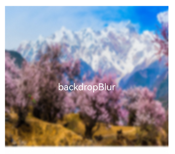
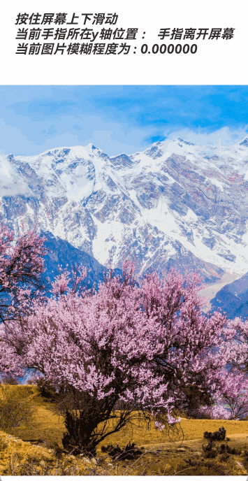

# Blur

Animation effects can enrich interface details, enhancing the realism and quality of the UI. For example, blur and shadow effects can make objects appear more three-dimensional, bringing animations to life. ArkUI provides a rich set of effect APIs, enabling developers to quickly create refined and personalized effects. This chapter introduces commonly used effect APIs such as blur, shadow, and color effects.

Blur can be used to convey depth in the interface space and distinguish hierarchical relationships between front and back elements.

| API                                                         | Description                                         |
| :------------------------------------------------------------ | :-------------------------------------------- |
| [backdropBlur](../reference/arkui-cj/cj-universal-attribute-imageeffect.md#func-backdropblurfloat64) | Adds a background blur effect to the current component, with the input parameter being the blur radius. |
| [blur](../reference/arkui-cj/cj-universal-attribute-imageeffect.md#func-blurfloat64) | Adds a content blur effect to the current component, with the input parameter being the blur radius. |

> **Note:**
>
> The above APIs are real-time blur interfaces that render frame by frame, resulting in higher performance overhead.

## Using backdropBlur to Add Background Blur to a Component

 <!-- run -->

```cangjie
package ohos_app_cangjie_entry

import kit.ArkUI.*
import ohos.arkui.state_macro_manage.*
import ohos.resource.*

@Entry
@Component
class EntryView {
    func build() {
        Column(space: 10) {
            Text('backdropBlur')
                .width(90.percent)
                .height(90.percent)
                .fontSize(20)
                .fontColor(Color.White)
                .textAlign(TextAlign.Center)
                .backdropBlur(Float64(10))
                .backgroundImage(@r(app.media.image1))
                .backgroundImageSize(width: 400, height: 300)
        }
        .width(100.percent)
        .height(50.percent)
        .margin(top: 30)
    }
}
```



## Using blur to Add Content Blur to a Component

 <!-- run -->

```cangjie
package ohos_app_cangjie_entry

import kit.ArkUI.*
import ohos.arkui.state_macro_manage.*
import ohos.resource.*

@Entry
@Component
class EntryView {
    @State var radius: Float64 = 0.0
    @State var text: String = ''
    @State var y: String = 'Finger not on screen'

    protected override func aboutToAppear() {
        this.text = "Hold and slide up/down on the screen\n" + "Current finger position on the y-axis: " + this.y +
            "\n" + "Current image blur level: " + this.radius.toString();
    }

    func build() {
        Flex(direction: FlexDirection.Column, justifyContent: FlexAlign.SpaceBetween, alignItems: ItemAlign.Center){
            Text(this.text)
                .height(200)
                .fontSize(20)
                .fontWeight(FontWeight.Bold)
                .fontFamily("cursive")
                .fontStyle(FontStyle.Italic)
            Image(@r(app.media.image1))
                .blur(this.radius)
                .height(100.percent)
                .width(100.percent)
                .objectFit(ImageFit.Cover)
        }
        .height(100.percent)
        .width(100.percent)
        .onTouch({event: TouchEvent =>
                if (event.eventType == TouchType.Move) {
                    this.y = event.touches[0].y.toString()
                    this.radius = event.touches[0].y / 10.0
                }
                if (event.eventType == TouchType.Up) {
                    this.radius = 0.0
                    this.y = 'Finger lifted from screen'
                }
                this.text = "Hold and slide up/down on the screen\n" + "Current finger position on the y-axis: " + this.y +
                    "\n" + "Current image blur level: " + this.radius.toString();
            })
    }
}
```

