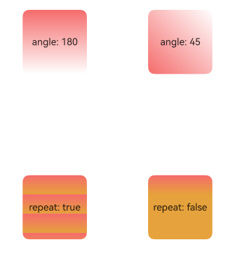
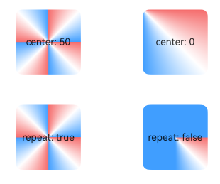
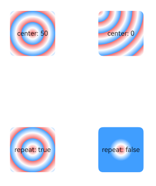

# Color

## Color

Through the color gradient interface, you can set gradient background color effects for components, achieving smooth transitions between two or more specified colors.

| Interface | Description |
| :-------- | :-------- |
| [linearGradient](../reference/arkui-cj/cj-universal-attribute-gradientcolor.md#func-lineargradientoptionfloat64-gradientdirection-arraycolorfloat64-bool) | Adds a linear gradient color effect to the current component. |
| [sweepGradient](../reference/arkui-cj/cj-universal-attribute-gradientcolor.md#func-sweepgradientlengthlength-float64-float64-float64-arraycolorfloat64-bool) | Adds an angular gradient color effect to the current component. |
| [radialGradient](../reference/arkui-cj/cj-universal-attribute-gradientcolor.md#func-radialgradientlengthlength-float64-arraycolorfloat64-bool) | Adds a radial gradient color effect to the current component. |

## Adding Linear Gradient Effect to Components

 <!--run-->

```cangjie
package ohos_app_cangjie_entry

import kit.ArkUI.*
import kit.LocalizationKit.*
import ohos.arkui.state_macro_manage.*

@Entry
@Component
class EntryView {
    func build() {
        Grid() {
            GridItem() {
                Column() {
                    Text('angle: 180').fontSize(15)
                }
                .width(100)
                .height(100)
                .justifyContent(FlexAlign.Center)
                .borderRadius(10)
                .linearGradient(colors: [(Color(0xf56c6c), 0.0), (Color(0xffffff), 1.0)])
            }

            GridItem() {
                Column() {
                    Text('angle: 45').fontSize(15)
                }
                .width(100)
                .height(100)
                .justifyContent(FlexAlign.Center)
                .borderRadius(10)
                .linearGradient(angle: 45.0, colors: [(Color(0xf56c6c), 0.0), (Color(0xffffff), 1.0)])
            }

            GridItem() {
                Column() {
                    Text('repeat: true').fontSize(15)
                }
                .width(100)
                .height(100)
                .justifyContent(FlexAlign.Center)
                .borderRadius(10)
                .linearGradient(repeating: true, colors: [(Color(0xf56c6c), 0.0), (Color(0xE6A23C), 0.3)])
            }

            GridItem() {
                Column() {
                    Text('repeat: false').fontSize(15)
                }
                .width(100)
                .height(100)
                .justifyContent(FlexAlign.Center)
                .borderRadius(10)
                .linearGradient(repeating: false, colors: [(Color(0xf56c6c), 0.0), (Color(0xE6A23C), 0.3)])
            }
        }
        .columnsGap(10)
        .rowsGap(10)
        .columnsTemplate('1fr 1fr')
        .rowsTemplate('1fr 1fr 1fr')
        .width(100.percent)
        .height(100.percent)
    }
}
```



## Adding Angular Gradient Effect to Components

 <!--run-->

```cangjie
package ohos_app_cangjie_entry

import kit.ArkUI.*
import kit.LocalizationKit.*
import ohos.arkui.state_macro_manage.*

@Entry
@Component
class EntryView {
    func build() {
        Grid() {
            GridItem() {
                Column() {
                    Text('center: 50').fontSize(15)
                }
                .width(100)
                .height(100)
                .justifyContent(FlexAlign.Center)
                .borderRadius(10)
                .sweepGradient(
                    (50, 50), // Angular gradient center point
                    start: 0.0, // Starting angle of gradient
                    end: 360.0, // Ending angle of gradient
                    colors: [
                        // Within the current component, according to the center point and gradient start/end values,
                        // the angular range 0-0.125 transitions from color stop 1 to color stop 2,
                        // the angular range 0.125-0.25 transitions from color stop 2 to color stop 3,
                        // With repeating set to true, the angular range 0.25-1 repeats the gradient effect from 0-0.25
                        (Color(0xf56c6c), 0.0), // Color stop 1 with position, corresponding to 0*360°=0°
                        (Color(0xffffff), 0.125), // Color stop 2 with position
                        (Color(0x409EFF), 0.25) // Color stop 3 with position
                    ],
                    repeating: true)
            }

            GridItem() {
                Column() {
                    Text('center: 0').fontSize(15)
                }
                .width(100)
                .height(100)
                .justifyContent(FlexAlign.Center)
                .borderRadius(10)
                .sweepGradient(
                    (0, 0), // Angular gradient center point (top-left corner coordinates)
                    start: 0.0, // Starting angle of gradient
                    end: 360.0, // Ending angle of gradient
                    colors: [
                        // Since the center is at the component's top-left corner, the gradient from stop 1 to stop 3 covers the entire component
                        (Color(0xf56c6c), 0.0), // Color stop 1 with position (0*360°=0°)
                        (Color(0xffffff), 0.125), // Color stop 2 with position (0.125*360°=45°)
                        (Color(0x409EFF), 0.25) // Color stop 3 with position (0.25*360°=90°)
                    ],
                    repeating: true)
            }

            GridItem() {
                Column() {
                    Text('repeat: true').fontSize(15)
                }
                .width(100)
                .height(100)
                .justifyContent(FlexAlign.Center)
                .borderRadius(10)
                .sweepGradient(
                    (50, 50),
                    start: 0.0,
                    end: 360.0,
                    colors: [
                        (Color(0xf56c6c), 0.0),
                        (Color(0xffffff), 0.125),
                        (Color(0x409EFF), 0.25)
                    ],
                    repeating: true)
            }

            GridItem() {
                Column() {
                    Text('repeat: false').fontSize(15)
                }
                .width(100)
                .height(100)
                .justifyContent(FlexAlign.Center)
                .borderRadius(10)
                .sweepGradient(
                    (50, 50),
                    start: 0.0,
                    end: 360.0,
                    colors: [
                        (Color(0xf56c6c), 0.0),
                        (Color(0xffffff), 0.125),
                        (Color(0x409EFF), 0.25)
                    ],
                    repeating: false)
            }
        }
        .columnsGap(10)
        .rowsGap(10)
        .columnsTemplate('1fr 1fr')
        .rowsTemplate('1fr 1fr 1fr')
        .width(100.percent)
        .height(437)
    }
}
```



## Adding Radial Gradient Effect to Components

 <!--run-->

```cangjie
package ohos_app_cangjie_entry

import kit.ArkUI.*
import kit.LocalizationKit.*
import ohos.arkui.state_macro_manage.*

@Entry
@Component
class EntryView {
    func build() {
        Grid() {
            GridItem() {
                Column() {
                    Text('center: 50').fontSize(15)
                }
                .width(100)
                .height(100)
                .justifyContent(FlexAlign.Center)
                .borderRadius(10)
                .radialGradient(
                    (50, 50), // Radial gradient center point
                    100, // Radial gradient radius
                    colors: [
                        // Within the component, centered at [50,50], radius 0-12.5 transitions from color stop 1 to 2,
                        // radius 12.5-25 transitions from color stop 2 to 3,
                        // Outside the component, other radius ranges repeat the 0-25 gradient effect
                        (Color(0xf56c6c), 0.0), // Color stop 1 with position (0*100=0)
                        (Color(0xffffff), 0.125), // Color stop 2 with position (0.125*100=12.5)
                        (Color(0x409EFF), 0.25) // Color stop 3 with position (0.25*100=25)
                    ],
                    repeating: true
                )
            }

            GridItem() {
                Column() {
                    Text('center: 0').fontSize(15)
                }
                .width(100)
                .height(100)
                .justifyContent(FlexAlign.Center)
                .borderRadius(10)
                .radialGradient(
                    (0, 0), // Radial gradient center point (top-left corner coordinates)
                    100,
                    colors: [
                        (Color(0xf56c6c), 0.0),
                        (Color(0xffffff), 0.125),
                        (Color(0x409EFF), 0.25)
                    ],
                    repeating: true
                )
            }

            GridItem() {
                Column() {
                    Text('repeat: true').fontSize(15)
                }
                .width(100)
                .height(100)
                .justifyContent(FlexAlign.Center)
                .borderRadius(10)
                .radialGradient(
                    (50, 50),
                    100,
                    colors: [
                        (Color(0xf56c6c), 0.0),
                        (Color(0xffffff), 0.125),
                        (Color(0x409EFF), 0.25)
                    ],
                    repeating: true
                )
            }

            GridItem() {
                Column() {
                    Text('repeat: false').fontSize(15)
                }
                .width(100)
                .height(100)
                .justifyContent(FlexAlign.Center)
                .borderRadius(10)
                .radialGradient(
                    (50, 50),
                    100.0,
                    colors: [
                        (Color(0xf56c6c), 0.0),
                        (Color(0xffffff), 0.125),
                        (Color(0x409EFF), 0.25)
                    ],
                    repeating: false // Areas outside the gradient range won't repeat the gradient effect
                )
            }
        }
        .columnsGap(10)
        .rowsGap(10)
        .columnsTemplate('1fr 1fr')
        .rowsTemplate('1fr 1fr 1fr')
        .width(100.percent)
        .height(100.percent)
    }
}
```

