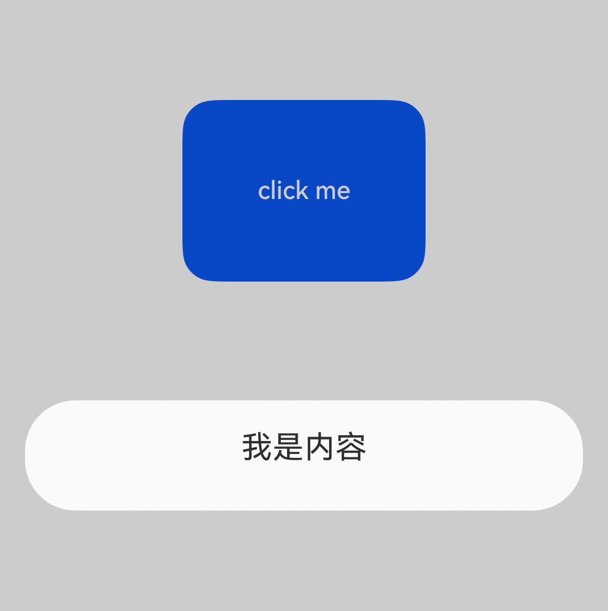
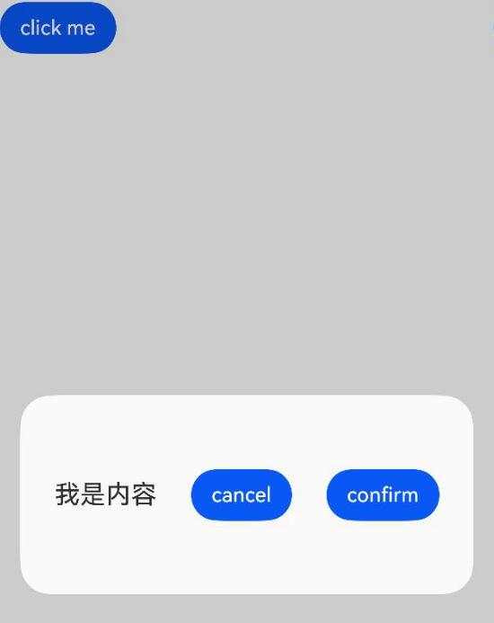
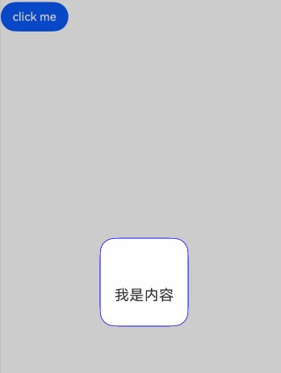
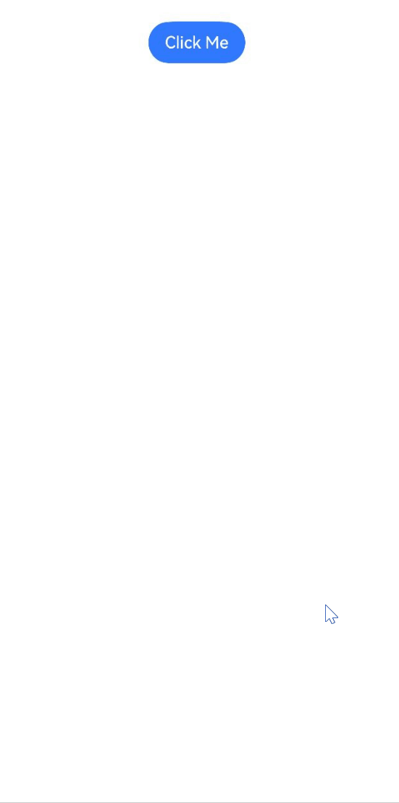

# Basic Custom Dialog (CustomDialog) (Not Recommended)

<!--Del-->
> **Note:**
>
> Currently in the beta phase.
<!--DelEnd-->

CustomDialog is a customizable dialog box that can be used for advertisements, prize notifications, warnings, software updates, and other user interaction responses. Developers can display custom dialogs using the CustomDialogController class. For specific usage, please refer to [Custom Dialog](../reference/arkui-cj/cj-dialog-customdialog.md).

> **Note:**
>
> By default, ArkUI dialogs are non-page-level dialogs. During page routing navigation, if the developer does not call the close method to dismiss the dialog, it will not automatically close.

The dialog (CustomDialog) can be configured as modal or non-modal via the [isModal](../reference/arkui-cj/cj-dialog-customdialog.md#var-ismodal) parameter. When isModal is true, the dialog is modal. When isModal is false, the dialog is non-modal.

## Creating a Custom Dialog

1. Use the @CustomDialog macro to decorate the custom dialog, where you can define the dialog content. The CustomDialogController must be defined within @CustomDialog.

    ```cangjie
    package ohos_app_cangjie_entry
    import kit.ArkUI.*
    import ohos.arkui.state_macro_manage.*

    @CustomDialog
    class MyDialog {
        var controller: Option<CustomDialogController> = Option.None
        func build() {
            Column() {
                Text("I am the content")
                    .fontSize(20)
            }.height(60).justifyContent(FlexAlign.Center)
        }
    }
    ```

2. Create a constructor that corresponds to the macro. Bind the onClick event to a component to trigger the dialog.

    <!-- run -->

    ```cangjie
    package ohos_app_cangjie_entry
    import kit.ArkUI.*
    import ohos.arkui.state_macro_manage.*

    @CustomDialog
    class MyDialog {
        var controller: Option<CustomDialogController> = Option.None
        func build() {
            Column() {
                Text("I am the content")
                    .fontSize(20)
            }.height(60).justifyContent(FlexAlign.Center)
        }
    }

    @Entry
    @Component
    class EntryView {
        var dialogController: CustomDialogController = CustomDialogController(CustomDialogControllerOptions(builder: MyDialog()))
        func build() {
            Column {
                Button("click me")
                    .onClick({evt =>
                        dialogController.openDialog()
                    }).position(x: 30.percent, y: 20.percent).width(40.percent).height(15.percent)
            }
        }
    }
    ```

    

## Dialog Interaction

The dialog can be used for data interaction to complete a series of user response operations.

1. Add buttons and data functions within the @CustomDialog macro.

    ```cangjie
    package ohos_app_cangjie_entry
    import kit.ArkUI.*
    import ohos.arkui.state_macro_manage.*

    @CustomDialog
    class MyDialog {
        var controller: Option<CustomDialogController> = Option.None
        func build() {

            Flex(justifyContent: FlexAlign.SpaceEvenly, alignItems: ItemAlign.Center) {
                Text("I am the content").fontSize(20)

                Button("cancel").onClick({ evt =>
                    controller?.closeDialog()
                })
                Button("confirm").onClick({ evt =>
                    controller?.closeDialog()
                })
            }.height(500.px)
        }
    }
    ```

2. The dialog page needs to be received in the constructor, and corresponding function operations should be created.

    <!-- run -->

    ```cangjie
    package ohos_app_cangjie_entry

    import kit.ArkUI.*
    import ohos.arkui.state_macro_manage.*

    @CustomDialog
    class MyDialog {
        var controller: Option<CustomDialogController> = Option.None
        func build() {

            Flex(justifyContent: FlexAlign.SpaceEvenly, alignItems: ItemAlign.Center) {
                Text("I am the content").fontSize(20)

                Button("cancel").onClick ({ evt =>
                    controller?.closeDialog()
                })
                Button("confirm").onClick ({ evt =>
                    controller?.closeDialog()
                })
            }.height(500.px)
        }
    }

    @Entry
    @Component
    class EntryView {
        var dialogController: CustomDialogController = CustomDialogController(CustomDialogControllerOptions(builder: MyDialog()))
        func build() {
            Column {
                Button("click me").onClick({evt =>
                    dialogController.openDialog()
                })
            }
        }
    }
    ```

    

## Dialog Styling

The dialog's appearance can be controlled by defining parameters such as width, height, background color, and shadow.

 <!-- run -->

```cangjie
package ohos_app_cangjie_entry
import kit.ArkUI.*
import ohos.arkui.state_macro_manage.*

@CustomDialog
class MyDialog {
    var controller: Option<CustomDialogController> = Option.None
    func build() {
        Row(space: 40) {
            Text("I am the content").fontSize(20).margin(top: 4, right: 4, bottom: 4, left: 4)
        }.height(500.px)
    }
}

@Entry
@Component
class EntryView {
    var dialogController: CustomDialogController =   CustomDialogController(CustomDialogControllerOptions(builder: MyDialog(),autoCancel: true,
    alignment: DialogAlignment.Center,
    offset: Offset(0.vp, 0.vp),
    gridCount: 4,
    customStyle: false,
    backgroundColor: 0xd9ffffff,
    cornerRadius: 20,
    width: 120,
    height: 120,
    borderWidth: 1,
    borderStyle: EdgeStyles(), // The borderStyle property must be used with borderWidth
    borderColor: Color.Blue, // The borderColor property must be used with borderWidth
    shadow: Option<ShadowOptions>.None,
    ))
    func build() {
        Column {
            Button("click me").onClick({evt =>
                dialogController.openDialog()
            })
        }
    }
}
```



## Nested Custom Dialogs

When opening a second dialog from the first dialog, it is recommended to define the second dialog in the parent component of the first dialog. The second dialog can then be opened via a callback passed from the parent component to the first dialog.

 <!-- run -->

```cangjie
package ohos_app_cangjie_entry

import kit.ArkUI.*
import ohos.arkui.state_macro_manage.*

@CustomDialog
class CustomDialogExampleTwo {
    var controllerTwo: Option<CustomDialogController> = Option.None
    @State var message: String = "I'm the second dialog box."
    @State var showIf: Bool = false
    func build() {
        Column() {
            if (this.showIf) {
                Text("Text")
                    .fontSize(30)
                    .height(100)
            }
            Text(this.message)
                .fontSize(30)
                .height(100)
            Button("Create Text")
                .onClick({ evt =>
                    this.showIf = true
                })
            Button("Close Second Dialog Box")
                .onClick({ evt =>
                    if (let Some(v) <- this.controllerTwo) {
                        v.closeDialog()
                    }
                }).margin(20)
        }
    }
}

@CustomDialog
class MyDialog {
    var openSecondBox: ()->Unit
    var controller: Option<CustomDialogController> = Option.None
    func build() {
        Row(space: 600) {
            Button ("Open Second Box")
                .onClick({ evt =>
                    this.controller?.closeDialog()
                    this.openSecondBox()
                })
                .margin(20)
        }.borderRadius(10)
    }
}

@Entry
@Component
class EntryView {
    @State var inputValue: String = "Click Me"
    var dialogController: CustomDialogController = CustomDialogController(
        CustomDialogControllerOptions(
            builder: MyDialog(openSecondBox:{=>this.dialogControllerTwo.openDialog()}),
            autoCancel: true,
            alignment: DialogAlignment.Bottom,
            offset: Offset(0, -20),
            gridCount: 4,
            customStyle: false
        )
    )
    var dialogControllerTwo: CustomDialogController = CustomDialogController(
        CustomDialogControllerOptions(
            builder: CustomDialogExampleTwo(),
            autoCancel: true,
            alignment: DialogAlignment.Bottom,
            offset: Offset(0, -25)
        )
    )

    func build() {
        Column() {
            Button(this.inputValue)
                .onClick({ evt =>
                    this.dialogController.openDialog()
                }).backgroundColor(0x317aff)
        }.width(100.percent).margin(top:20)
    }
}
```



Due to the parent-child relationship in state management for custom dialogs, if the second dialog is defined within the first dialog, new components cannot be created in the child component (second dialog) after the parent component (first dialog) is destroyed (closed).