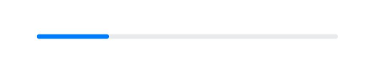
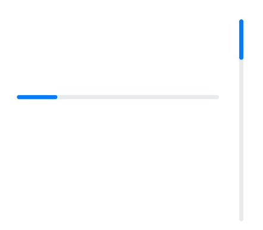
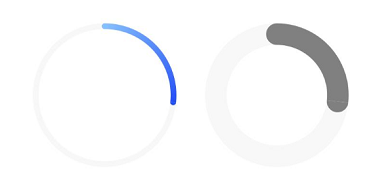
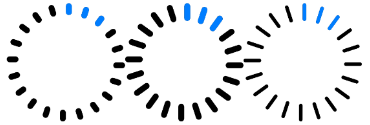
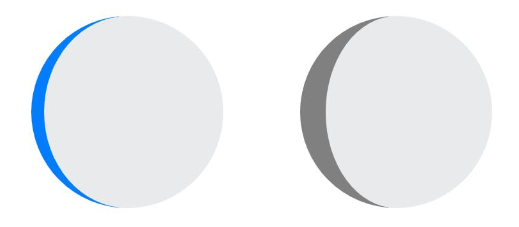

# Progress Bar (Progress)

Progress is a display component that shows the current progress of a target operation. For specific usage, please refer to [Progress](../../../en/application-dev/reference/arkui-cj/cj-information-display-progress.md).

## Creating a Progress Bar

Progress is created by calling the interface, with the following syntax:

```cangjie
Progress(value!: Float64, total!: Float64 = 100.0, progressType!: ProgressType = ProgressType.Linear)
```

Here, `value` sets the initial progress value, `total` sets the total length of the progress, and `ProgressType` sets the style of the progress bar.

```cangjie
Progress(value: 24.0, total: 100.0, progressType: ProgressType.Linear) // Creates a linear progress bar with total length 100 and initial progress value 24
```



## Setting Progress Bar Styles

Progress has 5 optional types, which can be set via `ProgressType`. The types include: `ProgressType.Linear` (linear style), `ProgressType.Ring` (ring style without scales), `ProgressType.ScaleRing` (ring style with scales), `ProgressType.Eclipse` (circular style), and `ProgressType.Capsule` (capsule style).

- Linear Style Progress Bar (default type)

  ```cangjie
  Progress(value: 20.0, total: 100.0, progressType: ProgressType.Linear)
      .width(200)
      .height(50)
  Progress(value: 20.0, total: 100.0, progressType: ProgressType.Linear)
      .width(50)
      .height(200)
  ```

  

- Ring Style Progress Bar Without Scales

  ```cangjie
  // From left to right, 1st ring progress bar with default foreground color as blue gradient and default strokeWidth of 2.vp
  Progress(value: 40.0, total: 150.0, progressType: ProgressType.Ring)
      .width(100)
      .height(100)
  // From left to right, 2nd ring progress bar
  Progress(value: 40.0, total: 150.0, progressType: ProgressType.Ring)
      .width(100)
      .height(100)
      .color(Color.Gray) // Sets foreground color to gray
      .style(strokeWidth: 15.vp) // Sets strokeWidth to 15.vp
  ```

  

- Ring Style Progress Bar With Scales

  ```cangjie
  Progress(value: 20.0, total: 150.0, progressType: ProgressType.ScaleRing)
      .width(100)
      .height(100)
      .backgroundColor(Color.Black)
      .style(scaleCount: 20, scaleWidth: 5.vp) // Sets total scale count to 20 and scale width to 5.vp
  Progress(value: 20.0, total: 150.0, progressType: ProgressType.ScaleRing)
      .width(100)
      .height(100)
      .backgroundColor(Color.Black)
      .style(strokeWidth: 15.vp, scaleCount: 20, scaleWidth: 5.vp) // Sets strokeWidth to 15.vp, scale count to 20, and scale width to 5.vp
  Progress(value: 20.0, total: 150.0, progressType: ProgressType.ScaleRing)
      .width(100)
      .height(100)
      .backgroundColor(Color.Black)
      .style(strokeWidth: 15.vp, scaleCount: 20, scaleWidth: 3.vp) // Sets strokeWidth to 15.vp, scale count to 20, and scale width to 3.vp
  ```

  

- Circular Style Progress Bar

  ```cangjie
  // From left to right, 1st circular progress bar with default foreground color as blue
  Progress(value: 10.0, total: 150.0, progressType: ProgressType.Eclipse)
      .width(100)
      .height(100)
  // From left to right, 2nd circular progress bar with foreground color set to gray
  Progress(value: 20.0, total: 150.0, progressType: ProgressType.Eclipse)
      .color(Color.Gray)
      .width(100)
      .height(100)
  ```

  

- Capsule Style Progress Bar

> **Note:**
>
> - The progress display effect at the rounded ends is the same as `ProgressType.Eclipse`.
>
> - The middle segment displays as a rectangular bar, similar to `ProgressType.Linear`.
>
> - Automatically adjusts to vertical display when height exceeds width.

  ```cangjie
  Progress(value: 10.0, total: 150.0, progressType: ProgressType.Capsule)
      .width(100)
      .height(50)
  Progress(value: 20.0, total: 150.0, progressType: ProgressType.Capsule)
      .width(50)
      .height(100)
      .color(Color.Gray)
  Progress(value: 50.0, total: 150.0, progressType: ProgressType.Capsule)
      .width(50)
      .height(100)
      .color(Color.Blue)
      .backgroundColor(Color.Black)
  ```

  

## Usage Example

Updating the current progress value, such as in an app installation progress bar, can be achieved by clicking a Button to increment `progressValue`. The `value` property assigns `progressValue` to the Progress component, triggering a refresh to update the current progress.

 <!-- run -->

```cangjie
package ohos_app_cangjie_entry
import kit.ArkUI.*
import ohos.arkui.state_macro_manage.*

@Entry
@Component
class EntryView {
    @State
    var progressValue: Float64 = 0.0 // Sets initial progress value to 0
    func build() {
        Column() {
            Column() {
                Progress(value: 0.0, total: 100.0, progressType: ProgressType.Capsule)
                    .width(200)
                    .height(50)
                    .value(this.progressValue)
                Row()
                    .width(100.percent)
                    .height(5)
                Button("Progress +5").onClick {
                    evt =>
                    this.progressValue += 5.0
                    if (this.progressValue > 100.0) {
                        this.progressValue = 0.0
                    }
                }
            }
        }
        .width(100.percent)
        .height(100.percent)
    }
}
```

