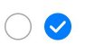
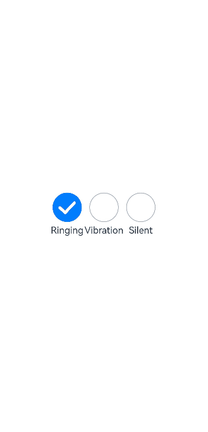

# Radio Button (Radio)

The Radio button is a component typically used to provide interactive selection options for users. Within the same group of Radio buttons, only one can be selected at a time. For specific usage, please refer to [Radio](../reference/arkui-cj/cj-button-picker-radio.md).

## Creating a Radio Button

Radio buttons are created by calling the following interface:

```cangjie
init(value!: String, group!: String, indicatorType!: RadioIndicatorType = RadioIndicatorType.TICK,
indicatorBuilder!: Option<() -> Unit> = Option.None)
```

Here, `value` represents the name of the radio button, `group` denotes the group name to which the radio button belongs, `indicatorType` specifies the selection style of the radio button, and `indicatorBuilder` allows configuring a custom component for the selection style.  
The `checked` property sets the state of the radio button, which can be either `false` or `true`. When set to `true`, the radio button is selected.

Radio buttons support styling for both selected and unselected states.

```cangjie
Radio(value: 'Radio1', group: 'radioGroup')
    .checked(false)
Radio(value: 'Radio2', group: 'radioGroup')
    .checked(true)
```



## Adding Events

In addition to supporting [Universal Events](../reference/arkui-cj/cj-universal-event-click.md), Radio buttons can trigger certain operations upon selection. The `onChange` event can be bound to respond with custom behavior after selection.

```cangjie
Radio(value: 'Radio1', group: 'radioGroup')
    .onChange({ isChecked =>
        if(isChecked) {
        // Operations to be performed
        }
    })
Radio(value: 'Radio2', group: 'radioGroup')
    .onChange({ isChecked =>
        if(isChecked) {
        // Operations to be performed
        }
    })
```

## Usage Example

Toggle sound modes by clicking Radio buttons.

 <!-- run -->

```cangjie
package ohos_app_cangjie_entry
import kit.ArkUI.*
import ohos.arkui.state_macro_manage.*
import ohos.arkui.ui_context.*

@Entry
@Component
class EntryView {
    func build() {
        Row() {
            Column() {
                Radio(value: 'Radio1', group: 'radioGroup')
                    .checked(true)
                    .height(50)
                    .width(50)
                    .onChange ({
                        isChecked => if (isChecked) {
                            // Switch to ringing mode
                            getUIContext().getPromptAction().showToast(ShowToastOptions(message: 'Ringing mode.'))
                        }
                    })
                Text('Ringing')
            }
            Column() {
                Radio(value: 'Radio2', group: 'radioGroup')
                    .height(50)
                    .width(50)
                    .onChange ({
                        isChecked => if (isChecked) {
                            // Switch to vibration mode
                            getUIContext().getPromptAction().showToast(ShowToastOptions(message: 'Vibration mode.'))
                        }
                    })
                Text('Vibration')
            }
            Column() {
                Radio(value: 'Radio3', group: 'radioGroup')
                    .height(50)
                    .width(50)
                    .onChange ({
                        isChecked => if (isChecked) {
                            // Switch to silent mode
                            getUIContext().getPromptAction().showToast(ShowToastOptions(message: 'Silent mode.'))
                        }
                    })
                Text('Silent')
            }
        }
        .height(100.percent)
        .width(100.percent)
        .justifyContent(FlexAlign.Center)
    }
}

```

