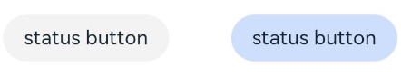
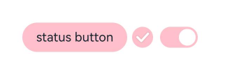
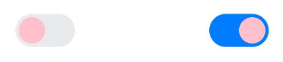
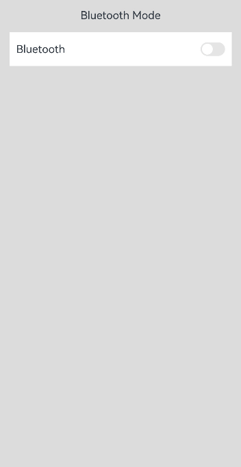

# Toggle Button (Toggle)

The Toggle component provides state button styles, checkbox styles, and switch styles, typically used for toggling between two states. For specific usage, please refer to [Toggle](../../../en/application-dev/reference/arkui-cj/cj-button-picker-toggle.md).

## Creating a Toggle Button

Toggle is created by calling the interface, with the following invocation format:

```cangjie
Toggle(toggleType: ToggleType, isOn!: Bool = false)
```

Here, `ToggleType` represents the switch type, including `ButtonType`, `CheckboxType`, and `SwitchType`, while `isOn` indicates the state of the toggle button.

There are two forms of interface invocation:

- Creating a Toggle without child components.
  When `ToggleType` is `CheckboxType` or `SwitchType`, it is used to create a Toggle without child components:

  ```cangjie
  Toggle(ToggleType.Checkbox, isOn: false)
  Toggle(ToggleType.Checkbox, isOn: true)
  ```

  

  ```cangjie
  Toggle(ToggleType.Switch, isOn: false)
  Toggle(ToggleType.Switch, isOn: true)
  ```

  

- Creating a Toggle with child components.

  When `ToggleType` is `ButtonType`, it can only contain one child component. If the child component has text settings, the corresponding text content will be displayed on the button.

  ```cangjie
  Toggle(ToggleType.Button, false) {
      Text('status button')
          .fontColor(0x182431)
          .fontSize(12)
  }.width(100)
  Toggle(ToggleType.Button, true) {
      Text('status button')
          .fontColor(0x182431)
          .fontSize(12)
  }.width(100)
  ```

  

## Customizing Styles

- Use the `selectedColor` property to set the background color when the Toggle is selected and turned on.

  ```cangjie
  Toggle(ToggleType.Button, true) {
      Text('status button')
          .fontColor(0x182431)
          .fontSize(12)
  }
      .width(100)
      .selectedColor(0xFEC0CD)
  Toggle(ToggleType.Checkbox, isOn: true).selectedColor(0xFEC0CD)
  Toggle(ToggleType.Switch, isOn: true).selectedColor(0xFEC0CD)
  ```

  

- Use the `switchPointColor` property to set the color of the circular slider for the `SwitchType`. This only takes effect when `toggleType` is `ToggleType.Switch`.

  ```cangjie
  Toggle(ToggleType.Switch, isOn: false).switchPointColor(0xFEC0CD)
  Toggle(ToggleType.Switch, isOn: true).switchPointColor(0xFEC0CD)
  ```

  

## Adding Events

In addition to supporting [Universal Events](../../../en/application-dev/reference/arkui-cj/cj-universal-event-click.md), Toggle can also trigger certain actions upon selection and deselection. You can bind the `onChange` event to respond to custom behaviors after these actions.

```cangjie
Toggle(ToggleType.Switch, isOn: false)
    .onChange {
        isOn => if (isOn) {
            // Operations to be performed
        }
    }
```

## Usage Example

Toggle is used to switch the Bluetooth state.

 <!-- run -->

```cangjie
package ohos_app_cangjie_entry
import kit.ArkUI.*
import ohos.arkui.ui_context.*
import ohos.arkui.state_macro_manage.*

@Entry
@Component
class EntryView {
    func build() {
        Column() {
            Row() {
                Text("Bluetooth Mode")
                    .height(50)
                    .fontSize(16)
            }
            Row() {
                Text("Bluetooth")
                    .height(50)
                    .padding(left: 10)
                    .fontSize(16)
                    .textAlign(TextAlign.Start)
                    .backgroundColor(0xFFFFFF)
                Toggle(ToggleType.Switch)
                    .margin(left: 200, right: 10)
                    .onChange {
                        isOn => if (isOn) {
                            getUIContext().getPromptAction().showToast(ShowToastOptions(message: 'Bluetooth is on.'))
                        } else {
                            getUIContext().getPromptAction().showToast(ShowToastOptions(message: 'Bluetooth is off.'))
                        }
                    }
            }.backgroundColor(0xFFFFFF)
        }
            .padding(10)
            .backgroundColor(0xDCDCDC)
            .width(100.percent)
            .height(100.percent)
    }
}
```

