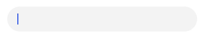
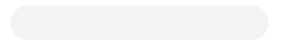
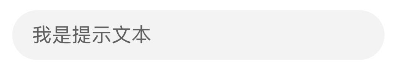
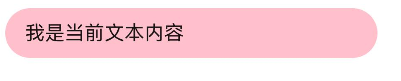
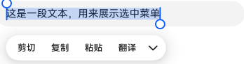
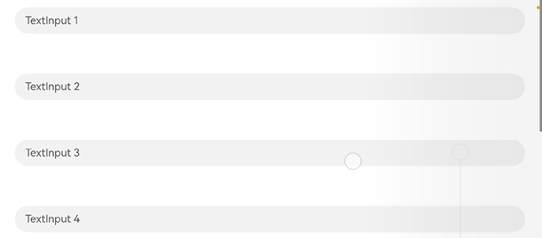

# Text Input (TextInput/TextArea)

TextInput and TextArea are input field components, typically used to respond to user input operations such as comment section inputs, chat box inputs, form inputs, etc. They can also be combined with other components to build functional pages, such as login/registration pages. For specific usage, please refer to [TextInput](../../../en/application-dev/reference/arkui-cj/cj-text-input-textinput.md) and [TextArea](../../../en/application-dev/reference/arkui-cj/cj-text-input-textarea.md).

## Creating Input Fields

TextInput is a single-line input field, while TextArea is a multi-line input field. They can be created using the following interfaces:

```cangjie
init(placeholder!: String = "", text!: String = "", controller!: TextInputController = TextInputController())
```

```cangjie
init(placeholder!: String = "", text!: String = "", controller!: TextAreaController = TextAreaController())
```

- Single-line input field:

    ```cangjie
    TextInput()
    ```

    

- Multi-line input field:

    ```cangjie
    TextArea()
    ```

    

- Multi-line input field with automatic line wrapping when text exceeds one line:

    ```cangjie
    TextArea(text: "I am TextArea I am TextArea I am TextArea I am TextArea").width(300)
    ```

    

## Customizing Styles

- Setting placeholder text when no input is provided:

    ```cangjie
    TextInput(placeholder: 'I am placeholder text')
    ```

    

- Setting the current text content of the input field:

    ```cangjie
    TextInput(placeholder: 'I am placeholder text', text: 'I am the current text content')
    ```

    

- Changing the background color of the input field by adding `backgroundColor`:

    ```cangjie
    TextInput(placeholder: 'I am placeholder text', text: 'I am the current text content')
    .backgroundColor(0xFEC0CD)
    ```

    

    More diverse styles can be achieved by combining with common properties.

## Selection Menu

When text in the input field is selected, a menu containing options like cut, copy, and translate will appear.

TextInput:

```cangjie
TextInput(text: 'This is a piece of text to demonstrate the selection menu')
```



TextArea:

```cangjie
TextArea(text: 'This is a piece of text to demonstrate the selection menu')
```


## Keyboard Avoidance

After the keyboard is raised, keyboard avoidance will only take effect for container components with scrolling capabilities during screen orientation changes. If you want keyboard avoidance to work for container components without scrolling capabilities, it is recommended to nest them within a container component that has scrolling capabilities, such as [Scroll](../../../en/application-dev/reference/arkui-cj/cj-scroll-swipe-scroll.md), [List](../../../en/application-dev/reference/arkui-cj/cj-scroll-swipe-list.md), or [Grid](../../../en/application-dev/reference/arkui-cj/cj-scroll-swipe-grid.md).

```cangjie
package ohos_app_cangjie_entry
import kit.ArkUI.*
import ohos.arkui.state_macro_manage.*

@Entry
@Component
class EntryView {
    var placeHolderArr: Array<String> = ["1", "2", "3", "4", "5", "6", "7"];
    func build() {
        Scroll() {
            Column {
                ForEach(this.placeHolderArr, itemGeneratorFunc: {placeholder: String, _: Int64 =>
                TextInput(placeholder: 'TextInput ' + placeholder)
                .margin(30)}
                )
            }
        }
        .height(100.percent)
        .width(100.percent)
    }
}
```

