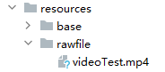

# Video Playback (Video)

The Video component is used to play video files and control their playback state, commonly employed for short video lists and in-app video pages. It automatically plays when fully displayed, pauses upon user click on the video area while showing a progress bar that allows seeking to specific positions. For detailed usage, refer to [Video](../../../en/application-dev/reference/arkui-cj/cj-image-video-video.md).

## Creating a Video Component

The Video component is created through API calls. For interface invocation forms, see [Creating a Video Component](../../../en/application-dev/reference/arkui-cj/cj-image-video-video.md#创建组件).

## Loading Video Resources

The Video component supports loading both local and network videos.

### Loading Local Videos

- Regular Local Videos

To load a local video, first specify the corresponding file in the local rawfile directory as shown below.



Then reference the video resource using the resource accessor @rawfile().

```cangjie
@Component
class VideoPlayer {
    private var controller: VideoController = VideoController()
    private var previewUris: AppResource = @r(app.media.preview)
    private var innerResource: AppResource = @rawfile("videoTest.mp4")

    func build() {
        Column() {
            Video(src: this.innerResource, previewUri: this.previewUris, controller: this.controller)
        }
    }
}
```

### Loading Sandbox Path Videos

Supports strings with the file:// path prefix for reading resources within the application sandbox path. Ensure the file exists in the application sandbox directory and has read permissions.

```cangjie
@Component
class VideoPlayer {
    private var controller: VideoController = VideoController()
    private var videoSrc: String = "file:///data/storage/el2/base/haps/entry/files/show.mp4"

    func build() {
        Column() {
            Video(src: this.videoSrc, controller: this.controller)
        }
    }
}
```

### Loading Network Videos

Loading network videos requires the ohos.permission.INTERNET permission. In this case, the Video's src property should be the URL of the network video.

```cangjie
@Component
class VideoPlayer {
    private var controller: VideoController = VideoController()
    private var previewUris: AppResource = @r(app.media.preview)
    private var videoSrc: String = "https://www.example.com/example.mp4" // Replace with actual video URL when using

    func build() {
        Column() {
            Video(src: this.videoSrc, previewUri: this.previewUris, controller: this.controller)
        }
    }
}
```

## Adding Properties

Video component [properties](../../../en/application-dev/reference/arkui-cj/cj-image-video-video.md#组件属性) primarily configure playback behavior, such as muting, displaying control bars, etc.

```cangjie
@Component
class VideoPlayer {
    private var controller: VideoController = VideoController()

    func build() {
        Column() {
            Video(controller: this.controller)
                .muted(false) // Set mute status
                .controls(false) // Show default control bar
                .autoPlay(false) // Enable autoplay
                .loop(false) // Enable loop playback
                .objectFit(ImageFit.Contain) // Set video scaling mode
        }
    }
}
```

## Event Invocation

Video component callback events include playback start, pause/end, failure, stop, preparation, and progress bar operations. It also supports general events like click and touch. For details, see [Event Description](../../../en/application-dev/reference/arkui-cj/cj-image-video-video.md#组件事件).

```cangjie
@Component
class VideoPlayer {
    private var controller: VideoController = VideoController()
    private var previewUris: AppResource = @r(app.media.preview)
    private var innerResource: AppResource = @rawfile("videoTest.mp4")

    func build() {
        Column() {
            Video(src: this.innerResource, previewUri: this.previewUris, controller: this.controller)
                .onUpdate({ value => // Update event callback
                    Hilog.info(0, "cangjie", "video update.")
                })
                .onPrepared({ value => // Preparation event callback
                    Hilog.info(0, "cangjie", "video prepared.")
                })
                .onError({ => // Error event callback
                    Hilog.info(0, "cangjie", "video error.")
                })
        }
    }
}
```

## Video Controller Usage

The Video controller primarily manages video states including play, pause, stop, and seeking. For details, see [VideoController Usage](../../../en/application-dev/reference/arkui-cj/cj-image-video-video.md#class-videocontroller).

- Default Controller

  The default controller supports basic functions: play, pause, seeking, and fullscreen display.

     <!-- run -->

  ```cangjie
  package ohos_app_cangjie_entry

  import kit.ArkUI.*
  import ohos.arkui.state_macro_manage.*
  import ohos.resource_manager.*

  @Entry
  @Component
  class EntryView {
      @State var videoSrc: AppResource = @r(app.media.startIcon) // Requires valid video source
      @State var previewUri: AppResource = @r(app.media.startIcon)
      @State var curRate: PlaybackSpeed = PlaybackSpeed.SpeedForward100X

      func build() {
          Row() {
              Column() {
                  Video(src: this.videoSrc, previewUri: this.previewUri, currentProgressRate: this.curRate)
              }
              .width(100.percent)
          }
          .height(100.percent)
      }
  }
  ```

- Custom Controller

  For custom controllers, first disable the default controller, then use components like Button and Slider for customized control and display, suitable for highly customized scenarios.

     <!-- run -->

  ```cangjie
  package ohos_app_cangjie_entry

  import kit.ArkUI.*
  import ohos.arkui.state_macro_manage.*
  import ohos.resource_manager.*

  @Entry
  @Component
  class EntryView {
      @State var videoSrc: AppResource = @r(app.media.startIcon) // Requires valid video source
      @State var previewUri: AppResource = @r(app.media.startIcon)
      @State var curRate: PlaybackSpeed = PlaybackSpeed.SpeedForward100X
      @State var isAutoPlay: Bool = false
      @State var showControls: Bool = true
      @State var sliderStartTime: String = ""
      @State var currentTime: Int32 = 0
      @State var durationTime: Int32 = 0
      var controller: VideoController = VideoController()
      func build() {
          Row() {
              Column() {
                  Video(src: this.videoSrc, previewUri: this.previewUri, currentProgressRate: this.curRate,
                      controller: this.controller)
                      .controls(false)
                      .autoPlay(true)
                      .onPrepared({
                              value => this.durationTime = value.duration
                          })
                      .onUpdate({
                              value => this.currentTime = value.time
                          })
                  Row() {
                      Text("${this.currentTime}s")
                      Slider(value: Float64(this.currentTime),  min: 0.0, max: Float64(this.durationTime))
                          .onChange({ value: Float64, mode: SliderChangeMode =>
                                  this.controller.setCurrentTime(Int32(value), SeekMode.Accurate)
                              })
                          .width(85.percent)
                      Text("${this.durationTime}s")
                  }
                  .opacity(0.8)
                  .width(100.percent)
              }.width(100.percent)
          }.height(100.percent)
      }
  }
  ```

## Additional Notes

The Video component encapsulates basic video playback capabilities. Developers don't need to create video instances or set/get video information—simply configure the data source and basic information to play videos, though with relatively limited extensibility.