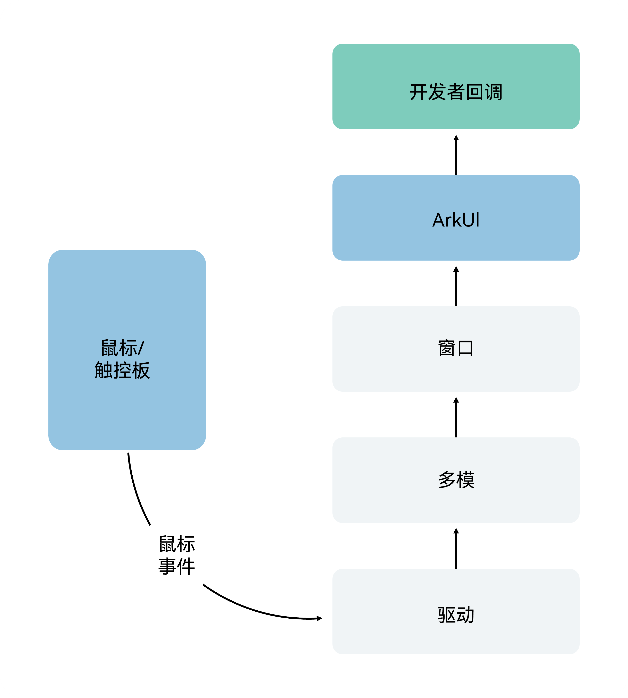
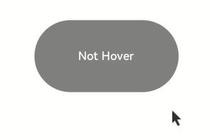
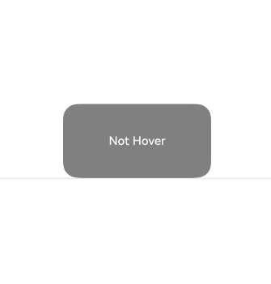
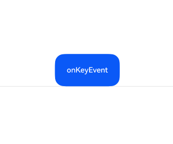
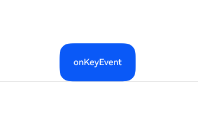

# Keyboard and Mouse Events

<!--Del-->
> **Note:**
>
> Currently in the beta phase.
<!--DelEnd-->

Keyboard and mouse events refer to input events from external devices such as keyboards and mice.

## Mouse Events

Supported mouse events include those triggered by external mice or touchpads.

The mouse can trigger the following events:

| Name                                       | Description                                       |
|:---------------------------------------- |:---------------------------------------- |
|  onHover(event: ?(Bool) -> Unit) | Triggered when the mouse enters or exits a component.<br>isHover: Indicates whether the mouse is hovering over the component. It is true when the mouse enters and false when it exits. |
|  onMouse(event: ?([MouseEvent](../reference/arkui-cj/cj-common-types.md#class-mouseevent)) -> Unit) | Triggered when the current component is clicked by a mouse button or when the mouse hovers and moves over the component.<br>The event return value includes the timestamp when the event was triggered, the mouse button, the action, the coordinates of the mouse position on the entire screen, and the coordinates relative to the current component. |

The principle of mouse events is illustrated below:



After a mouse event is passed to ArkUI, it first determines whether the event is a left button press/release/move and then responds differently:

- Yes: The mouse event is first converted into a touch event at the same position, performing collision detection, gesture judgment, and callback response for the touch event. Then, it proceeds to perform collision detection and callback response for the mouse event.

- No: The event is only used to perform collision detection and callback response for the mouse event.

> **Note:**
>
> All single-finger responsive touch events/gesture events can be operated and responded to via the left mouse button. For example, if you need to develop a feature where clicking a Button navigates to a page and it needs to support both finger taps and left mouse button clicks, binding just one click event (onClick) can achieve this effect. If you need to implement different effects for finger taps and left mouse button clicks, you can use the source field in the callback parameters of onClick to determine whether the current triggering event comes from a finger or a mouse.

### onHover

```cangjie
public func onHover(event: ?(Bool) -> Unit): T
```

Mouse hover event. The parameter type is Bool, indicating whether the mouse enters or leaves the component. This event does not support custom bubbling settings and defaults to parent-child bubbling.

If a component is bound to this interface, the event is triggered the moment the mouse pointer moves from outside the component into it, with the parameter value being true. The event is also triggered the moment the mouse pointer leaves the component, with the parameter value being false.

> **Note:**
>
> Event bubbling: In a tree structure, after a child node processes an event, the event is passed to its parent node for processing.

 <!-- run -->

```cangjie
package ohos_app_cangjie_entry

import kit.ArkUI.*
import ohos.arkui.state_macro_manage.*

@Entry
@Component
class EntryView {
    @State
    var hoverText: String = 'Not Hover'
    @State
    var color: Color = Color.Gray

    func build() {
        Column() {
            Button(this.hoverText)
                .width(200)
                .height(100)
                .backgroundColor(this.color)
                .onHover(
                    {
                        isHover => // Use the onHover interface to monitor whether the mouse is hovering over the Button component
                        if (isHover) {
                            this.hoverText = 'Hovered!'
                            this.color = Color.Green
                        } else {
                            this.hoverText = ' Hover'
                            this.color = Color.Gray
                        }
                    })
        }
            .width(100.percent)
            .height(100.percent)
            .justifyContent(FlexAlign.Center)
    }
}

```

This example creates a Button component with an initial background color of gray and the text "Not Hover". The Button component in the example is bound to the onHover callback.

When the mouse moves from outside the Button into it, the callback is triggered with the parameter value true, changing the component's background color to Color.Green and the text to "Hovered!".

When the mouse moves from inside the Button out of it, the callback is triggered with the parameter value false, restoring the component to its initial style.



### onMouse

```cangjie
public func onMouse(event: ?(MouseEvent) -> Unit): T
```

Mouse event callback. Whenever the mouse pointer performs an action (MouseAction) within a component bound to this API, the event callback is triggered. The parameter is a [MouseEvent](../reference/arkui-cj/cj-universal-event-mouse.md#class-mouseevent) object, representing the mouse event that triggered this action. This event supports custom bubbling settings and defaults to parent-child bubbling. It is commonly used for developer-defined mouse behavior logic.

Developers can obtain the coordinates (screenX/screenY/x/y), button ([MouseButton](../reference/arkui-cj/cj-common-types.md#enum-mousebutton)), action ([MouseAction](../reference/arkui-cj/cj-common-types.md#enum-mouseaction)), timestamp (timestamp), interactive component area ([EventTarget](../reference/arkui-cj/cj-universal-event-click.md#class-eventtarget)), and event source ([SourceType](.../reference/arkui-cj/cj-common-types.md#enum-sourcetype)) from the MouseEvent object in the callback.

> **Note:**
>
> The values for MouseButton: Left/Right/Middle/Back/Forward correspond to physical buttons on the mouse. Events for these buttons are triggered when they are pressed or released. None indicates no button, which appears in events triggered by moving the mouse without any button pressed or released.

 <!-- run -->

```cangjie
package ohos_app_cangjie_entry
import kit.ArkUI.*
import ohos.arkui.state_macro_manage.*

@Entry
@Component
class EntryView {
    @State var buttonText: String = ''
    @State var columnText: String = ''
    @State var hoverText: String = 'Not Hover'
    @State var color: Color = Color.Gray

    func build() {
        Column(space: 20) {
            Button(this.hoverText)
                .width(200)
                .height(100)
                .backgroundColor(this.color)
                .onHover({isHover =>
                    if (isHover) {
                        this.hoverText = 'Hovered!'
                        this.color = Color.Green
                    } else {
                        this.hoverText = 'Not Hover'
                        this.color = Color.Gray
                    }
                })
                .onMouse({event =>
                this.buttonText = "Button onMouse:\n" +
                    "x,y = (${event.x},${event.y})\n" +
                    "windowXY=(${event.screenX},${event.screenY})"
                })
            Divider()
            Text(this.buttonText).fontColor(Color.Green)
            Divider()
            Text(this.columnText).fontColor(Color.Red)
        }
        .width(100.percent)
        .height(100.percent)
        .justifyContent(FlexAlign.Center)
        .borderWidth(2.px)
        .borderColor(Color.Red)
        .onMouse({event =>
                this.columnText = "Column onMouse:\n" +
                    "x,y = (${event.x},${event.y})\n" +
                    "windowXY=(${event.screenX},${event.screenY})"
        })
    }
}
```



## Key Events

### onKeyEvent

```cangjie
public func onKeyEvent(event: ?(KeyEvent) -> Unit): T
```

When the component bound to this method is in a focused state, key events from an external keyboard will trigger this method. The callback parameter is [KeyEvent](../reference/arkui-cj/cj-universal-event-key.md#class-keyevent), from which the current key event's key action ([KeyType](../reference/arkui-cj/cj-common-types.md#enum-keytype)), key name (keyText), event source device type ([KeySource](../reference/arkui-cj/cj-common-types.md#enum-keysource)), event source device ID (deviceId), meta key press state (metaKey), and timestamp (timestamp) can be obtained.

 <!-- run -->

```cangjie
package ohos_app_cangjie_entry
import kit.ArkUI.*
import ohos.arkui.state_macro_manage.*

@Entry
@Component
class EntryView {
    @State var buttonText: String = ''
    @State var buttonType: String = ''
    @State var columnText: String = ''
    @State var columnType: String = ''

    func build() {
        Column() {
            Button('onKeyEvent')
                .defaultFocus(true)
                .width(140)
                .height(70)
                .onKeyEvent({ event =>
                    if (event.keyType == KeyType.Down) {
                        this.buttonType = 'Down'
                    }
                    if (event.keyType == KeyType.Up) {
                        this.buttonType = 'Up'
                    }
                    this.buttonText = """
                        Button:
                        KeyType: ${this.buttonType}
                        KeyCode: ${event.keyCode.toString()}
                        KeyText: ${event.keyText.toString()}
                    """
                })

            Divider()
            Text(this.buttonText).fontColor(Color.Green)

            Divider()
            Text(this.columnText).fontColor(Color.Red)
        }
        .width(100.percent)
        .height(100.percent)
        .justifyContent(FlexAlign.Center)
        .onKeyEvent({ event =>
            if (event.keyType == KeyType.Down) {
                this.columnType = 'Down'
            }
            if (event.keyType == KeyType.Up) {
                this.columnType = 'Up'
            }
            this.columnText = """
                Column:
                KeyType: ${this.columnType}
                KeyCode: ${event.keyCode.toString()}
                KeyText: ${event.keyText.toString()}
            """
        })
    }
}
```

In the above example, the onKeyEvent is bound to the Button component and its parent container Column. When the application opens and the page loads, the first non-container component in the component tree that can receive focus automatically gets focus. The Button is set as the default focus of the current page. Since the Button is a child node of the Column, the Button receiving focus also means the Column receives focus. For the focus mechanism, see [Focus Events](./cj-common-events-focus-event.md).



After opening the application, press these keys in sequence on the keyboard: Space, Enter, Left Ctrl, Left Shift, Letter A, Letter Z.

> **Note:**
>
> - Since the onKeyEvent event bubbles by default, both the Button's and Column's onKeyEvent can respond.
> - Each key press results in two callbacks, corresponding to KeyType.Down and KeyType.Up, indicating the key being pressed and then released.

To prevent bubbling, i.e., only the Button responds to keyboard events and not the Column, add the event.stopPropagation() method to the Button's onKeyEvent callback, as shown below:

 <!-- run -->

```cangjie
package ohos_app_cangjie_entry
import kit.ArkUI.*
import ohos.arkui.state_macro_manage.*

@Entry
@Component
class EntryView {
    @State var buttonText: String = ''
    @State var buttonType: String = ''
    @State var columnText: String = ''
    @State var columnType: String = ''

    func build() {
        Column() {
            Button('onKeyEvent')
                .defaultFocus(true)
                .width(140)
                .height(70)
                .onKeyEvent({ event =>
                    // Prevent event bubbling with stopPropagation
                    event.stopPropagation()
                    if (event.keyType == KeyType.Down) {
                        this.buttonType = 'Down'
                    }
                    if (event.keyType == KeyType.Up) {
                        this.buttonType = 'Up'
                    }
                    this.buttonText = """
                        Button:
                        KeyType: ${this.buttonType}
                        KeyCode: ${event.keyCode.toString()}
                        KeyText: ${event.keyText.toString()}
                    """
                })

            Divider()
            Text(this.buttonText).fontColor(Color.Green)

            Divider()
            Text(this.columnText).fontColor(Color.Red)
        }
        .width(100.percent)
        .height(100.percent)
        .justifyContent(FlexAlign.Center)
        .onKeyEvent({ event =>
            if (event.keyType == KeyType.Down) {
                this.columnType = 'Down'
            }
            if (event.keyType == KeyType.Up) {
                this.columnType = 'Up'
            }
            this.columnText = """
                Column:
                KeyType: ${this.columnType}
                KeyCode: ${event.keyCode.toString()}
                KeyText: ${event.keyText.toString()}
            """
        })
    }
}
```

