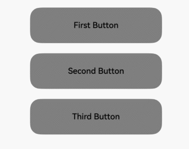
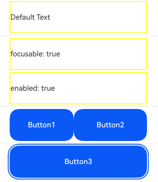
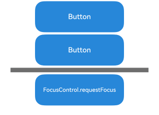

# Focus Events

## Basic Concepts and Specifications

### Basic Concepts

#### Focus, Focus Chain, and Focus Navigation

- **Focus**: Refers to the single interactive element currently highlighted in the application interface. When users interact indirectly with the application using non-pointing input devices such as keyboards, TV remotes, or car infotainment knobs, focus-based navigation and interaction become essential input methods.
- **Focus Chain**: In the component tree structure of an application, when a component gains focus, all nodes along the path from the root node to that component node are considered in a focused state, forming a continuous focus chain.
- **Focus Navigation**: Refers to the behavior of transferring focus between components within the application. This process is transparent to users, but developers can capture these changes by listening to `onFocus` (focus gain) and `onBlur` (focus loss) events. For specific methods and rules of focus navigation, see [Focus Navigation Specifications](#focus-navigation-specifications).

#### Focus State

Refers to the style applied to the currently focused component.

- **Display Rules**: By default, the focus state is not displayed. It only becomes visible when the application enters the active state. Therefore, while a focused component may not display its focus state (depending on whether it is active), a component displaying the focus state must be focused. Most components have built-in focus state styles, but developers can customize them using style interfaces. Once customized, the component will no longer display the built-in focus state style. In a focus chain, if multiple components have focus states, the system adopts a child-first strategy, prioritizing the child component's focus state and displaying only one focus state at a time.
- **Entering Active State**: The focus active state is entered by pressing the TAB key on an external keyboard or using the `FocusController.activate(true)` method. Once active, keyboard TAB or arrow keys can be used for focus navigation. The initial TAB key press used to activate the focus state does not trigger focus navigation.
- **Exiting Active State**: The focus active state exits when the application receives the `FocusController.active(false)` method or a click event (including touchscreen press events and left mouse button press events).

#### Hierarchical Pages

Hierarchical pages are a collective term for specific container components in the focus framework, including `Page`, `Dialog`, `SheetPage`, `ModalPage`, `Menu`, `Popup`, `NavBar`, and `NavDestination`. These components typically have the following key characteristics:

- **Visual Hierarchy Independence**: Visually, these components appear independent of other page content, often overlaying it to create a hierarchical visual distinction.
- **Focus Capture**: When first created and displayed, these components immediately capture the application's focus.
- **Focus Navigation Scope Limitation**: When focus is within these components, users cannot transfer focus to elements outside the component using keyboard keys; focus movement is restricted to the component's interior.

In an application, there is always at least one hierarchical page component holding the current focus. When this hierarchical page is closed or becomes invisible, focus automatically transfers to the next available hierarchical page component, ensuring continuity and consistency in user interaction.

> **Notes:**
>
> - The `Popup` component does not exhibit the second characteristic when its `focusable` property (a component-specific attribute, not a universal one) is set to `false`.
> - `NavBar` and `NavDestination` do not have the third characteristic. Their focus navigation scope is the same as that of their first parent hierarchical page.

#### Root Container

The root container is a concept within hierarchical pages. When a hierarchical page is first created and displayed, it immediately captures focus according to its characteristics. The end node of the focus chain for this page becomes the default focus, typically located on the root container of the hierarchical page.

By default, the default focus of a hierarchical page is on its root container, but developers can customize this behavior using the `defaultFocus` property.

When focus is on the root container, the first TAB key press not only activates the focus state but also triggers focus transfer to child components. If the child component is also a container, focus continues to propagate downward until reaching a leaf node. The propagation rule is: prioritize transferring focus to the last focused child node; if none exists, default to the first child node.

### Focus Navigation Specifications

Focus navigation can be categorized into active and passive navigation based on the triggering method.

#### Active Focus Navigation

Refers to focus movement caused by intentional actions of developers or users, including:

- **Keyboard Navigation (TAB/Shift+TAB/Arrow Keys)**:
  - **Prerequisite**: The application must be in the focus active state.
  - **Scope Limitation**: Keyboard navigation is restricted to the currently focused hierarchical page. For details, see the "Focus Navigation Scope Limitation" section under [Hierarchical Pages](#hierarchical-pages).
  - **Key Types**:
    - **TAB Key**: Follows a Z-shaped traversal logic, iterating through all leaf nodes in the current scope. Upon reaching the last component, pressing TAB again cycles focus back to the first focusable component, enabling circular navigation.
    - **Shift+TAB Key**: Produces the opposite effect of the TAB key.
    - **Arrow Keys (Up, Down, Left, Right)**: Follows a cross-shaped movement strategy. In a single-layer container, focus transfer is determined by the container's specific navigation algorithm. If the algorithm determines the next focus should land on a container component, the system uses a center-point distance priority algorithm to identify the target child node.
  - **Navigation Algorithm**: Each focusable container component has its own navigation algorithm defining focus transfer rules.
  - **Child-First Priority**: When a child component handles keyboard navigation events, the parent component does not intervene.

- **requestFocus**:
  - See [Active Focus Gain/Loss](#active-focus-gainloss) for details. This method actively transfers focus to a specified component.
  - Cannot cross windows or ArkUI instances but can cross hierarchical pages.

- **focusOnTouch**:
  - See [focusOnTouch](../../../en/application-dev/reference/arkui-cj/cj-universal-attribute-focus.md#func-focusontouchbool) for details. Enables a bound component to gain focus upon click. If the component itself is not focusable, this feature is ineffective. If bound to a container component, clicking prioritizes transferring focus to the last focused child component; otherwise, it transfers to the first focusable child component.

#### Passive Focus Navigation

Passive focus navigation refers to automatic focus transfer triggered by system or other operations without direct developer intervention, which is the default behavior of the focus system.

Current mechanisms for passive focus navigation include:

- **Component Deletion**: When a focused component is deleted, the focus framework first attempts to transfer focus to adjacent sibling components, following a back-to-front order. If no siblings are focusable, focus is released, and the parent component is notified to handle focus.
- **Property Changes**: If the `focusable` or `enabled` property of a focused component is set to `false`, or its `visibility` property is set to invisible, the focus framework automatically transfers focus to another focusable component, following the same sibling order as above.
- **Hierarchical Page Switching**: During page transitions (e.g., navigating from one page to another), the current page's focus is automatically released, and the new page may gain focus based on preset logic.
- **Web Component Initialization**: For Web components, if designed to require immediate focus upon creation (e.g., certain pop-ups or input fields), focus may transfer to the Web component. This behavior is part of the component's logic and not within the focus framework's specifications.

### Focus Navigation Algorithms

In the focus management system, each focusable container is equipped with specific navigation algorithms that define how focus transfers from the currently focused child component to the next focusable child component when using TAB, Shift+TAB, or arrow keys.

The choice of algorithm depends on the container's UX (User Experience) specifications and is adapted by the container component. Currently, the focus framework supports three navigation algorithms: Linear Navigation, Projection Navigation, and Custom Navigation.

#### Linear Navigation Algorithm

The default navigation strategy, based on the mounting order of child nodes in the node tree. Commonly used for unidirectional layout containers like `Row`, `Column`, and `Flex`. Rules:

- **Order Dependency**: Navigation order is entirely based on the mounting order of child nodes, independent of their actual layout positions.
- **TAB Key Navigation**: Pressing TAB iterates through child nodes in mounting order.
- **Arrow Key Navigation**: Arrow keys perpendicular to the container's defined direction are ignored. For example, vertical arrow keys are ineffective in a horizontal `Row` container.
- **Boundary Handling**: When focus is on the first or last child node, the container rejects arrow key navigation in the opposite direction. For example, a left arrow key is ignored when focus is on the first child of a horizontal `Row`.

#### Projection Navigation Algorithm

Based on the projection of the currently focused component in the navigation direction, combined with overlap area and center-point distance for selection. Ideal for containers with unevenly sized child components, currently only `Flex` components with the `wrap` property. Rules:

1. **Arrow Key Navigation**: Calculate the overlap area between the projection and child components. Among components with non-zero overlap, select the one with the shortest center-point distance. If multiple candidates exist, the earlier node in the tree wins. If no overlap, the container cannot handle the arrow key navigation.
2. **TAB Key Navigation**: First, apply Rule 1 using the right arrow key. If unsuccessful, simulate moving the focused child component downward by its height, then apply Rule 1 using the left arrow key. The child component with the farthest center-point distance and overlap wins. If no overlap, the container cannot handle the TAB key navigation.
3. **Shift+TAB Key Navigation**: First, apply Rule 1 using the left arrow key. If unsuccessful, simulate moving the focused child component upward by its height, then apply Rule 1 using the right arrow key. The child component with the farthest center-point distance and overlap wins. If no overlap, the container cannot handle the Shift+TAB key navigation.

#### Custom Navigation Algorithm

Defined by the component itself, with specifications determined by the component.

## Focus Gain/Loss Events

```cangjie
public func onFocus(callback: ()->Unit): This
```

Focus gain event callback. Triggered when the bound component gains focus.

```cangjie
public func onBlur(callback: ()->Unit): This
```

Focus loss event callback. Triggered when the bound component loses focus.

The `onFocus` and `onBlur` interfaces are typically used in pairs to monitor component focus changes.

 <!-- run -->

```cangjie
package ohos_app_cangjie_entry
import kit.ArkUI.*
import ohos.arkui.state_macro_manage.*

@Entry
@Component
class EntryView {
    @State var oneButtonColor: Color = Color.Gray
    @State var twoButtonColor: Color = Color.Gray
    @State var threeButtonColor: Color = Color.Gray
    func build() {
        Column(space: 20) {
        // Use up/down keys on an external keyboard to move focus between three buttons. Button color changes when focused and reverts when unfocused.
        Button("First Button")
            .backgroundColor(oneButtonColor)
            .width(260)
            .height(70)
            .fontColor(Color.Black)
            // Listen for focus gain event on the first component; change color when focused.
            .onFocus({ =>
                oneButtonColor = Color.Green
            })
            // Listen for focus loss event on the first component; revert color when unfocused.
            .onBlur({=>
                oneButtonColor = Color.Gray
            })
        Button("Second Button")
            .backgroundColor(twoButtonColor)
            .width(260)
            .height(70)
            .fontColor(Color.Black)
            // Listen for focus gain event on the second component; change color when focused.
            .onFocus({=>
                twoButtonColor = Color.Green
            })
            // Listen for focus loss event on the second component; revert color when unfocused.
            .onBlur({=>
                twoButtonColor = Color.Gray
            })
        Button("Third Button")
            .backgroundColor(threeButtonColor)
            .width(260)
            .height(70)
            .fontColor(Color.Black)
            // Listen for focus gain event on the third component; change color when focused.
            .onFocus({=>
                threeButtonColor = Color.Green
            })
            // Listen for focus loss event on the third component; revert color when unfocused.
            .onBlur({=>
                threeButtonColor = Color.Gray
            })
        }.width(100.percent).margin(top: 20)
    }
}
```



The above example includes the following steps:

1. The application opens. Pressing the TAB key activates focus navigation. "First Button" displays the focus state style: a blue outline around the component. The `onFocus` callback is triggered, changing the background color to green.
2. Pressing TAB again triggers focus navigation. "Second Button" gains focus, triggering its `onFocus` callback (background turns green). "First Button" loses focus, triggering its `onBlur` callback (background reverts to gray).
3. Pressing TAB again triggers focus navigation. "Third Button" gains focus, triggering its `onFocus` callback (background turns green). "Second Button" loses focus, triggering its `onBlur` callback (background reverts to gray).

## Setting Component Focusability

```cangjie
public func focusable(isFocusable: Bool): This
```

Sets whether the component can receive focus.

Components can be broadly categorized into three types based on focusability:

1. **Default Focusable Components**: Typically interactive components like `Button`, `Checkbox`, and `TextInput`. These components are focusable by default without any property settings.
2. **Focusable but Not by Default**: Examples include `Text` and `Image`. These components are not focusable by default but can be enabled using the universal property `focusable(true)`. If no `focusable` property is set but the component has focus capability, configuring `onClick` or a single-finger tap gesture implicitly makes it focusable. If `focusable` is set to `false`, even with these events, the component remains unfocusable.
3. **Non-Focusable Components**: Typically non-interactive display components like `Blank` and `Circle`. These cannot be made focusable even with the `focusable` property.

```cangjie
public func enabled(value: Bool): This
```

Sets the component's interactivity property [`enabled`](../../../en/application-dev/reference/arkui-cj/cj-universal-attribute-enable.md#func-enabledbool) to `false`, making the component non-interactive and unfocusable.

```cangjie
public func visibility(value: Visibility): This
```

Sets the component's visibility property [`visibility`](../../../en/application-dev/reference/arkui-cj/cj-universal-attribute-visibility.md#func-visibilityvisibility) to `Visibility.None` or `Visibility.Hidden`, making the component invisible and unfocusable.

```cangjie
public func focusOnTouch(isFocusOnTouch: Bool): This
```

Sets whether the component can gain focus upon click.

> **Notes:**
>
> When a component is focused, setting its `focusable` or `enabled` property to `false` automatically causes it to lose focus. The focus then transfers to another focusable component according to the [Focus Navigation Specifications](#focus-navigation-specifications).

 <!-- run -->

```cangjie
package ohos_app_cangjie_entry
import kit.ArkUI.*
import ohos.arkui.state_macro_manage.*

@Entry
@Component
class EntryView {
    @State var textFocusable: Bool = true
    @State var textEnabled: Bool = true
    @State var color1: Color = Color(0xFFFF00)
    @State var color2: Color = Color(0xFFFF00)
    @State var color3: Color = Color(0xFFFF00)

    func build() {
        Column(space: 5) {
            // First Text component without focusable property set; unfocusable by default.
            Text("Default Text")
                .borderColor(color1)
                .borderWidth(2)
                .width(300)
                .height(70)
                .onFocus({ =>
                    color1 = Color.Blue
                })
                .onBlur({ =>
                    color1 = Color(0xFFFF00)
                })

            Divider()

            // Second Text component with initial focusable=true and focusOnTouch=true.
            Text("focusable: " + textFocusable.toString())
                .borderColor(color2)
                .borderWidth(2)
                .width(300)
                .height(70)
                .focusable(textFocusable)
                .focusOnTouch(true)
                .onFocus({ =>
                    color2 = Color.Blue
                })
                .onBlur({ =>
                    color2 = Color(0xFFFF00)
                })

            // Third Text component with focusable=true and initial enabled=true.
            Text("enabled: " + textEnabled.toString())
                .borderColor(color3)
                .borderWidth(2)
                .width(300)
                .height(70)
                .focusable(true)
                .enabled(textEnabled)
                .focusOnTouch(true)
                .onFocus({ =>
                    color3 = Color.Blue
                })
                .onBlur({ =>
                    color3 = Color(0xFFFF00)
                })

            Divider()

            Row() {
                Button("Button1")
                    .width(140).height(70)
                Button("Button2")
                    .width(160).height(70)
            }

            Divider()
            Button("Button3")
                .width(300).height(70)

            Divider()
        }
        .width(100.percent)
        .justifyContent(FlexAlign.Center)
        .onKeyEvent({ e =>
            // Bind onKeyEvent. When the Column component is focused, pressing 'F' toggles the second Text's focusable property.
            if (e.keyCode == 2022 && e.keyType == KeyType.Down) {
                textFocusable = !textFocusable
            }
            // Bind onKeyEvent. When the Column component is focused, pressing 'G' toggles the third Text's enabled property.
            if (e.keyCode == 2023 && e.keyType == KeyType.Down) {
                textEnabled = !textEnabled
            }
        })
    }
}
```

Execution Effect:



The above example includes the following steps:

1. The first `Text` component does not have `focusable(true)` set, making it unfocusable.
2. Clicking the second `Text` component (with `focusOnTouch(true)`) focuses it. Pressing TAB triggers focus navigation, keeping focus on the second `Text`. Pressing the 'F' key triggers `## Active Focus Acquisition/Loss

Using methods from focusControl:

```cangjie
public static func requestFocus(keyValue: String): Bool
```

Calling this interface can actively transfer focus to the specified component. The focus transfer takes effect at the next frame signal.

 <!-- run -->

```cangjie
package ohos_app_cangjie_entry
import kit.ArkUI.*
import ohos.arkui.state_macro_manage.*

@Entry
@Component
class EntryView {
    @State var btColor: UInt32 = 0x2787d9
    @State var btColor2: UInt32 = 0x2787d9

    func build() {
        Column(space: 20) {
            Column(space: 5) {
                Button("Button")
                    .width(200)
                    .height(70)
                    .fontColor(Color.White)
                    .focusOnTouch(true)
                    .backgroundColor(0x2787d9)
                    .onFocus({ =>
                        btColor = 0xd5d5d5
                    })
                    .onBlur({ =>
                        btColor = 0x2787d9
                    })
                    .id("testButton")

                Button("Button")
                    .width(200)
                    .height(70)
                    .fontColor(Color.White)
                    .focusOnTouch(true)
                    .backgroundColor(btColor2)
                    .onFocus({ =>
                        btColor2 = 0xd5d5d5
                    })
                    .onBlur({ =>
                        btColor2 = 0x2787d9
                    })
                    .id("testButton2")

                Divider()
                    .vertical(false)
                    .width(80.percent)
                    .backgroundColor(0x707070)
                    .height(10)
                //Click the focusControl.requestFocus button to focus the second Button.
                Button("FocusControl.requestFocus")
                    .width(200)
                    .height(70)
                    .fontColor(Color.White)
                    .onClick({ evt =>
                        FocusControl.requestFocus("testButton2")
                    })
                    .backgroundColor(0xff2787d9)
            }
        }
        .width(100.percent)
        .height(100.percent)
    }
}
```



## Focus and Key Events

When a component gains focus and has a click event (`onClick`) or single-finger tap event (`TapGesture`), pressing Enter or Space will trigger the corresponding event callback.

> **Note:**
>
> - When click events (`onClick`) or single-finger tap events (`TapGesture`) are triggered by Enter or Space, they do not bubble up by default, meaning the parent component's corresponding [key event](../../../en/application-dev/reference/arkui-cj/cj-universal-event-key.md) will not be triggered simultaneously.
> - Key events (`onKeyEvent`) bubble up by default, meaning they will also trigger the parent component's key event callback.
> - If a component has both click events (`onClick`) and key events (`onKeyEvent`), both will respond when Enter or Space is pressed.
> - A focused component responding to click events (`onClick`) is independent of the focus active state.

 <!-- run -->

```cangjie
package ohos_app_cangjie_entry
import kit.ArkUI.*
import ohos.arkui.state_macro_manage.*

@Entry
@Component
class EntryView {
    @State var count: Int = 0
    @State var name: String = "Button"

    func build() {
        Column {
            Button(name)
                .fontSize(30)
                .onClick({ evt =>
                    count++
                    if (count <= 0) {
                        name = "count is negative number"
                    } else if (count % 2 == 0) {
                        name = "count is even number"
                    } else {
                        name = "count is odd number"
                    }
                })
                .height(60)
        }
        .height(100.percent).width(100.percent).justifyContent(FlexAlign.Center)
    }
}
```


## Component Focus Capability Description

Basic component focus capabilities are as follows:

| Basic Component                                     | Has Focus Capability | Default focusable Value |
| :---------------------------------------- | :------- | :------------ |
| [AlphabetIndexer](../../../en/application-dev/reference/arkui-cj/cj-information-display-alphabetindexer.md) | Yes       | true         |
| [Blank](../../../en/application-dev/reference/arkui-cj/cj-blank-divider-blank.md) | No       | false        |
| [Button](../../../en/application-dev/reference/arkui-cj/cj-button-picker-button.md) | Yes       | true         |
| [Checkbox](../../../en/application-dev/reference/arkui-cj/cj-button-picker-checkbox.md) | Yes       | true         |
| [CheckboxGroup](../../../en/application-dev/reference/arkui-cj/cj-button-picker-checkboxgroup.md) | Yes       | true         |
| [DataPanel](../../../en/application-dev/reference/arkui-cj/cj-information-display-datapanel.md) | Yes       | false        |
| [DatePicker](../../../en/application-dev/reference/arkui-cj/cj-button-picker-datepicker.md) | Yes       | true         |
| [Divider](../../../en/application-dev/reference/arkui-cj/cj-blank-divider-divider.md) | Yes       | false        |
| [Gauge](../../../en/application-dev/reference/arkui-cj/cj-information-display-gauge.md) | Yes       | false        |
| [Image](../../../en/application-dev/reference/arkui-cj/cj-image-video-image.md) | Yes       | false        |
| [ImageSpan](../../../en/application-dev/reference/arkui-cj/cj-text-input-imagespan.md)                 | No       | false        |
| [LoadingProgress](../../../en/application-dev/reference/arkui-cj/cj-information-display-loadingprogress.md) | Yes       | true        |
| [Navigation](../../../en/application-dev/reference/arkui-cj/cj-navigation-switching-navigation.md) | Yes       | true         |
| [PatternLock](../../../en/application-dev/reference/arkui-cj/cj-information-display-patternlock.md) | Yes       | true        |
| [Progress](../../../en/application-dev/reference/arkui-cj/cj-information-display-progress.md) | Yes       | true        |
| [QRCode](../../../en/application-dev/reference/arkui-cj/cj-information-display-qrcode.md) | Yes       | true        |
| [Radio](../../../en/application-dev/reference/arkui-cj/cj-button-picker-radio.md) | Yes       | true         |
| [Rating](../../../en/application-dev/reference/arkui-cj/cj-button-picker-rating.md) | Yes       | true         |
| [RichEditor](../../../en/application-dev/reference/arkui-cj/cj-text-input-richeditor.md) | Yes       | true         |
| [RichText](../../../en/application-dev/reference/arkui-cj/cj-text-input-richtext.md) | No       | false        |
| [ScrollBar](../../../en/application-dev/reference/arkui-cj/cj-scroll-swipe-scrollbar.md) | No       | false        |
| [Search](../../../en/application-dev/reference/arkui-cj/cj-text-input-search.md) | Yes       | true         |
| [Select](../../../en/application-dev/reference/arkui-cj/cj-button-picker-select.md) | Yes       | true         |
| [Slider](../../../en/application-dev/reference/arkui-cj/cj-button-picker-slider.md) | Yes       | true         |
| [Span](../../../en/application-dev/reference/arkui-cj/cj-text-input-span.md) | No       | false        |
| [Stepper](../../../en/application-dev/reference/arkui-cj/cj-navigation-switching-stepper.md) | Yes       | true         |
| [StepperItem](../../../en/application-dev/reference/arkui-cj/cj-navigation-switching-stepperitem.md) | Yes       | true         |
| [Text](../../../en/application-dev/reference/arkui-cj/cj-text-input-text.md) | Yes       | false        |
| [TextArea](../../../en/application-dev/reference/arkui-cj/cj-text-input-textarea.md) | No       | false         |
| [TextClock](../../../en/application-dev/reference/arkui-cj/cj-information-display-textclock.md) | No       | false        |
| [TextInput](../../../en/application-dev/reference/arkui-cj/cj-text-input-textinput.md) | Yes       | true         |
| [TextPicker](../../../en/application-dev/reference/arkui-cj/cj-button-picker-textpicker.md) | Yes       | true         |
| [TextTimer](../../../en/application-dev/reference/arkui-cj/cj-information-display-texttimer.md) | No       | false        |
| [Toggle](../../../en/application-dev/reference/arkui-cj/cj-button-picker-toggle.md) | Yes       | true         |

Container component focus capabilities are as follows:

| Container Component                                     | Can Be Focused | Default focusable Value |
| :---------------------------------------- | :------- | :------------ |
| [Badge](../../../en/application-dev/reference/arkui-cj/cj-information-display-badge.md) | No     | false        |
| [Column](../../../en/application-dev/reference/arkui-cj/cj-row-column-stack-column.md) | Yes     | true         |
| [Flex](../../../en/application-dev/reference/arkui-cj/cj-row-column-stack-flex.md) | Yes     | true         |
| [GridCol](../../../en/application-dev/reference/arkui-cj/cj-grid-layout-gridcol.md) | Yes     | true         |
| [GridRow](../../../en/application-dev/reference/arkui-cj/cj-grid-layout-gridrow.md) | Yes     | true         |
| [Grid](../../../en/application-dev/reference/arkui-cj/cj-scroll-swipe-grid.md) | Yes     | true         |
| [GridItem](../../../en/application-dev/reference/arkui-cj/cj-scroll-swipe-griditem.md) | Yes     | true         |
| [List](../../../en/application-dev/reference/arkui-cj/cj-scroll-swipe-list.md) | Yes     | true         |
| [ListItem](../../../en/application-dev/reference/arkui-cj//cj-scroll-swipe-listitem.md) | Yes     | true         |
| [ListItemGroup](../../../en/application-dev/reference/arkui-cj/cj-scroll-swipe-listgroup.md) | Yes     | true         |
| [Navigator](../../../en/application-dev/reference/arkui-cj/cj-navigation-switching-navigation.md) | Yes     | true         |
| [Refresh](../../../en/application-dev/reference/arkui-cj/cj-scroll-swipe-refresh.md) | Yes     | true        |
| [RelativeContainer](../../../en/application-dev/reference/arkui-cj/cj-row-column-stack-relativecontainer.md) | No     | false         |
| [Row](../../../en/application-dev/reference/arkui-cj/cj-row-column-stack-row.md) | Yes    | true         |
| [RowSplit](../../../en/application-dev/reference/arkui-cj/cj-grid-layout-rowsplit.md) | Yes     | true         |
| [Scroll](../../../en/application-dev/reference/arkui-cj/cj-scroll-swipe-scroll.md) | Yes     | true         |
| [SideBarContainer](../../../en/application-dev/reference/arkui-cj/cj-grid-layout-sidebar.md) | Yes     | true         |
| [Stack](../../../en/application-dev/reference/arkui-cj/cj-row-column-stack-stack.md) | Yes     | true         |
| [Swiper](../../../en/application-dev/reference/arkui-cj/cj-scroll-swipe-swiper.md) | Yes     | true         |
| [Tabs](../../../en/application-dev/reference/arkui-cj/cj-navigation-switching-tabs.md) | Yes     | true         |

Media component focus capabilities are as follows:

| Media Component                                     | Can Be Focused | Default focusable Value |
| :---------------------------------------- | :------- | :------------ |
| [Video](../../../en/application-dev/reference/arkui-cj/cj-image-video-video.md) | Yes     | true         |