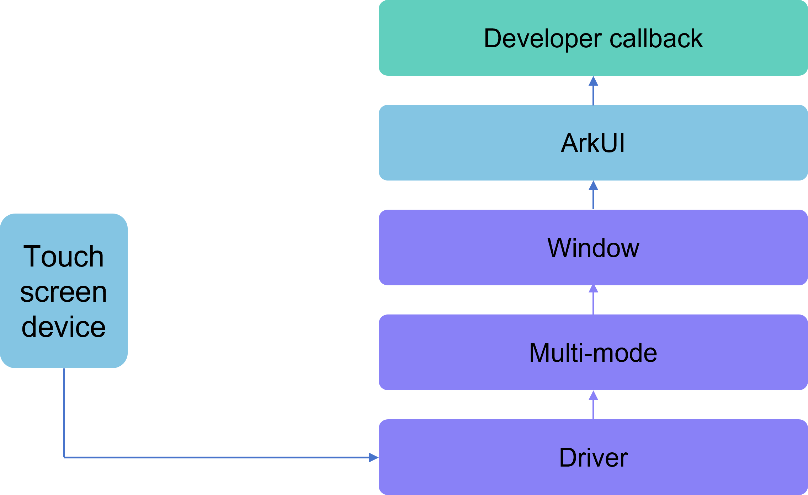
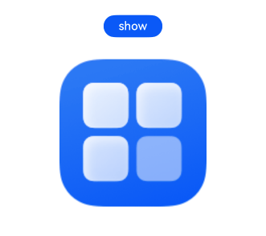
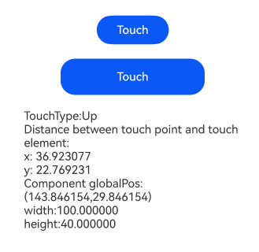

# Touch Events

Touch events refer to callback events triggered when a finger/stylus presses, slides, or lifts on a component. These include [Click Events](#click-events) and [Touch Events](#touch-events). The principle of touch events is illustrated below:

**Figure 1** Touch Event Principle



## Click Events

A click event occurs when a finger or stylus completes a full press-and-lift action. When a click event occurs, the following callback function is triggered:

```cangjie
func onClick(callback: (ClickEvent)->Unit): This
```

The event parameter provides the coordinate position of the click event relative to the window or component, as well as the event source that triggered the click.

For example, using a button's click event to control the display and hiding of an image.

 <!-- run -->

```cangjie
package ohos_app_cangjie_entry
import kit.ArkUI.*
import ohos.arkui.state_macro_manage.*
import ohos.resource_manager.*
import ohos.resource.__GenerateResource__

@Entry
@Component
class EntryView {
    @State var flag = true
    @State var btnMsg: String = 'show'

    func build() {
        Column {
            Button(this.btnMsg)
                .width(80)
                .height(30)
                .margin(30)
                .onClick({ event =>
                    if (this.flag) {
                        this.btnMsg = 'hide'
                    } else {
                        this.btnMsg = 'show'
                    }
                    // Clicking the Button controls the Image's display/hide
                    this.flag = !this.flag
                })
            if (this.flag) {
                Image(@r(app.media.startIcon))
                    .width(200)
                    .height(200)
            }
        }
        .height(100.percent)
        .width(100.percent)
    }
}
```

**Figure 2** Controlling Image Display/Hide via Button Click Event



## Touch Events

When a finger or stylus touches a component, different actions trigger corresponding event responses, including press (Down), slide (Move), and lift (Up) events:

```cangjie
public func onTouch(callback: (TouchEvent)->Unit): This
```

- event.type as TouchType.Down: Indicates a finger press.
- event.type as TouchType.Up: Indicates a finger lift.
- event.type as TouchType.Move: Indicates finger movement while pressed.
- event.type as TouchType.Cancel: Indicates interruption/cancellation of current finger operation.

Touch events can be triggered simultaneously by multiple fingers. The event parameter provides information such as triggering finger position, unique finger identifier, currently changed finger, and input device source.

 <!-- run -->

```cangjie
package ohos_app_cangjie_entry
import kit.ArkUI.*
import ohos.arkui.state_macro_manage.*

@Entry
@Component
class EntryView {
    @State var text: String = ""
    @State var eventType: String = ""

    func build() {
        Column {
            Button('Touch')
                .height(40)
                .width(100)
                .onTouch({ event =>
                    this.eventType = match (event.eventType) {
                        case TouchType.Down => 'Down'
                        case TouchType.Up => 'Up'
                        case TouchType.Move => 'Move'
                        case TouchType.Cancel => 'Move'
                        case TouchType.Unknown => "Unknown"
                        case _ => ""
                    }
                    this.text = 'TouchType:' + this.eventType + '\nDistance between touch point and touch element:\nx: '
                        + event.touches[0].x.toString() + '\n' + 'y: ' + event.touches[0].y.toString()
                        + '\nComponent globalPos:(' + event.target.getOrThrow().area.globalPosition.x.getOrThrow().value.toString()
                        + ',' + event.target.getOrThrow().area.globalPosition.y.getOrThrow().value.toString() + ')\nwidth:'
                        + event.target.getOrThrow().area.width.value.toString() + '\nheight:' + event.target.getOrThrow().area.height.value.toString()
                })
            Button('Touch')
                .height(50)
                .width(200)
                .margin(20)
                .onTouch({ event =>
                    this.eventType = match (event.eventType) {
                        case TouchType.Down => 'Down'
                        case TouchType.Up => 'Up'
                        case TouchType.Move => 'Move'
                        case TouchType.Cancel => 'Move'
                        case TouchType.Unknown => "Unknown"
                        case _ => ""
                    }
                    this.text = 'TouchType:' + this.eventType + '\nDistance between touch point and touch element:\nx: '
                        + event.touches[0].x.toString() + '\n' + 'y: ' + event.touches[0].y.toString()
                        + '\nComponent globalPos:(' + event.target.getOrThrow().area.globalPosition.x.getOrThrow().value.toString()
                        + ',' + event.target.getOrThrow().area.globalPosition.y.getOrThrow().value.toString() + ')\nwidth:'
                        + event.target.getOrThrow().area.width.value.toString() + '\nheight:' + event.target.getOrThrow().area.height.value.toString()
                })
            Text(this.text)
        }
        .width(100.percent)
        .padding(30)
    }
}
```

