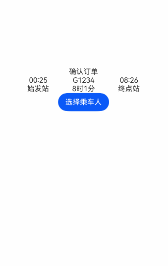

# Binding Full-Screen Modal Page (bindContentCover)

[Full-screen modal page (bindContentCover)](../../../en/application-dev/reference/arkui-cj/cj-universal-attribute-bindcontentcover.md#func-bindcontentcoverboolunitcontentcoveroptions) is a popup interaction page in full-screen modal form that completely covers the underlying parent view. It is suitable for scenarios such as viewing large images or full-screen document review.

## Usage Constraints

The full-screen modal page is essentially a popup component, with its interaction layer defaulting to the top level within the application.

During [Navigation](../../../en/application-dev/reference/arkui-cj/cj-navigation-switching-navigation.md) transitions, newly pushed pages cannot surpass the full-screen modal in hierarchy and will still appear beneath the modal page. For such scenarios, it is recommended to migrate the modal page content to the transition page. For example, in the aforementioned case, NavDestination can be used to replace the invoked modal page, with the newly pushed page hierarchy remaining below the full-screen modal.

## Lifecycle

The full-screen modal page provides lifecycle functions to notify the application of its lifecycle states. The lifecycle triggers occur in the following sequence: onWillAppear -> onAppear -> onWillDisappear -> onDisappear.

| Name            | Type | Description                       |
| :----------------- | :------ | :---------------------------- |
| onWillAppear    | () -> Unit | Callback function when the full-screen modal page is about to appear (before animation starts). |
| onAppear    | () -> Unit | Callback function when the full-screen modal page has appeared (after animation ends).  |
| onWillDisappear | () -> Unit | Callback function when the full-screen modal page is about to disappear (before animation starts). |
| onDisappear |() -> Unit  | Callback function when the full-screen modal page has disappeared (after animation ends).     |

## Using bindContentCover to Build Full-Screen Modal Content Over Semi-Modal

There exists a hierarchical interaction between full-screen and semi-modal popups. A subsequently invoked modal page can cover a previous modal page. If developers wish to achieve a full-screen transition that covers the semi-modal while keeping the semi-modal page visible after swiping to exit the full-screen page, combining bindSheet with bindContentCover can fulfill this scenario requirement.

For details, refer to [Modal Transition](./cj-modal-transition.md#using-bindcontentcover-to-build-full-screen-modal-transition-effects) to learn about using bindContentCover to create full-screen modal transition effects.

## Example Code

 <!-- run -->

```cangjie
package ohos_app_cangjie_entry

import kit.ArkUI.*
import ohos.arkui.state_macro_manage.*
import kit.PerformanceAnalysisKit.*
import std.collection.*

struct PersonList{
    var name: String = ""
    var carnum: String = ""
    public init(name: String,carnum: String){
        this.name = name
        this.carnum = carnum
    }
}

@Entry
@Component
class EntryView {

    private var personlist: ArrayList<PersonList> = ArrayList<PersonList>(
        [PersonList("Xu**","123***456"),PersonList("Wang**","234***345"),PersonList("Chen**","345**456")])

    // Semi-modal transition control variable
    @State var isSheetShow: Bool = false
    // Full-screen modal transition control variable
    @State var isPresent: Bool = false
    public func onAppear() {
        Hilog.info(0, "cangjie", "BindContentCover onAppear.")
    }
    public func onDisappear() {
        Hilog.info(0, "cangjie", "BindContentCover onDisappear.")
    }

    @Builder
    public func MycontentCoverBulider(){
        Column(){
            Column(){
                Blank().height(20.percent)
                ForEach(this.personlist,itemGeneratorFunc:{item:PersonList,index: Int64 =>
                        Row(){
                            Column(){
                                if(index %2 == 0){
                                    Column()
                                    .width(20)
                                    .height(20)
                                    .border(width: 10, color: 0x007dfe)
                                    .backgroundColor(0x007dfe)
                                }else{
                                    Column()
                                    .width(20)
                                    .height(20)
                                }
                            }.width(20.percent)
                            Column(){
                                Text(item.name)
                                .fontColor(0x333333)
                                .fontSize(18)
                                Text(item.carnum)
                                .fontColor(0x666666)
                                .fontSize(14)
                            }.width(60.percent).alignItems(HorizontalAlign.Center)
                            Column(){
                                Text("Edit")
                                .fontColor(0x007dfe)
                                .fontSize(16)
                            }
                            .width(20.percent)
                        }
                        .padding(top:10,bottom:10)
                        .width(92.percent)
                        .backgroundColor(Color.White)
                        })
            }.justifyContent(FlexAlign.Center).alignItems(HorizontalAlign.Center)
            Button("Confirm")
            .width(400)
            .height(40)
            .fontColor(Color.Blue)
            .onClick({
                evt =>
                this.isPresent = !this.isPresent
            })
        }
        .backgroundColor(0xf5f5f5)
        .size(width: 100.percent,height: 80.percent)
    }

    @Builder
    public func TripInfo(){
        Row(){
            Column(){
                Text("00:25")
                Text("Departure Station")
            }.width(100)
            Column(){
                Text("G1234")
                Text("8h 1m")
            }.width(100)
            Column(){
                Text("08:26")
                Text("Terminal Station")
            }.width(100)
        }
    }
    // Step 2: Define semi-modal display interface
    // Build modal display interface via builder
    @Builder
    public func MySheetBuilder(){
        Column(){
            Column(){
                this.TripInfo()
            }.width(500)
            .margin(15)
            .backgroundColor(Color.White)
            .borderRadius(10)

            Column(){
                Button("+ Select Passenger")
                .fontSize(18)
                .onClick({
                    evt =>
                    // Step 3: Invoke full-screen modal display interface via full-modal API, newly invoked modal panel defaults to top layer
                    this.isPresent = !this.isPresent
                })
                // Bind modal display interface MyContentCoverBuilder via full-modal API.
                .bindContentCover(this.isPresent,MycontentCoverBulider,options: ContentCoverOptions(
                          modalTransition: ModalTransition.Default,backgroundColor: Color.White,onAppear: onAppear,onDisappear:onDisappear)
                    )
            }
            .justifyContent(FlexAlign.Center)
            .backgroundColor(Color.White)
            .padding(60)
        }
    }

    func build() {
        Column(){
            Blank().height(20.percent)
            Text("Confirm Order")
            this.TripInfo()
            Column(){
                Button("Select Passenger")
                .onClick({
                    evt =>
                    this.isSheetShow = !this.isSheetShow
                })
                // Step 1: Define semi-modal transition effect
                .bindSheet(this.isSheetShow,MySheetBuilder)
            }
        }
        .width(100.percent)
        .height(100.percent)
        .backgroundColor(Color.White)
    }
}
```

