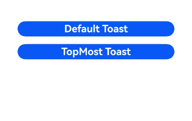

# Toast Feedback  

Toast is a temporary message prompt used to provide brief operational feedback or status information to users. It typically pops up briefly at the bottom or top of the screen and automatically disappears after a short period. The primary purpose of Toast is to deliver concise, non-intrusive feedback without interrupting the user's current workflow.  

## Usage Guidelines  

- **Use Toast judiciously rather than frequently notifying users.**  

  Toast is suitable for common scenarios such as:  
  - Providing immediate feedback after a user action to indicate success or failure.  
  - Notifying users of application state changes.  

- **Keep text concise due to limited display time; avoid lengthy content.**  

  Toast text should be clear and readable, with font size and color consistent with the application's theme. Additionally, Toast should not contain interactive elements like buttons or links.  

- **Avoid forced placement and excessive pop-ups.**  

  As a lightweight in-app notification, Toast should not:  
  - Overlap or obscure other UI elements, causing confusion about whether the content belongs to the Toast or another component.  
  - Pop up too frequently without time intervals, disrupting normal usage.  
  - Replace the previous Toast too quickly with a new one.  
  - Display for more than 3 seconds to prevent interference with user actions.  

- **Adhere to the system's default pop-up position.**  

  By default, Toast appears at the bottom of the interface with a safe margin. As a system-level in-app prompt, follow the default behavior to avoid overlapping with other pop-up components. Adjustments may be made for special scenarios.  

## Toast Display Mode Comparison  

Toast supports two display modes:  
- **DEFAULT** (displays within the application)  
- **TOP_MOST** (displays above the application)  

For **TOP_MOST** Toast, a full-screen sub-window (matching the main window size on the device) is created before display. The Toast's layout position is calculated and rendered within this sub-window. Key differences from **DEFAULT** mode are:  

| Difference        | DEFAULT | TOP_MOST |  
| :---------------- | :------ | :------- |  
| Sub-window Creation | No | Yes |  
| Hierarchy Level | Displays within the main window, sharing its (usually lower) level. | Displays in a sub-window, typically above the main window but below soft keyboards and permission dialogs. |  
| Soft Keyboard Avoidance | Always shifts up by the keyboard height when raised. | Only shifts if obscured, maintaining an 80.vp gap from the keyboard. |  

 <!--run-->  

```cangjie  
package ohos_app_cangjie_entry  

import kit.ArkUI.*  
import ohos.arkui.ui_context.*  
import ohos.arkui.state_macro_manage.*  

@Entry  
@Component  
class EntryView{  
    func build(){  
        Row(){  
            Blank().height(20.percent)  
            Button(){  
                Text("DEFAULT Toast")  
                .fontSize(20)  
                .fontWeight(FontWeight.Bold)  

            }.onClick({  
                evt =>  
                getUIContext().getPromptAction().showToast(  
                        ShowToastOptions(message: "OK, I'm a DEFAULT toast", duration: 2000,  
                        bottom: 80.vp, showMode: ToastShowMode.Default))  
            }).align(Alignment.Center)  

            Button(){  
                Text("TOP_MOST Toast")  
                .fontSize(20)  
                .fontWeight(FontWeight.Bold)  
            }.onClick({  
                evt =>  
                getUIContext().getPromptAction().showToast(  
                        ShowToastOptions(message: "OK, I'm a TOP_MOST toast", duration: 2000,  
                        bottom: 85.vp, showMode: ToastShowMode.TopMost))  
            })  
        }  
    }  
}  
```  

  

## Creating a Toast  

Suitable for scenarios requiring brief, auto-dismissing prompts.  

 <!--run-->  

```cangjie  
package ohos_app_cangjie_entry  

import kit.ArkUI.*  
import ohos.arkui.ui_context.*  
import ohos.arkui.state_macro_manage.*  

@Entry  
@Component  
class EntryView{  

    func build(){  
        Column(){  
            Button("Show toast").fontSize(20)  
            .onClick{  
                    =>  
                    getUIContext().getPromptAction().showToast(message: "Hello World", duration: 2000)  
            }  
        }.size(width: 100.percent, height: 100.percent).justifyContent(FlexAlign.Center)  
    }  
}  
```  

