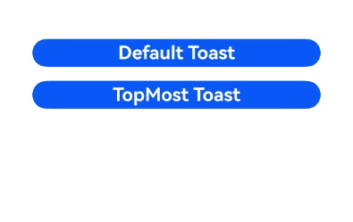
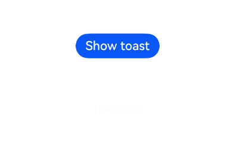

# Toast Feedback  

Toast is a temporary message prompt used to provide brief operational feedback or status information to users. It typically pops up briefly at the bottom or top of the screen and automatically disappears after a short duration. The primary purpose of Toast is to deliver concise, non-intrusive feedback without interrupting the user's current workflow.

You can use the [getPromptAction](../reference/arkui-cj/cj-apis-uicontext-uicontext.md#func-getpromptaction) method in [UIContext](../reference/arkui-cj/cj-apis-uicontext-uicontext.md) to obtain the [PromptAction](../reference/arkui-cj/cj-apis-uicontext-promptaction.md) object associated with the current UI context, then call [showToast](../reference/arkui-cj/cj-apis-uicontext-promptaction.md#func-showtoastshowtoastoptions) on this object to create and display a text toast.

> **Note:**
>
> For security reasons, for example, to prevent Toast from maliciously blocking other pages, Toast can only be displayed in the current UI instance. After the application exits, it will not be displayed separately on the desktop.

## Usage Guidelines  

- **Use Toast judiciously rather than excessively notifying users.**  

  Toast is suitable for common scenarios such as:  
  - Providing immediate feedback after a user action (e.g., success or failure notifications).  
  - Informing users about application state changes.  

- **Keep text concise.** Since Toast has limited display time, avoid lengthy messages.  

  Toast text should be clear and readable, with font size and color consistent with the application's theme. Additionally, Toast should not contain interactive elements such as buttons or links.  

- **Avoid forced placement and frequent pop-ups.**  

  As a lightweight in-app notification, Toast should not obstruct other UI elements (e.g., overlapping pop-up content) to prevent user confusion. Avoid:  
  - Frequent consecutive pop-ups without intervals.  
  - Replacing one Toast with another in quick succession.  
  - Displaying Toast for more than 3 seconds to avoid disrupting user actions.  

- **Adhere to the system's default positioning.**  

  By default, Toast appears at the bottom of the screen with a safe margin. As a system-wide in-app prompt, follow the default behavior to prevent overlap with other pop-up components. Adjust layout only in exceptional cases.  

- **Maximum font scaling limit for the toast.**

  For instant feedback, the maximum font scaling is 2.

## Toast Display Modes  

Toast supports two display modes:  
- **Default**: Displays within the application.  
- **TopMost**: Displays above the application.  

Before showing a **TopMost** Toast, a full-screen sub-window (matching the main window size on the device) is created. The Toast's layout position is calculated and displayed within this sub-window. Key differences between the modes are:  

| Difference          | Default                                                                 | TopMost                                                                 |
|---------------------|-------------------------------------------------------------------------|--------------------------------------------------------------------------|
| Sub-window Creation | No                                                                     | Yes                                                                     |
| Hierarchy           | Displays within the main window (same hierarchy, usually lower).       | Displays in a sub-window (higher than the main window and other pop-ups but lower than soft keyboards or permission dialogs). |
| Soft Keyboard Avoidance | Always shifts up by the keyboard height when raised.               | Shifts only if obscured, maintaining an 80.vp gap between Toast and keyboard. |

<!--run-->

```cangjie  
package ohos_app_cangjie_entry  

import kit.ArkUI.*  
import ohos.arkui.ui_context.*  
import ohos.arkui.state_macro_manage.*  

@Entry  
@Component  
class EntryView{  
    func build(){  
        Row(){  
            Blank().height(20.percent)  
            Button(){  
                Text("Default Toast")  
                .fontSize(20)  
                .fontWeight(FontWeight.Bold)  

            }.onClick({  
                evt =>  
                getUIContext().getPromptAction().showToast(  
                        ShowToastOptions(message: "OK, I'm a Default Toast", duration: 2000,  
                        bottom: 80.vp, showMode: ToastShowMode.Default))  
            }).align(Alignment.Center)  

            Button(){  
                Text("TopMost Toast")  
                .fontSize(20)  
                .fontWeight(FontWeight.Bold)  
            }.onClick({  
                evt =>  
                getUIContext().getPromptAction().showToast(  
                        ShowToastOptions(message: "OK, I'm a TopMost Toast", duration: 2000,  
                        bottom: 85.vp, showMode: ToastShowMode.TopMost))  
            })  
        }  
    }  
}  
```  

  

## Creating a Toast  

Suitable for scenarios requiring brief, auto-dismissing prompts.  

<!--run-->  

```cangjie  
package ohos_app_cangjie_entry  

import kit.ArkUI.*  
import ohos.arkui.ui_context.*  
import ohos.arkui.state_macro_manage.*  

@Entry  
@Component  
class EntryView{  

    func build(){  
        Column(){  
            Button("Show toast").fontSize(20)  
            .onClick({  
                    evt=>  
                    getUIContext().getPromptAction().showToast(message: "Hello World")  
            })  
        }.size(width: 100.percent,height: 100.percent).justifyContent(FlexAlign.Center)  
    }  
}  
```  

