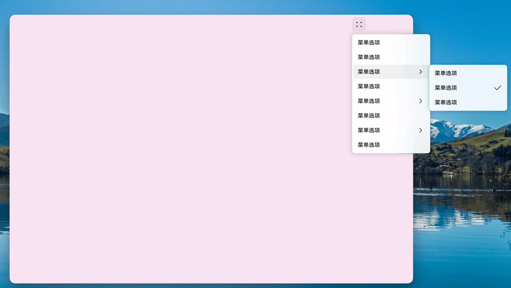

# Popup Overview  

<!--Del-->
> **Note:**
>
> Currently in the beta phase.
<!--DelEnd-->

A popup generally refers to a UI interface that automatically appears when an application is opened or is triggered by user actions. It is used to briefly display information requiring user attention or actions to be processed.  

## Types of Popups  

Based on user interaction scenarios, popups can be categorized into **modal popups** and **non-modal popups**, distinguished by whether the user must respond to them.  

- **Modal Popup:** A strong interaction form that interrupts the user's current workflow, requiring a response before proceeding with other operations. Typically used for scenarios where critical information must be conveyed to the user.  

- **Non-modal Popup:** A weak interaction form that does not affect the user's current operations. Users may choose not to respond, and such popups usually have a time limit, disappearing automatically after a period. Generally used for scenarios where users need to perform functional operations in addition to being informed.  

> **Note:**  
>  
> Currently, modal popups can be converted to non-modal by setting specific properties. For example, for `AlertDialog`, setting [`isModal`](../reference/arkui-cj/cj-dialog-customdialog.md#var-ismodal) to `false` makes it non-modal. For other popups, refer to the API documentation.  

## Usage Scenarios  

Developers can choose the appropriate popup for page development based on actual application scenarios.  

| Popup Name | Application Scenario |  
| :--- | :--- |  
| [Dialog](cj-dialog-base-overview.md) | When displaying information or actions that users currently need or must focus on (e.g., confirming app exit), this popup should be prioritized. |  
| [Menu](cj-popup-and-menu-components-menu.md) | When binding executable operations to a specified component (e.g., long-pressing an icon to display options), this popup should be prioritized. |  
| [Popup](cj-popup-and-menu-components-popup.md) | When providing hints for a specified component (e.g., clicking a question mark icon to display help text), this popup should be prioritized. |  
| [bindContentCover / bindSheet](cj-modal-overview.md) | When a new interface needs to overlay the old one without the old interface disappearing (e.g., clicking a thumbnail to view a larger image), this popup should be prioritized. |  
| [Toast](cj-create-toast.md) | When providing brief feedback on the user's current operation in a small window (e.g., notifying successful file saving), this popup should be prioritized. |  

## Specifications and Constraints  

- When multiple popup components appear sequentially, the later one has a higher layer than the earlier one. Upon exiting, they close in order from highest to lowest layer. Layer adjustment is not supported.  
- On mobile devices, sub-window mode popups cannot extend beyond the main window. On 2-in-1 devices, when using modal popups, scenarios may require display beyond the main window. Developers can achieve this by setting `showInSubWindow` to `true`, as shown below:  

  