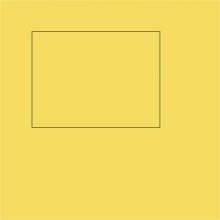
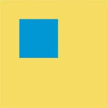
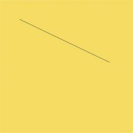
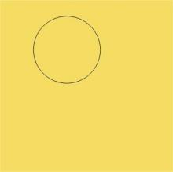
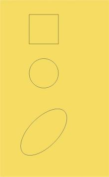
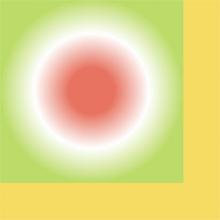
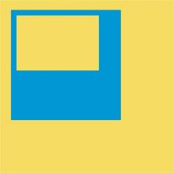
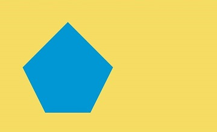

# Drawing Custom Graphics with Canvas

<!--Del-->
> **Note:**
>
> Currently in the beta phase.
<!--DelEnd-->

Canvas provides a canvas component for custom graphics rendering. Developers can use the `CanvasRenderingContext2D` and `OffscreenCanvasRenderingContext2D` objects to draw on the Canvas component, supporting basic shapes, text, images, and more.

## Drawing Custom Graphics with Canvas Component

- Use the [`CanvasRenderingContext2D`](../reference/arkui-cj/cj-canvas-drawing-canvasrenderingcontext2d.md) object to draw on the Canvas.

    <!-- run -->

  ```cangjie
  package ohos_app_cangjie_entry

  import kit.ArkUI.*
  import ohos.arkui.state_macro_manage.*

  @Entry
  @Component
  class EntryView {
      // Configuration parameters for CanvasRenderingContext2D, including antialiasing (true enables antialiasing).
      var settings: RenderingContextSettings = RenderingContextSettings(antialias: true)
      // Creates a CanvasRenderingContext2D object for drawing via the canvas.
      var context: CanvasRenderingContext2D = CanvasRenderingContext2D(this.settings)
      func build() {
          Flex(direction: FlexDirection.Column, alignItems: ItemAlign.Center, justifyContent: FlexAlign.Center) {
              // Invokes CanvasRenderingContext2D within the canvas.
              Canvas(this.context)
                  .width(100.percent)
                  .height(100.percent)
                  .backgroundColor(0XF5DC62)
                  .onReady(
                      {
                          =>
                          // Drawing operations can be performed here.
                          this.context.lineWidth = 0.6
                          this.context.strokeRect(50.0, 50.0, 200.0, 150.0);
                      }
                  )
          }.width(100.percent).height(100.percent)
      }
  }
  ```

  

## Initializing the Canvas Component

`onReady(() -> Unit)` is the event callback triggered when the Canvas component initializes or resizes. After this event, the Canvas component's definitive width and height can be obtained, enabling further use of `CanvasRenderingContext2D` and `OffscreenCanvasRenderingContext2D` objects to call relevant APIs for graphics rendering.

 <!-- run -->

```cangjie
package ohos_app_cangjie_entry

import kit.ArkUI.*
import ohos.arkui.state_macro_manage.*

@Entry
@Component
class EntryView {
    // Configuration parameters for CanvasRenderingContext2D, including antialiasing (true enables antialiasing).
    var settings: RenderingContextSettings = RenderingContextSettings(antialias: true)
    // Creates a CanvasRenderingContext2D object for drawing via the canvas.
    var context: CanvasRenderingContext2D = CanvasRenderingContext2D(this.settings)
    func build() {
        Canvas(this.context)
        .width(100.percent)
        .height(100.percent)
        .backgroundColor(0XF5DC62)
        .onReady({
            =>
            this.context.fillStyle = 0X0097D4
            this.context.fillRect(50.0, 50.0, 100.0, 100.0)
        })
    }
}
```



## Canvas Component Drawing Methods

After invoking the Canvas component's lifecycle interface `onReady()`, developers can directly use the Canvas component for drawing. Alternatively, they can define a `Path2D` object separately to construct an ideal path and then use the Canvas component for rendering after `onReady()` is called.

- Directly call relevant APIs via `CanvasRenderingContext2D` and `OffscreenCanvasRenderingContext2D` objects for drawing.

     <!-- run -->

  ```cangjie
  package ohos_app_cangjie_entry

  import kit.ArkUI.*
  import ohos.arkui.state_macro_manage.*

  @Entry
  @Component
  class EntryView {
      private let settings: RenderingContextSettings = RenderingContextSettings(antialias: true)
      private let context: CanvasRenderingContext2D = CanvasRenderingContext2D(this.settings)

      func build() {
          Flex(direction: FlexDirection.Column, alignItems: ItemAlign.Center, justifyContent: FlexAlign.Center) {
              Canvas(this.context)
                  .width(100.percent)
                  .height(100.percent)
                  .backgroundColor(0XF5DC62)
                  .onReady(
                      {
                          =>
                          this.context.beginPath()
                          this.context.moveTo(50.0, 50.0)
                          this.context.lineTo(280.0, 160.0)
                          this.context.stroke()
                      }
                  )
          }.width(100.percent).height(100.percent)
      }
  }
  ```

  

- First, define a `Path2D` object separately to construct the desired path, then use the `stroke` or `fill` methods of `CanvasRenderingContext2D` and `OffscreenCanvasRenderingContext2D` for drawing. For details, refer to [`Path2D`](../reference/arkui-cj/cj-canvas-drawing-path2d.md#class-path2d).

     <!-- run -->

  ```cangjie
  package ohos_app_cangjie_entry

  import kit.ArkUI.*
  import ohos.arkui.state_macro_manage.*

  @Entry
  @Component
  class EntryView {
      private let settings: RenderingContextSettings = RenderingContextSettings(antialias: true)
      private let context: CanvasRenderingContext2D = CanvasRenderingContext2D(this.settings)

      var region: Path2D = Path2D()
      func build() {
          Flex(direction: FlexDirection.Column, alignItems: ItemAlign.Center, justifyContent: FlexAlign.Center) {
              Canvas(this.context)
                  .width(100.percent)
                  .height(100.percent)
                  .backgroundColor(0XF5DC62)
                  .onReady(
                      {
                          =>
                          this.region.arc(100.0, 75.0, 50.0, 0.0, 6.28)
                          this.context.stroke(this.region)
                      }
                  )
          }.width(100.percent).height(100.percent)
      }
  }
  ```

  

## Common Methods of Canvas Component

The `OffscreenCanvasRenderingContext2D` and `CanvasRenderingContext2D` objects provide numerous properties and methods for drawing text, graphics, and pixel manipulation, serving as the core of the Canvas component. Common interfaces include [`fill`](../reference/arkui-cj/cj-canvas-drawing-canvasrenderingcontext2d.md#func-fillcanvasfillrule) (fills closed paths), [`clip`](../reference/arkui-cj/cj-canvas-drawing-canvasrenderingcontext2d.md#func-clipcanvasfillrule) (sets the current path as a clipping path), [`stroke`](../reference/arkui-cj/cj-canvas-drawing-canvasrenderingcontext2d.md#func-stroke) (performs stroke operations), etc. Additionally, properties like [`fillStyle`](../reference/arkui-cj/cj-canvas-drawing-canvasrenderingcontext2d.md#prop-fillstyle) (specifies fill color), [`globalAlpha`](../reference/arkui-cj/cj-canvas-drawing-canvasrenderingcontext2d.md#prop-globalalpha) (sets transparency), and [`strokeStyle`](../reference/arkui-cj/cj-canvas-drawing-canvasrenderingcontext2d.md#prop-strokestyle) (sets stroke color) modify rendering styles. Below are some common use cases:

- Basic Shape Drawing.

  Use [`arc`](../reference/arkui-cj/cj-canvas-drawing-canvasrenderingcontext2d.md#func-arcfloat64-float64-float64-float64-float64-bool) (draws arcs), [`ellipse`](../reference/arkui-cj/cj-canvas-drawing-canvasrenderingcontext2d.md#func-ellipsefloat64-float64-float64-float64-float64-float64-float64-bool) (draws ellipses), [`rect`](../reference/arkui-cj/cj-canvas-drawing-canvasrenderingcontext2d.md#func-rectfloat64-float64-float64-float64) (creates rectangular paths), etc., to draw basic shapes.

     <!-- run -->

  ```cangjie
  package ohos_app_cangjie_entry

  import kit.ArkUI.*
  import ohos.arkui.state_macro_manage.*
  import std.math.MathExtension

  @Entry
  @Component
  class EntryView {
  private let settings: RenderingContextSettings = RenderingContextSettings(antialias: true)
  private let context: CanvasRenderingContext2D = CanvasRenderingContext2D(this.settings)

  func build() {
      Flex(direction: FlexDirection.Column, alignItems: ItemAlign.Center, justifyContent: FlexAlign.Center) {
              Canvas(this.context)
              .width(100.percent)
              .height(100.percent)
              .backgroundColor(0XF5DC62)
              .onReady({
                  =>
                      // Draws a rectangle
                      this.context.beginPath()
                      this.context.rect(100.0, 50.0, 100.0, 100.0)
                      this.context.stroke()
                      // Draws a circle
                      this.context.beginPath()
                      this.context.arc(150.0, 250.0, 50.0, 0.0, 6.28)
                      this.context.stroke()
                      // Draws an ellipse
                      this.context.beginPath()
                      this.context.ellipse(150.0, 450.0, 50.0, 100.0, Float64.GetPI() * 0.25, Float64.GetPI() * 0.0, Float64.GetPI() * 2.0)
                      this.context.stroke()
              })
      }.width(100.percent).height(100.percent)
  }
  }
  ```

  

- Text Drawing.

  Use [`fillText`](../reference/arkui-cj/cj-canvas-drawing-canvasrenderingcontext2d.md#func-filltextstring-float64-float64-optionfloat64) (fills text) and [`strokeText`](../reference/arkui-cj/cj-canvas-drawing-canvasrenderingcontext2d.md#func-stroketextstring-float64-float64-optionfloat64) (strokes text) for text rendering. The example sets the font to a bold 50-pixel "sans-serif" and fills "Hello World!" at (50, 100). It then sets `strokeStyle` to red, `lineWidth` to 0.7, and the same font to stroke "Hello World!" at (50, 120).

     <!-- run -->

  ```cangjie
  package ohos_app_cangjie_entry

  import kit.ArkUI.*
  import ohos.arkui.state_macro_manage.*

  @Entry
  @Component
  class EntryView {
      private let settings: RenderingContextSettings = RenderingContextSettings(antialias: true)
      private let context: CanvasRenderingContext2D = CanvasRenderingContext2D(this.settings)

      func build() {
          Flex(direction: FlexDirection.Column, alignItems: ItemAlign.Center, justifyContent: FlexAlign.Center) {
              Canvas(this.context)
                  .width(100.percent)
                  .height(100.percent)
                  .backgroundColor(0XF5DC62)
                  .onReady({
                      =>
                      // Text fill
                      this.context.font = "FontStyle.Normal bolder 50.px sans-serif"
                      this.context.fillText("Hello World!", 50.0, 100.0)
                      // Text stroke
                      this.context.strokeStyle = 0Xff0000
                      this.context.lineWidth = 0.7
                      this.context.font = "FontStyle.Normal bolder 50.px sans-serif"
                      this.context.strokeText("Hello World!", 50.0, 120.0)
                      }
                  )
          }.width(100.percent).height(100.percent)
      }
  }
  ```

  

- Other Methods.

  Canvas also provides other methods. Gradient-related methods include [`createLinearGradient`](../reference/arkui-cj/cj-canvas-drawing-canvasrenderingcontext2d.md#func-createlineargradientfloat64-float64-float64-float64) (creates a linear gradient) and [`createRadialGradient`](../reference/arkui-cj/cj-canvas-drawing-canvasrenderingcontext2d.md#func-createradialgradientfloat64-float64-float64-float64-float64-float64) (creates a radial gradient).

     <!-- run -->

  ```cangjie
  package ohos_app_cangjie_entry

  import kit.ArkUI.*
  import ohos.arkui.state_macro_manage.*
  
  @Entry
  @Component
  class EntryView {
      private let settings: RenderingContextSettings = RenderingContextSettings(antialias: true)
      private let context: CanvasRenderingContext2D = CanvasRenderingContext2D(this.settings)

      func build() {
            Canvas(this.context)
                .width(100.percent)
                .height(100.percent)
                .backgroundColor(0XF5DC62)
                .onReady(
                    {
                        =>
                        // Creates a radial gradient CanvasGradient object
                        let grad = this.context.createRadialGradient(200.0, 200.0, 50.0, 200.0, 200.0, 200.0)
                        // Sets gradient stops (offset and color)
                        grad.addColorStop(0.0, 0XE87361)
                        grad.addColorStop(0.5, 0XFFFFF0)
                        grad.addColorStop(1.0, 0XBDDB69)
                        // Fills a rectangle with the gradient
                        this.context.fillStyle = grad
                        this.context.fillRect(0.0, 0.0, 400.0, 400.0)
                    }
                )
        }
  }
  ```

  

## Usage Examples

- Regular Basic Shape Drawing.

     <!-- run -->

  ```cangjie
  package ohos_app_cangjie_entry

  import kit.ArkUI.*
  import ohos.arkui.state_macro_manage.*

  @Entry
  @Component
  class EntryView {
      private let settings: RenderingContextSettings = RenderingContextSettings(antialias: true)
      private let context: CanvasRenderingContext2D = CanvasRenderingContext2D(this.settings)

      func build() {
          Flex(direction: FlexDirection.Column, alignItems: ItemAlign.Center, justifyContent: FlexAlign.Center) {
              Canvas(this.context)
                  .width(100.percent)
                  .height(100.percent)
                  .backgroundColor(0XF5DC62)
                  .onReady(
                      {
                      =>
                          // Sets fill style to blue
                          this.context.fillStyle = 0X0097D4
                          // Draws a 200x200 rectangle with top-left corner at (50, 50)
                          this.context.fillRect(50.0, 50.0, 200.0, 200.0)
                          // Clears a 150x100 area with top-left corner at (70, 70)
                          this.context.clearRect(70.0, 70.0, 150.0, 100.0)
                      }
                  )
          }.width(100.percent).height(100.percent)
      }
  }
  ```

  

- Irregular Shape Drawing.

     <!-- run -->

  ```cangjie
  package ohos_app_cangjie_entry

  import kit.ArkUI.*
  import ohos.arkui.state_macro_manage.*

  @Entry
  @Component
  class EntryView {
      private let settings: RenderingContextSettings = RenderingContextSettings(antialias: true)
      private let context: CanvasRenderingContext2D = CanvasRenderingContext2D(this.settings)

      // Constructs a pentagon using Path2D methods
      var path: Path2D = Path2D()
      func build() {
          Flex(direction: FlexDirection.Column, alignItems: ItemAlign.Center, justifyContent: FlexAlign.Center) {
              Canvas(this.context)
                  .width(100.percent)
                  .height(100.percent)
                  .backgroundColor(0XF5DC62)
                  .onReady(
                      {
                      =>
                      path.moveTo(150.0, 50.0)
                      path.lineTo(50.0, 150.0)
                      path.lineTo(100.0, 250.0)
                      path.lineTo(200.0, 250.0)
                      path.lineTo(250.0, 150.0)
                      path.closePath()
                      // Sets fill color to blue
                      this.context.fillStyle = 0X0097D4
                      // Fills the pentagon described by Path2D within the canvas
                      this.context.fill(path)
                      }
                  )
          }.width(100.percent).height(100.percent)
      }
  }
  ```

  