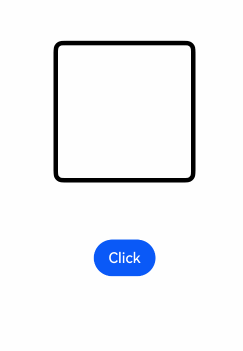

# Appearance/Disappearance Transition

[transition](../../../en/application-dev/reference/arkui-cj/cj-animation-transition.md#func-transition) is a fundamental component transition interface used to implement animation effects when a component appears or disappears. By combining [TransitionEffect objects](../../../en/application-dev/reference/arkui-cj/cj-animation-transition.md#class-transitioneffect), various effects can be defined.

**Table 1** Transition Effect Interfaces

| Transition Effect | Description | Animation |
|:-------- |:-------- |:-------- |
| IDENTITY | Disables transition effects. | None. |
| OPACITY | Default transition effect, opacity transition. | On appearance: opacity changes from 0 to 1; on disappearance: opacity changes from 1 to 0. |
| SLIDE | Slide transition effect. | On appearance: slides in from the left side of the window; on disappearance: slides out to the right side of the window. |
| translate | Creates a transition effect by setting component translation. | On appearance: from the value set by the translate interface to the default value 0; on disappearance: from the default value 0 to the value set by the translate interface. |
| rotate | Creates a transition effect by setting component rotation. | On appearance: from the value set by the rotate interface to the default value 0; on disappearance: from the default value 0 to the value set by the rotate interface. |
| opacity | Creates a transition effect by setting opacity parameters. | On appearance: from the value set by opacity to the default opacity 1; on disappearance: from the default opacity 1 to the value set by opacity. |
| move | Creates an effect of appearing from or disappearing to a window edge via [TransitionEdge](../../../en/application-dev/reference/arkui-cj/cj-animation-transition.md#enum-transitionedge). | On appearance: slides in from the TransitionEdge direction; on disappearance: slides out to the TransitionEdge direction. |
| asymmetric | Combines asymmetric appearance and disappearance transition effects using this method.<br/>- appear: appearance transition effect.<br/>- disappear: disappearance transition effect. | On appearance: uses the TransitionEffect set by appear; on disappearance: uses the TransitionEffect set by disappear. |
| combine | Combines other TransitionEffects. | Combines other TransitionEffects to take effect together. |
| animation | Defines animation parameters for transition effects:<br/>- If not defined, follows the animation parameters of animateTo.<br/>- Does not support configuring animation parameters via the component's animation interface.<br/>- The onFinish of animation in TransitionEffect does not take effect. | Execution order is top-down; the animation of the above TransitionEffect also applies to the below TransitionEffect. |

## Example

1. Create a TransitionEffect.

    ```cangjie
    // On appearance, all transition effects' appearance effects will be superimposed; on disappearance, all disappearance transition effects will be superimposed
    // Used to illustrate the animation parameters each effect follows
    private var effect: TransitionEffect =
    TransitionEffect.OPACITY // Creates an opacity transition effect; since the animation interface is not called here, it will follow animateTo's animation parameters
    // Adds a scale transition effect via the combine method and specifies the curve
    .combine(TransitionEffect.scale(ScaleOptions(x: 0.0, y: 0.0)).animation(AnimateParam(curve: Curve.Smooth)))
    // Adds a rotation transition effect; the animation parameters here will follow the above TransitionEffect, i.e., Curve.Smooth
    .combine(TransitionEffect.rotate(RotateOptions(
                    90.0,
                    x: 0.0,
                    y: 0.0,
                    z: 1.0,
                    centerX: 50.percent,
                    centerY: 50.percent,
                    centerZ: 0.vp,
                    perspective: 0.0
                    )))
    // Adds a translation transition effect; the animation parameters will follow the TransitionEffect above with animation, i.e., Curve.Smooth
    .combine(TransitionEffect.translate(TranslateOptions(y: 150)).animation(AnimateParam(curve: Curve.Smooth)))
    // Adds a move transition effect and specifies the curve
    .combine(TransitionEffect.move(TransitionEdge.End).animation(AnimateParam(curve: Curve.Linear)))
    // Adds an asymmetric transition effect; since animation is not set here, it will follow the animation effect of the above TransitionEffect, i.e., Curve.Linear
    .combine(TransitionEffect.asymmetric(TransitionEffect.scale(ScaleOptions(x: 0.0,y: 0.0)),
            TransitionEffect.rotate(RotateOptions(
                    90.0,
                    x: 0.0,
                    y: 0.0,
                    z: 1.0,
                    centerX: 50.percent,
                    centerY: 50.percent,
                    centerZ: 0.vp,
                    perspective: 0.0
                    ))))
    ```

2. Apply the transition effect to the component via the [transition](../../../en/application-dev/reference/arkui-cj/cj-animation-transition.md#func-transition) interface.

    ```cangjie
    Text("test")
    .transition(this.effect)
    ```

3. Trigger the transition by adding or removing components.

    ```cangjie
    @State var isPresent: Bool = false
    //...
    if (this.isPresent) {
        Text("test")
        .transition(this.effect)
    }
    //...

    // Control adding or removing components
    // Method 1: Place the control variable within the animateTo closure; TransitionEffects without animation parameters defined will follow animateTo's animation parameters
    getUIContext().animateTo(AnimateParam(curve: Curve.Smooth), { =>
            this.isPresent = false})

    // Method 2: Directly control adding or removing components; animation parameters are configured via the TransitionEffect's animation interface
    this.isPresent = false
    ```

The complete example code and effect are as follows. The example uses the direct method of adding or removing components to trigger the transition, which can also be replaced by changing the control variable within the animateTo closure to trigger the transition.

 <!-- run -->

```cangjie
package ohos_app_cangjie_entry
import kit.ArkUI.*
import ohos.arkui.state_macro_manage.*

@Entry
@Component
class EntryView {
    @State var isPresent: Bool = false
    private var effect: TransitionEffect =
    TransitionEffect.OPACITY.animation(AnimateParam(curve: Curve.ExtremeDeceleration))
    .combine(TransitionEffect.rotate(RotateOptions(
        90.0,
        x: 0.0,
        y: 0.0,
        z: 1.0,
        centerX: 50.percent,
        centerY: 50.percent,
        centerZ: 0.vp,
        perspective: 0.0
        )))

    func build() {
        Stack {
            if (this.isPresent) {
                Column {
                    Text("ArkUI")
                    .fontWeight(FontWeight.Bold)
                    .fontSize(20.vp)
                    .fontColor(Color.White)
                }
                .justifyContent(FlexAlign.Center)
                .width(150.vp)
                .height(150.vp)
                .borderRadius(10.vp)
                .backgroundColor(0xf56c6c)
                .transition(this.effect)
            }

            Column {}
            .width(155.vp)
            .height(155.vp)
            .border(width: 5.vp, color: Color.Black, radius: 10)

            Button("Click")
            .margin(top: 320.vp)
            .onClick{evt =>
                    this.isPresent = !this.isPresent
                }
        }
        .width(100.percent)
        .height(60.percent)
    }
}
```



When adding transition effects to multiple components, you can achieve a staggered appearance/disappearance effect by configuring different delay values in the animation parameters:

 <!-- run -->

```cangjie
package ohos_app_cangjie_entry

import kit.ArkUI.*
import ohos.arkui.ui_context.*
import ohos.arkui.state_macro_manage.*

const ITEM_COUNTS: Int64 = 9
const ITEM_COLOR: Int64 = 0xED6F21
const INTERVAL: Int32 = 30
const DURATION: Int32 = 300

@Entry
@Component
class EntryView {
    @State
    var isGridShow: Bool = false
    private var dataArray: Array<Int64> = Array<Int64>(ITEM_COUNTS, {i => i + 1})

    func build() {
        Stack {
            if (this.isGridShow) {
                Grid {
                    ForEach(
                        this.dataArray,
                        itemGeneratorFunc: {
                            item: Int64, index: Int64 => GridItem {
                                Stack {
                                    Text((item).toString())
                                }
                                    .size(width: 50.vp, height: 50.vp)
                                    .backgroundColor(ITEM_COLOR)
                                    .transition(
                                        TransitionEffect
                                            .OPACITY
                                            .combine(TransitionEffect.scale(ScaleOptions(x: 0.0, y: 0.0)))
                                            .animation(
                                                AnimateParam(duration: DURATION, curve: Curve.Friction,
                                                    delay: INTERVAL * Int32(index))))
                                    .borderRadius(10.vp)
                            }.transition(TransitionEffect.opacity(0.99))
                        },
                        keyGeneratorFunc: {item: Int64, index: Int64 => item.toString()}
                    )
                }
                    .columnsTemplate('1fr 1fr 1fr')
                    .rowsGap(15.vp)
                    .columnsGap(15.vp)
                    .size(width: 180.vp, height: 180.vp)
                    .transition(TransitionEffect.opacity(0.99))
            }
        }
            .size(width: 100.percent, height: 100.percent)
            .onClick(
                {
                    evt => getUIContext().animateTo(
                        AnimateParam(duration: DURATION,
                        delay: INTERVAL * (Int32(ITEM_COUNTS) - 1), curve: Curve.Friction),
                        {
                            => this.isGridShow = !this.isGridShow
                        }
                    )
                })
    }
}
```

