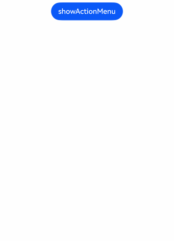
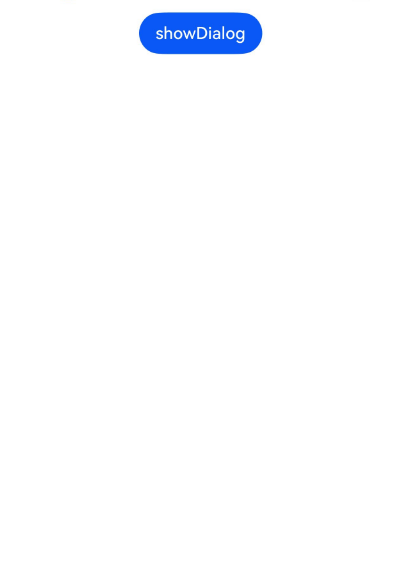
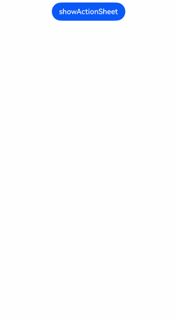
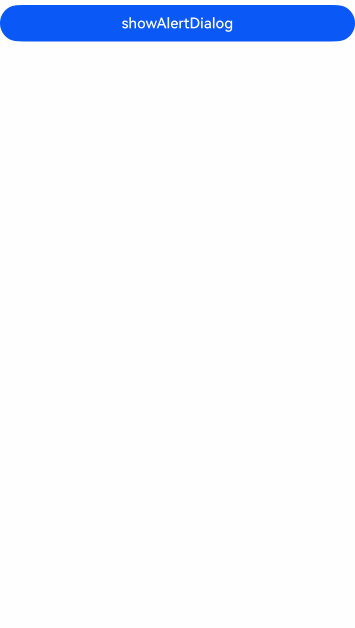

# Fixed-Style Popup Dialogs

Fixed-style popup dialogs adopt a consistent layout format, allowing developers to focus on inputting the required text content without concerning themselves with display layout details. This simplifies the usage process and enhances convenience.

## Usage Constraints

- Action menus (`showActionMenu`) and dialog boxes (`showDialog`) must first obtain a [UIContext](../reference/arkui-cj/cj-apis-uicontext-uicontext.md#class-uicontext) object using the [getPromptAction](../reference/arkui-cj/cj-apis-uicontext-uicontext.md#func-getPromptAction) method before invoking corresponding methods through this object.

- Action menus (`showActionMenu`), dialog boxes (`showDialog`), list selection popups (`ActionSheet`), and alert dialogs (`AlertDialog`) can be configured with `isModal` set to `false` to become non-modal popups.

## Action Menu (`showActionMenu`)

The action menu obtains a `PromptAction` object through the [getPromptAction](../reference/arkui-cj/cj-apis-uicontext-uicontext.md#func-getPromptAction) method and supports usage in callbacks or developer-defined classes.

After creating and displaying an action menu, the menu's response result asynchronously returns the index of the selected button in the `buttons` array.

 <!-- run -->

```cangjie
package ohos_app_cangjie_entry

import ohos.base.*
import ohos.arkui.component.*
import ohos.arkui.state_management.*
import ohos.arkui.state_macro_manage.*
import std.collection.*
import ohos.arkui.ui_context.*
import ohos.business_exception.BusinessException
import kit.PerformanceAnalysisKit.*

@Entry
@Component
class EntryView {
    @State var index1: Int32 = 0
    func build() {
         Column {
            Button("showActionMenu").onClick(
                {
                    evt =>
                    let buttons: Array<ButtonInfo> = [ButtonInfo(text: "item1", color: Color.Gray), ButtonInfo(text: "item2", color: Color.Black)]
                    getUIContext().getPromptAction().showActionMenu(ActionMenuOptions(title: "showActionMenu Title Info", buttons: buttons),
                        callback: {
                            err: Option<BusinessException>, i: Option<Int32> => try {
                                match (err) {
                                    case Some(e) => Hilog.info(0, "cangjie", "error: errcode is ${e.code}")
                                    case _ => index1 = i.getOrThrow()
                                }
                            } catch (e: Exception) {
                                Hilog.info(0, "cangjie", e.toString())
                            }
                        })
                }
            )
        }.width(100.percent).padding(top: 5)
    }
}
```



## Dialog Box (`showDialog`)

The dialog box obtains a `PromptAction` object through the [getPromptAction](../reference/arkui-cj/cj-apis-uicontext-uicontext.md#func-getPromptAction) method and supports usage in callbacks or developer-defined classes.

 <!-- run -->

```cangjie
package ohos_app_cangjie_entry

import ohos.base.*
import ohos.arkui.component.*
import ohos.arkui.state_management.*
import ohos.arkui.state_macro_manage.*
import std.collection.*
import ohos.arkui.ui_context.*
import ohos.business_exception.BusinessException
import kit.PerformanceAnalysisKit.*

@Entry
@Component
class EntryView {
    @State var index1: Int32 = 0
    func build() {
         Column {
            Button("showDialog").onClick(
                {
                    evt =>
                    getUIContext().getPromptAction().showDialog(
                        ShowDialogOptions(
                            title: "showDialog Title Info",
                            message: "Message Info",
                            buttons: [
                                ButtonInfo(text: 'button1', color: Color(0X000000)),
                                ButtonInfo(text: 'button2', color: Color(0X000000))
                            ]
                        ),
                        callback: {
                            err: Option<BusinessException>, i: Option<Int32> => try {
                                match (err) {
                                    case Some(e) => Hilog.info(0, "cangjie", "error: errcode is ${e.code}")
                                    case _ => ()
                                }
                            } catch (e: Exception) {
                                Hilog.info(0, "cangjie", e.toString())
                            }
                        }
                    )
                }
            )
        }.width(100.percent).padding(top: 5)
    }
}
```



## List Selection Popup (`ActionSheet`)

List selector popups are suitable for presenting multiple action options, especially when only an action list needs to be displayed without other content.

The list selector popup is implemented through the [showActionSheet](../reference/arkui-cj/cj-apis-uicontext-uicontext.md#func-showActionSheetactionsheetoptions)interface in [UIContext](../reference/arkui-cj/cj-apis-uicontext-uicontext.md#class-uicontext).

This example defines the popup's style and animation effects by configuring interfaces such as `width`, `height`, and `transition`.

 <!-- run -->

```cangjie
package ohos_app_cangjie_entry

import ohos.base.*
import ohos.arkui.component.*
import ohos.arkui.ui_context.*
import ohos.arkui.state_management.*
import ohos.arkui.state_macro_manage.*
import kit.PerformanceAnalysisKit.*

@Entry
@Component
class EntryView {
    func build() {
        Column() {
            Button('showActionSheet').onClick({ e =>
                let confirm: ActionSheetButtonOptions = ActionSheetButtonOptions(value: "Confirm button", action: {=> Hilog.info(0, "cangjie", "Get Alert Dialog handled")},
                    defaultFocus: true, style: DialogButtonStyle.Default)
                let sheets: Array<SheetInfo> = [
                    SheetInfo(title: "apple", action: {=> Hilog.info(0, "cangjie", "apple")}),
                    SheetInfo(title: "banana", action: {=> Hilog.info(0, "cangjie", "banana")}),
                    SheetInfo(title: "pears", action: {=> Hilog.info(0, "cangjie", "pears")})]
                getUIContext().showActionSheet(
                    ActionSheetOptions(
                        title: 'ActionSheet title',
                        message: 'message',
                        sheets: sheets,
                        autoCancel: false,
                        confirm: confirm,
                        width: 300,
                        height: 300,
                        cornerRadius: BorderRadiuses(topLeft: 20.vp, topRight: 20.vp, bottomLeft: 20.vp,
                            bottomRight: 20.vp),
                        borderWidth: 1.vp,
                        borderStyle: EdgeStyles(),
                        borderColor: Color.Blue,
                        backgroundColor: Color.White,
                        transition: TransitionEffect.asymmetric(
                            TransitionEffect
                                .OPACITY
                                .animation(AnimateParam(duration: 3000, curve: Curve.Sharp))
                                .combine(
                                    TransitionEffect
                                        .scale(ScaleOptions(x: 1.5, y: 1.5))
                                        .animation(AnimateParam(duration: 3000, curve: Curve.Sharp))),
                            TransitionEffect
                                .OPACITY
                                .animation(AnimateParam(duration: 100, curve: Curve.Smooth))
                                .combine(
                                    TransitionEffect
                                        .scale(ScaleOptions(x: 0.5, y: 0.5))
                                        .animation(AnimateParam(duration: 100, curve: Curve.Smooth)))
                        ),
                        alignment: DialogAlignment.Center,
                    )
                )
            })
        }.width(100.percent).margin(top: 5)
    }
}
```



## Alert Dialog (`AlertDialog`)

Alert dialogs can be used when you need to ask users questions or obtain their permission.

- Alert dialogs are used to convey important information but will interrupt the current task. Provide necessary information and useful actions.
- Avoid using alert dialogs solely to provide information. Users dislike being interrupted by information-rich but non-actionable alerts.

This example defines the style and animation effects of a multi-button dialog by configuring interfaces such as `width`, `height`, and `transition`.

 <!-- run -->

```cangjie
package ohos_app_cangjie_entry

import ohos.base.*
import ohos.arkui.component.*
import ohos.arkui.ui_context.*
import ohos.arkui.state_management.*
import ohos.arkui.state_macro_manage.*
import kit.PerformanceAnalysisKit.*

@Entry
@Component
class EntryView {
    func build() {
        Column() {
            Button('showAlertDialog')
                .onClick({
                    evt =>
                    let primaryButton = AlertDialogButtonOptions(
                        value: 'cancel',
                        action: {
                            => Hilog.info(0, "cangjie", 'Callback when the first button is clicked')
                        }
                    )
                    let secondaryButton = AlertDialogButtonOptions(
                        enabled: true,
                        defaultFocus: true,
                        style: DialogButtonStyle.Highlight,
                        value: 'ok',
                        action: {
                            => Hilog.info(0, "cangjie", 'Callback when the second button is clicked')
                        }
                    )
                    getUIContext().showAlertDialog(
                        AlertDialogParamWithButtons(
                            message: 'text',
                            title: 'title',
                            autoCancel: true,
                            alignment: DialogAlignment.Center,
                            offset: Offset(0.0, -20.0),
                            gridCount: 3,
                            transition: TransitionEffect.asymmetric(
                                TransitionEffect
                                    .OPACITY
                                    .animation(AnimateParam(duration: 3000, curve: Curve.Sharp))
                                    .combine(TransitionEffect.scale(ScaleOptions(x: 1.5, y: 1.5)))
                                    .animation(AnimateParam(duration: 3000, curve: Curve.Sharp)),
                                TransitionEffect
                                    .OPACITY
                                    .animation(AnimateParam(duration: 100, curve: Curve.Smooth))
                                    .combine(
                                        TransitionEffect
                                            .scale(ScaleOptions(x: 0.5, y: 0.5))
                                            .animation(AnimateParam(duration: 100, curve: Curve.Smooth)))
                            ),
                            primaryButton: primaryButton,
                            secondaryButton: secondaryButton
                        )
                    )
                }).width(100.percent).margin(top: 5)
        }
    }
}
```

