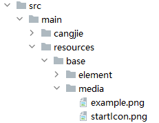
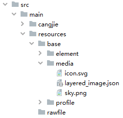
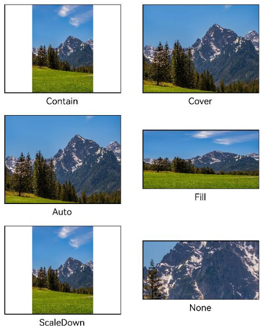
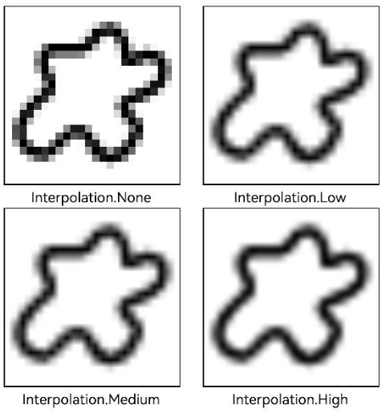
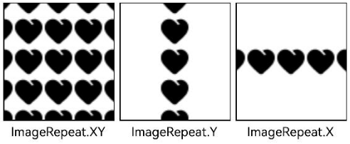
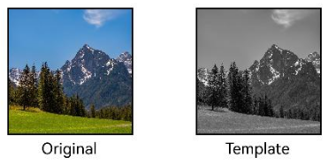
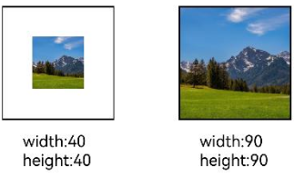
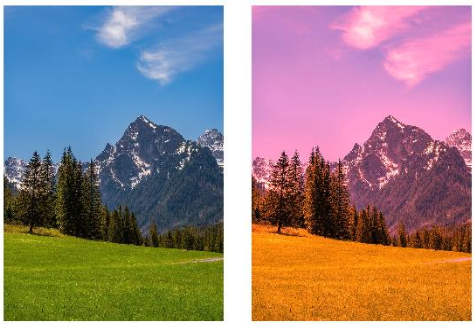
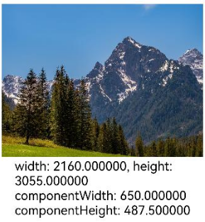

# Displaying Images (Image)

Developers often need to display images in applications, such as icons in buttons, network images, or local images. To display images in an application, the Image component must be used. The Image component supports multiple image formats, including PNG, JPG, BMP, SVG, GIF, and HEIF. For specific usage, refer to the [Image](../../../en/application-dev/reference/arkui-cj/cj-image-video-image.md) component.

The Image component is created by calling an interface, which is invoked as follows:

```cangjie
Image(src: String | AppResource | PixelMap | ImageContent)
```

This interface retrieves images from a data source and supports rendering and displaying both local and network images. Here, `src` is the data source of the image. For loading methods, refer to [Loading Image Resources](#loading-image-resources).

## Loading Image Resources

The Image component supports loading two types of resources: archived images and multimedia pixel maps.

### Archived Image Data Sources

Archived image data sources can be categorized into local resources, network resources, Resource resources, media library resources, and Base64.

- **Local Resources**

  Create a folder and place local images anywhere within the `cangjie` folder.

  The Image component can display images by referencing the local image path (the root directory is the `cangjie` folder).

  ```cangjie
  Image('file://media/images/view.jpg')
  .width(200)
  ```

- **Network Resources**

  Loading network images requires the `ohos.permission.INTERNET` permission. In this case, the `src` parameter of the Image component is the URL of the network image.

  Currently, the Image component only supports loading simple network images.

  When loading a network image for the first time, the Image component requests the network resource. For subsequent loads, the image is read directly from the cache by default.

  Network images must comply with the RFC 9113 standard; otherwise, loading will fail. If the downloaded network image exceeds 10MB or multiple network images are downloaded at once, it is recommended to use the [HTTP](../network/cj-http-request.md) tool for pre-downloading to improve image loading performance and facilitate data management on the application side.

  ```cangjie
  Image("https://www.example.com/example.jpg") // Replace with the actual URL in practice
  ```

- **Resource Resources**

  Using the resource format allows images to be imported across packages/modules. Images in the `resources` folder can be read and converted to the `AppResource` format via the `@r` resource interface. The directory structure of the `resources` folder is as follows:

  

  Invocation method:

  ```cangjie
  Image(@r(app.media.startIcon))
  ```

- **Media Library (`file://media/storage`)**

  Supports strings with the `file://` path prefix.

  The URL format obtained from the media library typically looks like this:

  ```cangjie
  Image('file://media/Photos/5')
  .width(200)
  ```

## Displaying Vector Graphics

The Image component can display vector graphics (SVG format images). For SVG tag documentation, refer to the [SVG Description](../../../en/application-dev/reference/ImageKit/cj-apis-image.md#svg标签说明).

SVG format images can use the `fillColor` property to change the drawing color.

```cangjie
Image(@r(app.media.cloud))
  .width(50)
  .fillColor(Color.Blue)
```

The original SVG image is shown below:


The SVG image after setting the drawing color:


### Referencing Bitmaps in Vector Graphics

If the SVG source loaded by the Image component contains references to local bitmaps, the SVG source path should be set to the project path with `cangjie` as the root directory. The local bitmap path should be set as a relative path at the same level as the SVG source.

The method for setting the SVG source path loaded by the Image component is as follows:

```cangjie
Image('resource://rawfile/icon.svg')
  .width(50)
  .height(50)
```

The SVG source specifies the local bitmap path via the `xmlns:xlink` attribute of the `<image>` tag. The local bitmap path is set as a relative path at the same level as the SVG source:

```cangjie
<svg width="200" height="200">
  <image width="200" height="200" xmlns:xlink="sky.svg">
</svg>
```

An example of the project file path is shown below:



## Adding Attributes

Setting attributes for the Image component allows for more flexible image display and custom effects. Below are examples of commonly used attributes. For a complete list of attributes, refer to [Image](../../../en/application-dev/reference/arkui-cj/cj-image-video-image.md).

### Setting Image Scaling Type

Use the `objectFit` property to scale the image within a fixed-width and fixed-height frame.

 <!-- run -->

```cangjie
package ohos_app_cangjie_entry
import kit.ArkUI.*
import ohos.arkui.state_macro_manage.*
import ohos.resource_manager.*

@Entry
@Component
class EntryView {
    let scroller: Scroller = Scroller()
    func build() {
        Scroll(this.scroller) {
            Column() {
                Row() {
                    Image(@r(app.media.example))
                        .width(160)
                        .height(120)
                        .border(width: 1)
                        // Maintain aspect ratio to scale down or up, ensuring the image is fully displayed within the boundaries.
                        .objectFit(ImageFit.Contain)
                        .margin(15)
                        .overlay(value: 'Contain', align: Alignment.Bottom, offset: OverlayOffset(x: 0.0, y: 20.0))
                    Image(@r(app.media.example))
                        .width(160)
                        .height(120)
                        .border(width: 1)
                        // Maintain aspect ratio to scale down or up, ensuring the image covers the boundaries.
                        .objectFit(ImageFit.Cover)
                        .margin(15)
                        .overlay(value: 'Cover', align: Alignment.Bottom, offset: OverlayOffset(x: 0.0, y: 20.0))
                }
                Row() {
                    Image(@r(app.media.example))
                        .width(160)
                        .height(120)
                        .border(width: 1)
                        // Adaptive display.
                        .objectFit(ImageFit.Auto)
                        .margin(15)
                        .overlay(value: 'Auto', align: Alignment.Bottom, offset: OverlayOffset(x: 0.0, y: 20.0))
                    Image(@r(app.media.example))
                        .width(160)
                        .height(80)
                        .border(width: 1)
                        // Scale without maintaining aspect ratio to fill the boundaries.
                        .objectFit(ImageFit.Fill)
                        .margin(15)
                        .overlay(value: 'Fill', align: Alignment.Bottom, offset: OverlayOffset(x: 0.0, y: 20.0))
                }
                Row() {
                    Image(@r(app.media.example))
                        .width(160)
                        .height(120)
                        .border(width: 1)
                        // Maintain aspect ratio to scale down or remain unchanged.
                        .objectFit(ImageFit.ScaleDown)
                        .margin(15)
                        .overlay(value: 'ScaleDown', align: Alignment.Bottom, offset: OverlayOffset(x: 0.0, y: 20.0))
                    Image(@r(app.media.example))
                        .width(160)
                        .height(80)
                        .border(width: 1)
                        // Display at original size.
                        .objectFit(ImageFit.None)
                        .margin(15)
                        .overlay(value: 'None', align: Alignment.Bottom, offset: OverlayOffset(x: 0.0, y: 20.0))
                }
            }
        }
    }
}
```



### Image Interpolation

When a low-resolution image is enlarged, it may appear blurry or jagged. The `interpolation` property can be used to interpolate the image for clearer display.

 <!-- run -->

```cangjie
package ohos_app_cangjie_entry

import kit.ArkUI.*
import ohos.arkui.state_macro_manage.*
import ohos.resource_manager.*

@Entry
@Component
class EntryView {
    func build() {
        Column() {
            Row() {
                Image(@r(app.media.grass))
                    .width(40.percent)
                    .interpolation(ImageInterpolation.None)
                    .borderWidth(1)
                    .overlay(value: "Interpolation.None", align: Alignment.Bottom, offset: OverlayOffset(x: 0.0, y: 20.0
                    ))
                    .margin(10)
                Image(@r(app.media.grass))
                    .width(40.percent)
                    .interpolation(ImageInterpolation.Low)
                    .borderWidth(1)
                    .overlay(value: "Interpolation.Low", align: Alignment.Bottom, offset: OverlayOffset(x: 0.0, y: 20.0)
                    )
                    .margin(10)
            }
                .width(100.percent)
                .justifyContent(FlexAlign.Center)

            Row() {
                Image(@r(app.media.grass))
                    .width(40.percent)
                    .interpolation(ImageInterpolation.Medium)
                    .borderWidth(1)
                    .overlay(value: "Interpolation.Medium", align: Alignment.Bottom,
                        offset: OverlayOffset(x: 0.0, y: 20.0))
                    .margin(10)
                Image(@r(app.media.grass))
                    .width(40.percent)
                    .interpolation(ImageInterpolation.High)
                    .borderWidth(1)
                    .overlay(value: "Interpolation.High", align: Alignment.Bottom, offset: OverlayOffset(x: 0.0, y: 20.0
                    ))
                    .margin(10)
            }
                .width(100.percent)
                .justifyContent(FlexAlign.Center)
        }.height(100.percent)
    }
}
```



### Setting Image Repeat Style

Use the `objectRepeat` property to set the image repeat style. For repeat styles, refer to the [ImageRepeat](../../../en/application-dev/reference/arkui-cj/cj-common-types.md#enum-imagerepeat) enumeration.

 <!-- run -->

```cangjie
package ohos_app_cangjie_entry

import kit.ArkUI.*
import ohos.arkui.state_macro_manage.*
import ohos.resource_manager.*

@Entry
@Component
class EntryView {
    func build() {
        Column(space: 10) {
            Row(space: 5) {
                Image(@r(app.media.ic_public_favor_filled_1))
                    .width(110)
                    .height(115)
                    .border(width: 1)
                    .objectRepeat(ImageRepeat.XY)
                    .objectFit(ImageFit.ScaleDown)
                    // Repeat the image on both horizontal and vertical axes
                    .overlay(value: 'ImageRepeat.XY', align: Alignment.Bottom, offset: OverlayOffset(x: 0.0, y: 20.0))
                Image(@r(app.media.ic_public_favor_filled_1))
                    .width(110)
                    .height(115)
                    .border(width: 1)
                    .objectRepeat(ImageRepeat.Y)
                    .objectFit(ImageFit.ScaleDown)
                    // Repeat the image only on the vertical axis
                    .overlay(value: 'ImageRepeat.Y', align: Alignment.Bottom, offset: OverlayOffset(x: 0.0, y: 20.0))
                Image(@r(app.media.ic_public_favor_filled_1))
                    .width(110)
                    .height(115)
                    .border(width: 1)
                    .objectRepeat(ImageRepeat.X)
                    .objectFit(ImageFit.ScaleDown)
                    // Repeat the image only on the horizontal axis
                    .overlay(value: 'ImageRepeat.X', align: Alignment.Bottom, offset: OverlayOffset(x: 0.0, y: 20.0))
            }
        }
        .height(150)
        .width(100.percent)
        .padding(8)
    }
}
```



### Setting Image Rendering Mode

Use the `renderMode` property to set the image rendering mode to original color or grayscale.

 <!-- run -->

```cangjie
package ohos_app_cangjie_entry

import kit.ArkUI.*
import ohos.arkui.state_macro_manage.*
import ohos.resource_manager.*

@Entry
@Component
class EntryView {
    func build() {
        Column(space: 10) {
            Row(50) {
                Image(@r(app.media.example))
                    // Set the image rendering mode to original color
                    .renderMode(ImageRenderMode.Original)
                    .width(100)
                    .height(100)
                    .border(width: 1)
                    // overlay is a common property for displaying descriptive text on components
                    .overlay(value: 'Original', align: Alignment.Bottom, offset: OverlayOffset(x: 0.0, y: 20.0))
                Image(@r(app.media.example))
                    // Set the image rendering mode to grayscale
                    .renderMode(ImageRenderMode.Template)
                    .width(100)
                    .height(100)
                    .border(width: 1)
                    .overlay(value: 'Template', align: Alignment.Bottom, offset: OverlayOffset(x: 0.0, y: 20.0))
            }
        }
        .height(150)
        .width(100.percent)
        .padding(top: 20, right: 10)
    }
}
```



### Setting Image Decoding Size

Use the `sourceSize` property to set the image decoding size, reducing the image resolution.

The original image size is 1280x960. This example decodes the image to 40x40 and 90x90.

 <!-- run -->

```cangjie
package ohos_app_cangjie_entry

import kit.ArkUI.*
import ohos.arkui.state_macro_manage.*
import ohos.resource_manager.*

@Entry
@Component
class EntryView {
    func build() {
        Column() {
            Row(50) {
                Image(@r(app.media.example))
                    .sourceSize(40, 40)
                    .objectFit(ImageFit.ScaleDown)
                    .aspectRatio(1.0)
                    .width(25.percent)
                    .border(width: 1)
                    .overlay(value: 'width:40 height:40', align: Alignment.Bottom, offset: OverlayOffset(x: 0.0, y: 40.0))
                Image(@r(app.media.example))
                    .sourceSize(90, 90)
                    .objectFit(ImageFit.ScaleDown)
                    .width(25.percent)
                    .aspectRatio(1.0)
                    .border(width: 1)
                    .overlay(value: 'width:90 height:90', align: Alignment.Bottom, offset: OverlayOffset(x: 0.0, y: 40.0))
            }
            .height(150)
            .width(100.percent)
            .padding(20)
        }
    }
}
```



### Adding Filter Effects to Images

Use the `colorFilter` property to modify pixel colors and add filter effects to images.

 <!-- run -->

```cangjie
package ohos_app_cangjie_entry

import kit.ArkUI.*
import ohos.arkui.state_macro_manage.*
import ohos.resource_manager.*

@Entry
@Component
class EntryView {
    let colorFilter = ColorFilter([1.0, 1.0, 0.0, 0.0, 0.0, 0.0, 1.0, 0.0, 0.0, 0.0, 0.0, 0.0, 1.0, 0.0, 0.0, 0.0, 0.0,
        0.0, 1.0, 0.0])
    func build() {
        Column() {
            Row() {
                Image(@r(app.media.example))
                    .width(40.percent)
                    .margin(10)
                Image(@r(app.media.example))
                    .width(40.percent)
                    .colorFilter(colorFilter)
                    .margin(10)
            }
            .width(100.percent)
            .justifyContent(FlexAlign.Center)
        }
    }
}
```



### Synchronous Image Loading

Typically, image loading is asynchronous to avoid blocking the main thread and affecting UI interactions. However, in specific cases where image refreshes cause flickering, the `syncLoad` property can be used to load images synchronously, preventing flickering. This is not recommended for long image loading times, as it may cause the page to become unresponsive.

```cangjie
Image(@r(app.media.icon))
  .syncLoad(true)
```## Event Callbacks

By binding the `onComplete` event to the Image component, essential information about the image can be obtained upon successful loading. If the image fails to load, the result can also be captured by binding the `onError` callback.

 <!-- run -->

```cangjie
package ohos_app_cangjie_entry

import kit.ArkUI.*
import ohos.arkui.state_macro_manage.*
import ohos.resource_manager.*
import kit.PerformanceAnalysisKit.Hilog

@Entry
@Component
class EntryView {
    @State var widthValue: Float64 = 0.0
    @State var heightValue: Float64 = 0.0
    @State var componentWidth: Float64 = 0.0
    @State var componentHeight: Float64 = 0.0
    func build() {
        Column() {
            Row() {
                Image(@r(app.media.example))
                    .width(200)
                    .height(150)
                    .margin(15)
                    .onComplete({msg: ImageLoadResult =>
                        this.widthValue = msg.width
                        this.heightValue = msg.height
                        this.componentWidth = msg.componentWidth
                        this.componentHeight = msg.componentHeight
                    })
                    .onError({evt =>
                        Hilog.info(0, "cangjie", "load image fail")
                    })
                    .overlay(
                        value: '\nwidth: ${this.widthValue}, height: ${this.heightValue}\ncomponentWidth: ${this.componentWidth}\ncomponentHeight: ${this.componentHeight}',
                        align: Alignment.Bottom,
                        offset: OverlayOffset( x: 0.0, y: 60.0 )
                    )
            }
        }
    }
}
```

