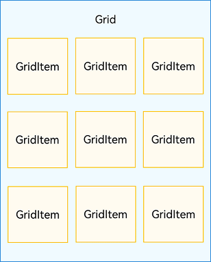
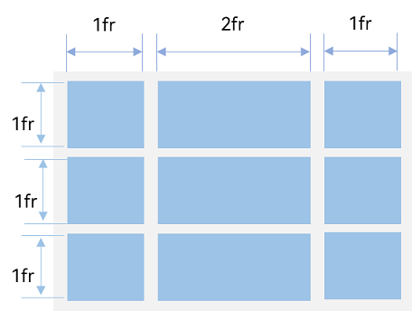
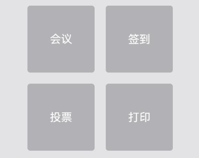
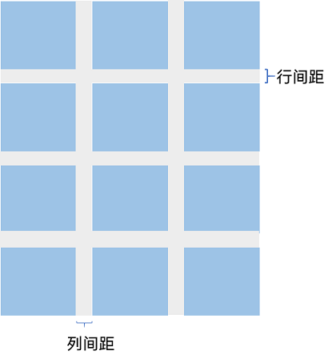
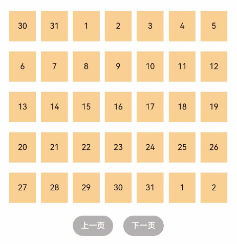

# Creating Grid Layout (Grid/GridItem)

## Overview

A grid layout consists of cells divided by "rows" and "columns," enabling diverse layouts by specifying the cells where "items" are placed. Grid layouts excel at evenly distributing page space and controlling child component proportions, making them a crucial adaptive layout solution. Common use cases include 9-grid image displays, calendars, calculators, etc.

ArkUI provides the [Grid](../../../en/application-dev/reference/arkui-cj/cj-scroll-swipe-grid.md) container component and its child component [GridItem](../../../en/application-dev/reference/arkui-cj/cj-scroll-swipe-griditem.md) for constructing grid layouts. Grid sets layout parameters, while GridItem defines child component characteristics. The Grid component supports generating child components through [conditional rendering](./rendering_control/cj-rendering-control-ifelse.md), [loop rendering](./rendering_control/cj-rendering-control-foreach.md), and [lazy loading](./rendering_control/cj-rendering-control-lazyforeach.md).

## Layout and Constraints

The Grid component serves as the grid container, with each internal entry corresponding to a GridItem component, as shown in Figure 1.

**Figure 1** Relationship Between Grid and GridItem Components



> **Note:**
>
> Child components of Grid must be GridItem components.

Grid layout is a two-dimensional layout system. The Grid component supports customizing row/column counts and size proportions, spanning child components across multiple rows/columns, and providing both vertical and horizontal layout capabilities. When the grid container's size changes, all child components and spacing adjust proportionally to achieve adaptive layout behavior. These capabilities enable various grid layout styles, as illustrated in Figure 2.

**Figure 2** Grid Layout Examples


If width/height properties are set for the Grid component, its dimensions follow those values. If unset, Grid defaults to matching its parent component's size.

Based on row/column count and proportion settings, Grid layouts can be categorized into three scenarios:

1. **Both row/column counts and proportions set**: Grid displays only fixed rows/columns of elements without scrolling (recommended approach).

2. **Only one of row/column counts or proportions set**: Elements arrange along the set direction, with overflow content accessible via scrolling.

3. **Neither row/column counts nor proportions set**: Elements arrange along the layout direction, with row/column counts determined by multiple attributes including layout direction and individual cell dimensions. Overflow content is hidden without scrolling.

## Arrangement Configuration

### Setting Row/Column Counts and Proportions

The overall arrangement is determined by configuring row/column counts and size proportions. Grid provides `rowsTemplate` and `columnsTemplate` properties for this purpose.

These properties accept space-separated strings of "number+fr" values. The count of "fr" units defines the number of rows/columns, while preceding numbers calculate proportional width/height allocations.

**Figure 3** Row/Column Proportion Example



As shown in Figure 3, this three-row, three-column grid divides vertical space equally (1fr each row) and horizontal space into four parts (first column: 1fr, second: 2fr, third: 1fr).

Implement this layout with:
```cangjie
Grid() {
  // ...
}
.rowsTemplate("1fr 1fr 1fr")
.columnsTemplate("1fr 2fr 1fr")
```

> **Note:**
>
> When `rowsTemplate` or `columnsTemplate` are set, Grid's `layoutDirection` and `cellLength` properties become ineffective. Refer to [Grid Properties](../../../en/application-dev/reference/arkui-cj/cj-scroll-swipe-grid.md#组件属性) for details.

## Displaying Data in Grid Layouts

Grid layouts organize content using two-dimensional structures, as shown in Figure 5.

**Figure 5** General Office Services



The Grid component can display GridItem children in a 2D arrangement:

```cangjie
Grid() {
    GridItem() {
        Text("Meeting")
        //  ...
    }

    GridItem() {
        Text("Check-in")
        //  ...
    }

    GridItem() {
        Text("Voting")
        //  ...
    }

    GridItem() {
        Text("Print")
        //  ...
    }
}
.rowsTemplate("1fr 1fr")
.columnsTemplate("1fr 1fr")
```

For structurally similar GridItems, prefer using ForEach with nested GridItem to reduce code duplication:

```cangjie
package ohos_app_cangjie_entry
import kit.ArkUI.*
import ohos.arkui.state_macro_manage.*
import ohos.resource_manager.*

@Entry
@Component
class EntryView {
    @State var services: Array<String> = ["Meeting", "Voting", "Check-in", "Print"]
    func build() {
            Column() {
                Grid() {
                    ForEach(this.services, itemGeneratorFunc: {service: String, _: Int64 =>
                        GridItem() {
                            Text(service)
                        }}
                    )
                }
                .rowsTemplate("1fr 1fr")
                .columnsTemplate("1fr 1fr")
            }
    }
}
```

## Configuring Row/Column Gaps

Horizontal spacing between grid units is called row gap; vertical spacing is column gap (Figure 6).

**Figure 6** Grid Gaps



Set gaps using `rowsGap` and `columnsGap`. For Figure 5's calculator, use 15vp row gap and 10vp column gap:

```cangjie
Grid() {
  // ...
}
.columnsGap(10)
.rowsGap(15)
```

## Building Scrollable Grid Layouts

Scrollable grids are common in file managers, shopping/video lists (Figure 7). When setting only one of `rowsTemplate` or `columnsTemplate`, content arranges along that axis with scrolling for overflow.

**Figure 7** Horizontally Scrollable Grid


Setting `columnsTemplate` enables vertical scrolling; `rowsTemplate` enables horizontal scrolling. Implement Figure 7's horizontal scroll by setting only `rowsTemplate`:

```cangjie
package ohos_app_cangjie_entry
import kit.ArkUI.*
import ohos.arkui.state_macro_manage.*
import ohos.resource_manager.*

@Entry
@Component
class EntryView {
    @State var services: Array<String> = ["Live", "Import"]
    func build() {
            Column(space: 5) {
                Grid() {
                    ForEach(this.services, itemGeneratorFunc: {service: String, _: Int64 =>
                        GridItem() {
                            // Add content
                        }
                        .width(25.percent)
                        }
                    )
                }
                .rowsTemplate("1fr 1fr")
                .rowsGap(15)
        }
    }
}
```

## Controlling Scroll Position

Similar to "back to top" in news lists, scroll control is useful for grid features like calendar pagination (Figure 8).

**Figure 8** Calendar Pagination



Initialize Grid with a [Scroller](../../../en/application-dev/reference/arkui-cj/cj-scroll-swipe-scroll.md#scroll) object for scroll control. Use [scrollPage](../../../en/application-dev/reference/arkui-cj/cj-scroll-swipe-scroll.md#func-scrollpagebool) for pagination:

```cangjie
var scroller: Scroller = Scroller()
```

In calendar implementation, clicking "Next Page" triggers scrolling via `scrollPage(true)`:

```cangjie
package ohos_app_cangjie_entry
import kit.ArkUI.*
import ohos.arkui.state_macro_manage.*
import ohos.resource_manager.*

@Entry
@Component
class EntryView {
    var scroller: Scroller = Scroller()
    func build() {
        Column() {
            Grid(scroller: this.scroller) {
              // Add content
            }
            .columnsTemplate("1fr 1fr 1fr 1fr 1fr 1fr 1fr")
            .height(85.percent)

            Row() {
              Row() {
                  Button("Previous")
                  .onClick{ evt =>
                      this.scroller.scrollPage(false)
                  }.width(100)
              }.width(50.percent)
              .justifyContent(FlexAlign.Center)

              Row() {
                  Button("Next")
                  .onClick{ evt =>
                      this.scroller.scrollPage(true)
                  }.width(100)
              }.width(50.percent)
              .justifyContent(FlexAlign.Center)
            }
            .height(15.percent)
        }.height(100.percent)
    }
}
```

## Performance Optimization

Like long lists, [loop rendering](./rendering_control/cj-rendering-control-foreach.md) suits smaller datasets. For large scrollable grids, prefer [lazy loading](./rendering_control/cj-rendering-control-lazyforeach.md) to load data on-demand, improving performance.

Refer to [Lazy Loading](./rendering_control/cj-rendering-control-lazyforeach.md) for implementation details.

When using lazy loading, set `cachedCount` to preload GridItems beyond the visible area, reducing blank spaces during scrolling (only effective with LazyForEach):

```cangjie
Grid() {
    LazyForEach(this.dataSource, itemGeneratorFunc: {dataSource: T, _: Int64 =>
        GridItem() {
        }
    })
}
.cachedCount(3)
```

> **Note:**
>
> Increasing `cachedCount` raises CPU/memory usage. Balance performance and user experience based on actual requirements.