# Creating Lists (List)

## Overview

A list is a complex container that automatically provides scrolling functionality when the number of list items exceeds the screen size. It is suitable for presenting homogeneous data types or datasets, such as images and text. Displaying data collections in lists is a common requirement in many applications (e.g., contact lists, music playlists, shopping lists, etc.).

Using lists enables efficient and structured display of scrollable information. By linearly arranging child components—[ListItemGroup](../../../en/application-dev/reference/arkui-cj/cj-scroll-swipe-listgroup.md) or [ListItem](../../../en/application-dev/reference/arkui-cj/cj-scroll-swipe-listitem.md)—vertically or horizontally within the [List](../../../en/application-dev/reference/arkui-cj/cj-scroll-swipe-list.md) component, individual views for rows or columns can be provided. Alternatively, [loop rendering](./rendering_control/cj-rendering-control-foreach.md) can iterate over a set of rows or columns, or a combination of single views and ForEach structures can be used to build a list. The List component supports rendering control methods such as conditional rendering, loop rendering, and lazy loading to generate child components.

## Layout and Constraints

As a container, a list automatically arranges its child components along its scrolling direction. Adding or removing components from the list triggers a re-layout of child components.

As shown in **Figure 1**, in a vertical list, the List component automatically arranges ListItemGroup or ListItem vertically.

ListItemGroup is used for grouped display of list data, and its child components are also ListItems. A ListItem represents a single list item and can contain one child component.

**Figure 1** Relationship Between List, ListItemGroup, and ListItem Components

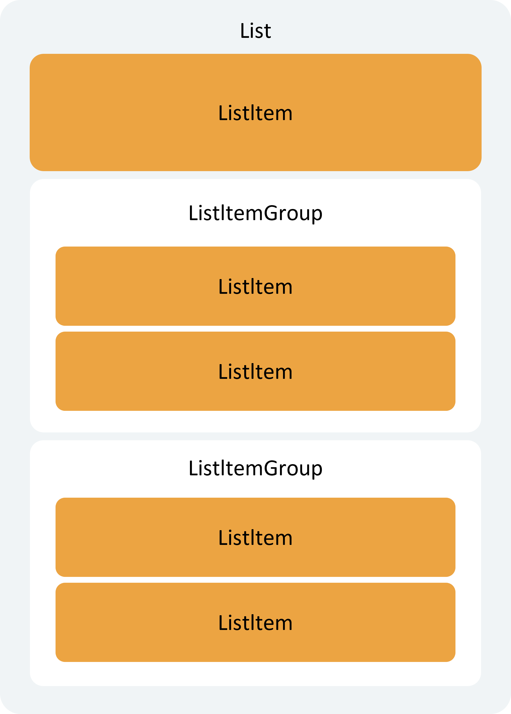

> **Note:**
>
> The child components of List must be ListItemGroup or ListItem. ListItem and ListItemGroup must be used in conjunction with List.

### Layout

In addition to providing vertical and horizontal layout capabilities and adaptive scrolling when content exceeds the screen, List also supports adaptive layout for the number of items along the cross axis.

Vertical layout capabilities can be used to build single-column or multi-column vertical scrolling lists, as shown in **Figure 2**.

**Figure 2** Vertical Scrolling Lists (Left: Single Column; Right: Multiple Columns)


Horizontal layout capabilities can be used to build single-row or multi-row horizontal scrolling lists, as shown in **Figure 3**.

**Figure 3** Horizontal Scrolling Lists (Left: Single Row; Right: Multiple Rows)

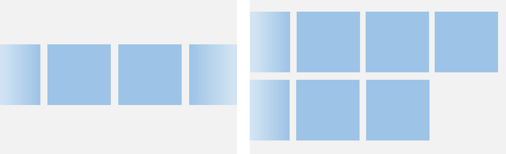

Grid and WaterFlow can also achieve single-column or multi-column layouts. However, if each column has equal width and no cross-row or cross-column layout is needed, List is recommended over Grid and WaterFlow.

### Constraints

The main axis of a list refers to the direction in which child component columns are arranged, which is also the scrolling direction of the list. The axis perpendicular to the main axis is called the cross axis.

As shown in **Figure 4**, the main axis of a vertical list is vertical, and the cross axis is horizontal. For a horizontal list, the main axis is horizontal, and the cross axis is vertical.

**Figure 4** Main Axis and Cross Axis of a List

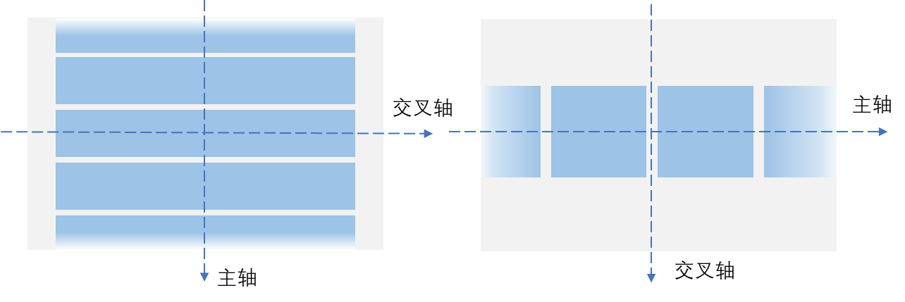

If the List component has a set size along its main or cross axis, its size in that direction will be the specified value.

If the List component does not have a set size along its main axis, and the total size of its child components along the main axis is less than the parent component's size, the List's main axis size will adapt to the total size of its child components.

As shown in **Figure 5**, when a vertical list B does not have a set height and its parent component A has a height of 200.vp, if the total height of all child components C is 150.vp, the height of list B will be 150.vp.

**Figure 5** Example 1 of Main Axis Height Constraint (**A**: Parent Component of List; **B**: List Component; **C**: All Child Components of List)

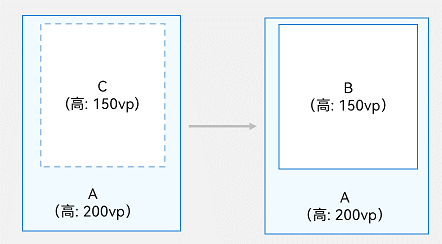

If the total size of child components along the main axis exceeds the parent component's size, the List's main axis size will adapt to the parent component's size.

As shown in **Figure 6**, for a vertical list B without a set height, if its parent component A has a height of 200.vp and the total height of all child components C is 300.vp, the height of list B will be 200.vp.

**Figure 6** Example 2 of Main Axis Height Constraint (**A**: Parent Component of List; **B**: List Component; **C**: All Child Components of List)

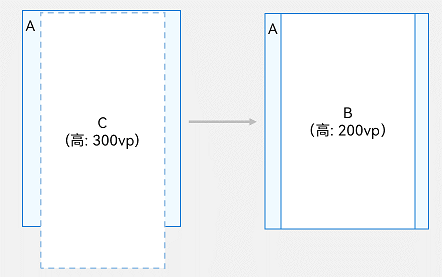

If the List component does not have a set size along its cross axis, its size will default to the parent component's size.

## Development Layout

### Setting the Main Axis Direction

The main axis of the List component defaults to the vertical direction, meaning a vertical scrolling list can be built without manually setting the direction.

For horizontal scrolling lists, set the listDirection property of List to Axis.Horizontal. The default value of listDirection is Axis.Vertical, meaning the main axis is vertical by default.

```cangjie
List() {
  // ...
}
.listDirection(Axis.Horizontal)
```

### Setting Cross Axis Layout

The cross axis layout of the List component can be configured using the lanes and alignListItem properties. The lanes property determines the number of list items arranged along the cross axis, while alignListItem sets the alignment of child components along the cross axis.

The lanes property is typically used to adaptively build lists with varying numbers of rows or columns across different device sizes, enabling "write once, deploy anywhere" scenarios. For details on declaring the lanes property, see [Declaration Method](../../../en/application-dev/reference/arkui-cj/cj-scroll-swipe-list.md#func-lanesint32). For a vertical list, setting lanes to 2 creates a two-column vertical list, as shown in the right image of Figure 2. The default value of lanes is 1, meaning a vertical list defaults to a single column.

```cangjie
List() {
  // ...
}
.lanes(2)
```

When declaring the property using ".lanes(minLength: Length, maxLength: Length)", the number of rows or columns is determined adaptively based on minLength, maxLength, and the List component's size.

```cangjie
List() {
  // ...
}
.lanes(minLength: 200, maxLength: 300)
```

For example, suppose a vertical list has lanes set to minLength: 200, maxLength: 300. In this case:

- When the List component's width is 300.vp, the list will have one column since minLength is 200.vp.
- When the List component's width changes to 400.vp, meeting twice the minLength, the list will adaptively switch to two columns.

For a vertical list, setting alignListItem to ListItemAlign.Center aligns list items horizontally to the center. The default value of alignListItem is ListItemAlign.Start, meaning list items are aligned to the start of the cross axis by default.

```cangjie
List() {
  // ...
}
.alignListItem(ListItemAlign.Center)
```

## Displaying Data in Lists

List views display collections of items vertically or horizontally, providing scrolling functionality when rows or columns exceed the screen size, making them ideal for large datasets. In its simplest form, a List statically creates the content of its ListItems.

**Figure 7** City List

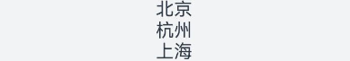

 <!-- run -->

```cangjie
package ohos_app_cangjie_entry

import kit.ArkUI.*
import ohos.arkui.state_macro_manage.*

@Entry
@Component
public class EntryView {
    func build() {
        List() {
            ListItem() {
                Text('Beijing').fontSize(24)
            }

            ListItem() {
                Text('Hangzhou').fontSize(24)
            }

            ListItem() {
                Text('Shanghai').fontSize(24)
            }
        }
        .backgroundColor(0xfff1f3f5)
        .alignListItem(ListItemAlign.Center)
    }
}
```

Since a ListItem can only have one root node component and does not support multiple components laid out flat, if a list item consists of multiple component elements, these elements must be combined into a container component or a custom component.

**Figure 8** Example of a Contact List Item

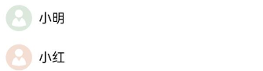

As shown in **Figure 8**, each contact in the contact list has an avatar and a name. Here, the Image and Text components must be encapsulated within a Row container.

```cangjie
List() {
    ListItem() {
        Row() {
            Image(@r(app.media.startIcon))
                .width(40)
                .height(40)
                .margin(10)
            Text('Xiao Ming').fontSize(20)
        }
    }
    ListItem() {
        Row() {
            Image(@r(app.media.startIcon))
                .width(40)
                .height(40)
                .margin(10)
            Text('Xiao Hong').fontSize(20)
        }
    }
}
```

## Iterating List Content

Typically, applications dynamically create lists from data collections. Using [loop rendering](./rendering_control/cj-rendering-control-foreach.md), data can be iteratively fetched from a source, and corresponding components can be created during each iteration, reducing code complexity.

Cangjie provides loop rendering capabilities for components via [ForEach](./rendering_control/cj-rendering-control-foreach.md). For a simple contact list example, contact names and avatar data are stored in the contacts array as Contact class structures. Using ForEach nested within ListItem replaces multiple flat, similar ListItems, reducing repetitive code.

 <!-- run -->

```cangjie
package ohos_app_cangjie_entry

import kit.ArkUI.*
import ohos.arkui.state_macro_manage.*
import ohos.resource_manager.*

public class Contact {
    var name: String
    var icon: AppResource

    public init(name: String, icon: AppResource) {
        this.name = name
        this.icon = icon
    }
}

@Entry
@Component
public class EntryView {
    private var contacts: Array<Contact> = [Contact('Xiao Ming', @r(app.media.startIcon)), Contact('Xiao Hong', @r(app.media.startIcon))]
    func build() {
        List() {
            ForEach(this.contacts, itemGeneratorFunc: { item: Contact, _: Int64 =>
                    ListItem() {
                        Row() {
                            Image(item.icon)
                                .width(40)
                                .height(40)
                                .margin(10)
                            Text(item.name).fontSize(20)
                        }
                            .width(100.percent)
                            .justifyContent(FlexAlign.Start)
                    }
                },
                keyGeneratorFunc: {item: Contact, idx: Int64 => idx.toString()}
            )
        }.width(100.percent)
    }
}
```

## Customizing List Styles

### Setting Content Spacing

When initializing a list, if spacing between list items is needed, the space parameter can be used. For example, to add 10.vp spacing along the main axis between each list item:

```cangjie
List(space: 10) {
  // ...
}
```

### Adding Dividers

Dividers separate interface elements, making individual elements easier to identify. As shown in **Figure 9**, when list items have icons (e.g., Bluetooth icons) on the left, the divider can start displaying after the icon since the icon itself provides sufficient distinction.

**Figure 9** Setting List Divider Styles

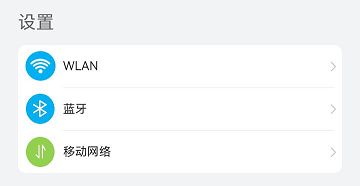

The List component provides the divider property to add dividers between list items. When setting the divider property, the strokeWidth and color properties can configure the thickness and color of the divider.

The startMargin and endMargin properties set the distance from the divider to the start and end edges of the list, respectively.

```cangjie
List() {
  // ...
}
.divider(strokeWidth: 1, color: 0xffe9f0f0, startMargin: 60, endMargin: 10)
```

This example draws a 1.vp thick divider starting 60.vp from the list's start edge and ending 10.vp from the end edge, achieving the divider style shown in **Figure 9**.

> **Note:**
>
> - The width of the divider creates spacing between ListItems. If the spacing set for the List is less than the divider's width, the spacing between ListItems will use the divider's width.
>
> - When the List has multiple columns, startMargin and endMargin apply to each column.
>
> - The List component's divider is drawn between two ListItems. No divider is drawn above the first ListItem or below the last ListItem.

### Adding Scrollbars

When the height (or width) of list items exceeds the screen height (or width), the list can scroll vertically (or horizontally). For pages with extensive content, users can drag the scrollbar for quick positioning, as shown in **Figure 10**.

**Figure 10** List Scrollbar

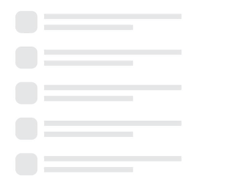

The scrollBar property of the List component controls the display of the scrollbar. The scrollBar property takes a value of type [BarState](../../../en/application-dev/reference/arkui-cj/cj-common-types.md#enum-barstate). When set to BarState.Auto, the scrollbar appears on demand. In this case, touching the scrollbar area displays the control, allowing users to drag it up or down to quickly browse content. The scrollbar thickens during dragging and disappears automatically after 2 seconds of inactivity.

```cangjie
List() {
    // ...
}
.scrollBar(BarState.Auto)
```

## Supporting Grouped Lists

Grouping data in lists enhances clarity and usability, making it easier to locate information. Grouped lists are common in real-world applications, such as the contact list shown in **Figure 11**.

**Figure 11** Grouped Contact List

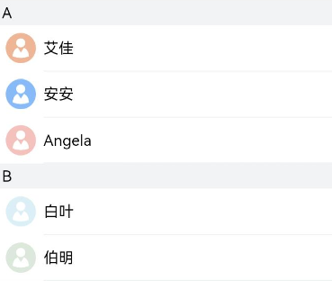

Using ListItemGroup within the List component enables grouping of items, creating a two-dimensional list.

The List component can directly use one or more ListItemGroup components, with ListItemGroup's width defaulting to fill the List component. When initializing ListItemGroup, the header parameter can set the group's header component.

 <!-- run -->

```cangjie
package ohos_app_cangjie_entry

import kit.ArkUI.*
import ohos.arkui.state_macro_manage.*
import ohos.resource_manager.*

@Entry
@Component
public class EntryView {
    @Builder
    public func itemHead(text: String) {
        // Header component for the list group, corresponding to the component for group labels like A, B, etc.
        Text(text)
            .fontSize(20)
            .backgroundColor(0xfff1f3f5)
            .width(100.percent)
            .padding(5)
    }

    func build() {
        List() {
            ListItemGroup(
                header: {=> bind(this.itemHead, this)("A")}){
                    =>
                    // Loop rendering for ListItems in group A
                }

            ListItemGroup(
                header: {=> bind(this.itemHead, this)("B")}) {
                    =>
                    // Loop rendering for ListItems in group B
                }
        }
    }
}
```

If multiple ListItemGroups share a similar structure, the grouped data can be organized into an array, and ForEach can be used to render multiple groups iteratively. For example, in a contact list, combine the contacts data (as described in the [Iterating List Content](#iterating-list-content) section) with their corresponding group titles into an array, contactsGroups. Then, use ForEach to iterate over contactsGroups, enabling a multi-group contact list. Refer to the example code in the [Adding Sticky Headers](#adding-sticky-headers) section.

## Adding Sticky Headers

Sticky headers are a common pattern for positioning header elements in alphabetical lists. As shown in **Figure 12**, when scrolling through group A in a contact list, the header for group B remains positioned below A. When scrolling through group B, its header sticks to the top of the screen until all items in B have been scrolled, after which it is replaced by the next header.

Sticky headers clarify the representation and purpose of data in lists, helping users locate information efficiently without repeatedly scrolling between the top of the list and areas of interest.

**Figure 12** Sticky Headers

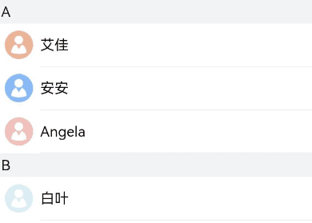

The sticky property of the List component, used with ListItemGroup, determines whether the header component sticks to the top or the footer component sticks to the bottom.

Setting the sticky property of the List component to StickyStyle.Header enables sticky header behavior. For sticky footers, initialize the footer component of ListItemGroup using the footer parameter and set the sticky property to StickyStyle.Footer.

 <!-- run -->

```cangjie
package ohos_app_cangjie_entry

import ohos.arkui.state_macro_manage.*
import ohos.resource_manager.*
import kit.ArkUI.*

public class Contact {
    var name: String
    var icon: AppResource

    public init(name: String, icon: AppResource) {
        this.name = name
        this.icon = icon
    }
}

public class ContactGroup {
    var title: String
    var contacts: Array<Contact>

    public init(title: String, contacts: Array<Contact>) {
        this.title = title
        this.contacts = contacts
    }
}

@Entry
@Component
public class EntryView {
    // Define the grouped contacts dataset as an array, contactsGroups
    private var contactsGroups : Array<ContactGroup> = [
            ContactGroup('A', [Contact('Ai Jia', @r(app.media.startIcon)),Contact('An An', @r(app.media.startIcon)),Contact('Angela', @r(app.media.startIcon))]),
            ContactGroup('B', [Contact('Bai Ye', @r(app.media.startIcon)),Contact('Bo Ming', @r(app.media.startIcon))])
        ]

    @Builder
    func itemHead(text: String) {
        // Header component for the list group, corresponding to group labels like A, B, etc.
        Text(text)
          .fontSize(20)
          .backgroundColor(0xfff1f3f5)
          .width(100.percent)
          .padding(5)
    }

    @Builder
    func footertest(itemGroup: ContactGroup) {
        ForEach(itemGroup.contacts, itemGeneratorFunc: { item: Contact, _:Int64 =>
                ListItem## Controlling Scroll Position

Controlling scroll position is a common requirement in practical applications. For instance, when a news page contains an extensive list of items, users may wish to quickly scroll to the bottom or return to the top after scrolling to a certain position. This can be achieved by controlling the scroll position, as illustrated in Figure 13.

**Figure 13** Returning to the Top of the List

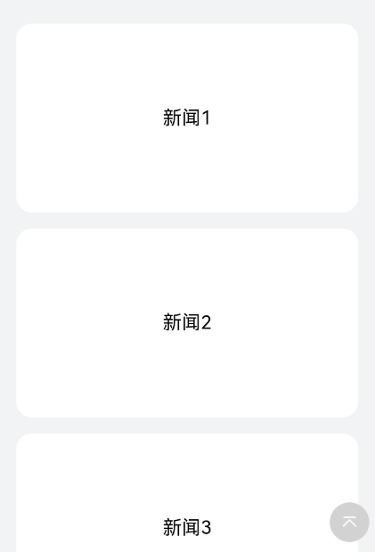

During the initialization of the List component, a [Scroller](../../../en/application-dev/reference/arkui-cj/cj-scroll-swipe-scroll.md) object can be bound via the `scroller` parameter to control list scrolling. For example, when a user clicks the "Return to Top" button at the bottom of a news app, the `scrollToIndex` method of the Scroller object can be used to scroll the list to a specified item index.

First, create a Scroller object named `listScroller`.

```cangjie
var listScroller: Scroller = Scroller()
```

Next, bind `listScroller` to the list by passing it as the `scroller` parameter during List component initialization. To return to the top of the list, set the `scrollToIndex` parameter to 0.

```cangjie
Stack(alignContent: Alignment.Bottom) {
    List(space: 20, scroller: this.listScroller) {
        // ...
    }
}

Button() {
    // ...
}
.onClick({ event =>
    this.listScroller.scrollToIndex(0)
})
```

## Responding to Scroll Position

Many applications need to monitor changes in scroll position and respond accordingly. For example, when scrolling through a contact list, if the user moves across groups starting with different letters, the sidebar letter index should update to reflect the current letter.

Beyond letter indexing, combining scrollable lists with multi-level categorization is also common in app development, such as in e-commerce product category pages where multi-level categorization requires monitoring scroll position.

**Figure 14** Letter Index Responding to Contact List Scrolling

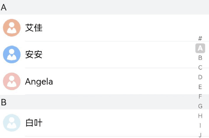

As shown in Figure 14, when the contact list scrolls from "A" to "B," the sidebar index should synchronously update from highlighting "A" to "B." This can be achieved by listening to the `onScrollIndex` event of the List component. The sidebar index should use the [AlphabetIndexer](../../../en/application-dev/reference/arkui-cj/cj-information-display-alphabetindexer.md) component.

During list scrolling, the `selectedIndex` for the letter index is recalculated based on the current scroll position `firstIndex`. Since the `selected` property of the AlphabetIndexer component sets the selected index, changes to `selectedIndex` trigger a re-render of the AlphabetIndexer, highlighting the corresponding letter.

 <!-- run -->

```cangjie
package ohos_app_cangjie_entry

import kit.ArkUI.*
import ohos.arkui.state_macro_manage.*
import ohos.resource_manager.*

@Entry
@Component
public class EntryView {
    let alphabets = ['#', 'A', 'B', 'C', 'D', 'E', 'F', 'G', 'H', 'I', 'J', 'K','L', 'M', 'N', 'O', 'P', 'Q', 'R', 'S', 'T', 'U', 'V', 'W', 'X', 'Y', 'Z']
    @State var selectedIndex: Int32 = 0;
    private var listScroller:Scroller = Scroller()

    func build() {
        Stack(alignContent: Alignment.End) {
            List(scroller: this.listScroller) {}
                .onScrollIndex({ firstIndex, scrollState, _ =>
                    // Recalculate this.selectedIndex based on the current scroll position firstIndex
                })

            // Alphabet indexer component
            AlphabetIndexer(arrayValue: this.alphabets, selected: 0)
                .selected(this.selectedIndex)
        }
    }
}
```

> **Note:**
>
> When calculating index values, a `ListItemGroup` counts as a single index, and internal `ListItem` indices are not included.

## Responding to List Item Swipe Actions

Swipe menus are common in many apps. For example, messaging apps often provide swipe-to-delete functionality, where users can swipe a list item to the left and tap a delete button to remove a message, as shown in Figure 15. The avatar badge in the list item is configured as described in [Adding Badges to List Items](#adding-badges-to-list-items).

**Figure 15** Swipe-to-Delete List Item

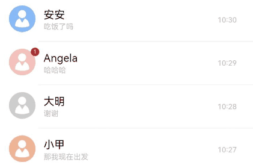

The `swipeAction` property of `ListItem` can be used to implement left/right swipe functionality. The `swipeAction` method requires a `SwipeActionOptions` parameter, where `start` sets the component that appears when swiping from the start (right), and `end` sets the component that appears when swiping from the end (left).

In a messaging list, the `end` parameter configures the delete button that appears when swiping left. The swipe index is passed to the delete button component, allowing the corresponding data item to be deleted when the button is clicked.

- Build the end-swipe component:

    ```cangjie
    @Builder
    func itemEnd(index: Int64) {
      // Build end-swipe component
      Button(ButtonOptions(shape: ButtonType.Circle)) {
        Image(@r(app.media.ic_public_delete_filled))
          .width(20)
          .height(20)
      }
      .onClick({ event =>
        // this.messages is the list data source. Remove the specified item on click.
        this.message.remove(index)
      })
    }
    ```

- Bind `swipeAction` to a swipeable `ListItem`:

    ```cangjie
    // When building the List, use ForEach to render ListItems based on this.messages.
    ListItem(){
        Text('1111').height(20)
    }
    .swipeAction(end: { => bind(this.itemEnd, this)(index)}) // index is the ListItem's position in the List
    ```

## Adding Badges to List Items

Badges are a non-intrusive and intuitive way to display notifications or draw attention to specific areas. For example, when a messaging list receives new messages, a badge typically appears in the top-right corner of the contact avatar, indicating unread messages, as shown in Figure 16.

**Figure 16** Adding Badges to List Items

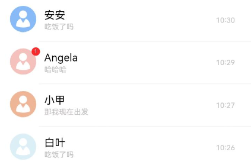

The [Badge](../../../en/application-dev/reference/arkui-cj/cj-information-display-badge.md) component can be used within `ListItem` to add badges. Badges are container components that attach to other components for informational marking.

To add a badge to the top-right corner of an avatar in a messaging list, wrap the avatar `Image` component inside a `Badge`. The `count` and `position` parameters set the number of messages and badge position, while `style` customizes the badge appearance.

```cangjie
ListItem(){
  Badge(
    count: 1, style: BadgeStyle(color: 0xfa2a2d, badgeSize: 16),
        position: BadgePosition.RightTop,
        child: { =>
            Image(@r(app.media.startIcon))
        }
    )
}
```

## Pull-to-Refresh and Load-More

Pull-to-refresh and load-more functionality is ubiquitous in mobile apps, such as refreshing news content. Both operations work by responding to [touch events](../../../en/application-dev/reference/arkui-cj/cj-universal-event-touch.md), displaying a refresh or load view at the top or bottom, and hiding it after completion.

Pull-to-refresh involves three steps:

1. Monitor touch-down events to record the initial position.
2. Monitor touch-move events to calculate the displacement from the initial position. A positive value indicates downward movement, with a predefined maximum displacement.
3. Monitor touch-up events. If the maximum displacement is reached, trigger data loading and display the refresh view, then hide it after completion.

> **Note:**
>
> For pull-to-refresh, use the [Refresh](../../../en/application-dev/reference/arkui-cj/cj-scroll-swipe-refresh.md) component.

## Editing Lists

List editing mode is widely used in to-do lists, file managers, and note-taking apps. The core functionality involves adding and deleting list items by modifying the underlying data collection.

## Handling Long Lists

[Loop rendering](./rendering_control/cj-rendering-control-foreach.md) is suitable for short lists. For long lists with many items, loading all elements at once can cause slow startup times. Instead, use [lazy loading](./rendering_control/cj-rendering-control-lazyforeach.md) (`LazyForEach`) to load data incrementally, improving performance.

For details on lazy loading optimization, refer to the [Lazy Loading](./rendering_control/cj-rendering-control-lazyforeach.md) section.

To enhance scrolling performance and reduce blank areas during scrolling, the List component provides the `cachedCount` parameter to set the number of cached items (only effective with `LazyForEach`).

```cangjie
List() {
  // ...
}.cachedCount(3)
```

For vertical lists:

- If `LazyForEach` is used for `ListItem`, in single-column mode, `cachedCount` items are cached before and after the visible items. In multi-column mode, `cachedCount * columnCount` items are cached.
- If `LazyForEach` is used for `ListItemGroup`, `cachedCount` groups are cached before and after the visible items, regardless of column mode.

> **Note:**
>
> Increasing `cachedCount` raises CPU and memory usage. Adjust based on performance and user experience requirements.
>
> With lazy loading, only visible and cached items are retained; others are destroyed.

## Collapsing and Expanding List Items

Collapsing and expanding list items is useful for displaying and editing information lists.

**Figure 17** Collapsing and Expanding List Items

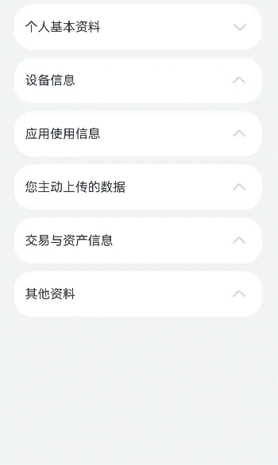

The implementation involves:

1. Defining the list item data structure:

    ```cangjie
    open class ItemInfo {
        var index: Int64
        var name: String
        var label: String
        var `type`: String = ''

        init(index: Int64, name: String, label: String, `type`: String) {
            this.index = index
            this.name = name
            this.label = label
            this.`type` = `type`
        }
    }

    public class ItemGroupInfo <: ItemInfo {
        var children: Array<ItemInfo>

        init(index: Int64, name: String, label: String, children: Array<ItemInfo>) {
            super(index, name, label, '')
            this.children = children
        }
    }
    ```

2. Constructing the list:

    ```cangjie
    @State var routes: Array<ItemGroupInfo> = [
        ItemGroupInfo(
            0,
            'basicInfo',
            'Personal Information',
            [
                ItemInfo(0, 'Nickname', 'xxxx', 'Text'),
                ItemInfo(1, 'Avatar', "resource://rawfile/startIcon.png", 'Image'),
                ItemInfo(2, 'Age', 'xxxx', 'Text'),
                ItemInfo(3, 'Birthday', 'xxxxxxxx', 'Text'),
                ItemInfo(4, 'Gender', 'xxxxxx', 'Text')
            ]
        ),
        ItemGroupInfo(1, 'equipInfo', 'Device Information', []),
        ItemGroupInfo(2, 'appInfo', 'App Usage Data', []),
        ItemGroupInfo(3, 'uploadInfo', 'User-Uploaded Data', []),
        ItemGroupInfo(4, 'tradeInfo', 'Transaction and Asset Data', []),
        ItemGroupInfo(5, 'otherInfo', 'Other Information', [])
    ]
    @State var expandedItems: ObservedArrayList<Float32> = ObservedArrayList<Float32>([0.0, 0.0, 0.0, 0.0, 0.0, 0.0])

    func build() {
        Column() {
            // ...
            List(space: 10) {
                ForEach(
                    this.routes,
                    itemGeneratorFunc: { itemGroup: ItemGroupInfo, _: Int64 =>
                        ListItemGroup(
                            ListItemGroupParams(header: {=> bind(this.ListItemGroupHeader, this)(itemGroup)},
                                footer: {=>}, space: 0, style: ListItemGroupStyle.CARD)) {
                                    if (this.expandedItems[itemGroup.index] == 180.0) {
                                        ForEach(itemGroup.children, itemGeneratorFunc: { item: ItemInfo, _: Int64 =>
                                            ListItem() {
                                                    Row() {
                                                        Text(item.name)
                                                        Blank()
                                                        if (item.`type` == 'Image') {
                                                            Image(item.label)
                                                                .height(20)
                                                                .width(20)
                                                        } else {
                                                            Text(item.label)
                                                        }
                                                        Image(@r(sys.media.ohos_ic_public_arrow_right))
                                                            .fillColor(@r(sys.color.ohos_id_color_fourth))
                                                            .height(30)
                                                            .width(30)
                                                    }
                                                    .width(100.percent)
                                            }.width(100.percent)
                                        })
                                    }
                            }
                    }
                )
            }.width(100.percent)
        }
        .width(100.percent)
        .height(100.percent)
        .justifyContent(FlexAlign.Start)
        .backgroundColor(@r(sys.color.ohos_id_color_sub_background))
    }
    ```

3. Controlling expansion/collapse by changing `ListItem` state and using animations:

    ```cangjie
    @Builder
    func ListItemGroupHeader(itemGroup: ItemGroupInfo) {
        Row() {
            Text(itemGroup.label)
            Blank()
            Image(@r(sys.media.ohos_ic_public_arrow_down))
                .fillColor(@r(sys.color.ohos_id_color_fourth))
                .height(30)
                .width(30)
                .animationStart(AnimateParam(curve: Curve.EaseInOut, duration: 500))
                .rotate(x: this.expandedItems[itemGroup.index])
                .animationEnd()
        }
        .width(100.percent)
        .padding(10)
        .onClick({
            event => this.expandedItems[itemGroup.index] = 180.0 - this.expandedItems[itemGroup.index]
        })
    }
    ```