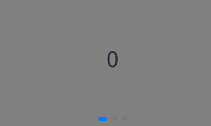
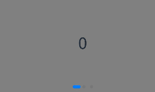
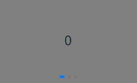
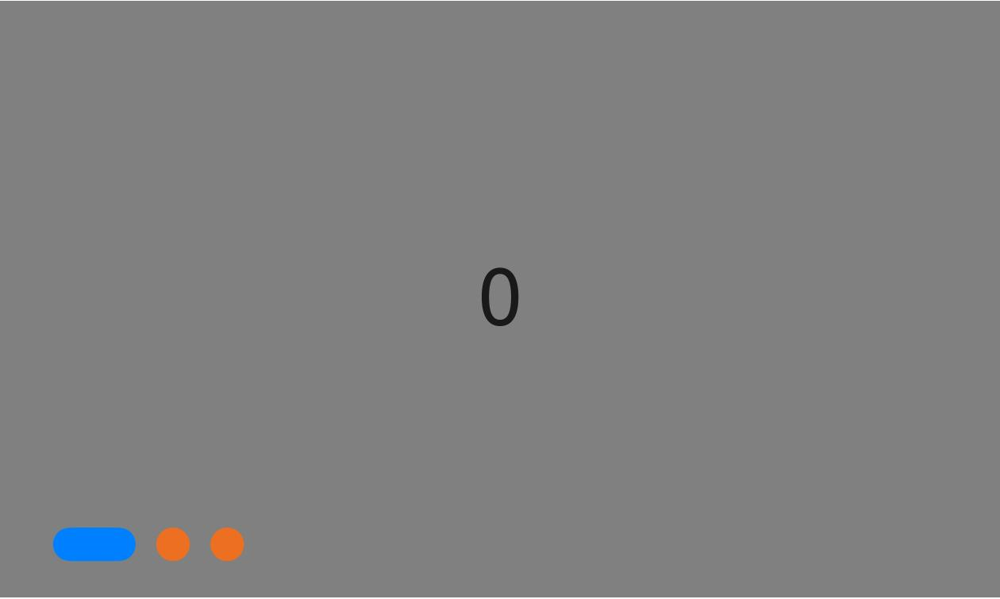
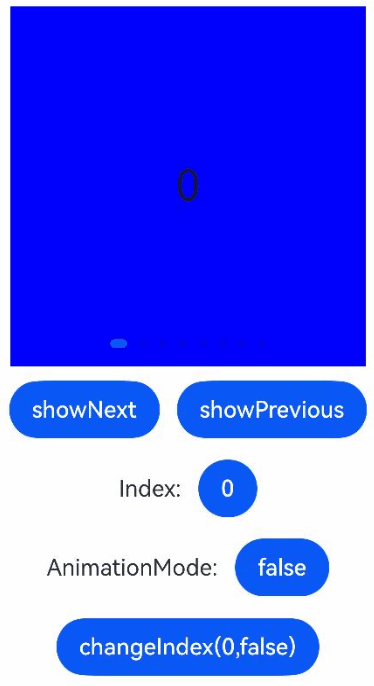
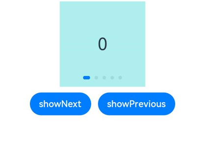
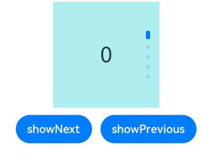
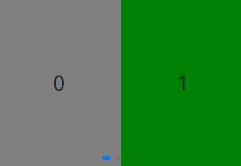

# Creating a Swiper

<!--Del-->
> **Note:**
>
> Currently in the beta phase.
<!--DelEnd-->

The [Swiper](../reference/arkui-cj/cj-scroll-swipe-swiper.md) component provides slide-based carousel display capabilities. As a container component, Swiper can display its child components in a carousel format when multiple children are set. This feature is commonly used for showcasing recommended content on application homepages.

For complex page scenarios, Swiper's preloading mechanism can be utilized to leverage idle time on the main thread for pre-building, layout, and rendering of components, thereby optimizing the sliding experience.

## Layout and Constraints

As a container component, Swiper will maintain its specified dimensions throughout the carousel display if size properties are explicitly set. If no size properties are specified, two scenarios exist: 
1. When either `prevMargin` or `nextMargin` is set, Swiper's dimensions will follow its parent component
2. Without these margin properties, Swiper automatically sizes itself based on its child components

## Loop Playback

Loop playback is controlled by the `loop` property, which defaults to `true`.

When `loop` is `true`, users can continue swiping forward from the first page to the last page or backward from the last page to the first. When `false`, swiping is restricted at the first and last pages.

- loop=true

  ```cangjie
  Swiper() {
  Text('0')
    .width(90.percent)
    .height(100.percent)
    .backgroundColor(Color.Gray)
    .textAlign(TextAlign.Center)
    .fontSize(30)

  Text('1')
    .width(90.percent)
    .height(100.percent)
    .backgroundColor(Color.Green)
    .textAlign(TextAlign.Center)
    .fontSize(30)

  Text('2')
    .width(90.percent)
    .height(100.percent)
    .backgroundColor(0xFEC0CD)
    .textAlign(TextAlign.Center)
    .fontSize(30)
  }
  .width(100.percent)
  .height(30.percent)
  .loop(true)
  ```

  

- loop=false

  ```cangjie
  Swiper() {
    // ...
  }
  .width(100.percent)
  .height(30.percent)
  .loop(false)
  ```

  

## Auto Play

The `autoPlay` property controls automatic cycling of child components, defaulting to `false`.

When `autoPlay` is `true`, components automatically cycle at intervals specified by the `interval` property (default: 3000ms).

```cangjie
Swiper() {
  // ...
}
.loop(true)
.autoPlay(true)
.interval(1000)
```


## Indicator Styles

Swiper provides default indicator dot and arrow styles, with dots centered below the Swiper by default. Developers can customize indicator position and style through the `indicator` property, while arrows remain hidden by default.

The `indicator` property allows positioning indicators relative to the Swiper's four edges, plus customization of dot size, color, mask, and selected state color.

- Default indicator style

  ```cangjie
  Swiper() {
      Text('0')
      .width(90.percent)
      .height(100.percent)
      .backgroundColor(Color.Gray)
      .textAlign(TextAlign.Center)
      .fontSize(30)

      Text('1')
      .width(90.percent)
      .height(100.percent)
      .backgroundColor(Color.Green)
      .textAlign(TextAlign.Center)
      .fontSize(30)

      Text('2')
      .width(90.percent)
      .height(100.percent)
      .backgroundColor(0xFEC0CD)
      .textAlign(TextAlign.Center)
      .fontSize(30)
      }
      .width(100.percent)
      .height(30.percent)
  ```

  

- Custom indicator style

  Sets dot diameter to 30vp, left margin to 0, and dot color to red.

  ```cangjie
  Swiper() {
    // ...
  }
  .width(100.percent)
  .height(30.percent)
  .indicator(
    Indicator.dot()
      .left(0)
      .itemWidth(13)
      .itemHeight(13)
      .selectedItemWidth(16)
      .selectedItemHeight(13)
      .color(0xED6F21)
      .selectedColor(0X007fff)
  )
  ```

  

## Page Switching Methods

Swiper supports both swipe gestures and indicator dot clicks for page navigation. The following example demonstrates controller-based page switching.

 <!-- run -->

```cangjie
package ohos_app_cangjie_entry
import kit.ArkUI.*
import ohos.arkui.state_macro_manage.*

@Entry
@Component
class EntryView {
    private var swiperBackgroundColors: Array<Color> = [Color.Blue, Color.Black, Color.Gray, Color.Green, Color.White, Color.Red]
    private var swiperController: SwiperController = SwiperController();
    @State var animationModeStr: Bool = false
    @State var targetIndex: Int64 = 0
    func build() {
        Column(space: 5) {
            Swiper(controller: this.swiperController) {
                ForEach(
                    this.swiperBackgroundColors,
                    itemGeneratorFunc: {
                        item: Color, index: Int64 => Text(index.toString())
                            .width(250)
                            .height(250)
                            .backgroundColor(item)
                            .textAlign(TextAlign.Center)
                            .fontSize(30)
                    }
                )
            }
            .indicator(true)

            Row(space:12) {
                Button('showNext').onClick({
                    evt => this
                        .swiperController
                        .showNext(); // Switch to next page via controller
                })
                Button('showPrevious').onClick({
                    evt => this
                        .swiperController
                        .showPrevious(); // Switch to previous page via controller
                })
            }
            .margin(5)
            Row(space:12) {
                Text('Index:')
                Button(this.targetIndex.toString()).onClick(
                    {
                        evt => this.targetIndex = (this.targetIndex + 1) % this.swiperBackgroundColors.toArray().size
                    })
            }
            .margin(5)
            Row(space:12) {
                Text('AnimationMode:')
                Button(this.animationModeStr.toString()).onClick(
                    {
                        evt => if (this.animationModeStr == false) {
                            this.animationModeStr = true
                        } else {
                            this.animationModeStr = false
                        }
                    })
            }
            .margin(5)
        }
        .width(100.percent)
        .margin(top: 5)
    }
}
```



## Carousel Orientation

Swiper supports both horizontal and vertical orientations via the `vertical` property.

- `vertical=true`: Vertical carousel
- `vertical=false` (default): Horizontal carousel

- Horizontal carousel

  ```cangjie
  Swiper() {
    // ...
  }
  .indicator(true)
  .vertical(false)
  ```

  

- Vertical carousel

  ```cangjie
  Swiper() {
    // ...
  }
  .indicator(true)
  .vertical(true)
  ```

  

## Multi-item Display

Swiper can display multiple child components per page through the [displayCount](../reference/arkui-cj/cj-scroll-swipe-swiper.md#func-displaycountint32) property.

 <!-- run -->

```cangjie
package ohos_app_cangjie_entry
import kit.ArkUI.*
import ohos.arkui.state_macro_manage.*

@Entry
@Component
class EntryView {
    func build() {
        Column(space: 5) {
              Swiper() {
                  Text('0')
                    .width(250)
                    .height(250)
                    .backgroundColor(Color.Gray)
                    .textAlign(TextAlign.Center)
                    .fontSize(30)
                  Text('1')
                    .width(250)
                    .height(250)
                    .backgroundColor(Color.Green)
                    .textAlign(TextAlign.Center)
                    .fontSize(30)
                  Text('2')
                    .width(250)
                    .height(250)
                    .backgroundColor(0xFEC0CD)
                    .textAlign(TextAlign.Center)
                    .fontSize(30)
                  Text('3')
                    .width(250)
                    .height(250)
                    .backgroundColor(Color.Blue)
                    .textAlign(TextAlign.Center)
                    .fontSize(30)
                }
                .indicator(true)
                .displayCount(2)
        }
        .width(100.percent)
    }
}
```

