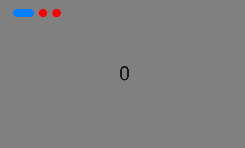

# Creating a Swiper

The [Swiper](../../../en/application-dev/reference/arkui-cj/cj-scroll-swipe-swiper.md) component provides the capability to display content in a swipeable carousel. As a container component, Swiper can cycle through multiple child components when they are added. This feature is commonly used to showcase recommended content on application homepages.

For complex page scenarios, Swiper's preloading mechanism can be utilized to construct and layout components during the main thread's idle time, optimizing the sliding experience.

## Layout and Constraints

As a container component, Swiper maintains its specified dimensions during operation if they are explicitly set. If dimensions are not specified, two scenarios exist: 
1. When `prevMargin` or `nextMargin` properties are set, Swiper inherits dimensions from its parent component.
2. Without these margin properties, Swiper automatically sizes itself based on child components.

## Loop Playback

The `loop` property controls continuous playback, defaulting to `true`.

When `loop` is enabled:
- Users can infinitely cycle forward/backward through pages
- When disabled (`loop=false`), navigation stops at first/last pages

- loop=true

  ```cangjie
  Swiper() {
  Text('0')
    .width(90.percent)
    .height(100.percent)
    .backgroundColor(Color.Gray)
    .textAlign(TextAlign.Center)
    .fontSize(30)

  Text('1')
    .width(90.percent)
    .height(100.percent)
    .backgroundColor(Color.Green)
    .textAlign(TextAlign.Center)
    .fontSize(30)

  Text('2')
    .width(90.percent)
    .height(100.percent)
    .backgroundColor(0xFEC0CD)
    .textAlign(TextAlign.Center)
    .fontSize(30)
  }
  .width(100.percent)
  .height(30.percent)
  .loop(true)
  ```

  

- loop=false

  ```cangjie
  Swiper() {
    // ...
  }
  .width(100.percent)
  .height(30.percent)
  .loop(false)
  ```

  

## Auto Play

The `autoPlay` property (default: `false`) enables automatic cycling of child components. 

When enabled:
- Components transition automatically
- `interval` property sets transition duration (default: 3000ms)

```cangjie
Swiper() {
  // ...
}
.loop(true)
.autoPlay(true)
.interval(1000)
```


## Indicator Styling

Swiper provides default pagination indicators (dots) centered below the component. The `indicator` property allows customization of:
- Position (top/bottom/left/right)
- Dot dimensions
- Active/inactive colors
- Mask effects

Arrow navigation is hidden by default.

- Default indicator style

  ```cangjie
  Swiper() {
      Text('0')
      .width(90.percent)
      .height(100.percent)
      .backgroundColor(Color.Gray)
      .textAlign(TextAlign.Center)
      .fontSize(30)

      Text('1')
      .width(90.percent)
      .height(100.percent)
      .backgroundColor(Color.Green)
      .textAlign(TextAlign.Center)
      .fontSize(30)

      Text('2')
      .width(90.percent)
      .height(100.percent)
      .backgroundColor(0xFEC0CD)
      .textAlign(TextAlign.Center)
      .fontSize(30)
      }
      .width(100.percent)
      .height(30.percent)
  ```

  

- Custom indicator style

  Configured with:
  - 30vp dot diameter
  - 0 left margin
  - Red inactive color
  - Blue active color

  ```cangjie
  Swiper() {
    // ...
  }
  .width(100.percent)
  .height(30.percent)
  .indicator(
    Indicator.dot()
      .left(0)
      .itemWidth(13)
      .itemHeight(13)
      .selectedItemWidth(16)
      .selectedItemHeight(13)
      .color(Color.Red)
      .selectedColor(0X007fff)
  )
  ```

  

## Navigation Methods

Swiper supports two navigation approaches:
1. Finger swiping
2. Indicator dot clicking

The following example demonstrates programmatic control via `SwiperController`:

 <!-- run -->

```cangjie
package ohos_app_cangjie_entry
import kit.ArkUI.*
import ohos.arkui.state_macro_manage.*

@Entry
@Component
class EntryView {
    private var swiperBackgroundColors: Array<Color> = [Color.Blue, Color.Black, Color.Gray, Color.Green, Color.White, Color.Red]
    private var swiperController: SwiperController = SwiperController();
    @State var animationModeStr: Bool = false
    @State var targetIndex: Int64 = 0
    func build() {
        Column(space: 5) {
            Swiper(controller: this.swiperController) {
                ForEach(
                    this.swiperBackgroundColors,
                    itemGeneratorFunc: {
                        item: Color, index: Int64 => Text(index.toString())
                            .width(250)
                            .height(250)
                            .backgroundColor(item)
                            .textAlign(TextAlign.Center)
                            .fontSize(30)
                    }
                )
            }
            .indicator(true)

            Row(12) {
                Button('showNext').onClick({
                    evt => this
                        .swiperController
                        .showNext(); // Navigate to next page via controller
                })
                Button('showPrevious').onClick({
                    evt => this
                        .swiperController
                        .showPrevious(); // Navigate to previous page via controller
                })
            }
            .margin(5)
            Row(12) {
                Text('Index:')
                Button(this.targetIndex.toString()).onClick(
                    {
                        evt => this.targetIndex = (this.targetIndex + 1) % this.swiperBackgroundColors.toArray().size
                    })
            }
            .margin(5)
            Row(12) {
                Text('AnimationMode:')
                Button(this.animationModeStr.toString()).onClick(
                    {
                        evt => if (this.animationModeStr == false) {
                            this.animationModeStr = true
                        } else {
                            this.animationModeStr = false
                        }
                    })
            }
            .margin(5)
        }
        .width(100.percent)
        .margin(top: 5)
    }
}
```


## Orientation

The `vertical` property controls swipe direction:
- `false` (default): Horizontal swiping
- `true`: Vertical swiping

- Horizontal swiping

  ```cangjie
  Swiper() {
    // ...
  }
  .indicator(true)
  .vertical(false)
  ```

  

- Vertical swiping

  ```cangjie
  Swiper() {
    // ...
  }
  .indicator(true)
  .vertical(true)
  ```

  

## Multi-item Display

The [displayCount](../../../en/application-dev/reference/arkui-cj/cj-scroll-swipe-swiper.md#func-displaycountint32) property enables showing multiple child components per page.

 <!-- run -->

```cangjie
package ohos_app_cangjie_entry
import kit.ArkUI.*
import ohos.arkui.state_macro_manage.*

@Entry
@Component
class EntryView {
    func build() {
        Column(space: 5) {
              Swiper() {
                  Text('0')
                    .width(250)
                    .height(250)
                    .backgroundColor(Color.Gray)
                    .textAlign(TextAlign.Center)
                    .fontSize(30)
                  Text('1')
                    .width(250)
                    .height(250)
                    .backgroundColor(Color.Green)
                    .textAlign(TextAlign.Center)
                    .fontSize(30)
                  Text('2')
                    .width(250)
                    .height(250)
                    .backgroundColor(0xFEC0CD)
                    .textAlign(TextAlign.Center)
                    .fontSize(30)
                  Text('3')
                    .width(250)
                    .height(250)
                    .backgroundColor(Color.Blue)
                    .textAlign(TextAlign.Center)
                    .fontSize(30)
                }
                .indicator(true)
                .displayCount(2)
        }
        .width(100.percent)
    }
}
```

