# Grid Layout (GridRow/GridCol)

<!--Del-->
> **Note:**
>
> Currently in the beta phase.
<!--DelEnd-->

## Overview

Grid layout is a universal auxiliary positioning tool that provides valuable reference for mobile device interface design. Its main advantages include:

1. **Regular Structure**: Grid layout offers a systematic structure to address dynamic layout challenges across multiple screen sizes and devices. By dividing the page into equal-width columns and rows, it facilitates precise element positioning and typesetting.

2. **Unified Positioning**: It establishes standardized positioning references, ensuring layout consistency across different devices. This reduces design and development complexity while improving efficiency.

3. **Flexible Spacing Control**: The grid system provides adaptable spacing adjustment methods to meet special layout requirements. By modifying column and row gaps, the overall page composition can be finely controlled.

4. **Auto-Wrapping and Responsiveness**: The grid automatically handles line breaks and adapts to one-to-many layouts. When elements exceed row/column capacity, they automatically wrap while maintaining responsive behavior across devices for flexible, adaptive layouts.

[GridRow](../reference/arkui-cj/cj-grid-layout-gridrow.md) serves as the grid container component and must be used in conjunction with grid item component [GridCol](../reference/arkui-cj/cj-grid-layout-gridcol.md) in grid layout scenarios.

## Grid Container GridRow

### Breakpoints in Grid System

The grid system uses device horizontal width ([screen density pixel value](../reference/arkui-cj/cj-common-pixelunits.md), unit: vp) as breakpoint criteria to define device width categories, establishing a comprehensive breakpoint rule set. Developers can implement distinct layout effects across different breakpoint ranges.

The default breakpoints classify device widths into four types (xs, sm, md, lg) with the following ranges:

| Breakpoint | Range (vp)       | Device Description       |
|:---- |:--------------- |:--------- |
| xs   | [0, 320)   | Extra small width devices |
| sm   | [320, 520) | Small width devices       |
| md   | [520, 840) | Medium width devices      |
| lg   | [840, +∞)  | Large width devices       |

In GridRow components, developers can customize breakpoint ranges using [breakpoints](../reference/arkui-cj/cj-grid-layout-gridrow.md#class-breakpoints), supporting up to 6 breakpoints. Beyond the default four, xl and xxl breakpoints can be enabled for six device size configurations (xs, sm, md, lg, xl, xxl).

| Breakpoint | Device Description       |
|:---- |:--------- |
| xs   | Extra small width devices |
| sm   | Small width devices       |
| md   | Medium width devices      |
| lg   | Large width devices       |
| xl   | Extra large width devices |
| xxl  | Super large width devices |

- Breakpoint positions are set via a monotonically increasing array. Since [breakpoints](../reference/arkui-cj/cj-grid-layout-gridrow.md#class-breakpoints) supports maximum 6 breakpoints, the array length cannot exceed 5.

    ```cangjie
    breakpoints: BreakPoints(value: [100.vp, 200.vp])
    ```

    This enables xs, sm, and md breakpoints: xs (<100.vp), sm (100.vp-200.vp), md (>200.vp).

    ```cangjie
    breakpoints: BreakPoints(value: [320.vp, 520.vp, 840.vp, 1080.vp])
    ```

    This enables five breakpoints: xs (<320.vp), sm (320.vp-520.vp), md (520.vp-840.vp), lg (840.vp-1080.vp), xl (>1080.vp).

- The grid system monitors window/container size changes for breakpoint triggers via the reference setting. Considering applications may display in non-fullscreen windows, using application window width as reference is more universal.

    Example: Using default 12 columns, dividing application width into six ranges where grid items occupy different columns per range.

    <!-- run -->

    ```cangjie
    package ohos_app_cangjie_entry
    import kit.ArkUI.*
    import ohos.arkui.state_macro_manage.*

    @Entry
    @Component
    class EntryView {
        @State
        var bgColors: Array<Color> = [Color(213,213,213), Color(150,150,150), Color(0,74,175), Color(39,135,217), Color(61,157,180), Color(23,169,141), Color(255,192,0), Color(170,10,33)];
        func build() {
            GridRow(
                columns: 12,
                breakpoints: BreakPoints(
                    value: [200.vp, 300.vp, 400.vp, 500.vp, 600.vp],
                    reference: BreakpointsReference.WindowSize
                ),
                direction: GridRowDirection.Row
            ) {
                ForEach(
                    bgColors,
                    itemGeneratorFunc: {
                        color: Color, index: Int64 => GridCol() {
                            Row() {
                                Text(index.toString())
                            }
                        }
                            .width(100.percent)
                            .height(50.vp)
                            .backgroundColor(color)
                            .span(GridColOptions(xs: 2, sm: 3, md: 4, lg: 6, xl:   8, xxl: 12))
                    }
                )
            }
        }
    }
    ```

    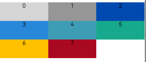

### Total Column Count

The columns property in GridRow sets the total number of columns in grid layout.

- Default columns value is 12, dividing the layout into 12 columns across all breakpoints when unset.

    <!-- run -->

    ```cangjie
    package ohos_app_cangjie_entry
    import kit.ArkUI.*
    import ohos.arkui.state_macro_manage.*

    @Entry
    @Component
    class EntryView {
        @State
        var bgColors: Array<Color> = [Color(213,213,213), Color(150,150,150), Color(0,74,175), Color(39,135,217), Color(61,157,180), Color(23,169,141), Color(255,192,0),Color(170,10,33),Color(213,213,213),Color(150,150,150), Color(0,74,175), Color(39,135,217)];
        func build() {
            GridRow(columns: GridRowOptions(xs: 12, sm: 12, md: 12, lg: 12, xl:    12, xxl: 12)) {
                ForEach(
                    bgColors,
                    itemGeneratorFunc: {
                        color: Color, index: Int64 => GridCol() {
                            Row() {
                                Text(index.toString())
                            }
                            .width(100.percent)
                            .height(50)
                        }.backgroundColor(color)
                    }
                )
            }
        }
    }
    ```

    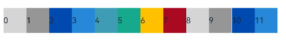

- Custom columns value divides the layout into specified columns across all devices. Below examples show layouts with 4 and 8 columns respectively (items default to 1 column):

    <!-- run -->

    ```cangjie
    package ohos_app_cangjie_entry
    import kit.ArkUI.*
    import ohos.arkui.state_macro_manage.*

    @Entry
    @Component
    class EntryView {
        var bgColors: Array<Color> = [Color(213,213,213), Color(150,150,150), Color(0,74,175), Color(39,135,217), Color(61,157,180), Color(23,169,141), Color(255,192,0), Color(170,10,33)];
        @State
        var currentBp: String = "";
        func build() {
            Column {
                Text("columns: 4")
                    .fontSize(20)
                    .fontColor(Color.Black)
                    .width(90.percent)
                Row() {
                    GridRow(columns: 4) {
                        ForEach(
                            bgColors,
                            itemGeneratorFunc: {
                                color: Color, index: Int64 => GridCol() {
                                    Row() {
                                        Text(index.toString())
                                    }
                                        .width(100.percent)
                                        .height(50)
                                }.backgroundColor(color)
                            }
                        )
                    }
                    .width(100.percent)
                    .height(100.percent)
                    .onBreakpointChange({bp => currentBp = bp})
                }
                .height(160)
                .border(color: Color.Blue, width: 2)
                .width(90.percent)
                Text("columns: 8")
                    .fontSize(20)
                    .fontColor(Color.Black)
                    .width(90.percent)
                Row() {
                    GridRow(columns: 8) {
                        ForEach(
                            bgColors,
                            itemGeneratorFunc: {
                                color: Color, index: Int64 => GridCol() {
                                    Row() {
                                        Text(index.toString())
                                    }
                                        .width(100.percent)
                                        .height(50)
                                }.backgroundColor(color)
                            }
                        )
                    }
                    .width(100.percent)
                    .height(100.percent)
                    .onBreakpointChange({bp => currentBp = bp})
                }
                .height(160)
                .border(color: Color.Blue, width: 2)
                .width(90.percent)
            }
        }
    }
    ```

    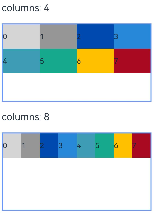

- When columns type is [GridRowOptions](../reference/arkui-cj/cj-grid-layout-gridrow.md#class-gridrowoptions), it supports total column configuration for six device sizes (xs, sm, md, lg, xl, xxl), allowing different values per size.

    <!-- run-->

    ```cangjie
    package ohos_app_cangjie_entry
    import kit.ArkUI.*
    import ohos.arkui.state_macro_manage.*

    @Entry
    @Component
    class EntryView {
        @State
        var bgColors: Array<Color> = [Color(213,213,213), Color(150,150,150), Color(0,74,175), Color(39,135,217), Color(61,157,180), Color(23,169,141), Color(255,192,0), Color(170,10,33)];
        func build() {
            GridRow(
                columns: GridRowOptions(xs: 12, sm: 4, md: 8, lg: 12, xl: 12,  xxl: 12),
                breakpoints: BreakPoints(
                    value: [200.vp, 300.vp, 400.vp, 500.vp, 600.vp], // Monotonically increasing array for breakpoints
                    reference: BreakpointsReference.WindowSize
                )
            ) {
                ForEach(
                    bgColors,
                    itemGeneratorFunc: {
                        color: Color, index: Int64 => GridCol() {
                            Row() {
                                Text(index.toString())
                            }
                            .width(100.percent)
                            .height(50.vp)
                        }.backgroundColor(color)
                    }
                )
            }
        }
    }
    ```

    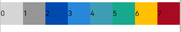

    If only sm and md columns are set, smaller sizes default to 12 columns while larger sizes inherit the previous size's setting (e.g., only sm:4, md:8 results in xs:12, lg:8, xl:8, xxl:8).

### Arrangement Direction

The direction property in GridRow specifies item arrangement within the container, accepting GridRowDirection.Row (left-to-right) or GridRowDirection.RowReverse (right-to-left) for flexible layout designs.

- Default left-to-right arrangement:

    ```cangjie
    GridRow(direction: GridRowDirection.Row ){}
    ```

    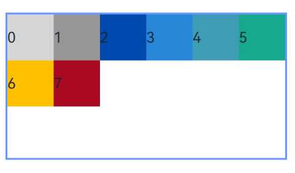

- Right-to-left arrangement:

    ```cangjie
    GridRow(direction: GridRowDirection.RowReverse ){}
    ```

    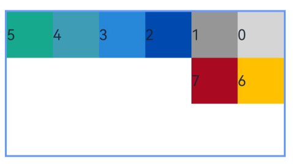

### Item Spacing

The gutter property controls horizontal and vertical spacing between grid items.

- When gutter is Length type, it sets equal horizontal/vertical spacing. This example sets 10vp gaps:

    ```cangjie
    GridRow( gutter: 10.vp ){}
    ```

    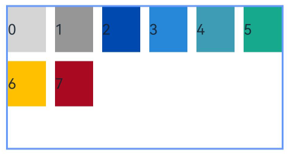

- When gutter is GutterOption type, x sets horizontal spacing and y sets vertical spacing:

    ```cangjie
    GridRow( gutter: GutterOption(x: 20.vp, y: 50.vp) ){}
    ```

    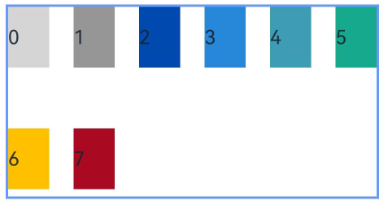

## Grid Item GridCol

As GridRow's child component, GridCol accepts parameters or property settings for span (column span), offset (column offset), and order (arrangement sequence).

- Setting span:

    ```cangjie
    GridCol( span: 2 ){}
    GridCol(){}.span(2)
    GridCol(){}.span(GridColOptions(xs:1, sm:2, md:3, lg:4, xl:12, xxl: 12))
    ```

- Setting offset:

    ```cangjie
    GridCol( offset: 2 ){}
    GridCol(){}.gridColOffset((GridColOptions(xs:1, sm:2, md:3, lg:4, xl:12, xxl: 12)))
    ```

- Setting order:

    ```cangjie
    GridCol( order: 2 ){}
    GridCol(){}.order(2)
    GridCol(){}.order(GridColOptions(xs:1, sm:2, md:3, lg:4, xl:12, xxl: 12))
    ```

### span

Determines item width by specifying occupied columns (default: 1).

- Int32 type applies uniform column span across all devices:

    <!-- run -->

    ```cangjie
    package ohos_app_cangjie_entry
    import kit.ArkUI.*
    import ohos.arkui.state_macro_manage.*

    @Entry
    @Component
    class EntryView {
        @State
        var bgColors: Array<Color> = [Color(213,213,213), Color(150,150,150), Color(0,74,175), Color(39,135,217), Color(61,157,180), Color(23,169,141), Color(255,192,0),Color(170,10,33)];
        func build() {
            GridRow(columns: 8) {
                ForEach(
                    bgColors,
                    itemGeneratorFunc: {
                        color: Color, index: Int64 => GridCol(span: 2) {
                            Row() {
                                Text(index.toString())
                            }
                            .width(100.percent)
                            .height(50.vp)
                        }.backgroundColor(color)
                    }
                )
            }
        }
    }
    ```

    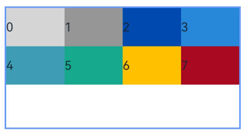

- [GridColOptions](../reference/arkui-cj/cj-grid-layout-gridcol.md#class-gridcoloptions) type supports per-device column span configuration:

    <!-- run -->

    ```cangjie
    package ohos_app_cangjie_entry
    import kit.ArkUI.*
    import ohos.arkui.state_macro_manage.*

    @Entry
    @Component
    class EntryView {
        @State
        var bgColors: Array<Color> = [Color(213,213,213), Color(150,150,150), Color(0,74,175), Color(39,135,217), Color(61,157,180), Color(23,169,141), Color(255,192,0), Color(170,10,33)];
        func build() {
            GridRow(columns: 8) {
                ForEach(
                    bgColors,
                    itemGeneratorFunc: {
                        color: Color, index: Int64 => GridCol() {
                            Row() {
                                Text(index.toString())
                            }
                            .width(100.percent)
                            .height(50.vp)
                        }
                        .backgroundColor(color)
                        .span(GridColOptions(xs: 1, sm: 2, md: 3, lg: 4, xl: 12,   xxl: 12))
                    }
                )
            }
        }
    }
    ```

    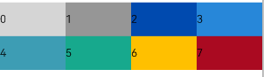

### offset

Specifies column offset from previous item (default: 0).

- Int32 type applies uniform offset:

    <!-- run -->

    ```cangjie
    package ohos_app_cangjie_entry
    import kit.ArkUI.*
    import ohos.arkui.state_macro_manage.*

    @Entry
    @Component
    class EntryView {
        @State
        var bgColors: Array<Color> = [Color(213,213,213), Color(150,150,150), Color(0,74,175), Color(39,135,217), Color(61,157,180), Color(23,169,141), Color(255,192,0), Color(170,10,33)];
        func build() {
            GridRow() {
                ForEach(
                    bgColors,
                    itemGeneratorFunc: {
                        color: Color, index: Int64 => GridCol(offset: 2) {
                            Row() {
                                Text(index.toString())
                            }
                            .width(100.percent)
                            .height(50.vp)
                        }.backgroundColor(color)
                    }
                )
            }
        }
    }
    ```

    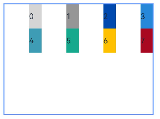

    Default 12-column grid with 1-column items and 2-column offsets results in 3-column units (item+gap), fitting four items per row.

- [GridColOptions](../reference/arkui-cj/cj-grid-layout-gridcol.md#class-gridcoloptions) type supports per-device offset configuration:

    <!-- run -->

    ```cangjie
    package ohos_app_cangjie_entry
    import kit.ArkUI.*
    import ohos.arkui.state_macro_manage.*

    @Entry
    @Component
    class EntryView {
        @State
        var bgColors: Array<Color> = [Color(213,213,213), Color(150,150,150), Color(0,74,175), Color(39,135,217), Color(61,157,180), Color(23,169,141), Color(255,192,0), Color(170,10,33)];
        func build() {
            GridRow() {
                ForEach(
                    bgColors,
                    itemGeneratorFunc: {
                        color: Color, index: Int64 => GridCol() {
## Nested Usage of Grid Components

Grid components can also be used in a nested manner to achieve complex layouts.

In the following example, the grid divides the entire space into 12 parts. The first-level `GridRow` nests `GridCol`, splitting into a large middle area and a "footer" area. The second-level `GridRow` nests `GridCol`, dividing into "left" and "right" areas. The space of child components is divided according to the parent component's space allocation in the upper level. The pink area represents the 12 columns of the screen space, while the green and blue areas represent the 12 columns of the parent `GridCol` component, sequentially dividing the space.
 <!-- run -->

```cangjie
package ohos_app_cangjie_entry
import kit.ArkUI.*
import ohos.arkui.state_macro_manage.*

@Entry
@Component
class EntryView {
    func build() {
        GridRow() {
            GridCol() {
                GridRow() {
                    GridCol() {
                        Row() {
                            Text('left').fontSize(24)
                        }
                        .justifyContent(FlexAlign.Center)
                        .height(90.percent)
                    }
                    .backgroundColor(0xff41dbaa)
                    .span(GridColOptions(xs: 12, sm: 2, md: 12, lg: 12, xl: 12, xxl: 12))
                    GridCol() {
                        Row() {
                            Text('right').fontSize(24)
                        }
                        .justifyContent(FlexAlign.Center)
                        .height(90.percent)
                    }
                    .backgroundColor(0xff4168db)
                    .span(GridColOptions(xs: 12, sm: 10, md: 12, lg: 12, xl: 12, xxl: 12))
                }.backgroundColor(0x19000000)
            }.span(GridColOptions(xs: 12, sm: 12, md: 12, lg: 12, xl: 12, xxl: 12))

            GridCol() {
                Row() {
                    Text('footer')
                        .width(100.percent)
                        .textAlign(TextAlign.Center)
                }
                .width(100.percent)
                .height(10.percent)
                .backgroundColor(0xFEC0CD)
            }.span(GridColOptions(xs: 12, sm: 12, md: 12, lg: 12, xl: 12, xxl: 12))
        }
        .width(100.percent)
        .height(300)
    }
}
```

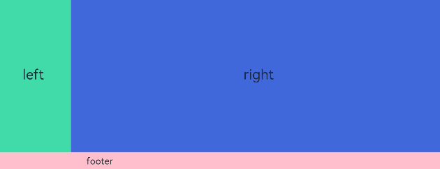

In summary, the grid component offers rich customization capabilities, making it exceptionally flexible and powerful. Simply define parameters such as `Columns`, `Margin`, `Gutter`, and `span` at different breakpoints to determine the final layout, without needing to consider specific device types or states (e.g., portrait or landscape orientation).