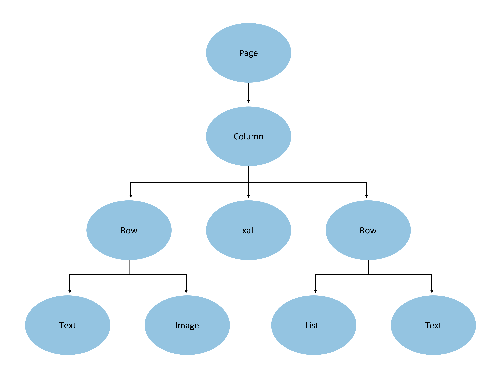
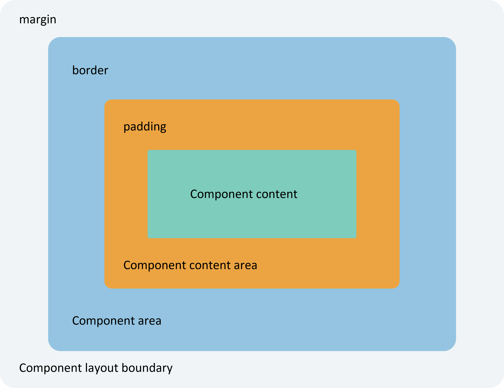

# Layout Overview

<!--Del-->
> **Note:**
>
> Currently in the beta phase.
<!--DelEnd-->

Components are arranged sequentially according to layout requirements to form application pages. In declarative UI, all pages are composed of custom components. Developers can choose appropriate layouts for page development based on their needs.

Layout refers to managing the size and position of UI components on user pages using specific components or attributes. In actual development, the following process should be followed to ensure overall layout effectiveness:

- Determine the page layout structure.
- Analyze the composition of elements on the page.
- Select suitable layout container components or attributes to control the position and size of each element on the page.

## Layout Structure

Layouts are typically hierarchical. A common page structure is shown below:

**Figure 1** Common Page Structure Diagram

To achieve the above effect, developers need to declare corresponding elements on the page. Here, `Page` represents the root node of the page, while elements like `Column`/`Row` are system components. For different page structures, ArkUI provides various layout components to help developers achieve the desired layout effects, such as `Row` for implementing linear layouts.

## Composition of Layout Elements

Layout-related container components can form corresponding layout effects. For example, the `List` component can constitute a linear layout.

**Figure 2** Layout Element Composition Diagram

- **Component Area (Blue Square)**: Represents the size of the component. The [width](../reference/arkui-cj/cj-universal-attribute-size.md#func-widthoptionlength) and [height](../reference/arkui-cj/cj-universal-attribute-size.md#func-heightoptionlength) attributes are used to set the size of the component area.
- **Component Content Area (Yellow Square)**: The size of the component content area is the component area size minus the component's [border](../reference/arkui-cj/cj-universal-attribute-border.md) value. The component content area size serves as the layout constraint for the component content (or child components) during size calculation.
- **Component Content (Green Square)**: The size occupied by the component content itself, such as the size of text content. The component content and component content area may not match. For example, if fixed `width` and `height` are set, the component content size is the set `width` and `height` minus `padding` and `border` values. However, the text content size is determined by the text layout engine, which may result in the actual text size being smaller than the set component content area size. When the component content and component content area sizes differ, the [align](../reference/arkui-cj/cj-universal-attribute-layoutconstraints.md#func-align) attribute takes effect, defining the alignment of the component content within the component content area, such as center alignment.
- **Component Layout Boundary (Dashed Line)**: When the [margin](../reference/arkui-cj/cj-universal-attribute-size.md#func-marginlength) attribute is set for a component, the component layout boundary is the component area plus the margin size.

## How to Choose a Layout

Declarative UI provides the following 10 common layouts. Developers can select the appropriate layout for page development based on actual application scenarios.

| Layout | Application Scenario |
|:---|:---|
| [Linear Layout](./cj-layout-development-linear.md) (`Row`, `Column`) | Preferred when there are more than one child element in the layout and they can be arranged linearly. |
| [Stack Layout](./cj-layout-development-stack-layout.md) (`Stack`) | Preferred when components need a stacking effect. The stacking effect of the stack layout does not occupy or affect the layout space of other child components in the same container. |
| [Flex Layout](./cj-layout-development-flex-layout.md) (`Flex`) | The flex layout is similar to the linear layout but differs in that it allows child components to compress or stretch by default. Preferred when child components need to calculate stretch or compression ratios, enabling better visual filling effects for multiple child components within containers. |
| [Relative Layout](./cj-layout-development-relative-layout.md) (`RelativeContainer`) | The relative layout is a 2D layout method that does not follow linear layout rules, offering more freedom. By setting anchor rules (`AlignRules`) on child components, child components can align their positions on the horizontal and vertical axes with the container or other child components. Anchor rules naturally support compression, stretching, stacking, or multi-line effects for child elements. Recommended for complex page element distributions or when linear layouts would result in deep nesting. |
| [Grid Layout](./cj-layout-development-grid-layout.md) (`GridRow`, `GridCol`) | Grids are universal auxiliary positioning tools for multi-device scenarios, dividing space into regular grids. Unlike fixed space divisions in grid layouts, grids can achieve different layouts for different devices, offering more flexible space division. This significantly reduces design and development costs for adapting to different screen sizes, ensuring a more orderly and rhythmic design and development process while maintaining consistency and coordination across devices. Recommended when content is the same but layouts differ. |
| [List](./cj-layout-development-create-list.md) (`List`) | Lists efficiently display structured, scrollable information. In ArkUI, lists support vertical and horizontal layouts and adaptive cross-axis arrangement. They are suitable for presenting similar data types or datasets, such as images and text. |
| [Grid](./cj-layout-development-create-grid.md) (`Grid`) | Grid layouts excel at evenly dividing pages and controlling child element proportions. They can specify the number of grids occupied by elements and span rows or columns. When grid container sizes change, all child elements and spacing adjust proportionally. Recommended for layouts requiring fixed proportions or evenly distributed space, such as calculators, photo albums, and calendars. |
| [Swiper](./cj-layout-development-create-looping.md) (`Swiper`) | Swiper components are typically used for ad rotation or image previews. |
| [Tabs](./cj-layout-development-tabs.md) (`Tabs`) | Tabs enable quick switching of view content within a page, improving information retrieval efficiency and simplifying the amount of information users receive at once. |

## Layout Position

The `position`, `offset`, and other attributes affect the position of layout containers relative to themselves or other components.

| Positioning Capability | Application Scenario | Implementation Method |
|:---|:---|:---|
| Absolute Positioning | Absolute positioning is less adaptable for devices of different sizes and has limitations in screen adaptation. | Use [position](../reference/arkui-cj/cj-universal-attribute-location.md#func-positionlength-length) to achieve absolute positioning, setting the offset of the element's top-left corner relative to the parent container's top-left corner. In layout containers, this attribute does not affect the parent container's layout but adjusts the position during rendering. |
| Relative Positioning | Relative positioning does not脱离文档流脱离文档流脱离文档流脱离文档流脱离文档流脱离文档流脱离文档流脱离文档流脱离文档流脱离文档流脱离文档流脱离文档流脱离文档流脱离文档流脱离文档流脱离文档流脱离文档流脱离文档流脱离文档流脱离文档流脱离文档流脱离文档流脱离文档流脱离文档流脱离文档流脱离文档流脱离文档流脱离文档流脱离文档流脱离文档流脱离文档流脱离文档流脱离文档流脱离文档流脱离文档流脱离文档流脱离文档流脱离文档流脱离文档流脱离文档流脱离文档流脱离文档流脱离文档流脱离文档流脱离文档流脱离文档流脱离文档流脱离文档流脱离文档流脱离文档流脱离文档流脱离文档流脱离文档流脱离文档流脱离文档流脱离文档流脱离文档流脱离文档流脱离文档流脱离文档流脱离文档流脱离文档流脱离文档流脱离文档流脱离文档流脱离文档流脱离文档流脱离文档流脱离文档流脱离文档流脱离文档流脱离文档流脱离文档流脱离文档流脱离文档流脱离文档流脱离文档流脱离文档流脱离文档流脱离文档流脱离文档流脱离文档流脱离文档流脱离文档流脱离文档流脱离文档流脱离文档流脱离文档流脱离文档流脱离文档流脱离文档流脱离文档流脱离文档流脱离文档流脱离文档流脱离文档流脱离文档流脱离文档流脱离文档流脱离文档流脱离文档流脱离文档流脱离文档流脱离文档流脱离文档流脱离文档流脱离文档流脱离文档流脱离文档流脱离文档流脱离文档流脱离文档流脱离文档流脱离文档流脱离文档流脱离文档流脱离文档流脱离文档流脱离文档流脱离文档流脱离文档流脱离文档流脱离文档流脱离文档流脱离文档流脱离文档流脱离文档流脱离文档流脱离文档流脱离文档流脱离文档流脱离文档流脱离文档流脱离文档流脱离文档流脱离文档流脱离文档流脱离文档流脱离文档流脱离文档流脱离文档流脱离文档流脱离文档流脱离文档流脱离文档流脱离文档流脱离文档流脱离文档流脱离文档流脱离文档流脱离文档流脱离文档流脱离文档流脱离文档流脱离文档流脱离文档流脱离文档流脱离文档流脱离文档流脱离文档流脱离文档流脱离文档流脱离文档流脱离文档流脱离文档流脱离文档流脱离文档流脱离文档流脱离文档流脱离文档流脱离文档流脱离文档流脱离文档流脱离文档流脱离文档流脱离文档流脱离文档流脱离文档流脱离文档流脱离文档流脱离文档流脱离文档流脱离文档流脱离文档流脱离文档流脱离文档流脱离文档流脱离文档流脱离文档流脱离文档流脱离文档流脱离文档流脱离文档流脱离文档流脱离文档流脱离文档流脱离文档流脱离文档流脱离文档流脱离文档流脱离文档流脱离文档流脱离文档流脱离文档流脱离文档流脱离文档流脱离文档流脱离文档流脱离文档流脱离文档流脱离文档流脱离文档流脱离文档流脱离文档流脱离文档流脱离文档流脱离文档流脱离文档流脱离文档流脱离文档流脱离文档流脱离文档流脱离文档流脱离文档流脱离文档流脱离文档流脱离文档流脱离文档流脱离文档流脱离文档流脱离文档流脱离文档流脱离文档流脱离文档流脱离文档流脱离文档流脱离文档流脱离文档流脱离文档流脱离文档流脱离文档流脱离文档流脱离文档流脱离文档流脱离文档流脱离文档流脱离文档流脱离文档流脱离文档流脱离文档流脱离文档流脱离文档流脱离文档流脱离文档流脱离文档流脱离文档流脱离文档流脱离文档流脱离文档流脱离文档流脱离文档流脱离文档流脱离文档流脱离文档流脱离文档流脱离文档流脱离文档流脱离文档流脱离文档流脱离文档流脱离文档流脱离文档流脱离文档流脱离文档流脱离文档流脱离文档流脱离文档流脱离文档流脱离文档流脱离文档流脱离文档流脱离文档流脱离文档流脱离文档流脱离文档流脱离文档流脱离文档流脱离文档流脱离文档流脱离文档流脱离文档流脱离文档流脱离文档流脱离文档流脱离文档流脱离文档流脱离文档流脱离文档流脱离文档流脱离文档流脱离文档流脱离文档流脱离文档流脱离文档流脱离文档流脱离文档流脱离文档流脱离文档流脱离文档流脱离文档流脱离文档流脱离文档流脱离文档流脱离文档流脱离文档流脱离文档流脱离文档流脱离文档流脱离文档流脱离文档流脱离文档流脱离文档流脱离文档流脱离文档流脱离文档流脱离文档流脱离文档流脱离文档流脱离文档流脱离文档流脱离文档流脱离文档流脱离文档流脱离文档流脱离文档流脱离文档流脱离文档流脱离文档流脱离文档流脱离文档流脱离文档流脱离文档流脱离文档流脱离文档流脱离文档流脱离文档流脱离文档流脱离文档流脱离文档流脱离文档流脱离文档流脱离文档流脱离文档流脱离文档流脱离文档流脱离文档流脱离文档流脱离文档流脱离文档流脱离文档流脱离文档流脱离文档流脱离文档流脱离文档流脱离文档流脱离文档流脱离文档流脱离文档流脱离文档流脱离文档流脱离文档流脱离文档流脱离文档流脱离文档流脱离文档流脱离文档流脱离文档流脱离文档流脱离文档流脱离文档流脱离文档流脱离文档流脱离文档流脱离文档流脱离文档流脱离文档流脱离文档流脱离文档流脱离文档流脱离文档流脱离文档流脱离文档流脱离文档流脱离文档流脱离文档流脱离文档流脱离文档流脱离文档流脱离文档流脱离文档流脱离文档流脱离文档流脱离文档流脱离文档流脱离文档流脱离文档流脱离文档流脱离文档流脱离文档流脱离文档流脱离文档流脱离文档流脱离文档流脱离文档流脱离文档流脱离文档流脱离文档流脱离文档流脱离文档流脱离文档流脱离文档流脱离文档流脱离文档流脱离文档流脱离文档流脱离文档流脱离文档流脱离文档流脱离文档流脱离文档流脱离文档流脱离文档流脱离文档流脱离文档流脱离文档流脱离文档流脱离文档流脱离文档流脱离文档流脱离文档流脱离文档流脱离文档流脱离文档流脱离文档流脱离文档流脱离文档流脱离文档流脱离文档流脱离文档流脱离文档流脱离文档流脱离文档流脱离文档流脱离文档流脱离文档流脱离文档流脱离文档流脱离文档流脱离文档流脱离文档流脱离文档流脱离文档流脱离文档流脱离文档流脱离文档流脱离文档流脱离文档流脱离文档流脱离文档流脱离文档流脱离文档流脱离文档流脱离文档流脱离文档流脱离文档流脱离文档流脱离文档流脱离文档流脱离文档流脱离文档流脱离文档流脱离文档流脱离文档流脱离文档流脱离文档流脱离文档流脱离文档流脱离文档流脱离文档流脱离文档流脱离文档流脱离文档流脱离文档流脱离文档流脱离文档流脱离文档流脱离文档流脱离文档流脱离文档流脱离文档流脱离文档流脱离文档流脱离文档流脱离文档流脱离文档流脱离文档流脱离文档流脱离文档流脱离文档流脱离文档流脱离文档流脱离文档流脱离文档流脱离文档流脱离文档流脱离文档流脱离文档流脱离文档流脱离文档流脱离文档流脱离文档流脱离文档流脱离文档流脱离文档流脱离文档流脱离文档流脱离文档流脱离文档流脱离文档流脱离文档流脱离文档流脱离文档流脱离文档流脱离文档流脱离文档流脱离文档流脱离文档流脱离文档流脱离文档流脱离文档流脱离文档流脱离文档流脱离文档流脱离文档流脱离文档流脱离文档流脱离文档流脱离文档流脱离文档流脱离文档流脱离文档流脱离文档流脱离文档流脱离文档流脱离文档流脱离文档流脱离文档流脱离文档流脱离文档流脱离文档流脱离文档流脱离文档流脱离文档流脱离文档流脱离文档流脱离文档流脱离文档流脱离文档流脱离文档流脱离文档流脱离文档流脱离文档流脱离文档流脱离文档流脱离文档流脱离文档流脱离文档流脱离文档流脱离文档流脱离文档流脱离文档流脱离文档流脱离文档流脱离文档流脱离文档流脱离文档流脱离文档流脱离文档流脱离文档流脱离文档流脱离文档流脱离文档流脱离文档流脱离文档流脱离文档流脱离文档流脱离文档流脱离文档流脱离文档流脱离文档流脱离文档流脱离文档流脱离文档流脱离文档流脱离文档流脱离文档流脱离文档流脱离文档流脱离文档流脱离文档流脱离文档流脱离文档流脱离文档流脱离文档流脱离文档流脱离文档流脱离文档流脱离文档流脱离文档流脱离文档流脱离文档流脱离文档流脱离文档流脱离文档流脱离文档流脱离文档流脱离文档流脱离文档流脱离文档流脱离文档流脱离文档流脱离文档流脱离文档流脱离文档流脱离文档流脱离文档流脱离文档流脱离文档流脱离文档流脱离文档流脱离文档流脱离文档流脱离文档流脱离文档流脱离文档流脱离文档流脱离文档流脱离文档流脱离文档流脱离文档流脱离文档流脱离文档流脱离文档流脱离文档流脱离文档流脱离文档流脱离文档流脱离文档流脱离文档流脱离文档流脱离文档流脱离文档流脱离文档流脱离文档流脱离文档流脱离文档流脱离文档流脱离文档流脱离文档流脱离文档流脱离文档流脱离文档流脱离文档流脱离文档流脱离文档流脱离文档流脱离文档流脱离文档流脱离文档流脱离文档流脱离文档流脱离文档流脱离文档流脱离文档流脱离文档流脱离文档流脱离文档流脱离文档流脱离文档流脱离文档流脱离文档流脱离文档流脱离文档流脱离文档流脱离文档流脱离文档流脱离文档流脱离文档流脱离文档流脱离文档流脱离文档流脱离文档流脱离文档流脱离文档流脱离文档流脱离文档流脱离文档流脱离文档流脱离文档流脱离文档流脱离文档流脱离文档流脱离文档流脱离文档流脱离文档流脱离文档流脱离文档流脱离文档流脱离文档流脱离文档流脱离文档流脱离文档流脱离文档流脱离文档流脱离文档流脱离文档流脱离文档流脱离文档流脱离文档流脱离文档流脱离文档流脱离文档流脱离文档流脱离文档流脱离文档流脱离文档流脱离文档流脱离文档流脱离文档流脱离文档流脱离文档流脱离文档流脱离文档流脱离文档流脱离文档流脱离文档流脱离文档流脱离文档流脱离文档流脱离文档流脱离文档流脱离文档流脱离文档流脱离文档流脱离文档流脱离文档流脱离文档流脱离文档流脱离文档流脱离文档流脱离文档流脱离文档流脱离文档流脱离文档流脱离文档流脱离文档流脱离文档流脱离文档流脱离文档流脱离文档流脱离文档流脱离文档流脱离文档流脱离文档流脱离文档流脱离文档流脱离文档流脱离文档流脱离文档流脱离文档流脱离文档流脱离文档流脱离文档流脱离文档流脱离文档流脱离文档流脱离文档流脱离文档流脱离文档流脱离文档流脱离文档流脱离文档流脱离文档流脱离文档流脱离文档流脱离文档流脱离文档流脱离文档流脱离文档流脱离文档流脱离文档流脱离文档流脱离文档流脱离文档流脱离文档流脱离文档流脱离文档流脱离文档流脱离文档流脱离文档流脱离文档流脱离文档流脱离文档流脱离文档流脱离文档流脱离文档流脱离文档流脱离文档流脱离文档流脱离文档流脱离文档流脱离文档流脱离文档流脱离文档流脱离文档流脱离文档流脱离文档流脱离文档流脱离文档流脱离文档流脱离文档流脱离文档流脱离文档流脱离文档流脱离文档流脱离文档流脱离文档流脱离文档流脱离文档流脱离文档流脱离文档流脱离文档流脱离文档流脱离文档流脱离文档流脱离文档流脱离文档流脱离文档流脱离文档流脱离文档流脱离文档流脱离文档流脱离文档流脱离文档流脱离文档流脱离文档流脱离文档流脱离文档流脱离文档流脱离文档流脱离文档流脱离文档流脱离文档流脱离文档流脱离文档流脱离文档流脱离文档流脱离文档流脱离文档流脱离文档流脱离文档流脱离文档流脱离文档流脱离文档流脱离文档流脱离文档流脱离文档流脱离文档流脱离