# RelativeContainer

## Overview

During application development, designing complex interfaces often involves nesting multiple components of the same or different types. Excessive nesting depth or too many nested components can introduce additional overhead. Optimizing the layout approach can effectively enhance performance and reduce time costs.

RelativeContainer is a container that employs relative layout, supporting the definition of positional relationships among child elements within the container. It is suitable for complex interface scenarios, facilitating the alignment and arrangement of multiple child components. Child elements can specify sibling elements or the parent container as anchor points for relative positioning. Figure 1 illustrates a conceptual diagram of RelativeContainer, where dashed lines indicate dependency relationships for positioning.

**Figure 1** Relative Layout Schematic

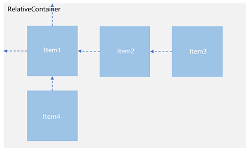

Child elements do not strictly follow the dependency relationships shown above. For example, Item4 can use either Item2 or the parent RelativeContainer as its anchor point.

## Basic Concepts

- **Reference Boundary**: Specifies which boundary of the current component aligns with the anchor point.
  
- **Anchor Point**: Defines the element used as the reference for positioning the current element.
  
- **Alignment Mode**: Determines whether the current element aligns with the anchor point's top, center, or bottom (vertical), or left, center, or right (horizontal).

## Setting Dependency Relationships

### Setting Reference Boundaries

Specifies which boundary of the current component aligns with the anchor point. Reference boundaries for child components within the container are differentiated by horizontal and vertical directions.

- **Horizontal Direction**: Component boundaries can align with the anchor point based on start (left), middle (center), or end (right). When all three boundaries are set, only start (left) and middle (center) take effect.

    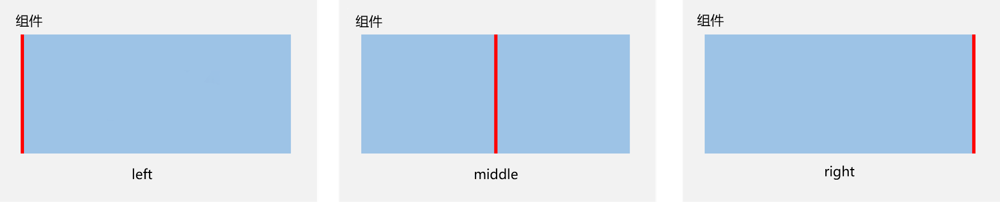

- **Vertical Direction**: Component boundaries can align with the anchor point based on top, center, or bottom. When all three boundaries are set, only top and center take effect.

    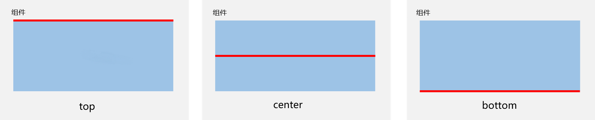

### Setting Anchor Points

Anchor points define the positional dependencies of child elements relative to their parent or sibling elements. Specifically, child elements can anchor their positions to the RelativeContainer, guidelines, barriers, or other child elements.

To precisely define anchor points, child elements of RelativeContainer must have unique component identifiers (id) for specifying anchor information. The parent RelativeContainer's identifier defaults to `__container__`, while other child elements' identifiers are set via the [id](../../../en/application-dev/reference/arkui-cj/cj-universal-attribute-componentid.md) attribute.

> **Note:**
>
> - Components without an id can still be displayed but cannot be referenced as anchor points by other components. The RelativeContainer will auto-generate an id for such components, but the pattern of these ids cannot be perceived by the application. Guideline and barrier ids must be unique to avoid conflicts with any components. In case of duplicates, the priority order is: component > guideline > barrier.
> - Avoid creating dependency loops when setting anchor points between components (except for chain dependencies). Dependency loops will prevent child components from having a positioning reference, ultimately making them unrenderable.

- **Parent RelativeContainer as Anchor Point**: `__container__` represents the container's component id.

    <!-- run -->

    ```cangjie
    package ohos_app_cangjie_entry
    import kit.ArkUI.*
    import ohos.arkui.state_macro_manage.*

    @Entry
    @Component
    class EntryView {
        func build() {
            RelativeContainer() {
                Row() {
                    Text('row1')
                }
                .justifyContent(FlexAlign.Center)
                .width(100)
                .height(100)
                .backgroundColor(0xa3cf62)
                .alignRules(
                    AlignRuleOption(
                        top: VerticalAlignment("__container__", VerticalAlign.Top),
                        left: HorizontalAlignment("__container__", HorizontalAlign.Start)
                    )
                )
                .id("row1")

                Row() {
                    Text('row2')
                }
                .justifyContent(FlexAlign.Center)
                .width(100)
                .height(100)
                .backgroundColor(0x00ae9d)
                .alignRules(
                    AlignRuleOption(
                        top: VerticalAlignment("__container__", VerticalAlign.Top),
                        right: HorizontalAlignment("__container__", HorizontalAlign.End)
                    )
                )
                .id("row2")
            }
            .width(300)
            .height(300)
            .margin(left: 20)
            .border(width: 2, color: 0x6699FF)
        }
    }
    ```

    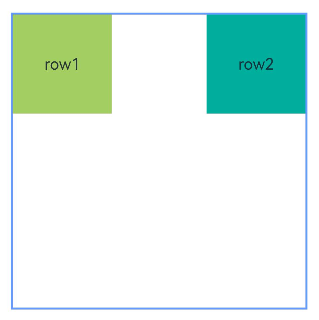

- **Sibling Element as Anchor Point**.

    <!-- run -->

    ```cangjie
    package ohos_app_cangjie_entry
    import kit.ArkUI.*
    import ohos.arkui.state_macro_manage.*

    @Entry
    @Component
    class EntryView {
        func build() {
            RelativeContainer() {
                Row() {
                    Text('row1')
                }
                .justifyContent(FlexAlign.Center)
                .width(100)
                .height(100)
                .backgroundColor(0x00ae9d)
                .alignRules(
                    AlignRuleOption(
                        top: VerticalAlignment("__container__", VerticalAlign.Top),
                        left: HorizontalAlignment("__container__", HorizontalAlign.Start)
                    )
                )
                .id("row1")

                Row() {
                    Text('row2')
                }
                .justifyContent(FlexAlign.Center)
                .width(100)
                .height(100)
                .backgroundColor(0xa3cf62)
                .alignRules(
                    AlignRuleOption(
                        top: VerticalAlignment("row1", VerticalAlign.Bottom),
                        left: HorizontalAlignment("row1", HorizontalAlign.Start)
                    )
                )
                .id("row2")
            }
            .width(300)
            .height(300)
            .margin(left: 20)
            .border(width: 2, color: 0x6699FF)
        }
    }
    ```

    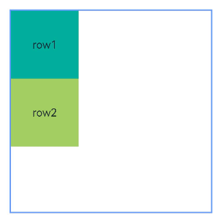

- **Child components can freely choose anchor points**, but ensure no mutual dependencies.

    <!-- run -->

    ```cangjie
    package ohos_app_cangjie_entry
    import kit.ArkUI.*
    import ohos.arkui.state_macro_manage.*

    @Entry
    @Component
    class EntryView {
        func build() {
            Row() {
                RelativeContainer() {
                    Row() {Text('row1')}
                    .justifyContent(FlexAlign.Center)
                    .width(100)
                    .height(100)
                    .backgroundColor(0xa3cf62)
                    .alignRules(
                        AlignRuleOption(
                            top: VerticalAlignment("__container__", VerticalAlign.Top),
                            left: HorizontalAlignment("__container__",HorizontalAlign.Start)
                        )
                    )
                    .id("row1")
                    Row() {Text('row2')}
                    .justifyContent(FlexAlign.Center)
                    .width(100)
                    .backgroundColor(0x00ae9d)
                    .alignRules(
                        AlignRuleOption(
                            top: VerticalAlignment("__container__", VerticalAlign.Top),
                            right: HorizontalAlignment("__container__",HorizontalAlign.End),
                            bottom: VerticalAlignment("row1", VerticalAlign.Center),
                        )
                    )
                    .id("row2")
                    Row() {Text('row3')}
                    .justifyContent(FlexAlign.Center)
                    .height(100)
                    .backgroundColor(0x0a59f7)
                    .alignRules(
                        AlignRuleOption(
                            top: VerticalAlignment("row1", VerticalAlign.Bottom),
                            left: HorizontalAlignment("row1", HorizontalAlign.Start),
                            right: HorizontalAlignment("row2", HorizontalAlign.Start)
                        )
                    )
                    .id("row3")
                    Row() {Text('row4')}
                    .justifyContent(FlexAlign.Center)
                    .backgroundColor(0x2ca9e0)
                    .alignRules(
                        AlignRuleOption(
                            top: VerticalAlignment("row3", VerticalAlign.Bottom),
                            left: HorizontalAlignment("row1", HorizontalAlign.Center),
                            right: HorizontalAlignment("row2", HorizontalAlign.End)
                        )
                    )
                    .id("row4")
                }
                .width(300)
                .height(300)
                .margin(left: 50)
                .border(width: 2, color: 0x6699FF)
            }.height(100.percent)
        }
    }
    ```

    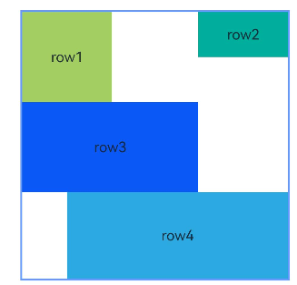

### Setting Alignment Relative to Anchor Points

After setting anchor points, use the [alignRules](../../../en/application-dev/reference/arkui-cj/cj-universal-attribute-location.md#func-alignrulesalignruleoption) attribute to define alignment positions relative to the anchor points.

- **Horizontal Alignment**: Positions can be set as `HorizontalAlign.Start`, `HorizontalAlign.Center`, or `HorizontalAlign.End`.

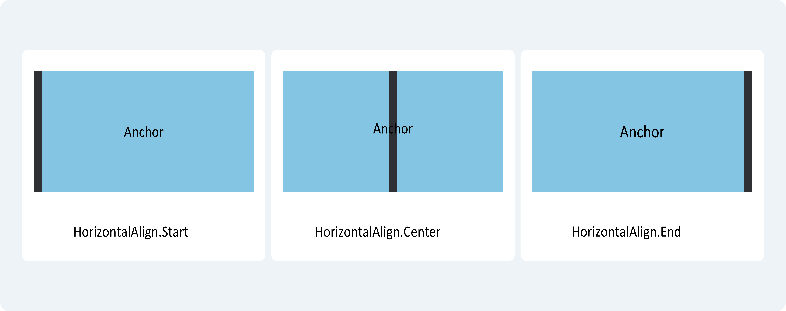

- **Vertical Alignment**: Positions can be set as `VerticalAlign.Top`, `VerticalAlign.Center`, or `VerticalAlign.Bottom`.

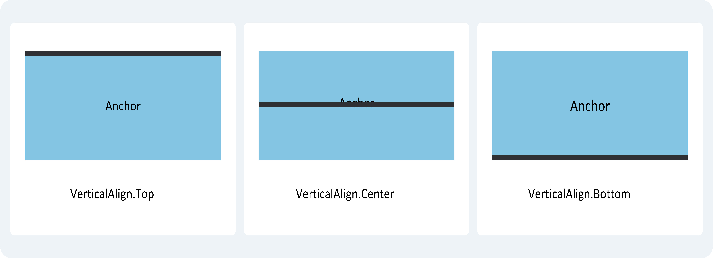

### Child Component Position Offset

After relative alignment, child components may still not be in their target positions. Developers can apply additional offsets using the `offset` property. When a component adjusted by `offset` serves as an anchor point, the alignment position is based on its pre-offset position. It is recommended to use [bias](../../../en/application-dev/reference/arkui-cj/cj-universal-attribute-location.md#class-bias) for additional offsets.

 <!-- run -->

```cangjie
package ohos_app_cangjie_entry

import kit.ArkUI.*
import ohos.arkui.state_macro_manage.*

@Entry
@Component
class EntryView {
    func build() {
        Row() {
            RelativeContainer() {
                Row() {
                    Text('row1')
                }
                .justifyContent(FlexAlign.Center)
                .width(100)
                .height(100)
                .backgroundColor(0xa3cf62)
                .alignRules(
                    AlignRuleOption(
                        top: VerticalAlignment("__container__", VerticalAlign.Top),
                        left: HorizontalAlignment("__container__",HorizontalAlign.Start)
                    )
                )
                .id("row1")

                Row() {
                    Text('row2')
                }
                .justifyContent(FlexAlign.Center)
                .width(100)
                .backgroundColor(0x00ae9d)
                .alignRules(
                    AlignRuleOption(
                        top: VerticalAlignment("__container__", VerticalAlign.Top),
                        right: HorizontalAlignment("__container__",HorizontalAlign.End),
                        bottom: VerticalAlignment("row1", VerticalAlign.Center)
                    )
                )
                .offset(x: -40, y: -20)
                .id("row2")

                Row() {
                    Text('row3')
                }
                .justifyContent(FlexAlign.Center)
                .height(100)
                .backgroundColor(0x0a59f7)
                .alignRules(
                    AlignRuleOption(
                        top: VerticalAlignment("row1", VerticalAlign.Bottom),
                        left: HorizontalAlignment("row1", HorizontalAlign.End),
                        right: HorizontalAlignment("row2", HorizontalAlign.Start)
                    )
                )
                .offset(x: -10, y: -20)
                .id("row3")

                Row() {
                    Text('row4')
                }
                .justifyContent(FlexAlign.Center)
                .backgroundColor(0x2ca9e0)
                .alignRules(
                    AlignRuleOption(
                        top: VerticalAlignment("row3", VerticalAlign.Bottom),
                        bottom: VerticalAlignment("__container__", VerticalAlign.Bottom),
                        left: HorizontalAlignment("__container__",HorizontalAlign.Start),
                        right: HorizontalAlignment("row1", HorizontalAlign.End)
                    )
                )
                .offset(x: -10, y: -30)
                .id("row4")
                Row() {
                    Text('row5')
                }
                .justifyContent(FlexAlign.Center)
                .backgroundColor(0x30c9f7)
                .alignRules(
                    AlignRuleOption(
                        top: VerticalAlignment("row3", VerticalAlign.Bottom),
                        bottom: VerticalAlignment("__container__", VerticalAlign.Bottom),
                        left: HorizontalAlignment("row2", HorizontalAlign.Start),
                        right: HorizontalAlignment("row2", HorizontalAlign.End)
                    )
                )
                .offset(x: 10, y: 20)
                .id("row5")
                Row() {
                    Text('row6')
                }
                .justifyContent(FlexAlign.Center)
                .backgroundColor(0xff33ffb5)
                .alignRules(
                    AlignRuleOption(
                        top: VerticalAlignment("row3", VerticalAlign.Bottom),
                        bottom: VerticalAlignment("row4", VerticalAlign.Bottom),
                        left: HorizontalAlignment("row3", HorizontalAlign.Start),
                        right: HorizontalAlignment("row3", HorizontalAlign.End)
                    )
                )
                .offset(x: -15, y: 10)
                .backgroundImagePosition(Alignment.Bottom)
                .backgroundImageSize(ImageSize.Cover)
                .id("row6")
            }
            .width(300)
            .height(300)
            .margin(left: 50)
            .border(width: 2, color: 0x6699FF)
        }.height(100.percent)
    }
}
```

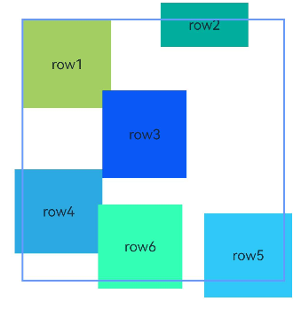

## Alignment Layout for Multiple Components

Components like `Row`, `Column`, `Flex`, and `Stack` can be aligned and arranged according to RelativeContainer rules.

 <!-- run -->

```cangjie
package ohos_app_cangjie_entry
import kit.ArkUI.*
import ohos.arkui.state_macro_manage.*

@Entry
@Component
class EntryView {
    func build() {
        Row() {
            RelativeContainer() {
                Row()
                .width(100)
                .height(100)
                .backgroundColor(0xa3cf62)
                .alignRules(
                    AlignRuleOption(
                        top: VerticalAlignment("__container__", VerticalAlign.Top),
                        left: HorizontalAlignment("__container__",HorizontalAlign.Start)
                    )
                )
                .id("row1")
                Column()
                .width(50.percent)
                .height(30)
                .backgroundColor(0x00ae9d)
                .alignRules(
                    AlignRuleOption(
                        top: VerticalAlignment("__container__", VerticalAlign.Top),
                        left: HorizontalAlignment("__container__",HorizontalAlign.Center)
                    )
                )
                .id("row2")

                Flex(direction: FlexDirection.Row) {
                    Text('1')
                        .width(20.percent)
                        .height(50)
                        .backgroundColor(0x0a59f7)
                    Text('2')
                        .width(20.percent)
                        .height(50)
                        .backgroundColor(0x2ca9e0)
                    Text('3')
                        .width(20.percent)
                        .height(50)
                        .backgroundColor(0x0a59f7)
                    Text('4')
                        .width(20.percent)
                        .height(50)
                        .backgroundColor(0x2ca9e0)
                }
                .padding(10)
                .backgroundColor(0x30c9f7)
                .alignRules(
                    AlignRuleOption(
                        top: VerticalAlignment("row2", VerticalAlign.Bottom),
                        left: HorizontalAlignment("__container__",HorizontalAlign.Start),
                        bottom: VerticalAlignment("__container__", VerticalAlign.Center),
                        right: HorizontalAlignment("row2", HorizontalAlign.Center)
                    )
                )
                .id("row3")

                Stack(alignContent: Alignment.Bottom) {
                    Text('First child, show in bottom')
                        .width(90.percent)
                        .height(100.percent)
                        .backgroundColor(0xa3cf62)
                        .align(Alignment.Top)
                    Text('Second child, show in top')
                        .width(70.percent)
                        .height(60.percent)
                        .backgroundColor(0x00ae9d)
                        .align(Alignment.Top)
                }
                .margin(top: 5)
                .alignRules(
                    AlignRuleOption(
                        top: VerticalAlignment("row3", VerticalAlign.Bottom),
                        left: HorizontalAlignment("__container__",HorizontalAlign.Start),
                        bottom: VerticalAlignment("__container__", VerticalAlign.Bottom),
                        right: HorizontalAlignment("row3", HorizontalAlign.End)
                    )
                )
                .id("row4")
            }
            .width(300)
            .height(300)
            .margin(left: 50)
            .border(width: 2, color: 0x6699FF)
        }.height(100.percent)
    }
}
```

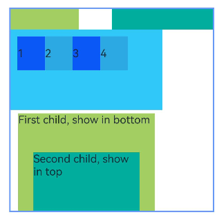## Component Sizing

When both frontend-defined child component dimensions and relative layout rules coexist, the rendering size of child components is determined based on constraint rules. The size set by the child component itself takes precedence over the alignment anchor dimensions in relative layout rules. Therefore, to achieve strict alignment between child components and anchors, only use `alignRules` and avoid using [size settings](../../../en/application-dev/reference/arkui-cj/cj-universal-attribute-size.md).

> **Note:**
>
> - If the child component's size cannot be determined based on constraints and its own `size` property, the component will not be rendered.
> - When two or more anchors are set in the same direction with incorrect positional order, the child component will be treated as having a size of 0 and will not be rendered.

 <!-- run -->

```cangjie
package ohos_app_cangjie_entry
import kit.ArkUI.*
import ohos.arkui.state_macro_manage.*

@Entry
@Component
class EntryView {
    func build() {
        Row() {
            RelativeContainer() {
                Row() {
                    Text('row1')
                }
                .justifyContent(FlexAlign.Center)
                .width(100)
                .height(100)
                .backgroundColor(0xa3cf62)
                .alignRules(
                    AlignRuleOption(
                        top: VerticalAlignment("__container__", VerticalAlign.Top),
                        left: HorizontalAlignment("__container__",HorizontalAlign.Start)
                    )
                )
                .id("row1")

                Row() {
                    Text('row2')
                }
                .justifyContent(FlexAlign.Center)
                .width(100)
                .backgroundColor(0x00ae9d)
                .alignRules(
                    AlignRuleOption(
                        top: VerticalAlignment("__container__", VerticalAlign.Top),
                        right: HorizontalAlignment("__container__",HorizontalAlign.End),
                        bottom: VerticalAlignment("row1", VerticalAlign.Center)
                    )
                )
                .id("row2")

                Row() {
                    Text('row3')
                }
                .justifyContent(FlexAlign.Center)
                .height(100)
                .backgroundColor(0x0a59f7)
                .alignRules(
                    AlignRuleOption(
                        top: VerticalAlignment("row1", VerticalAlign.Bottom),
                        left: HorizontalAlignment("row1", HorizontalAlign.End),
                        right: HorizontalAlignment("row2", HorizontalAlign.Start),
                    )
                )
                .id("row3")

                Row() {
                    Text('row4')
                }
                .justifyContent(FlexAlign.Center)
                .backgroundColor(0x2ca9e0)
                .alignRules(
                    AlignRuleOption(
                        top: VerticalAlignment("row3", VerticalAlign.Bottom),
                        bottom: VerticalAlignment("__container__", VerticalAlign.Bottom),
                        left: HorizontalAlignment("__container__",HorizontalAlign.Start),
                        right: HorizontalAlignment("row1", HorizontalAlign.End)
                    )
                )
                .id("row4")

                Row() {
                    Text('row5')
                }
                .justifyContent(FlexAlign.Center)
                .backgroundColor(0x30c9f7)
                .alignRules(
                    AlignRuleOption(
                        top: VerticalAlignment("row3", VerticalAlign.Bottom),
                        bottom: VerticalAlignment("__container__", VerticalAlign.Bottom),
                        left: HorizontalAlignment("row2", HorizontalAlign.Start),
                        right: HorizontalAlignment("row2", HorizontalAlign.End)
                    )
                )
                .id("row5")

                Row() {
                    Text('row6')
                }
                .justifyContent(FlexAlign.Center)
                .backgroundColor(0xff33ffb5)
                .alignRules(
                    AlignRuleOption(
                        top: VerticalAlignment("row3", VerticalAlign.Bottom),
                        bottom: VerticalAlignment("row4", VerticalAlign.Bottom),
                        left: HorizontalAlignment("row3", HorizontalAlign.Start),
                        right: HorizontalAlignment("row3", HorizontalAlign.End)
                    )
                )
                .id("row6")
                .backgroundImagePosition(Alignment.Bottom)
                .backgroundImageSize(ImageSize.Cover)
            }
            .width(300)
            .height(300)
            .margin(left: 50)
            .border(width: 2, color: 0x6699FF)
        }.height(100.percent)
    }
}
```

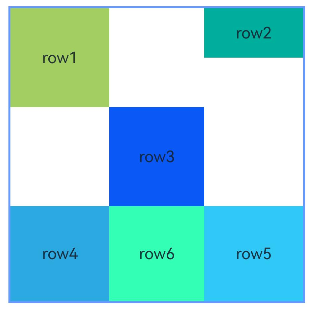

## Multiple Components Forming a Chain

Chain formation relies on inter-component relationships. Taking the simplest horizontal chain composed of components A and B as an example, the dependency relationship is: Anchor1 <-- ComponentA <--> ComponentB --> Anchor2. This means A has a left anchor, B has a right anchor, while A's right anchor aligns with B's `HorizontalAlign.Start`, and B's left anchor aligns with A's `HorizontalAlign.End`.

- The chain's direction and format are declared in the chain head component's [chainMode](../../../en/application-dev/reference/arkui-cj/cj-universal-attribute-location.md#func-chainmodeaxis-chainstyle) interface. The `bias` properties of chain elements become invalid, while the chain head's `bias` property serves as the chain's overall bias. The chain head refers to the first component in the chain that satisfies chain formation rules (horizontally starting from the left, or right in RTL languages; vertically starting from the top).

- If the combined size of all chain elements exceeds the anchor constraints, the excess portion will be evenly distributed on both sides of the chain. In [Packed](../../../en/application-dev/reference/arkui-cj/cj-universal-attribute-location.md#packed) chains, the distribution of excess space can be adjusted via [bias](../../../en/application-dev/reference/arkui-cj/cj-universal-attribute-location.md#class-bias).

 <!-- run -->

```cangjie
package ohos_app_cangjie_entry
import kit.ArkUI.*
import ohos.arkui.state_macro_manage.*

@Entry
@Component
class EntryView {
    func build() {
        Row() {
            RelativeContainer() {
                Row() {
                    Text('row1')
                }
                .justifyContent(FlexAlign.Center)
                .width(80)
                .height(80)
                .backgroundColor(0xa3cf62)
                .alignRules(
                    AlignRuleOption(
                        top: VerticalAlignment("__container__", VerticalAlign.Top),
                        left: HorizontalAlignment("__container__",HorizontalAlign.Start),
                        right: HorizontalAlignment("row2", HorizontalAlign.Start)
                    )
                )
                .id("row1")
                .chainMode(Axis.Horizontal, ChainStyle.SPREAD)

                Row() {
                    Text('row2')
                }
                .justifyContent(FlexAlign.Center)
                .width(80)
                .height(80)
                .backgroundColor(0x00ae9d)
                .alignRules(
                    AlignRuleOption(
                        top: VerticalAlignment("row1", VerticalAlign.Top),
                        right: HorizontalAlignment("row3",HorizontalAlign.Start),
                        left: HorizontalAlignment("row1",HorizontalAlign.End)
                    )
                )
                .id("row2")

                Row() {
                    Text('row3')
                }
                .justifyContent(FlexAlign.Center)
                .height(80)
                .width(80)
                .backgroundColor(0x0a59f7)
                .alignRules(
                    AlignRuleOption(
                        top: VerticalAlignment("row1", VerticalAlign.Top),
                        left: HorizontalAlignment("row2", HorizontalAlign.End),
                        right: HorizontalAlignment("__container__", HorizontalAlign.End),
                    )
                )
                .id("row3")

                Row() {
                    Text('row4')
                }
                .justifyContent(FlexAlign.Center)
                .width(80)
                .height(80)
                .backgroundColor(0xa3cf62)
                .alignRules(
                    AlignRuleOption(
                        center: VerticalAnchor("__container__", VerticalAlign.Center),
                        left: HorizontalAlignment("__container__",HorizontalAlign.Start),
                        right: HorizontalAlignment("row5", HorizontalAlign.Start)
                    )
                )
                .id("row4")
                .chainMode(Axis.Horizontal, ChainStyle.SPREAD_INSIDE)

                Row() {
                    Text('row5')
                }
                .justifyContent(FlexAlign.Center)
                .width(80)
                .height(80)
                .backgroundColor(0x00ae9d)
                .alignRules(
                    AlignRuleOption(
                        top: VerticalAlignment("row4", VerticalAlign.Top),
                        left: HorizontalAlignment("row4", HorizontalAlign.End),
                        right: HorizontalAlignment("row6", HorizontalAlign.Start)
                    )
                )
                .id("row5")

                Row() {
                    Text('row6')
                }
                .justifyContent(FlexAlign.Center)
                .width(80)
                .height(80)
                .backgroundColor(0x0a59f7)
                .alignRules(
                    AlignRuleOption(
                        top: VerticalAlignment("row4", VerticalAlign.Top),
                        left: HorizontalAlignment("row5", HorizontalAlign.End),
                        right: HorizontalAlignment("__container__", HorizontalAlign.End)
                    )
                )
                .id("row6")

                Row() {
                    Text('row7')
                }
                .justifyContent(FlexAlign.Center)
                .width(80)
                .height(80)
                .backgroundColor(0xa3cf62)
                .alignRules(
                    AlignRuleOption(
                        bottom: VerticalAlignment("__container__", VerticalAlign.Bottom),
                        left: HorizontalAlignment("__container__", HorizontalAlign.Start),
                        right: HorizontalAlignment("row8", HorizontalAlign.Start)
                    )
                )
                .id("row7")
                .chainMode(Axis.Horizontal, ChainStyle.PACKED)

                Row() {
                    Text('row8')
                }
                .justifyContent(FlexAlign.Center)
                .width(80)
                .height(80)
                .backgroundColor(0x00ae9d)
                .alignRules(
                    AlignRuleOption(
                        top: VerticalAlignment("row7", VerticalAlign.Top),
                        left: HorizontalAlignment("row7", HorizontalAlign.End),
                        right: HorizontalAlignment("row9", HorizontalAlign.Start)
                    )
                )
                .id("row8")

                Row() {
                    Text('row9')
                }
                .justifyContent(FlexAlign.Center)
                .width(80)
                .height(80)
                .backgroundColor(0x0a59f7)
                .alignRules(
                    AlignRuleOption(
                        top: VerticalAlignment("row7", VerticalAlign.Top),
                        left: HorizontalAlignment("row8", HorizontalAlign.End),
                        right: HorizontalAlignment("__container__", HorizontalAlign.End)
                    )
                )
                .id("row9")
            }
            .width(300)
            .height(300)
            .margin(left: 50)
            .border(width: 2, color: 0x6699FF)
        }.height(100.percent)
    }
}
```

