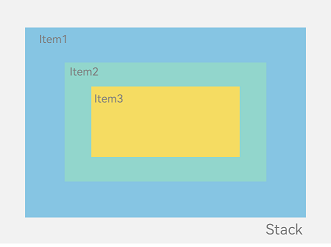
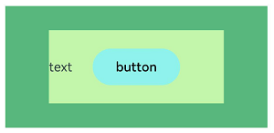
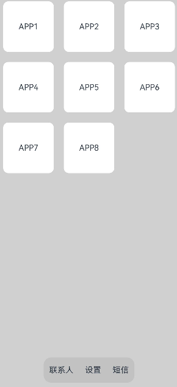

# Stack Layout (Stack)

## Overview

The Stack Layout (StackLayout) is used to reserve an area on the screen to display elements within components, providing a layout where elements can overlap. The Stack Layout achieves fixed positioning and layering through the [Stack](../../../en/application-dev/reference/arkui-cj/cj-row-column-stack-stack.md) container component. Child elements within the container are pushed onto the stack in sequence, with each subsequent child element covering the previous one. Child elements can be stacked and their positions can be set.

The Stack Layout offers strong capabilities for page layering and position positioning, making it suitable for scenarios such as advertisements and card stacking effects.

As shown in Figure 1, the Stack serves as the container, and the order of child elements within the container is Item1 → Item2 → Item3.

**Figure 1** Stack Layout



## Development Layout

The Stack component is a container component that can contain various child elements. By default, child elements are centered and stacked. Child elements are constrained within the Stack and can be styled and arranged.

<!-- run -->

```cangjie
package ohos_app_cangjie_entry
import kit.ArkUI.*
import ohos.arkui.state_macro_manage.*

@Entry
@Component
class EntryView {
    func build() {
        Column() {
            Stack() {
                Column() {}
                    .width(90.percent)
                    .height(100.percent)
                    .backgroundColor(0xff58b87c)
                Text('text')
                    .width(60.percent)
                    .height(60.percent)
                    .backgroundColor(0xffc3f6aa)
                Button('button')
                    .width(30.percent)
                    .height(30.percent)
                    .backgroundColor(0xff8ff3eb)
                    .fontColor(0x000)
            }
            .width(100.percent)
            .height(150)
            .margin(top: 50)
        }
    }
}
```



## Alignment

The Stack component achieves relative movement of positions through the [alignContent parameter](../../../en/application-dev/reference/arkui-cj/cj-row-column-stack-stack.md#func-aligncontentalignment). As shown in Figure 2, nine alignment methods are supported.

**Figure 2** Alignment of Elements Within the Stack Container  


<!-- run -->

```cangjie
package ohos_app_cangjie_entry
import kit.ArkUI.*
import ohos.arkui.state_macro_manage.*

@Entry
@Component
class EntryView {
    func build() {
        Stack(alignContent: Alignment.TopStart) {
            Text('Stack')
                .width(90.percent)
                .height(100.percent)
                .backgroundColor(0xe1dede)
                .align(Alignment.BottomEnd)
            Text('Item 1')
                .width(70.percent)
                .height(80.percent)
                .backgroundColor(0xd2cab3)
                .align(Alignment.BottomEnd)
            Text('Item 2')
                .width(50.percent)
                .height(60.percent)
                .backgroundColor(0xc1cbac)
                .align(Alignment.BottomEnd)
        }
        .width(100.percent)
        .height(150)
        .margin(top: 5)
    }
}
```

## Z-Order Control

The display hierarchy of sibling components within the Stack container can be altered using the zIndex property of [Z-Order Control](../../../en/application-dev/reference/arkui-cj/cj-universal-attribute-zorder.md). A higher zIndex value means a higher display hierarchy, meaning components with larger zIndex values will overlay those with smaller zIndex values.

In a Stack Layout, if a subsequent child element's dimensions are larger than those of a preceding child element, the preceding child element will be completely hidden.

<!-- run -->

```cangjie
package ohos_app_cangjie_entry
import kit.ArkUI.*
import ohos.arkui.state_macro_manage.*

@Entry
@Component
class EntryView {
    func build() {
        Stack(alignContent: Alignment.BottomStart) {
            Column() {
                Text('Stack Child Element 1')
                    .textAlign(TextAlign.End)
                    .fontSize(20)
            }
            .width(100)
            .height(100)
            .backgroundColor(0xffd306)

            Column() {
                Text('Stack Child Element 2').fontSize(20)
            }
            .width(150)
            .height(150)
            .backgroundColor(0xFEC0CD)

            Column() {
                Text('Stack Child Element 3').fontSize(20)
            }
            .width(200)
            .height(200)
            .backgroundColor(Color.Gray)
        }
        .width(350)
        .height(350)
        .backgroundColor(0xe0e0e0)
    }
}
```


In the above figure, the last child element (Element 3) has dimensions larger than all preceding child elements, so the first two elements are completely hidden. By modifying the zIndex properties of Child Element 1 and Child Element 2, these elements can be displayed.

<!-- run -->

```cangjie
package ohos_app_cangjie_entry
import kit.ArkUI.*
import ohos.arkui.state_macro_manage.*

@Entry
@Component
class EntryView {
    func build() {
        Stack(alignContent: Alignment.BottomStart) {
            Column() {
                Text('Stack Child Element 1').fontSize(20)
            }
            .width(100)
            .height(100)
            .backgroundColor(0xffd306)
            .zIndex(2)
            Column() {
                Text('Stack Child Element 2').fontSize(20)
            }
            .width(150)
            .height(150)
            .backgroundColor(0xFEC0CD)
            .zIndex(1)
            Column() {
                Text('Stack Child Element 3').fontSize(20)
            }
            .width(200)
            .height(200)
            .backgroundColor(Color.Gray)
        }
        .width(350)
        .height(350)
        .backgroundColor(0xe0e0e0)
    }
}
```


## Scenario Example

Using the Stack Layout to quickly build a page.

<!-- run -->

```cangjie
package ohos_app_cangjie_entry
import kit.ArkUI.*
import ohos.arkui.state_macro_manage.*

@Entry
@Component
class EntryView {
    private var arr: Array<String> = ['APP1', 'APP2', 'APP3', 'APP4', 'APP5', 'APP6', 'APP7', 'APP8'];
    func build() {
        Stack(alignContent: Alignment.Bottom) {
            Flex(wrap: FlexWrap.Wrap) {
                ForEach(this.arr,itemGeneratorFunc: {
                    item: String, idx: Int64 => Text(item)
                        .width(100)
                        .height(100)
                        .fontSize(16)
                        .margin(10)
                        .textAlign(TextAlign.Center)
                        .borderRadius(10)
                        .backgroundColor(0xFFFFFF)
                    },
                    keyGeneratorFunc: {item: String, idx: Int64 => idx.toString()}
                )
            }
            .width(100.percent)
            .height(100.percent)
            Flex(justifyContent: FlexAlign.SpaceAround, alignItems: ItemAlign.Center) {
                Text('Contacts').fontSize(16)
                Text('Settings').fontSize(16)
                Text('Messages').fontSize(16)
            }
            .width(50.percent)
            .height(50)
            .backgroundColor(0x16302e2e)
            .margin(bottom: 15)
            .borderRadius(15)
        }
        .width(100.percent)
        .height(100.percent)
        .backgroundColor(0xCFD0CF)
    }
}
```

