# Tabs

When a page contains a large amount of information, categorizing the content helps users focus on the currently displayed information and improves space utilization. The [Tabs](../../../en/application-dev/reference/arkui-cj/cj-navigation-switching-tabs.md) component enables quick switching between views within a single page, enhancing information retrieval efficiency while streamlining the amount of information users receive at once.

## Basic Layout

The Tabs component consists of two parts: TabContent and TabBar. TabContent represents the content pages, while TabBar serves as the navigation tab bar. As shown in the diagram below, the layout varies based on navigation types, which can be categorized as bottom navigation, top navigation, or sidebar navigation, with their respective navigation bars positioned at the bottom, top, or side.

**Figure 1** Tabs Component Layout Schematic

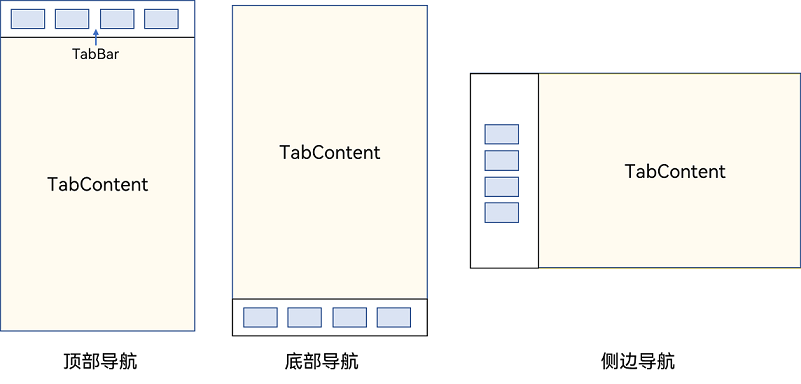

> **Note:**
>
> - The TabContent component does not support setting generic width properties; its width defaults to filling the parent Tabs component.
> - The TabContent component does not support setting generic height properties; its height is determined by the parent Tabs component's height and the TabBar component's height.

Tabs wrap TabContent with curly braces, as shown in Figure 2, where TabContent displays the corresponding content pages.

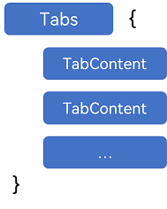

Each TabContent requires a corresponding tab, which can be configured via the tabBar property. Setting the tabBar property on a TabContent component defines the content for its corresponding tab.

```cangjie
 TabContent() {
   Text('Home Content').fontSize(30)
 }
.tabBar('Home')
```

When multiple content sections are needed, place them sequentially within the Tabs component.

```cangjie
Tabs() {
  TabContent() {
    Text('Home Content').fontSize(30)
  }
  .tabBar('Home')

  TabContent() {
    Text('Recommendations').fontSize(30)
  }
  .tabBar('Recommend')

  TabContent() {
    Text('Discover').fontSize(30)
  }
  .tabBar('Discover')

  TabContent() {
    Text('My Content').fontSize(30)
  }
  .tabBar("Mine")
}
```

## Bottom Navigation

Bottom navigation is the most common navigation pattern in applications. Positioned at the bottom of primary application pages, it helps users understand the app's functional categories and the content associated with each tab. Its bottom placement also facilitates one-handed operation. Typically serving as the main navigation, bottom navigation organizes content by function to align with user habits and streamline switching between modules.

**Figure 3** Bottom Navigation Bar

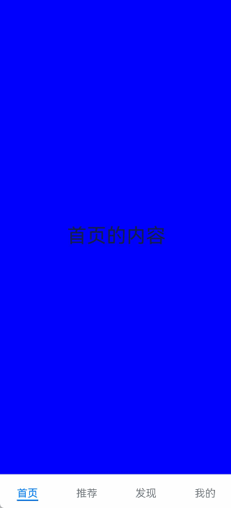

The navigation bar position is set using the Tabs' barPosition parameter. By default, the navigation bar is at the top (BarPosition.Start). For bottom navigation, set barPosition to BarPosition.End.

```cangjie
Tabs(barPosition: BarPosition.End) {
    // TabContent content, e.g., Home, Discover, Recommend, Mine
    // ...
}
```

## Top Navigation

When there are numerous content categories with roughly equal browsing frequency requiring frequent switching, top navigation is often used. This design further subdivides bottom navigation content, commonly seen in news apps with categories like Follow, Video, Tech, or theme apps with subdivisions like Images, Videos, Fonts, etc.

**Figure 4** Top Navigation Bar

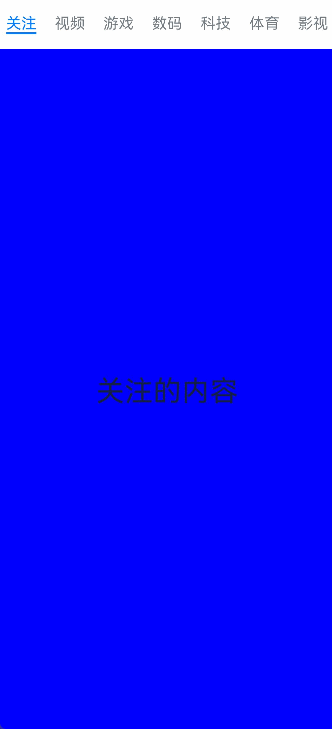

```cangjie
Tabs(barPosition: BarPosition.Start) {
    // TabContent content, e.g., Follow, Video, Games, Tech, Sports, Movies
    // ...
}
```

## Sidebar Navigation

Sidebar navigation is less common and typically used in landscape interfaces for app navigation. Given users' left-to-right reading habits, the sidebar defaults to the left side.

**Figure 5** Sidebar Navigation

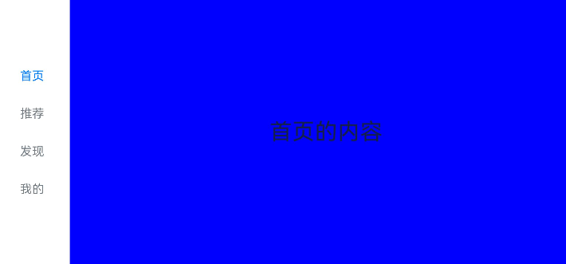

To implement sidebar navigation, set the Tabs' vertical property to true (default is false), indicating vertical arrangement of content and navigation.

```cangjie
Tabs(barPosition: BarPosition.Start) {
    // TabContent content, e.g., Home, Discover, Recommend, Mine
    // ...
}
.vertical(true)
```

> **Note:**
>
> - When vertical is false, the tabBar width defaults to filling the screen width; set barWidth as needed.
> - When vertical is true, the tabBar height defaults to the actual content height; set barHeight as needed.

## Disabling Swipe Navigation

By default, navigation bars support swipe switching. However, in pages with multi-level categorization (e.g., combining bottom and top navigation), bottom navigation swiping may conflict with top navigation. In such cases, disabling bottom navigation swiping improves user experience.

**Figure 6** Disabled Bottom Navigation Swiping

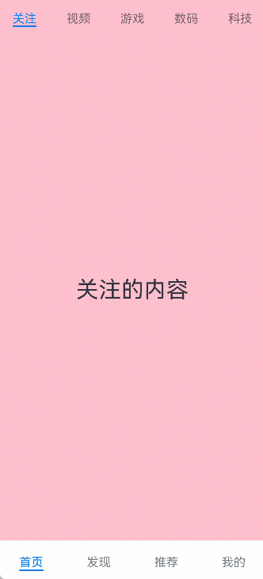

The scrollable property controls swipe switching (default: true). Set it to false to disable swiping.

```cangjie
Tabs(barPosition: BarPosition.End) {
    TabContent() {
        Column() {
            Tabs() {
                // Top navigation content
                // ...
            }
        }
        .backgroundColor(0XFF08A8F1)
        .width(100.percent)
    }
    .tabBar("Home")

    // Other TabContent content, e.g., Discover, Recommend, Mine
    // ...
}
.scrollable(false)
```

## Fixed Navigation Bar

For fixed, non-expandable content categories (e.g., bottom navigation typically has 3-5 fixed tabs), use a fixed navigation bar. Fixed bars cannot scroll or be dragged, with tabs evenly distributed across the bar's width.

**Figure 7** Fixed Navigation Bar


The Tabs' barMode property controls bar scrolling (default: BarMode.Fixed).

```cangjie
Tabs(barPosition: BarPosition.End) {
    // TabContent content, e.g., Home, Discover, Recommend, Mine
    // ...
}
.barMode(BarMode.Fixed)
```

## Scrollable Navigation Bar

Scrollable navigation bars suit top or sidebar navigation when categories exceed screen width. Users can click or swipe to access hidden tabs.

**Figure 8** Scrollable Navigation Bar

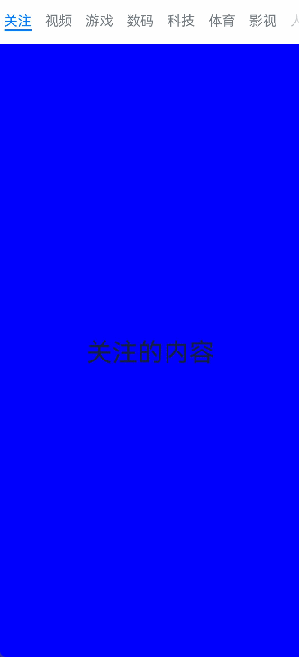

Set barMode to BarMode.Scrollable (default: BarMode.Fixed).

```cangjie
Tabs(barPosition: BarPosition.Start) {
    // TabContent content, e.g., Home, Discover, Recommend, Mine
    // ...
}
.barMode(BarMode.Scrollable)
```

## Custom Navigation Bar

For bottom navigation (typically distinguishing primary app functions), combining text and semantic icons enhances UX. This requires custom tab styling.

**Figure 9** Custom Navigation Bar

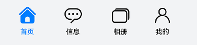

By default, an underline indicates the active tab. Custom bars must implement styles to distinguish active/inactive tabs.

Use tabBar's CustomBuilder to pass custom function components. For example, tabBuilder accepts parameters like title, index, and image resources for active/inactive states, determining UI display based on currentIndex matching targetIndex.

```cangjie
@State var currentIndex: Int32 = 0

@Builder
func tabBuilder(title: String, targetIndex: Int32, imgs: Array<AppResource>) {
    Column(){
        if (this.currentIndex != targetIndex) {
            Image(imgs[0]).size(width: 25, height: 25)
            Text(title).fontColor(0X1698CE)
        } else {
            Image(imgs[1]).size(width: 25, height: 25)
            Text(title).fontColor(0X6B6B6B)
        }
    }
    .width(100.percent)
    .height(50)
    .justifyContent(FlexAlign.Center)
}
```

Pass the custom function component and parameters via TabContent's tabBar property.

```cangjie
TabContent(){
  Text("My Content").fontSize(30)
}.tabBar({ =>
  bind(this.tabBuilder, this)("Mine", 0, [@r(app.media.mine_normal), @r(app.media.mine_selected)])
})
```

## Switching to Specific Tabs

With custom navigation bars, Tabs only handle content page switching via swiping or clicking. Tab switching logic must be implemented manually to sync tab bar changes with content.

**Figure 10** Unlinked Content and Tabs

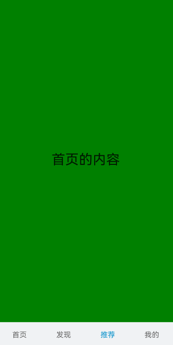

Use Tabs' onChange event to monitor index changes and update currentIndex for tab synchronization.

```cangjie
package ohos_app_cangjie_entry
import kit.ArkUI.*
import ohos.arkui.state_macro_manage.*
import std.collection.ArrayList

@Entry
@Component
public class EntryView {
    @State var currentIndex: Int32 = 2

    @Builder
    func tabBuilder(title: String, targetIndex: Int32) {
        Column(){
            Text(title)
                .fontColor(
                    if (this.currentIndex == targetIndex) {
                        0X1698CE
                    } else {
                        0X6B6B6B
                    })
        }
    }

    func build() {
        Column() {
            Tabs(barPosition: BarPosition.End){
                TabContent(){
                    // ...
                }.tabBar({ =>
                    bind(this.tabBuilder, this)("Home", 0)
                }).backgroundColor(Color.Green)
                TabContent() {
                    // ...
                }.tabBar({ =>
                    bind(this.tabBuilder, this)("Discover", 1)
                }).backgroundColor(Color(0xFFFF00))
                TabContent() {
                    // ...
                }.tabBar({ =>
                    bind(this.tabBuilder, this)("Recommend", 2)
                }).backgroundColor(0xFEC0CD)
                TabContent() {
                    // ...
                }.tabBar({ =>
                    bind(this.tabBuilder, this)("Mine", 3)
                }).backgroundColor(Color.Blue)
            }
            .animationDuration(0.0)
            .backgroundColor(0xF1F3F5)
            .onChange({index =>
                this.currentIndex = index
            })
        }.width(100.percent)
    }
}
```

**Figure 11** Linked Content and Tabs

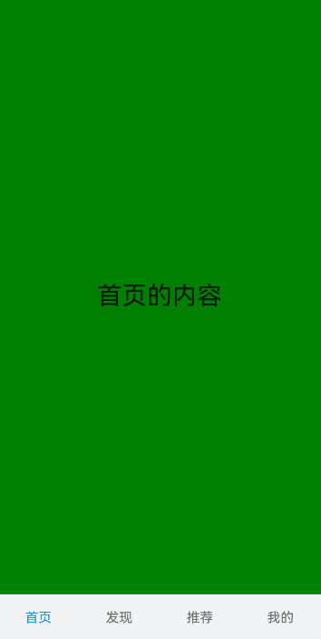

To switch tabs without swiping or clicking, pass currentIndex to Tabs' index parameter or use TabsController. TabsController manages Tabs component switching via its changeIndex method.

**Figure 12** Switching to Specific Tab

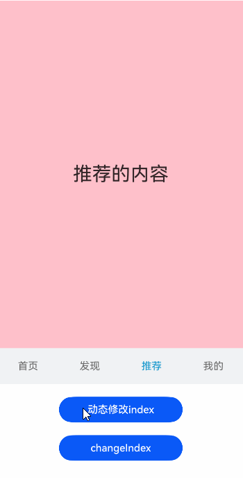