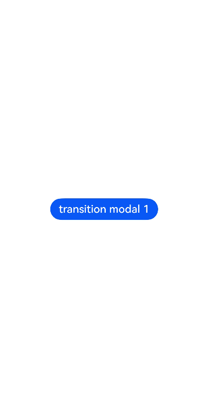
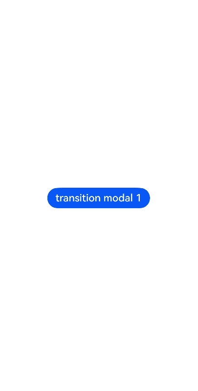

# Modal Page Overview

<!--Del-->
> **Note:**
>
> Currently in the beta phase.
<!--DelEnd-->

A modal page is an interactive popup with a large panel and expansive view. Like other popup components, modal pages are typically used to temporarily display information requiring user attention or pending operations while maintaining the current context. Compared to other popup components, modal pages require developers to populate content through custom components, often presenting significantly larger views. By default, user interaction is required to exit the modal page. ArkUI currently provides two types of modal page components: **Half-modal** and **Full-modal**.

- **Half-modal:** Developers can use this modal page to achieve versatile effects. It supports displaying different styles of half-modal pages on devices with varying widths. Users can close the half-modal page by swiping sideways, clicking the mask layer, clicking the close button, or pulling down.

- **Full-modal:** Developers can use this modal page to achieve full-screen modal popup effects. By default, it requires a sideways swipe to close.

## Usage Scenarios

| Interface | Usage Scenario |
|:---|:---|
| [bindContentCover](./cj-contentcover-page.md) | Used for custom full-screen modal display interfaces. Combined with transition animations and shared element animations, it can achieve complex transition effects, such as viewing enlarged images after clicking thumbnails. |
| [bindSheet](./cj-sheet-page.md) | Used for half-modal display interfaces, such as share dialogs. |