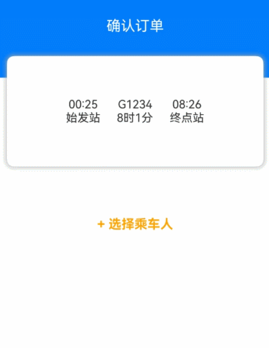
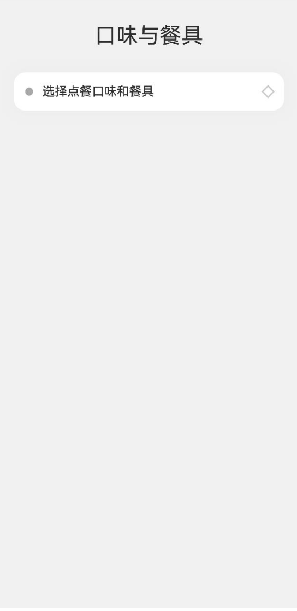
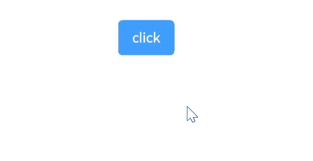
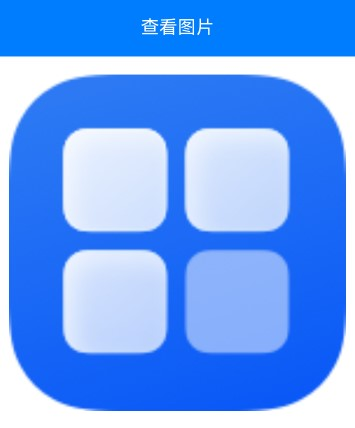
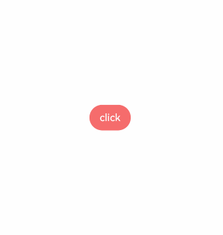
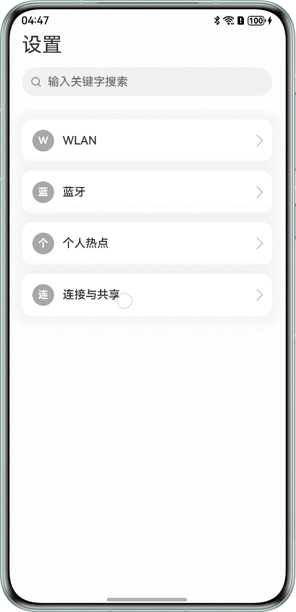

# Modal Transition  

Modal transition is a type of transition where a new interface overlays the old one without the old interface disappearing.  

**Table 1** Modal Transition Interfaces  

| Interface                                       | Description                | Use Case                                     |
|:---------------------------------------- |:----------------- |:---------------------------------------- |
| [bindContentCover](../reference/arkui-cj/cj-universal-attribute-bindcontentcover.md#func-bindcontentcoverbool-custombuilder-contentcoveroptions) | Displays a full-screen modal component.        | Used for custom full-screen modal interfaces, combined with transition animations and shared element animations to achieve complex transition effects, such as clicking a thumbnail to view a larger image. |
| [bindSheet](../reference/arkui-cj/cj-universal-attribute-sheettransition.md#func-bindsheetbool----unit-sheetoptions) | Displays a semi-modal component.          | Used for semi-modal interfaces, such as a share dialog.                          |
| [bindMenu](../reference/arkui-cj/cj-universal-attribute-menu.md#func-bindmenu---unit) | Displays a menu, which pops up when the component is clicked.     | Scenarios requiring a menu, such as the "+" button in general applications.                 |
| [bindContextMenu](../reference/arkui-cj/cj-universal-attribute-menu.md#func-bindcontextmenu---unit-responsetype) | Displays a menu, which pops up after a long press or right-click. | Floating effect on long press, typically used in combination with drag-and-drop frameworks, such as long-pressing a desktop icon to float it.             |
| [bindPopup](../reference/arkui-cj/cj-universal-attribute-popup.md#func-bindpopupbool-custompopupoptions) | Displays a Popup dialog.        | Popup dialog scenarios, such as providing temporary explanations for a component after clicking.               |
| [if](./rendering_control/cj-rendering-control-ifelse.md)                                       | Adds or removes components via `if`.      | Used to temporarily display an interface under certain conditions. The back navigation for this method must be implemented by the developer through event listeners.  |

## Building Full-Screen Modal Transition Effects with `bindContentCover`  

The [bindContentCover](../reference/arkui-cj/cj-universal-attribute-bindcontentcover.md#func-bindcontentcoverbool-custombuilder-contentcoveroptions) interface is used to bind a full-screen modal page to a component. Transition effects can be added during the appearance and disappearance of the component by setting the `ModalTransition` parameter. Below is an example of the steps to build a full-screen modal transition effect using `bindContentCover`:  

- Define the full-screen modal transition effect [bindContentCover](../reference/arkui-cj/cj-universal-attribute-bindcontentcover.md#func-bindcontentcoverbool-custombuilder-contentcoveroptions).  

- Define the modal display interface.  

   ```cangjie
   // Use @Builder to construct the modal display interface
   @Builder
   func MyBuilder() {
     Column {
       Text("my model view")
     }
     // Add transition animation for appearance/disappearance effects. The transition must be applied to the first component under the builder.
     .transition(TransitionEffect.translate(TranslateOptions(y: 1000)).animation(AnimateParam(curve: Curve.Smooth)))
   }
   ```

- Trigger the modal display interface via the modal interface and implement the corresponding animation effects through transition or shared element animations.  

   ```cangjie
   // Modal transition control variable
   @State var isPresent: Bool = false

   Button("Click to present model view")
     // Bind the modal display interface via the selected modal interface. ModalTransition is a built-in ContentCover transition animation type. Here, "None" means the system does not add default animations. The state variable is controlled via onDisappear.
     .bindContentCover(this.isPresent, this.MyBuilder, options: ContentCoverOptions(
               modalTransition: ModalTransition.Default,
               onDisappear: {
                => if (this.isPresent) {
                  this.isPresent = !this.isPresent
                 }
               }
     ))
     .onClick({
        evt => this.isPresent = !this.isPresent
      // Change the state variable to display the modal interface
     })
   ```

The complete example code and effect are as follows.  

 <!-- run -->

```cangjie
package ohos_app_cangjie_entry

import kit.ArkUI.*
import ohos.arkui.state_macro_manage.*

class PersonList {
    var name: String
    var cardnum: String
    public init(name: String, cardnum: String) {
        this.name = name
        this.cardnum = cardnum
    }
}

@Entry
@Component
class EntryView {
    private var personList: Array<PersonList> = [
        PersonList("王**", "1234***********789"),
        PersonList("宋*", "2345***********789"),
        PersonList("许**", "3456***********789"),
        PersonList("唐*", "4567***********789")
    ]

    @State
    var isPresent: Bool = false

    @Builder
    func MyBuilder() {
        Column {
            Row {
                Text("选择乘车人")
                    .fontSize(20.vp)
                    .fontColor(Color.White)
                    .width(100.percent)
                    .textAlign(TextAlign.Center)
                    .padding(top: 30.vp, bottom: 15.vp)
            }.backgroundColor(0x007dfe)

            Row {
                Text("+ 添加乘车人")
                    .fontSize(16.vp)
                    .fontColor(0x333333)
                    .margin(top: 10.vp)
                    .padding(top: 20.vp, bottom: 20.vp)
                    .width(92.percent)
                    .borderRadius(10.vp)
                    .textAlign(TextAlign.Center)
                    .backgroundColor(Color.White)
            }

            Column {
                ForEach(
                    this.personList,
                    itemGeneratorFunc: {
                        item: PersonList, index: Int64 => Row {
                            Column {
                                if (index % 2 == 0) {
                                    Column {
                                    }
                                    .width(20.vp)
                                    .height(20.vp)
                                    .border(width: 1.vp, color: 0x007dfe)
                                    .backgroundColor(0x007dfe)
                                } else {
                                    Column {
                                    }
                                    .width(20.vp)
                                    .height(20.vp)
                                    .border(width: 1.vp, color: 0x007dfe)
                                }
                            }.width(20.percent)

                            Column {
                                Text(item.name)
                                    .fontColor(0x333333)
                                    .fontSize(18.vp)
                                Text(item.cardnum)
                                    .fontColor(0x666666)
                                    .fontSize(14.vp)
                            }
                                .width(60.percent)
                                .alignItems(HorizontalAlign.Start)

                            Column {
                                Text("编辑")
                                    .fontColor(0x007dfe)
                                    .fontSize(16.vp)
                            }.width(20.percent)
                        }
                        .padding(top: 10.vp, bottom: 10.vp)
                        .border(width: 1.vp, color: 0xf1f1f1)
                        .width(92.percent)
                        .backgroundColor(Color.White)
                    }
                )
            }.padding(top: 20.vp, bottom: 20.vp)

            Text("确认")
                .width(90.percent)
                .height(40.vp)
                .textAlign(TextAlign.Center)
                .borderRadius(10.vp)
                .fontColor(Color.White)
                .backgroundColor(0x007dfe)
                .onClick({
                    evt => this.isPresent = !this.isPresent
                })
        }
        .size(width: 100.percent, height: 100.percent)
        .backgroundColor(0xf5f5f5)
        .transition(
            TransitionEffect
                .translate(TranslateOptions(y: 1000))
                .animation(AnimateParam(curve: Curve.Smooth)))
    }

    func build() {
        Column {
            Row {
                Text("确认订单")
                    .fontSize(20.vp)
                    .fontColor(Color.White)
                    .width(100.percent)
                    .textAlign(TextAlign.Center)
                    .padding(top: 30.vp, bottom: 60.vp)
            }.backgroundColor(0x007dfe)

            Column {
                Row {
                    Column {
                        Text("00:25")
                        Text("始发站")
                    }.width(30.percent)

                    Column {
                        Text("G1234")
                        Text("8时1分")
                    }.width(30.percent)

                    Column {
                        Text("08:26")
                        Text("终点站")
                    }.width(30.percent)
                }
            }
            .width(92.percent)
            .padding(15.percent)
            .margin(top: -30)
            .backgroundColor(Color.White)
            .shadow(radius: 30.0, color: 0xaaaaaa)
            .borderRadius(10.vp)

            Column {
                Text("+ 选择乘车人")
                    .fontSize(18.vp)
                    .fontColor(Color(0xFFA500))
                    .fontWeight(FontWeight.Bold)
                    .padding(top: 10.vp, bottom: 10.vp)
                    .width(60.percent)
                    .textAlign(TextAlign.Center)
                    .borderRadius(15.vp)
                    .bindContentCover(
                        this.isPresent,
                        this.MyBuilder,
                        options: ContentCoverOptions(
                            modalTransition: ModalTransition.Default,
                            onDisappear: {
                                => if (this.isPresent) {
                                    this.isPresent = !this.isPresent
                                }
                            }
                        )
                    )
                    .onClick({
                        evt => this.isPresent = !this.isPresent
                    })
            }.padding(top: 60.vp)
        }
    }
}
```

  

## Building Semi-Modal Transition Effects with `bindSheet`  

The [bindSheet](../reference/arkui-cj/cj-universal-attribute-sheettransition.md#func-bindsheetbool-custombuilder-sheetoptions) attribute can bind a semi-modal page to a component. The size of the semi-modal can be determined by setting a custom or default built-in height during the component's appearance. The steps to build semi-modal transition effects are essentially the same as those for building full-screen modal transition effects using [bindContentCover](../reference/arkui-cj/cj-universal-attribute-bindcontentcover.md#func-bindcontentcoverbool-custombuilder-contentcoveroptions).  

The complete example and effect are as follows.  

 <!-- run -->

```cangjie
package ohos_app_cangjie_entry

import kit.ArkUI.*
import ohos.arkui.state_macro_manage.*

@Entry
@Component
class EntryView {
    @State
    var isShowSheet: Bool = false
    private let menusList: Array<String> = ["不要辣", "少放辣", "多放辣", "不要香菜", "不要香葱", "不要一次性餐具",
        "需要一次性餐具"]

    @Builder
    func mySheet() {
        Column {
            Flex(direction: FlexDirection.Row, wrap: FlexWrap.Wrap) {
                ForEach(
                    this.menusList,
                    itemGeneratorFunc: {
                        item: String, index: Int64 => Text(item)
                            .fontSize(16.vp)
                            .fontColor(0x333333)
                            .backgroundColor(0xf1f1f1)
                            .borderRadius(8.vp)
                            .margin(10.vp)
                            .padding(10.vp)
                    }
                )
            }.padding(top: 18.vp)
        }
        .width(100.percent)
        .height(100.percent)
        .backgroundColor(Color.White)
    }

    func build() {
        Column {
            Text("口味与餐具")
                .fontSize(28.vp)
                .padding(top: 30.vp, bottom: 30.vp)
            Column {
                Row {
                    Row {
                    }
                    .width(10.vp)
                    .height(10.vp)
                    .backgroundColor(0xa8a8a8)
                    .margin(right: 12.vp)
                    .borderRadius(20.vp)
                    Column {
                        Text("选择点餐口味和餐具")
                            .fontSize(16.vp)
                            .fontWeight(FontWeight.Medium)
                    }.alignItems(HorizontalAlign.Start)

                    Blank()

                    Row {
                    }
                    .width(12.vp)
                    .height(12.vp)
                    .margin(right: 15.vp)
                    .border(width: 2.vp, color: 0xcccccc)
                    .rotate(angle: 45.0)
                }
                .borderRadius(15.vp)
                .shadow(radius: 100.0, color: 0xededed)
                .width(90.percent)
                .alignItems(VerticalAlign.Center)
                .padding(left: 15.vp, top: 15.vp, bottom: 15.vp)
                .backgroundColor(Color.White)
                .bindSheet(
                    this.isShowSheet,
                    this.mySheet,
                    options: SheetOptions(
                        height: SheetSize.FitContent,
                        dragBar: false,
                        onDisappear: {
                            => this.isShowSheet = !this.isShowSheet
                        }
                    )
                )
                .onClick({evt => this.isShowSheet = !this.isShowSheet})
            }.width(100.percent)
        }
        .width(100.percent)
        .height(100.percent)
        .backgroundColor(0xf1f1f1)
    }
}
```

  

## Implementing Menu Popup Effects with `bindMenu`  

[bindMenu](../reference/arkui-cj/cj-universal-attribute-menu.md#func-bindmenuarraymenuelement-menuoptions) binds a popup menu to a component, triggered by clicking. The complete example and effect are as follows.  

 <!-- run -->

```cangjie
package ohos_app_cangjie_entry

import kit.ArkUI.*
import ohos.arkui.state_macro_manage.*
import ohos.hilog.*

@Entry
@Component
class EntryView {
    @State
    var items: Array<MenuElement> = [
        MenuElement(value: "菜单项1", action: {=> Hilog.info(0, "cangjie", "handle Menu1 select")}),
        MenuElement(value: "菜单项2", action: {=> Hilog.info(0, "cangjie", "handle Menu2 select")})
    ]

    func build() {
        Column {
            Button("click")
                .backgroundColor(0x409eff)
                .borderRadius(5.vp)
                .bindMenu(this.items)
        }
        .justifyContent(FlexAlign.Center)
        .width(100.percent)
        .height(437.vp)
    }
}
```

  

## Implementing Menu Popup Effects with `bindContextMenu`  

[bindContextMenu](../reference/arkui-cj/cj-universal-attribute-menu.md#func-bindcontextmenu---unit-responsetype-contextmenuoptions) binds a popup menu to a component, triggered by a long press or right-click. The complete example and effect are as follows.  

 <!-- run -->

```cangjie
package ohos_app_cangjie_entry
import kit.ArkUI.*
import ohos.arkui.state_macro_manage.*
import ohos.resource.*

@Entry
@Component
class EntryView {
    private var menu: Array<String> = ["保存图片", "收藏", "搜一搜"]
    private var pics: Array<AppResource> = [@r(app.media.startIcon)]

    @Builder
    func myMenu() {
        Column {
            ForEach(
                this.menu,
                itemGeneratorFunc: {
                    item: String, index: Int64 => Row {
                        Text(item)
                            .fontSize(18.vp)
                            .width(100.percent)
                            .textAlign(TextAlign.Center)
                    }
                    .padding(15.vp)
                    .border(width: 1.vp, color: 0xcccccc)
                }
            )
        }
        .width(140.vp)
        .borderRadius(15.vp)
        .shadow(radius: 15.0, color: 0xf1f1f1)
        .backgroundColor(0xf1f1f1)
    }

    func build() {
        Column {
            Row {
                Text("查看图片")
                    .fontSize(20.vp)
                    .fontColor(Color.White)
                    .width(100.percent)
                    .textAlign(TextAlign.Center)
                    .padding(top: 20.vp, bottom: 20.vp)
            }.backgroundColor(0x007dfe)

            Column {
                ForEach(
                    this.pics,
                    itemGeneratorFunc: {
                        item: AppResource, index: Int64 => Row {
                            Image(item)
                                .width(100.percent)
                        }
                        .padding(top: 20.vp, bottom: 20.vp, left: 10.vp, right: 10.vp)
                        .bindContextMenu(builder: this.myMenu, responseType: ResponseType.LongPress)
                    }
                )
            }
        }
        .width(100.percent)
        .alignItems(HorizontalAlign.Center)
    }
}
```

## Implementing Bubble Popup Effect Using bindPopUp

The [bindpopup](../reference/arkui-cj/cj-universal-attribute-popup.md) attribute can bind a popup to a component and configure its content, interaction logic, and display state.

Complete example and code are provided below.

 <!-- run -->

```cangjie
package ohos_app_cangjie_entry

import kit.ArkUI.*
import ohos.arkui.state_macro_manage.*

@Entry
@Component
class EntryView {
    @State
    var customPopup: Bool = false

    @Builder
    func popupBuilder() {
        Column(space: 2.vp) {
            Row {
            }
            .width(64.vp)
            .height(64.vp)
            .backgroundColor(0x409eff)
            Text("Popup")
                .fontSize(10.vp)
                .fontColor(Color.White)
        }
        .justifyContent(FlexAlign.SpaceAround)
        .width(100.vp)
        .height(100.vp)
        .padding(5.vp)
        .backgroundColor(Color.Red)
    }

    func build() {
        Column {
            Button("click")
                .onClick({
                    evt => this.customPopup = !this.customPopup
                })
                .backgroundColor(0xf56c6c)
                .bindPopup(
                    this.customPopup,
                    CustomPopupOptions(
                        builder: bind(popupBuilder, this),
                        placement: Placement.Top,
                        popupColor: Color(0xf56c6c),
                        enableArrow: true,
                        autoCancel: true,
                        showInSubWindow: false,
                        onStateChange: {
                            e => if (!e.isVisible) {
                                this.customPopup = false
                            }
                        }
                    )
                )
        }
        .justifyContent(FlexAlign.Center)
        .width(100.percent)
        .height(437.vp)
    }
}
```



## Implementing Modal Transition Using if

The aforementioned modal transition interfaces require binding to other components and triggering the modal interface by monitoring state variable changes. Alternatively, the if paradigm can be used to achieve modal transition effects by adding/removing components.

Complete example and code are provided below.

 <!-- run -->

```cangjie
package ohos_app_cangjie_entry

import kit.ArkUI.*
import ohos.arkui.ui_context.*
import ohos.arkui.state_macro_manage.*

@Entry
@Component
class EntryView {
    private var listArr: Array<String> = ["WLAN", "Bluetooth", "Personal Hotspot", "Connection & Sharing"]
    private var shareArr: Array<String> = ["Screen Casting", "Printing", "VPN", "Private DNS", "NFC"]
    @State
    var isShowShare: Bool = false
    private func shareFunc(): Unit {
        getUIContext().animateTo(
            AnimateParam(duration: 500),
            {
                => this.isShowShare = !this.isShowShare
            }
        )
    }

    func build() {
        Stack {
            Column {
                Column {
                    Text("Settings")
                    .fontSize(28.vp)
                    .fontColor(0x333333)
                }
                .width(90.percent)
                .padding(top: 40.vp, bottom: 15.vp)
                .alignItems(HorizontalAlign.Start)

                Search(placeholder: "Enter keywords to search")
                .width(90.percent)
                .height(40.vp)
                .margin(bottom: 20.vp)

                List(initialIndex: 0) {
                    ForEach(
                        this.listArr,
                        itemGeneratorFunc: {item: String, index: Int64 =>
                            ListItem {
                                Row {
                                    Row {
                                        Text((item
                                            .toRuneArray()
                                            .get(0) ?? r'0').toString())
                                            .fontColor(Color.White)
                                            .fontSize(14.vp)
                                            .fontWeight(FontWeight.Bold)
                                    }
                                    .width(30.vp)
                                    .height(30.vp)
                                    .backgroundColor(0xa8a8a8)
                                    .margin(right: 12.vp)
                                    .borderRadius(20.vp)
                                    .justifyContent(FlexAlign.Center)

                                    Column {
                                        Text(item)
                                            .fontSize(16.vp)
                                            .fontWeight(FontWeight.Medium)
                                    }.alignItems(HorizontalAlign.Start)

                                    Blank()

                                    Row {
                                    }
                                    .width(12.vp)
                                    .height(12.vp)
                                    .margin(right: 15.vp)
                                    .border(width: 2.vp, color: 0xcccccc)
                                    .borderWidth(EdgeWidths(top: 2.vp, right: 2.vp))
                                    .rotate(angle: 45.0)
                                }
                                .borderRadius(15.vp)
                                .shadow(radius: 100.0, color: 0xededed)
                                .width(90.percent)
                                .alignItems(VerticalAlign.Center)
                                .padding(top: 15.vp, bottom: 15.vp, left: 15.vp)
                                .backgroundColor(Color.White)
                            }
                            .width(100.percent)
                            .margin(top: 12.vp)
                            .onClick({
                                evt => if (item.endsWith("Sharing")) {
                                    this.shareFunc()
                                }
                            })
                        },
                        keyGeneratorFunc: {item: String, index: Int64 => item.toString()}
                    )
                }.width(100.percent).height(80.percent)
            }
            .width(100.percent)
            .height(100.percent)
            .backgroundColor(0xfefefe)

            if (this.isShowShare) {
                Column {
                    Column {
                        Row {
                            Row {
                                Row {
                                }
                                .width(16.vp)
                                .height(16.vp)
                                .border(width: 2.vp, color: 0x333333)
                                .borderWidth(EdgeWidths(top: 2.vp, left: 2.vp))
                                .rotate(angle: -45.0)
                            }
                            .padding(left: 15.vp, right: 10.vp)
                            .onClick({
                                evt => this.shareFunc()
                            })
                            Text("Connection & Sharing")
                                .fontSize(28.vp)
                                .fontColor(0x333333)
                        }.padding(top: 30.vp)
                    }
                    .width(90.percent)
                    .padding(bottom: 15.vp, top: 40.vp)
                    .alignItems(HorizontalAlign.Start)

                    List(initialIndex: 0) {
                        ForEach(
                            this.shareArr,
                            itemGeneratorFunc: {item: String, Index: Int64 =>
                                ListItem {
                                    Row {
                                        Row {
                                            Text((item
                                                .toRuneArray()
                                                .get(0) ?? r'0').toString())
                                                .fontColor(Color.White)
                                                .fontSize(14.vp)
                                                .fontWeight(FontWeight.Bold)
                                        }
                                        .width(30.vp)
                                        .height(30.vp)
                                        .backgroundColor(0xa8a8a8)
                                        .margin(right: 12.vp)
                                        .borderRadius(20.vp)
                                        .justifyContent(FlexAlign.Center)

                                        Column {
                                            Text(item)
                                                .fontSize(16.vp)
                                                .fontWeight(FontWeight.Medium)
                                        }.alignItems(HorizontalAlign.Start)

                                        Blank()

                                        Row {
                                        }
                                        .width(12.vp)
                                        .height(12.vp)
                                        .margin(right: 15.vp)
                                        .border(width: 2.vp, color: 0xcccccc)
                                        .borderWidth(EdgeWidths(top: 2.vp, right: 2.vp))
                                        .rotate(angle: 45.0)
                                    }
                                    .borderRadius(15.vp)
                                    .shadow(radius: 100.0, color: 0xededed)
                                    .width(90.percent)
                                    .alignItems(VerticalAlign.Center)
                                    .padding(left: 15.vp, top: 15.vp, bottom: 15.vp)
                                    .backgroundColor(Color.White)
                                }.width(100.percent).margin(top: 12.vp)
                            },
                            keyGeneratorFunc: {item: String, index: Int64 => item.toString()}
                        )
                    }.width(100.percent).height(80.percent)
                }
                .width(100.percent)
                .height(100.percent)
                .backgroundColor(0xffffff)
                .transition(
                    TransitionEffect
                        .OPACITY
                        .combine(TransitionEffect.translate(TranslateOptions(x: 100.percent)))
                        .combine(TransitionEffect.scale(ScaleOptions(x: 0.95, y: 0.95))))
            }
        }
    }
}
```

