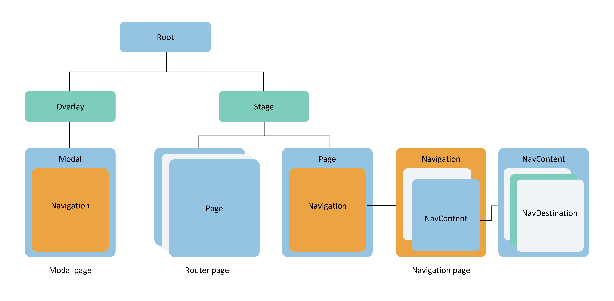

# Overview of Component Navigation and Page Routing  

<!--Del-->
> **Note:**
>
> Currently in the beta phase.
<!--DelEnd-->

A page refers to a visual interaction unit composed of layouts, components, interaction logic, etc., carrying specific functional logic and information display. It is the core interface carrier for user interaction with an application. A complete application often consists of multiple pages. Both Component Navigation ([Navigation](../reference/arkui-cj/cj-navigation-switching-navigation.md)) and page routing ([Router](../reference/arkui-cj/cj-apis-uicontext-router.md)) provide page navigation capabilities within an application.

- In the Component Navigation ([Navigation](../reference/arkui-cj/cj-navigation-switching-navigation.md)) framework, a "page" is carried by the NavDestination component, specifically referring to the content contained within a NavDestination component.
- In the page routing ([Router](../reference/arkui-cj/cj-apis-uicontext-router.md)) framework, a "page" specifically refers to a custom component decorated with @Entry.

In comparison, Component Navigation ([Navigation](../reference/arkui-cj/cj-navigation-switching-navigation.md)) places pages within the Navigation component for navigation, providing enhanced "Write Once, Run Anywhere" (WORA) capabilities, more flexible page stack operations, and supporting richer animations and lifecycle management. Therefore, it is recommended to use Component Navigation ([Navigation](../reference/arkui-cj/cj-navigation-switching-navigation.md)) for page navigation and intra-component navigation to achieve a better user experience.  

## Architectural Differences  

From the perspective of the ArkUI component tree hierarchy, pages managed by Router were originally located under the stage node for page stack management. The Navigation component, as a navigation container, can be mounted under a single page node or be layered and nested. Navigation manages the title bar, content area, and toolbar. The content area displays user-defined page content and supports routing capabilities. This design of Navigation offers the following advantages:  

  

1. **Explicit Interface Separation**: Clearly distinguishes the title bar, content area, and toolbar, enabling more flexible management and UX animation capabilities.  

2. **Explicit Routing Container Concept**: Developers can determine the placement of routing containers, supporting display in full-modal, half-modal, or pop-up windows.  

3. **Integrated UX Design and WORA Capabilities**: Provides unified title display, page switching, and single/dual-column adaptation by default.  

4. **Flexible Page Configuration**: Based on the universal [UIBuilder](./paradigm/cj-macro-builder.md) capability, developers can define the mapping between page aliases and UI, offering more flexible page configuration.  

5. **Rich Transition Animations**: Converts page transition animations into component property animations, leveraging component attribute animations and shared element animations for richer and more flexible effects.  

6. **Open Page Stack Object**: Developers can inherit and better manage page display by extending the page stack object.