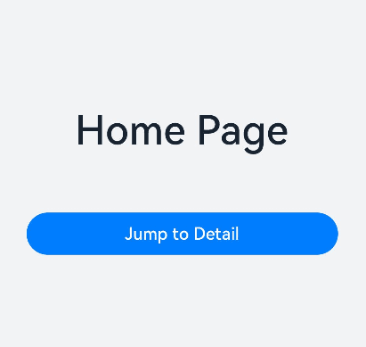

# Page Routing (ohos.router) (Not Recommended)

Page routing refers to navigating between different pages and passing data within an application. The Router module facilitates page routing through different URL addresses, enabling easy access to various pages. This document will introduce how to implement page routing using the Router module from the aspects of [Page Navigation](#page-navigation), [Page Return](#page-return), and [Adding a Confirmation Dialog Before Page Return](#adding-a-confirmation-dialog-before-page-return).

> **Note:**
>
> The [Navigation component](../../../en/application-dev/reference/arkui-cj/cj-navigation-switching-navigation.md) offers more powerful features and customization capabilities. It is recommended to use this component as the routing framework for applications.

## Page Navigation

Page navigation is a crucial part of the development process. When using an application, users often need to navigate between different pages, sometimes while passing data from one page to another.

**Figure 1** Page Navigation



The Router module provides two navigation modes: [Router.pushUrl](../../../en/application-dev/reference/arkui-cj/cj-apis-router.md#func-pushurl) and [Router.replaceUrl](../../../en/application-dev/reference/arkui-cj/cj-apis-router.md#func-replaceurl). These modes determine whether the target page will replace the current page.

- **Router.pushUrl**: The target page does not replace the current page but is pushed onto the page stack. This preserves the current page's state, allowing users to return to it via the back button or by calling the [Router.back](../../../en/application-dev/reference/arkui-cj/cj-apis-router.md#func-back) method.

- **Router.replaceUrl**: The target page replaces the current page, and the current page is destroyed. This releases the current page's resources, making it impossible to return to it.

> **Note:**
>
> The maximum capacity of the page stack is 32 pages. If this limit is exceeded, you can call the [Router.clear](../../../en/application-dev/reference/arkui-cj/cj-apis-router.md#func-clear) method to clear the historical page stack and free up memory space.

Additionally, the Router module provides two instance modes: Standard and Single. These modes determine whether the target URL can correspond to multiple instances.

- **Standard**: Multi-instance mode, which is the default navigation mode. The target page is added to the top of the page stack, regardless of whether a page with the same URL exists in the stack.

- **Single**: Single-instance mode. If the target page's URL already exists in the page stack, the closest page with the same URL (from the top of the stack) is moved to the top, becoming the new page. If no page with the target URL exists in the stack, the navigation follows the default multi-instance mode.

Before using Router-related functionalities, you need to import the Router module in your code.

```cangjie
import kit.ArkUI.Router
```

- **Scenario 1**: There is a home page (Home) and a details page (Detail). You want to navigate from the home page to the details page when a product is clicked. The home page should remain in the page stack to restore its state upon return. In this scenario, use the `pushUrl` method with the Standard instance mode (or omit the mode parameter).

  ```cangjie
  import kit.ArkUI.Router

  func onJumpClick() {
    Router.pushUrl(url: 'pages/Detail', mode: RouterMode.Standard, callback: { code => })
  }
  ```

  > **Note:**
  >
  > In multi-instance mode, the `RouterMode.Standard` parameter can be omitted.

- **Scenario 2**: There is a login page (Login) and a profile page (Profile). After successful login, you want to navigate to the profile page and destroy the login page so that returning exits the application. In this scenario, use the `replaceUrl` method with the Standard instance mode (or omit the mode parameter).

  ```cangjie
  import kit.ArkUI.Router

  func onJumpClick() {
    Router.replaceUrl(url: 'pages/Profile', mode: RouterMode.Standard, callback: { code => })
  }
  ```

  > **Note:**
  >
  > In multi-instance mode, the `RouterMode.Standard` parameter can be omitted.

- **Scenario 3**: There is a settings page (Setting) and a theme-switching page (Theme). You want to navigate from the settings page to the theme-switching page when the theme option is clicked. Ensure only one theme-switching page exists in the stack, and return directly to the settings page. In this scenario, use the `pushUrl` method with the Single instance mode.

  ```cangjie
  import kit.ArkUI.Router

  // In the Setting page
  func onJumpClick() {
    Router.replaceUrl(url: 'pages/Theme' // Target URL
    , mode: RouterMode.Single, callback: { code => })
  }
  ```

- **Scenario 4**: There is a search results page (SearchResult) and a search details page (SearchDetail). When a search result is clicked, navigate to the details page. If the result has already been viewed, reuse the existing details page instead of creating a new one. In this scenario, use the `replaceUrl` method with the Single instance mode.

  ```cangjie
  import kit.ArkUI.Router

  // In the SearchResult page
  func onJumpClick() {
    Router.replaceUrl(url: 'pages/SearchDetail' // Target URL
    , mode: RouterMode.Single, callback: { code => })
  }
  ```

The above scenarios do not involve passing parameters.

To pass data to the target page during navigation, add a `params` property to the Router method call and specify a string as the parameter. For example:

```cangjie
import kit.ArkUI.Router

func onJumpClick() {
    Router.pushUrl(url: 'pages/Detail', params: "pagesparams", mode: RouterMode.Standard, callback: { code => })
}
```

In the target page, you can retrieve the passed parameters by calling the Router module's [getParams](../../../en/application-dev/reference/arkui-cj/cj-apis-router.md#func-getParams) method. For example:

```cangjie
import kit.ArkUI.Router

var params: String = "params"
var params_get: Option<String> = Router.getParams()
var id : Option<String> = params_get
```

## Page Return

After completing operations on a page, users often need to return to the previous page or a specified page. This requires the page return functionality. During the return process, data may need to be passed to the target page, which involves data transfer.

**Figure 2** Page Return


Before using Router-related functionalities, import the Router module in your code.

```cangjie
import kit.ArkUI.Router
```

You can use the following methods to return to a page:

- **Method 1**: Return to the previous page.

  ```cangjie
  import kit.ArkUI.Router

  Router.back()
  ```

  This method returns to the previous page, i.e., the page's position in the stack. The previous page must exist in the stack; otherwise, the method will have no effect.

- **Method 2**: Return to a specified page.

  Return to a regular page.

  ```cangjie
  import kit.ArkUI.Router

  Router.back(
    url: 'pages/Home'
  )
  ```

  Return to a named route page.

  ```cangjie
  import kit.ArkUI.Router

  Router.back(
    url: 'myPage' // myPage is the alias of the named route page
  )
  ```

  This method returns to the specified page, which must exist in the stack.

- **Method 3**: Return to a specified page and pass custom parameters.

  Return to a regular page.

  ```cangjie
  import kit.ArkUI.Router

  Router.back(
    url: 'pages/Home',
    params: 'From Home Page'
  )
  ```

  Return to a named route page.

  ```cangjie
  import kit.ArkUI.Router

  Router.back(
    url: 'myPage',
    params: 'From Home Page'
  )
  ```

  This method not only returns to the specified page but also passes custom parameters. These parameters can be retrieved and parsed in the target page using the `Router.getParams` method.

In the target page, call `Router.getParams` where needed:

```cangjie
import kit.ArkUI.Router

@Entry
@Component
class EntryView {
  @State var message: String = 'Hello World'

  public override func onPageShow() {
    var params:Option<String> = Router.getParams() // Retrieve the passed parameter object
        var info: Option<String> = params // Get the value of the info property
  }
  // ...
}
```

> **Note:**
>
> When using `Router.back` to return to a specified page, all pages from the top of the stack (inclusive) to the specified page (exclusive) are popped and destroyed.
>
> Additionally, if `Router.back` is used to return to the original page, the original page is not recreated. Thus, variables declared with `@State` are not redeclared, and the `aboutToAppear` lifecycle callback is not triggered. To use custom parameters passed during the return, parse them where needed, such as in the `onPageShow` lifecycle callback.

## Adding a Confirmation Dialog Before Page Return

In application development, to prevent accidental operations or data loss, you may need to display a confirmation dialog before users return to another page, asking them to confirm the action.

This document introduces how to implement this functionality using [System Default Confirmation Dialog](#system-default-confirmation-dialog) and [Custom Confirmation Dialog](#custom-confirmation-dialog).

**Figure 3** Adding a Confirmation Dialog Before Page Return


### System Default Confirmation Dialog

To achieve this, use the Router module's [Router.showAlertBeforeBackPage](../../../en/application-dev/reference/arkui-cj/cj-apis-router.md#func-showAlertBeforeBackPage) and [Router.back](../../../en/application-dev/reference/arkui-cj/cj-apis-router.md#func-back) methods.

Before using Router-related functionalities, import the Router module in your code.

```cangjie
import kit.ArkUI.Router
```

To enable the confirmation dialog before returning from the target page, call `Router.showAlertBeforeBackPage` before `Router.back` to set the dialog message. For example, define a back button click event handler in the payment page:

```cangjie
func onBackClick() {
  // Call router.showAlertBeforeBackPage() to set the confirmation dialog message
  try {
    Router.showAlertBeforeBackPage(
      'You have not completed the payment. Are you sure you want to return?' // Dialog content
      ,{ code => })
    } catch (e: Exception) {
        AppLog.error(e.toString())
        }
    // Call router.back() to return to the previous page
    Router.back()
}
```

The `Router.showAlertBeforeBackPage` method accepts an object with the following property:

- `message`: String type, representing the dialog content.

If successful, the confirmation dialog will appear before returning.

When the user clicks the "Back" button, a confirmation dialog will prompt them to confirm the action. Selecting "Cancel" keeps the user on the current page, while "Confirm" triggers `Router.back` and executes the navigation based on parameters.

### Custom Confirmation Dialog

A custom confirmation dialog can differentiate the application's UI from the system default dialog, enhancing user experience. This example uses a popup to demonstrate a custom confirmation dialog.

Before using Router-related functionalities, import the Router module in your code.

```cangjie
import kit.ArkUI.Router
```

In the event callback, call the popup method:

```cangjie
import kit.ArkUI.Router

func onBackClick() {
  // Display a custom confirmation dialog
  let buttons: Array<ButtonInfo> = [
                    ButtonInfo("Back", Color.Black),
                    ButtonInfo("Confirm", Color.Black)
                ]
  PromptAction.showDialog(
            message: 'You have not completed the payment. Are you sure you want to return?',
            buttons: buttons,
            callback: { err: Option<AsyncError>,
            i: Option<Int32> =>
                    if (i == 0){
                    AppLog.info ('User canceled the operation.')
                        }
                    else if (i == 1){
                    AppLog.info('User confirmed the operation.')
                    Router.back()
                        }
                      })
}
```

When the user clicks the "Back" button, the custom confirmation dialog appears. Selecting "Cancel" keeps the user on the current page, while "Confirm" triggers `Router.back` and executes the navigation based on parameters.