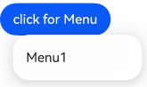
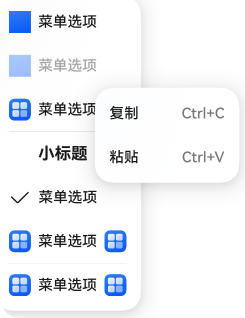

# Menu Control (Menu)

<!--Del-->
> **Note:**
>
> Currently in the beta phase.
<!--DelEnd-->

Menu is a menu interface, typically used for right-click pop-ups, click pop-ups, etc. For specific usage, please refer to [Menu Control](../reference/arkui-cj/cj-universal-attribute-menu.md).

When using [bindContextMenu](../reference/arkui-cj/cj-universal-attribute-menu.md#func-bindcontextmenucustombuilder-responsetype-contextmenuoptions) with a preview image set, the menu will have an overlay when popped up, making it modal.

When using [bindMenu](../reference/arkui-cj/cj-universal-attribute-menu.md#func-bindmenuarraymenuelement) or bindContextMenu without setting a preview image, the menu will pop up without an overlay, making it non-modal.

## Lifecycle

| Name | Type | Description |
|:---|:---|:---|
| aboutToAppear | () -> Unit | Callback event before the menu display animation. |
| onAppear | () -> Unit | Callback event when the menu pops up. |
| aboutToDisappear | () -> Unit | Callback event before the menu exit animation. |
| onDisappear | () -> Unit | Callback event when the menu disappears. |

## Creating a Default-Style Menu

The menu needs to be implemented by calling the bindMenu interface. bindMenu responds to the click event of the bound component. After binding the component, the menu will pop up when the corresponding component is clicked.

```cangjie
Button("click for Menu").bindMenu(
    [
        MenuElement(
            value: 'Menu1',
            action: {
                => Hilog.info(0, 'cangjie', 'handle Menu1 select')
            }
        )
    ]
)
```



### Creating a Custom-Style Menu

When the default style does not meet development requirements, you can use [@Builder](./paradigm/cj-macro-builder.md) to customize the menu content and implement the customization through the bindMenu interface.

#### Developing Menu Content with @Builder

 <!-- run -->

```cangjie
package ohos_app_cangjie_entry

import kit.ArkUI.*
import ohos.arkui.state_macro_manage.*
import ohos.resource.*
import kit.LocalizationKit.*

class Tmp {
    var iconStr2: AppResource = @r(app.media.startIcon)

    public func set(val: AppResource) {
        this.iconStr2 = val
    }
}

@Entry
@Component
class EntryView {
    @State var select: Bool = true
    private var iconStr: AppResource = @r(app.media.startIcon)
    private var iconStr2: AppResource = @r(app.media.startIcon)

    @Builder
    func SubMenu() {
        Menu() {
            MenuItem(startIcon: "", content: "Copy", endIcon: "", labelInfo: "Ctrl+C")
            MenuItem(startIcon: "", content: "Paste", endIcon: "", labelInfo: "Ctrl+V")
        }
    }

    @Builder
    func MyMenu() {
        Menu() {
            MenuItem(startIcon: @r(app.media.startIcon), content: @r(app.string.module_desc),
                endIcon: @r(app.string.module_desc), labelInfo: @r(app.string.module_desc))
            MenuItem(startIcon: @r(app.media.startIcon), content: @r(app.string.module_desc),
                endIcon: @r(app.string.module_desc), labelInfo: @r(app.string.module_desc)).enabled(false)
            MenuItem(
                startIcon: this.iconStr,
                content: @r(app.string.module_desc),
                endIcon: @r(app.media.startIcon),
                labelInfo: @r(app.string.module_desc),
                // When the builder parameter is configured, it indicates that a submenu is bound to the menuItem. Hovering over this menu item will display the submenu.
                builder: this.SubMenu
            )
            MenuItemGroup(header: "Subtitle", footer: "") {
                =>
                MenuItem(startIcon: "", content: "Menu Option", endIcon: "", labelInfo: "")
                    .selectIcon(true)
                    .selected(this.select)
                    .onChange(
                        {
                            selected =>
                            let Str: Tmp = Tmp()
                            Str.set(@r(app.media.startIcon))
                        }
                    )
                MenuItem(
                    startIcon: @r(app.media.startIcon),
                    content: @r(app.string.module_desc),
                    endIcon: @r(app.media.startIcon),
                    labelInfo: @r(app.string.module_desc),
                    builder: this.SubMenu
                )
            }

            MenuItem(
                startIcon: this.iconStr2,
                content: @r(app.string.module_desc),
                endIcon: @r(app.media.startIcon),
                labelInfo: @r(app.string.module_desc)
            )
        }
    }

    func build() {
        // ...
    }
}
```

### Binding Components with bindMenu Property

```cangjie
Button('click for Menu')
    .bindMenu(builder: this.MyMenu)
```



## Creating a Menu Supporting Right-Click or Long Press

Customize the menu through the bindContextMenu interface and set the trigger method for the menu pop-up, which can be right-click or long press. The menu items popped up using bindContextMenu are in an independent sub-window and can be displayed outside the application window.

- The method for developing menu content with @Builder is the same as described above.
- Confirm the pop-up method of the menu and bind the component using the bindContextMenu property. In the example, the menu is triggered by right-click.

```cangjie
Button('click for Menu')
    .bindContextMenu(
        builder: this.MyMenu,
        responseType: ResponseType.RightClick
    )
```