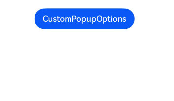

# Popup

<!--Del-->
> **Note:**
>
> Currently in the beta phase.
<!--DelEnd-->

The Popup attribute can be bound to components to display popup tooltips, configuring popup content, interaction logic, and display states. It is primarily used for scenarios like screen recording and informational popup reminders.

There are two types of popups: one is the system-provided [PopupOptions](../reference/arkui-cj/cj-universal-attribute-popup.md#struct-popupoptions), and the other is the developer-customizable [CustomPopupOptions](../reference/arkui-cj/cj-universal-attribute-popup.md#struct-custompopupoptions). PopupOptions configures buttons via `primaryButton` and `secondaryButton` to create popups with buttons, while CustomPopupOptions uses the `builder` configuration for custom popups.

Popups can be configured as modal or non-modal windows through the [mask](../reference/arkui-cj/cj-common-types.md#var-mask) parameter. When `mask` is set to `true` or a color value, the popup becomes a modal window; when set to `false`, it becomes non-modal.

## Text Popup

Text popups are commonly used for displaying informational messages without any interactive elements. The Popup attribute must be bound to a component, and the popup appears when the `show` parameter in `bindPopup` is set to `true`.

In this example, the Popup attribute is bound to a Button component. Each click toggles the `handlePopup` boolean value, triggering the popup when the value is `true`.

<!-- run -->

```cangjie
package ohos_app_cangjie_entry

import kit.ArkUI.*
import ohos.arkui.state_macro_manage.*

@Entry
@Component
class EntryView {
    @State var handlePopup: Bool = false
    func build() {
        Column {
            Button('PopupOptions')
                .onClick ({
                    e => this.handlePopup = !this.handlePopup
                })
                .bindPopup(
                    this.handlePopup,
                    PopupOptions(message: 'This is a popup with PopupOptions', placement: Placement.Bottom)
                )
        }.width(100.percent).padding(top: 5)
    }
}
```


## Adding State Change Events to Popups

The `onStateChange` parameter adds a callback for popup state changes, allowing detection of the current popup display state.

<!-- run -->

```cangjie
package ohos_app_cangjie_entry

import kit.ArkUI.*
import ohos.arkui.state_macro_manage.*

@Entry
@Component
class EntryView {
    @State var handlePopup: Bool = false
    func build() {
        Column {
            Button('PopupOptions')
                .onClick ({
                    e => this.handlePopup = !this.handlePopup
                })
                .bindPopup(
                    this.handlePopup,
                    PopupOptions(
                        message: 'This is a popup with PopupOptions',
                        placement: Placement.Bottom,
                        onStateChange: {
                            e =>
                            if (!e.isVisible) {
                                this.handlePopup = false
                            }
                        }
                    )
                )
        }.width(100.percent).padding(top: 5)
    }
}
```


## Popup with Buttons

The `primaryButton` and `secondaryButton` attributes allow adding up to two buttons to a popup for simple interactions. Developers can configure the `action` parameter to define the triggered operations.

<!-- run -->

```cangjie
package ohos_app_cangjie_entry

import kit.ArkUI.*
import ohos.arkui.state_macro_manage.*
import ohos.hilog.*

@Entry
@Component
class EntryView {
    @State var handlePopup: Bool = false
    func build() {
        Column() {
            Button('PopupOptions')
                .margin(top: 200)
                .onClick ({
                    e => this.handlePopup = !this.handlePopup
                })
                .bindPopup(
                    this.handlePopup,
                    PopupOptions(
                        message: 'This is a popup with PopupOptions',
                        placement: Placement.Bottom,
                        primaryButton: PopupButton(
                            value: "Confirm",
                            action: { => Hilog.info(0, 'cangjie', 'Confirm')}
                        ),
                        secondaryButton: PopupButton(
                            value: "Cancel",
                            action: { => Hilog.info(0, 'cangjie', 'Cancel')}
                        )
                    )
                )
        }.width(100.percent).padding(top: 5)
    }
}
```


## Popup Animations

Popups can define entry and exit animations using the `transition` parameter.

<!-- run -->

```cangjie
package ohos_app_cangjie_entry

import kit.ArkUI.*
import ohos.arkui.state_macro_manage.*

@Entry
@Component
class EntryView {
    @State var handlePopup: Bool = false
    @State var customPopup: Bool = false
    @State var popup: Bool = false
    @State var custom: String = "Custom Wait"
    // Popup builder defines popup content
    @Builder
    func popupBuilder() {
        Row() {
            Text('Custom Popup with transitionEffect').fontSize(10)
        }
        .height(50)
        .padding(5)
    }

    func build() {
        Flex(direction: FlexDirection.Column) {
            // PopupOptions type popup content
            Button('PopupOptions')
                .position(x: 100, y: 150)
                .onClick ({
                    e => this.popup = !this.popup
                })
                .bindPopup(
                    this.popup,
                    PopupOptions(
                        message: "This is popup with transitionEffect",
                        placement: Placement.Top,
                        showInSubWindow: false,
                        onStateChange: {
                            e =>
                            custom = "stateChange: ${e.isVisible}"
                            if (!e.isVisible) {
                                this.popup = true
                            }
                        },
                        // Set entry and exit animations as translate effects
                        transition: TransitionEffect.asymmetric(
                            TransitionEffect
                            .OPACITY
                            .animation(AnimateParam(duration: 1000, curve: Curve.Ease))
                            .combine(
                                TransitionEffect.translate(TranslateOptions(x: 50, y: 50))
                            ),
                            TransitionEffect.IDENTITY
                        )
                    )
                )

            // CustomPopupOptions type popup content
            Button('CustomPopupOptions')
                .position(x: 80, y: 300)
                .onClick ({
                    e => this.customPopup = !this.customPopup
                })
                .bindPopup(
                    this.customPopup,
                    CustomPopupOptions(
                        builder: popupBuilder,
                        placement: Placement.Top,
                        showInSubWindow: false,
                        onStateChange: {
                            e =>
                            custom = "stateChange: ${e.isVisible}"
                            if (!e.isVisible) {
                                this.customPopup = true
                            }
                        },
                        // Set entry and exit animations as scaling effects
                        transition: TransitionEffect
                            .scale(ScaleOptions(x: 1.0, y: 0.0))
                            .animation(AnimateParam(duration: 500, curve: Curve.Ease))
                    )
                )
        }.width(100.percent).padding(top: 5)
    }
}
```


## Custom Popups

Developers can use the `builder` in `CustomPopupOptions` to create custom popups. The `@Builder` can contain custom content. Additionally, parameters like `popupColor` can control popup styling.

<!-- run -->

```cangjie
package ohos_app_cangjie_entry

import kit.ArkUI.*
import ohos.arkui.state_macro_manage.*
import ohos.resource.*
import kit.LocalizationKit.*

@Entry
@Component
class EntryView {
    @State var customPopup: Bool = false
    @State var custom: String = "Custom Wait"
    // Popup builder defines popup content
    @Builder
    func popupBuilder() {
        Row(space: 2) {
            Image(@r(app.media.startIcon))
                .width(24)
                .height(24)
                .margin(left: 5)
            Text('This is Custom Popup').fontSize(15)
        }
        .width(200)
        .height(50)
        .padding(5)
    }
    func build() {
        Column() {
            Button('CustomPopupOptions')
                .position(x: 100, y: 200)
                .onClick ({
                    e => this.customPopup = !this.customPopup
                })
                .bindPopup(
                    this.customPopup,
                    CustomPopupOptions(
                        builder: popupBuilder, // Popup content
                        placement: Placement.Bottom, // Popup position
                        popupColor: Color.Red, // Popup background color
                        showInSubWindow: false,
                        onStateChange: {
                            evt =>
                            custom = "stateChange: ${evt.isVisible}"
                            if (!evt.isVisible) {
                                customPopup = true
                            }
                        }
                    )
                )
        }.height(100.percent)
    }
}
```

The `placement` parameter positions the popup relative to the target component. The popup builder triggers informational prompts to guide users through operations, enhancing UI experience.



## Popup Styling

Beyond custom builders, popup styling and display effects can be configured via interfaces.

Background Color: Defaults to transparent with a default blur effect (COMPONENT_ULTRA_THICK on devices).

Mask Style: Defaults to a transparent mask.

Display Size: Determined by the builder content or message length.

Position: Defaults below the host component, configurable via the `Placement` interface.

This example demonstrates styling through `popupColor` (background color), `mask` (mask style), `width` (popup width), and `placement` (position).

<!-- run -->

```cangjie
package ohos_app_cangjie_entry

import kit.ArkUI.*
import ohos.arkui.state_macro_manage.*

@Entry
@Component
class EntryView {
    @State var handlePopup: Bool = false

    func build() {
        Column(space: 100) {
            Button('PopupOptions')
                .onClick({
                    e => this.handlePopup = !this.handlePopup
                })
                .bindPopup(
                    this.handlePopup,
                    PopupOptions(
                        message: "This is a popup",
                        width: 200,
                        popupColor: Color.Red,
                        mask: Color(0x33d9d9d9), // Set popup background color
                        placement: Placement.Top,
                        showInSubWindow: false,
                        backgroundBlurStyle: BlurStyle.None
                    )
                    // Disabling blur requires turning off the popup's blur background
                )
        }.width(100.percent)
    }
}
```

