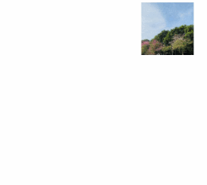

# Rotation Screen Animation

Rotation screen animations are primarily divided into two categories: [Layout Transition Rotation Animation](#layout-transition-rotation-animation) and [Opacity Transition Rotation Animation](#opacity-transition-rotation-animation), designed to achieve natural transitions when the screen display orientation changes. The layout transition rotation animation is relatively simple to implement—for example, configuring auto-rotation in `module.json5` (or setting the window display orientation) suffices. In contrast, the opacity transition rotation animation requires preparing two sets of views in addition to the `module.json5` configuration. During screen rotation, the disappearing view gradually fades out while the newly appearing view fades in, creating a smooth visual experience.

## Layout Transition Rotation Animation

The layout transition rotation animation is designed to synchronize the window and application view rotation during screen orientation changes, providing size and position transition effects. This type of rotation animation is system-default and developer-friendly. When the screen orientation changes, the system generates a window rotation animation and automatically adjusts the window size to match the rotated dimensions. During this process, the window notifies the corresponding application to re-layout according to the new window size, producing a layout animation with parameters identical to the window rotation animation.

Switching the screen orientation achieves the layout transition rotation animation effect.

 <!--run-->

```cangjie
package ohos_app_cangjie_entry

import kit.ArkUI.*
import ohos.arkui.state_macro_manage.*
import ohos.resource.*

@Entry
@Component
class EntryView{
    func build(){
        Column(){
            Image(@r(app.media.foreground))
                .position(x: 0,y: 0)
                .size(width: 100,height: 100)
                .id('image1')
                .backgroundColor(Color.Blue)
        }
    }
}
```

Add `"orientation": "auto_rotation"` to the `abilities` list in the project's `module.json5` file.

```json
"orientation": "auto_rotation",
```

The layout transition rotation animation applies size and position transitions to the synchronously rotating window and application view.


