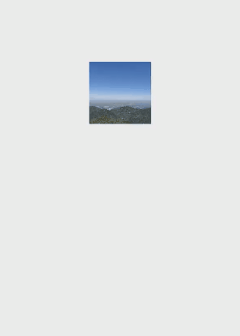

# Rotation Screen Animation  

Rotation screen animations are primarily divided into two categories: [Layout Transition Rotation Animation](#layout-transition-rotation-animation) and [Opacity Transition Rotation Animation](#opacity-transition-rotation-animation), designed to achieve a natural transition during screen orientation changes. The layout transition rotation animation is relatively simple to implement—for example, configuring auto-rotation in module.json5 (or setting the window display orientation) suffices. In contrast, the opacity transition rotation animation requires preparing two sets of views in addition to the module.json5 configuration. During screen rotation, the disappearing view gradually fades out while the new view fades in, creating a smooth visual experience.  

## Layout Transition Rotation Animation  

The layout transition rotation animation is designed to synchronize the window and application view rotation during screen orientation changes, providing size and position transition effects. This type of animation is system-default and easy for developers to implement. When the screen orientation changes, the system generates a window rotation animation and automatically adjusts the window size to match the rotated dimensions. During this process, the window notifies the corresponding application to re-layout based on the new window size, producing a layout animation with parameters identical to the window rotation animation.  

Switching the screen orientation achieves the layout transition rotation animation effect.  

 <!--run-->  

```cangjie  
package ohos_app_cangjie_entry  

import kit.ArkUI.*  
import ohos.arkui.state_macro_manage.*  
import ohos.resource_manager.*  

@Entry  
@Component  
class EntryView{  
    func build(){  
        Column(){  
            Image(@r(app.media.foreground))  
                .position(x: 0,y: 0)  
                .size(width: 100,height: 100)  
                .id('image1')  
                .backgroundColor(Color.Blue)  
        }  
    }  
}  
```  

Add `"orientation": "auto_rotation"` to the abilities list in the project's module.json5 file.  

```json  
"orientation": "auto_rotation",  
```  

The layout transition rotation animation applies size and position transitions to the synchronously rotated window and application view.  

  

## Opacity Transition Rotation Animation  

The opacity transition rotation animation activates during screen orientation changes. When the window performs a rotation animation, it adds a default opacity transition to components that appear or disappear during rotation, achieving graceful component appearance and disappearance. This feature listens for window rotation events and switches component view effects within the event. If the root nodes of the disappearing and appearing views are not configured with transition effects, a default opacity transition (i.e., [TransitionEffect](../../../en/application-dev/reference/arkui-cj/cj-animation-transition.md#class-transitioneffect).OPACITY) is automatically applied, creating fade-out and fade-in effects.  

 <!-- run -example1 -->  

```cangjie  
package ohos_app_cangjie_entry  

import kit.ArkUI.*  
import ohos.arkui.state_macro_manage.*  
import ohos.resource_manager.*  
import ohos.display.*  
import ohos.display.{Orientation as DisplayOrientation}  

func matchor(orientation: DisplayOrientation): String {  
    match(orientation){  
        case Landscape => "Landscape"  
        case Portrait => "Portrait"  
        case LandscapeInverted => "LandscapeInverted"  
        case PortraitInverted => "PortraitInverted"  
        case _ => "FollowDesktop"  
    }  
}  

@Entry  
@Component  
class EntryView{  
    // Obtain the screen orientation by listening to the window's windowsSizeChange event  
    @StorageLink["orientation"] var orientation: DisplayOrientation  = DisplayOrientation.Portrait  

    func build(){  
        Stack() {  
            if(matchor(orientation) == "Portrait"|| matchor(orientation) == "PortraitInverted"){  
                Image(@r(app.media.startIcon))  
                    .size(width: 100, height: 100 )  
                    .id('image1')  
                  // Developers can also manually set TransitionEffect.OPACITY for the transition to achieve opacity changes in rotation animation  
//                   .transition(TransitionEffect.OPACITY)  
            }else{  
                Image(@r(app.media.startIcon))  
                    .position(x: 0, y: 0 )  
                    .size( width: 200, height: 200)  
                    .id('image2')  
                    // Developers can also manually set TransitionEffect.OPACITY for the transition to achieve opacity changes in rotation animation  
//                    .transition(TransitionEffect.OPACITY)  
            }  
        }.backgroundColor(Color.White).size(width: 100.percent, height: 100.percent)  
    }  
}  
```  

Listen to the window rotation synchronization event `windowsSizeChange` to implement view switching. For example, add logic in the `onWindowStageCreate` method of the main_ability.cj file to obtain the screen orientation.  

Add `"orientation": "auto_rotation"` to the abilities list in the project's module.json5 file.  

```json  
"orientation": "auto_rotation",  
```  

The opacity transition rotation animation applies size and position transitions to the window while simultaneously transitioning the application view, fading out the disappearing view and fading in the new view.  

