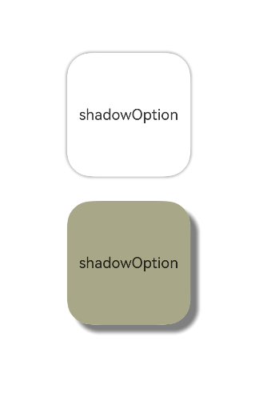

# Shadow

The shadow interface [shadow](../../../en/application-dev/reference/arkui-cj/cj-universal-attribute-imageeffect.md#func-shadowfloat64-resourcecolor-float64-float64) can add shadow effects to the current component. This interface supports two types of parameters, allowing developers to customize shadow effects by configuring [ShadowOptions](../../../en/application-dev/reference/arkui-cj/cj-text-input-text.md#class-shadowoptions). In ShadowOptions mode, when radius = 0 or the color's alpha value is 0, no shadow effect will be displayed.

<!-- run -->

```cangjie
package ohos_app_cangjie_entry

import kit.ArkUI.*
import ohos.arkui.state_macro_manage.*

@Entry
@Component
class EntryView {
    func build() {
        Row() {
            Column() {
                Column() {
                    Text('shadowOption').fontSize(12)
                }
                .width(100)
                .aspectRatio(1.0)
                .margin(10)
                .justifyContent(FlexAlign.Center)
                .backgroundColor(Color.White)
                .borderRadius(20)
                .shadow(radius: 10.0, color: Color.Gray)

                Column() {
                    Text('shadowOption').fontSize(12)
                }
                .width(100)
                .aspectRatio(1.0)
                .margin(10)
                .justifyContent(FlexAlign.Center)
                .backgroundColor(0xa8a888)
                .borderRadius(20)
                .shadow(radius: 10.0, color: Color.Gray, offsetX: 20.0, offsetY: 20.0)
            }
            .width(100.percent)
            .height(100.percent)
            .justifyContent(FlexAlign.Center)
        }
        .height(100.percent)
    }
}
```

